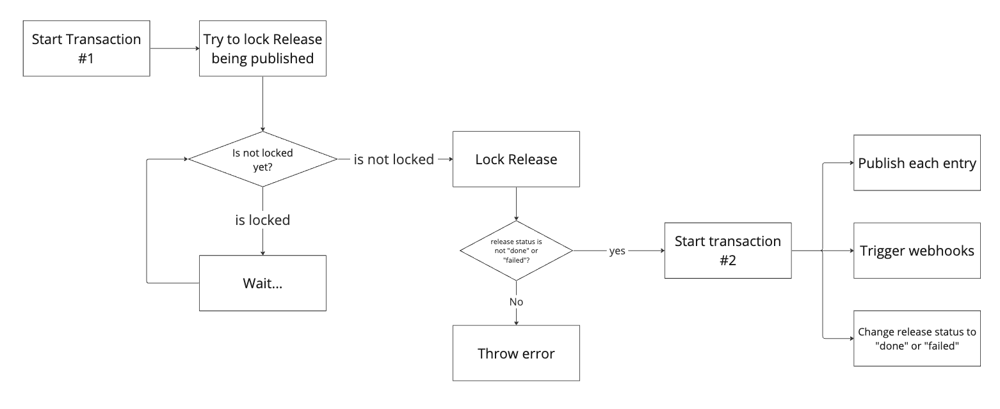

:::caution
İçerik Yayınlama Takvimi henüz stabil bir özellik değildir. Bu nedenle, bu sayfada belgelenen tüm unsurlar şu anda görünür değildir. Eğer Yayınlama Takvimini denemek isterseniz, `contentReleasesScheduling` özellik bayrağını kullanarak **kendi** riskinizle etkinleştirebilirsiniz.
:::

Takvim, kullanıcılara bir yayın için planlanan bir tarih belirleme olanağı tanır ve yayınlamasını veya kaldırılmasını otomatikleştirir. Bu gerçekleştiğinde, yayınlama denemesinin sonucunu sağlayan bir webhook tetiklenir.

## Nasıl çalışır

Her seferinde bir yayın oluşturduğunuzda veya güncellediğinizde ve bir planlanan tarih eklediğinizde, bu isteği işlemekten sorumlu olan sunucu, yayınlamak için seçilen tarih için yeni bir **cronjob** (node-schedule kullanarak) oluşturacaktır.

## Zaman Dilimleri

Planlanan bir tarihi seçerken, belirli bir zaman dilimi seçme seçeneğiniz vardır; varsayılan olarak, sistem zaman diliminiz seçilir. Bu önlem, bir yayının yayınlanma zamanını seçerken herhangi bir potansiyel kafa karışıklığını önlemek için alınmıştır. 

:::info
Sonuç olarak, bir kullanıcı "Europe/Paris" zaman dilimini (UTC+01:00) kullanarak 16:00 için bir program ayarlarsa, aynı yayına erişen başka bir kullanıcı aynı saati (16:00 (UTC+01:00)) görecektir, sisteminin zaman diliminden bağımsız olarak.
:::

## Birden Fazla Strapi Örneği ile Takvimleme

Strapi projenizin birden fazla örnekte çalışması mümkündür. Böyle durumlarda, **cronjob**larla ne olur? Hepsi eşzamanlı mı çalışır, yayını birden fazla kez yayınlamaya mı çalışır? Bu senaryoyu ele alma biçimimizi anlamak için, bir yayını planlarken iki durumu ayırt etmek önemlidir:

### Çalışma Zamanında Planlanan Yayın

Eğer 3 Strapi örneği eşzamanlı olarak çalışıyorsa ve aralarındaki trafiği herhangi bir yöntemle dağıtıyorsanız, büyük bir sorun yoktur. Bunun nedeni, bir yayını oluşturmak/güncellemek ve bir program eklemek için bir isteği işleyen sunucunun ilgili cronjob ile yalnızca o sunucu olmasıdır. Böylece, bir kopyalama olmaz ve potansiyel yarış durumu problemleri önlenir.

### Yeni Bir Strapi Örneği Başlatma

Yeni bir Strapi örneği başlatma sorunu şudur; çünkü tüm planlanmış yayınları alırız ve her biri için **cronjob**ların oluşturulmasını sağlarız. Sonuç olarak, birden fazla Strapi örneği bir yayın için aynı **cronjob** ile sonuçlanabilir. Bunun üstesinden gelmek için şu mantığı uygularız:

Yayınlanmakta olan yayını SQL için **forUpdate** kullanarak kilitleyen bir işlem ayarlıyoruz. Bu, yayına erişmeyi deneyen diğer süreçlerin, ilk işlem tamamlanana kadar bekletileceği anlamına gelir.

> Eğer yayın girişlerinin doğrulaması başarılı olursa, yayınlama işlemi sorunsuz bir şekilde devam eder. — Yayınlanan tarihi güncel tarih ile **releasedAt** sütununa günceller ve satır kilidini serbest bırakırız. Sonrasında, yayın erişiminde bulunmaya çalışan herhangi bir gelen süreç, yayının zaten yayınlandığı için basitçe bir hata ile karşılaşır.

Öte yandan, yayınlama işlemi başarısız olursa, yayın durumunu "başarısız" olarak güncelleriz. Durum "başarısız" olarak işaretlendiğinde, sonraki yayınlama denemeleri sessizce başarısız olacaktır. "Başarısız" durumu, yalnızca bir kullanıcı yayında değişiklik yaptığında değişir.