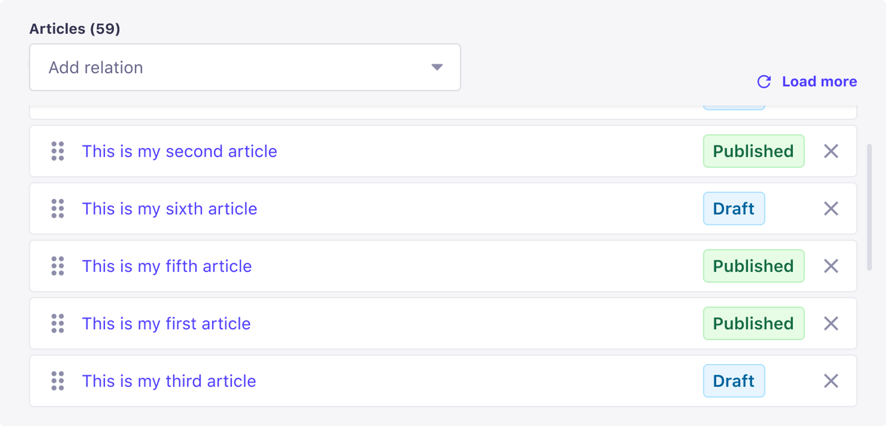
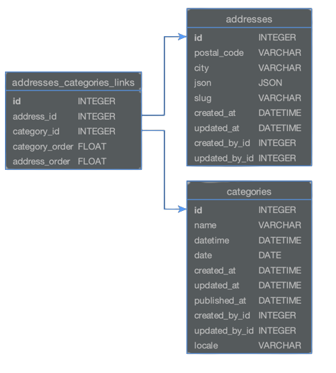
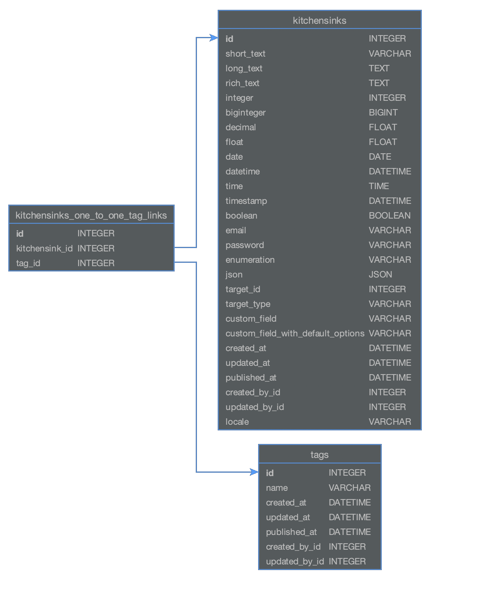
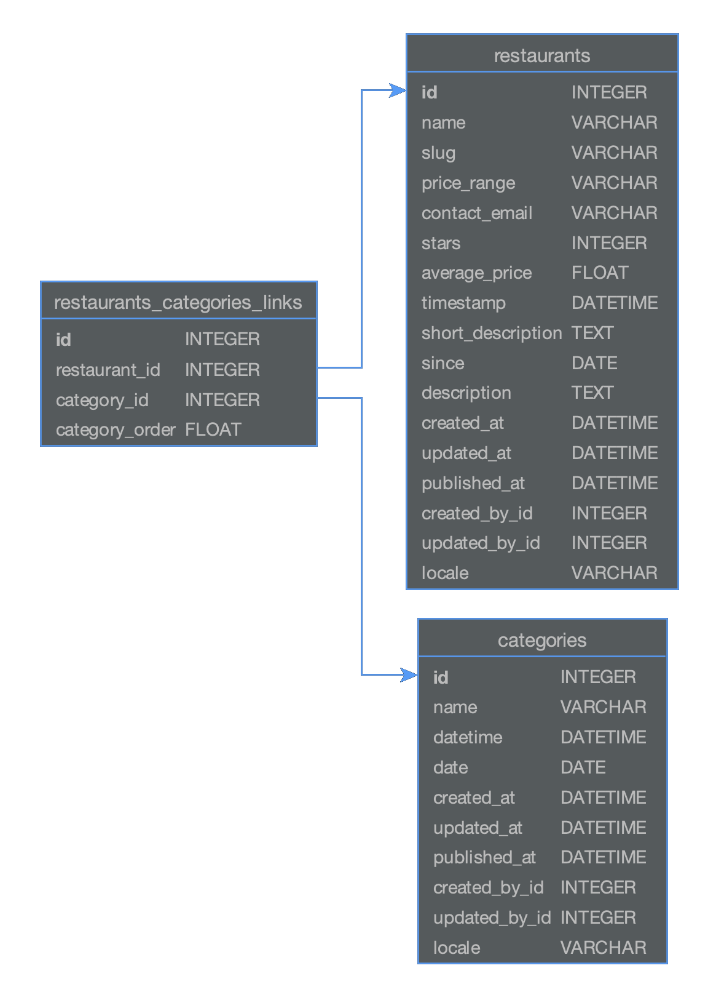
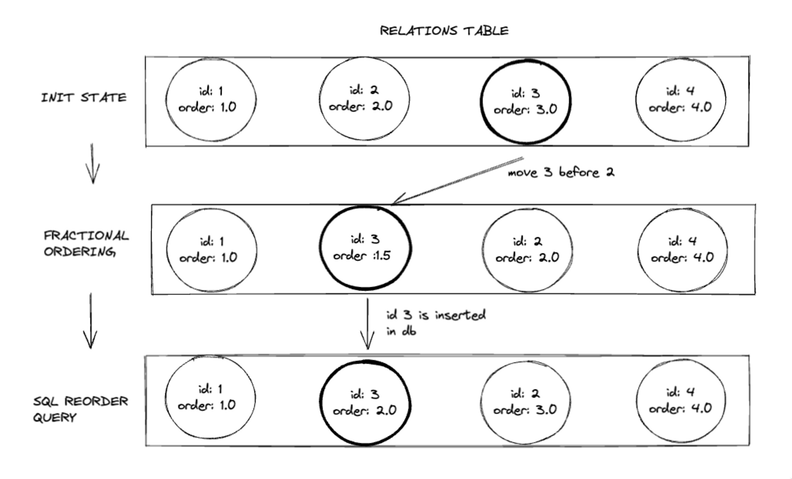
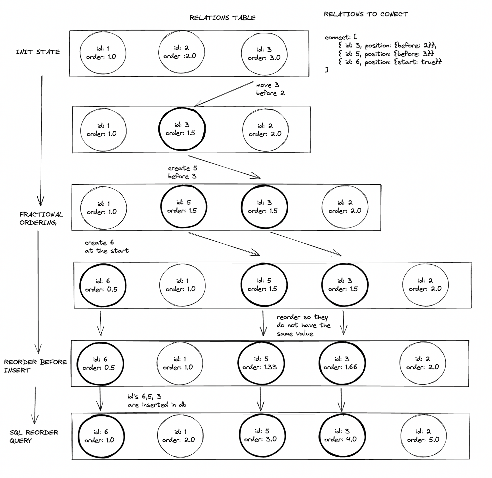

Strapi, bir ilişki listesini yeniden sıralamanıza olanak tanır.



Bu sıralama özelliği, İçerik Yöneticisi ve API'de mevcuttur.

## Kod Konumu

`packages/core/database/lib/entity-manager/relations-orderer.js`

## Sıra DB'de nasıl saklanır?

- İlişkinin sıralama değerini `order` alanında saklıyoruz.
- Çift yönlü ilişkiler için, diğer tarafın sıralama değerini `inverse_order` alanında saklıyoruz.

Tüm ilişki türleri için sıralama değerlerini saklıyoruz, ancak istisnalar:

- Polimorfik ilişkiler (uygulamak için çok karmaşık).
- Birbirine tek yönlü ilişkiler (çünkü her çift için yalnızca bir ilişki vardır).

### Çoktan Çoğa (Adresler &lt;-&gt; Kategoriler)



- `category_order`, bir adres varlığındaki kategoriler ilişkilerinin sıralama değeridir.
- `address_order`, bir kategori varlığındaki adresler ilişkilerinin sıralama değeridir.

### Tek Yönlü (Kişisel Havuzlar &lt;-&gt; Etiketler)



- Her çift için yalnızca bir ilişki olduğundan `order` alanı yoktur.

### Tek Yönlü İlişki (Restoranlar &lt;-&gt; Kategoriler)

Bir restoranın birçok kategorisi olduğu durumda:



- `category_order`, bir restoran varlığındaki kategoriler ilişkilerinin sıralama değeridir.
- Tek yönlü bir ilişki olduğu için `restaurant_order` yoktur.

## DB katmanında ilişkileri nasıl sıralarız?

Daha fazla bilgi için [Strapi Dokümanları](https://docs.strapi.io/dev-docs/api/rest/relations#connect) bakın.

Veritabanı katmanı, aşağıda gösterilen bir yük almalıdır:

```js
  category: {
    connect: [
      { id: 6, position: { after: 1} },    // İlişki id=1'den sonra olmalıdır
      { id: 8, position: { end: true }},   // Sona yerleştirilmelidir
    ],
    disconnect: [
      { id: 4 }
    ]
  }
```

## İlişkilerin sıralaması nasıl çalışır?

Kesirli indeksleme kullanıyoruz. Bu, ilişkileri sıralamak için ondalık sayılar kullandığımız anlamına gelir. Daha ayrıntılı bir anlayış için aşağıdaki diyagramlara bakın.

### Basit örnek



### Karmaşık örnek



### Algoritma adımları

`connect` dizisinden:

- Her bir öğe için, **id ile ilişkileri yükleyin**, **`after` veya `before` alanlarından**.
- `after` ve `before` ilişkilerine dayanarak hesaplamaya başlayın:
  - **Başlangıç** ile `after`/`before` ilişkileriyle (**adım 1**). Bunlara **başlangıç ilişkileri** diyelim.
  - `connect` dizisinden güncellemeleri **sırasıyla uygulayın**.
    - Güncelleme `before` türündeyse:
      - Belirtilen öğenin listede **önüne** yerleştirilecektir.
      - Eğer belirtilen öğe bir `init relation` ise, o öğeyi o ilişkinin ve önündekinin arasına yerleştirin.
        - Sıralama değerini belirlemek için, **order = beforeRelation.order - 0.5**. Bu, öğenin `before` ilişkisinden önce ve ondan önce gelenin ardından yerleştirilmesini sağlar.
      - Aksi halde **order = beforeRelation.order**
    - Güncelleme `after` türündeyse:
      - Belirtilen öğenin listede **ardına** yerleştirilecektir.
      - Eğer belirtilen öğe bir `init relation` ise, o öğeyi o ilişkinin ve ardından gelenin arasına yerleştirin.
        - Sıralama değerini belirlemek için, **order = beforeRelation.order + 0.5**. Bu, öğenin `after` ilişkisi öncesi ve ardından gelenin önüne yerleştirilmesini sağlar.
      - Aksi halde **order = beforeRelation.order**
    - Güncelleme `end` türündeyse:
      - **Sona** yerleştirin
        - Eğer bir init relation'dan sonra yerleştiriliyorsa: **order = lastRelation.order + 0.5**
        - Aksi halde **order = lastRelation.order**
    - Güncelleme `start` türündeyse:
      - **Başlangıca** yerleştirin
      - **order = 0.5**
    - `before/after`: Eğer **id mevcut dizide yoksa**, **hata fırlatın**
    - Eğer bir **id** bu dizide **zaten mevcutsa, öncekini kaldırın**
- **Sıralama değerine göre gruplama yapın** ve başlangıç ilişkilerini dikkate almayın
  - Her grup için sıralama değerlerini yeniden hesaplayın, böylece tekrar eden numaralar yoktur ve aynı sırayı koruyabilirler.
    - Örnek : `[ {id: 5 , order: 1.5}, {id: 3, order: 1.5 } ]` → `[ {id: 5 , order: 1.33}, {id: 3, order: 1.66 } ]`
  - **Değerleri veritabanına ekleyin**
  - **Veritabanındaki sıralamayı, sıralama pozisyonlarına göre güncelleyin.** (ROW_NUMBER() ifadesini kullanarak)

`disconnect` dizisinden:

- Veritabanından ilişkileri silin.
- Kalan öğeleri veritabanında sıralama pozisyonlarına göre, ROW_NUMBER() ifadesini kullanarak yeniden sıralayın.