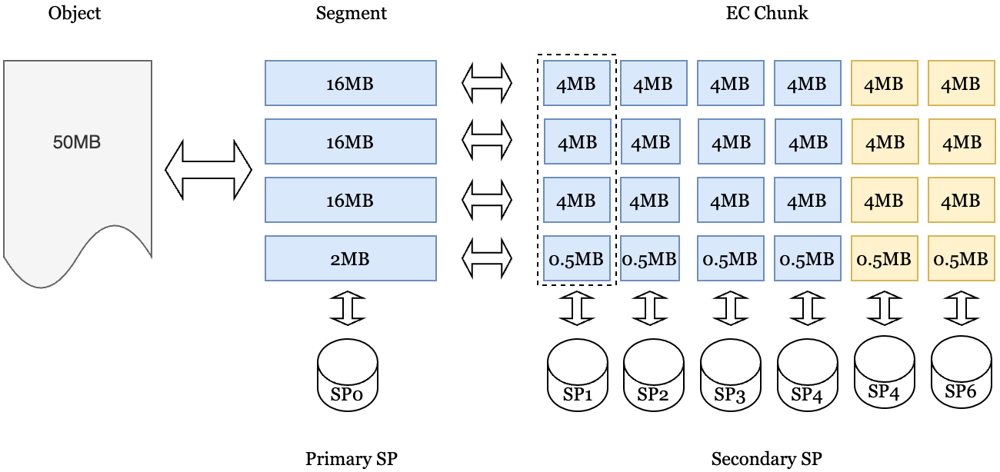

Greenfield'deki bir nesne, aşağıdaki gibi çoklu SP'ler arasında depolanır, örneğin, 50MB:



Detaylı açıklamadan önce veri depolama ile ilgili bazı kavramları tanıtacağız.

## Segment 
Segment, bir nesnenin temel depolama birimidir. **Bir nesne yükü**, bir veya daha fazla segmentten oluşur. Segment boyutu, Greenfield blok zincirinde genel olarak yapılandırılmıştır. Varsayılan segment boyutu **16MB**'dir. Daha büyük nesneler için, yük verisi birçok segmente ayrılacaktır. Eğer nesnenin boyutu 16MB'den küçükse, yalnızca bir segmenti vardır ve segment boyutu, nesnenin boyutuyla aynıdır.

:::info
Lütfen, bir nesnenin yük verisinin aynı boyutta segmentlere ayrılacağını, ancak son segmentin **gerçek boyut** olduğunu unutmayın. Örneğin, bir nesne 50MB boyutundaysa, yalnızca son segmentin boyutu 2 MB'dır ve diğer segmentlerin boyutları hepsi 16MB'dır.
:::

## EC Parçacığı 
Silme Kodu (EC), Greenfield'de verimli veri yedekliliği sağlamak için tanıtılmıştır. **Bir segment**, silme kodlama işlemini gerçekleştirmek için bir sınırdır. Her seferinde bir segment silme kodlanarak bazı EC parçacıkları oluşturulur. EC stratejisi, Greenfield blok zincirinde genel olarak yapılandırılmıştır. Varsayılan EC stratejisi **4+2**'dir; yani bir segment için 4 veri parçası ve 2 parity parçası. Veri parçacığı boyutu segmentin ¼'üdür. Bir tipik segment **16MB** olduğundan, bir tipik EC veri parçası **4MB**'dir.

## Parça
Parça, Greenfield'deki arka uç depolama için temel depolama birimidir. Her segment veya EC parçacığı bir veri parçası olarak kabul edilebilir. Ve her parça için anahtar, Greenfield zincirindeki politika esas alınarak üretilir.

## Ana SP
Greenfield'deki her kova, bir **SP** ile bağlanmıştır; bu SP'ye ana SP denir. Kullanıcı, bir kova oluştururken ana SP olarak bir SP seçmelidir. Kova altında depolanan tüm nesneler için ana SP, nesnelerin yük verisinin tüm segmentlerinden oluşan bir tam kopyayı saklayacaktır. Ve yalnızca ana SP, kullanıcıların okuma veya indirme taleplerine hizmet eder.

## İkincil SP
Bir nesnenin yük verisinin **EC parçacıkları**, ikincil SP'ler adı verilen bazı SP'lerde saklanmaktadır. Her ikincil SP, daha iyi veri erişilebilirliği için kullanılan yük verisinin bir kısmını saklar. Nesne yükü, EC parçacıklarından geri kazanılabilir.

---

## Yedeklilik Stratejisi
Yedeklilik stratejisi, bir nesne yükünün SP'ler arasında nasıl saklandığını tanımlar ve bu, Greenfield blok zincirinde genel olarak yapılandırılmıştır. Aşağıda mevcut strateji bulunmaktadır:

* Dosyanın veri akışı, segment boyutunun ayrıntısına göre segmentlere ayrılacaktır. 
* Eğer verinin boyutu segment boyutundan küçükse, veri boyutuna göre ayrılacaktır. Varsayılan segment boyutu **16MB**'dir;
* Greenfield, EC stratejisi olarak **Reed-Solomon algoritmasını** kullanır [[Reed-Solomon](https://en.wikipedia.org/wiki/Reed%E2%80%93Solomon_error_correction)], varsayılan veri blokları **4**, varsayılan parity blokları ise **2**'dir.
* Bir nesnenin tüm segment parçaları, Ana SP'de saklanır;
* Segment ile EC kodlaması yapıldıktan sonra, EC kodlama modülü altı **EC parça** parçası oluşturacaktır. Segmentin tüm EC parça parçaları, seçilen altı ikincil SP'de saklanacaktır.

:::tip
Örneğin, 32MB bir dosya işlenirken, nesne iki segmente bölünür. Bu iki segment, ana depolama sağlayıcısında saklanır ve her segment, altı 4MB parça oluşturmak için silme kodlaması ile kodlanır. Bu altı parça, sayısal sıraya göre altı ikincil depolama sağlayıcısında saklanır.
:::

---

## Bütünlük Hash'i
Bütünlük hash'leri, ana SP'nin bir kök hash'ini ve EC stratejisine dayalı olarak her ikincil SP için birkaç kök hash'i içerir. İkincil hash'lerin sayısı, dataBlocks ile parityBlock'un toplamına eşittir (şu anda altıdır). Her parçanın hash'i, veri parçasının içeriği üzerinde hash algoritması (varsayılan **sha256**) kullanılarak hesaplanır. Parçaların kök hash'i, tüm parçaların hash'leri esas alınarak hesaplanır.

Hesaplama süreci aşağıdaki gibi temsil edilebilir:

```
// secondaryHashN, N'inci ikincil SP tarafından hesaplanan Bütünlük Hash'ini temsil eder.
// segmentN_pieceN, EC kodlamadan sonra nesnenin N'inci segmentinin N'inci parçasını temsil eder.
IntegrityHashes = [primaryHash, secondaryHash1 ...secondaryHash6]
primaryHash := hash(hash(segment1)+hash(segment2)..+hash(segmentN))
secondaryHashN := hash(hash(segment1_pieceN)+hash(segment2_pieceN)..+hash(segmentN_pieceN))
```

Örneğin, 32MB bir dosya işlenirken, segment1 ve segment2 adında iki segment elde ettik. Ana SP'nin bütünlük hash'i, `hash(segment1) + hash(segment2)` ile eşittir. Her ikincil SP için, segmentlerin elde ettiği parçaları piece1 ve piece2 olarak saklar. İlk ikincil SP'nin bütünlük hash'i, `hash(segment1_piece1) + hash(segment2_piece1)` ile eşittir.

Bütünlük hash'i, zincirdeki nesnelerin önemli bir meta verisidir. Bir nesne oluşturma sürecinde, her nesnenin bütünlük hash'i hesaplanır ve bu bilgi, verilerin doğruluğunu sağlamak için blok zincirine kaydedilir.