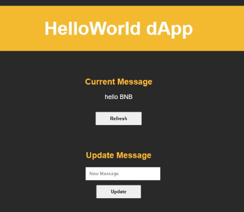
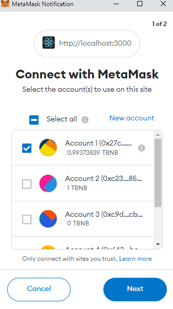

# opBNB üzerinde Truffle ve React kullanarak Tam Yığın DApp oluşturma

Bu eğitimde, opBNB üzerinde basit bir HelloWorld akıllı sözleşmesini dağıtacağız ve dağıtılan akıllı sözleşme ile etkileşimde bulunmak için React kullanarak bir Web3 ön yüzü oluşturacağız; yani opBNB blockchain'inden okumak ve yazmak.

## Ne yapıyoruz

opBNB, temel olarak BNB Zinciri'nin tam potansiyelini açığa çıkarmak için daha düşük ücretler ve daha yüksek verim sunan optimize edilmiş bir katman-2 çözümüdür.

:::info
Bu eğitim için, opBNB ağında basit bir `HelloWorld` akıllı sözleşmesini dağıtacağız ve dağıtılan akıllı sözleşme ile veri okumak ve yazmak için ReactJS kullanarak bir ön yüz oluşturacağız.
:::

`HelloWorld` akıllı sözleşmesi, kullanıcı tanımlı mesajları depolamak için kullanılacak basit bir dize değişken mesajıdır, örneğin, `Merhaba, opBNB Kullanıcısı`. `updateMessage` fonksiyonu, mesaj değişkenini herhangi bir kullanıcı tanımlı dize değeri ile güncellemek için kullanılacaktır.

Bu akıllı sözleşme daha sonra [Truffle IDE](https://trufflesuite.com/) kullanılarak opBNB ağında dağıtılacaktır. Daha sonra [ReactJS boilerplate](https://create-react-app.dev/) kullanarak akıllı sözleşme ile iletişim kuracak bir ön yüz oluşturacağız. [Web3.js kütüphanesi](https://web3js.readthedocs.io/en/v1.10.0/#) akıllı sözleşme ile etkileşimde bulunmak ve opBNB blockchain'ine veri okumak ve yazmak için kullanılmaktadır. Ayrıca işlemleri imzalamak ve herhangi bir gaz maliyetini ödemek için [Metamask](https://metamask.io/) kullanıyoruz.

*Bu, eğitim amaçlı temel bir örnektir ve [Truffle](https://trufflesuite.com/), [React](https://react.dev/) ve [MetaMask](https://metamask.io/) ile aşinalık varsaymaktadır.*

## Öğrenim Kazanımları

Bu eğitim sonunda aşağıdakilere ulaşabileceksiniz:

- Truffle IDE kullanarak bir proje şablonu oluşturmak ve opBNB üzerinde basit bir akıllı sözleşmeyi yazmak, derlemek ve dağıtmak.
- Dağıtılan akıllı sözleşme ile etkileşimde bulunmak için ReactJS kullanarak bir ön yüz oluşturmak.
- ReactJS ön yüzü aracılığıyla opBNB üzerinde dağıtılan akıllı sözleşmelerle Web3.js kütüphanesi kullanarak etkileşimde bulunmak.

## Ön Koşullar

- [Node.js (Node v18.14.2)](https://nodejs.org/en/download/)
- [Metamask Web Cüzdanı](https://metamask.io/)
- [Truffle v5.10.0](https://trufflesuite.com/docs/truffle/how-to/install/)
- opBNB Testnet ile yapılandırılmış Metamask cüzdanınızda tBNB alın
  - `opBNB için Metamask Cüzdanı Yapılandırması.`
  - `opBNB hesabınıza tBNB yatırın`

## Demo Adım Adım Kılavuzu

Bu eğitimde, basit bir `HelloWorld` akıllı sözleşmesini opBNB ağında geliştirmek, derlemek ve dağıtmak için Truffle IDE kullanacağız. Ön yüzü oluşturmak için `create-react-app` React boilerplate'ini kullanacağız. Daha da önemlisi, dapp'imizi web3 dünyasına bağlamak için Metamask cüzdanını kullanacağız.

### Adım 1: Projeyi ayarlayın

1. Makinenizde Node.js ve npm'nin kurulu olduğundan emin olun.

2. Aşağıdaki komutu çalıştırarak Truffle'ı global olarak kurun:

    ```shell
    npm install -g truffle
    ```

3. Projeniz için yeni bir dizin oluşturun ve içine girin:

    ```shell
    mkdir HelloWorldDapp
    cd HelloWorldDapp
    ```

4. Yeni bir Truffle projesi başlatın. Sözleşmeleri test etmek ve dağıtmak için gerekli dizin yapısını oluşturan [bare Truffle projesi](https://trufflesuite.com/docs/truffle/getting-started/creating-a-project.html) oluşturun:

    ```shell
    truffle init
    ```
   
    Truffle, projeniz için aşağıdaki dizin yapısını oluşturur:

     - `contracts/`: [Solidity sözleşmeleriniz](https://trufflesuite.com/docs/truffle/getting-started/interacting-with-your-contracts) için dizin.
     - `migrations/`: [betimlenebilir dağıtım dosyaları](https://trufflesuite.com/docs/truffle/getting-started/running-migrations#migration-files) için dizin.
     - `test/`: [uygulamanızı ve sözleşmelerinizi test eden](https://trufflesuite.com/docs/truffle/testing/testing-your-contracts) dosyalar için dizin.
     - `truffle-config.js`: Truffle [yapılandırma dosyası](https://trufflesuite.com/docs/truffle/reference/configuration).

5. Aşağıdaki komutu çalıştırarak Create React App'i global olarak kurun:

    ```shell
    npm install -g create-react-app
    ```

6. Aşağıdaki komut ile React uygulaması ön yüzünü oluşturun:

    ```shell
    npx create-react-app frontend
    ```

7. Aşağıdaki komut ile istemci dizinine gidin:

    ```shell
    cd frontend
    ```

### Adım 2: `hdwallet-provider​`i kurun

`hdwallet-provider`, 12 veya 24 kelimeden türetilmiş adresler için işlemleri imzalayan ayrı bir pakettir. Varsayılan olarak, `hdwallet-provider`, mnemonikten üretilen ilk adresi kullanır. Ancak bu yapılandırılabilir. Daha fazla bilgi için Truffle `hdwallet-provider` deposuna başvurun. `hdwallet-provider`'ı kurmak için aşağıdaki komutu çalıştırın:

```shell
npm install @truffle/hdwallet-provider
```

### Adım 3: `.env` dosyasını oluşturun​

- Aşağıdaki komutu kullanarak `dotenv` paketini kurun:

```shell
npm install dotenv
```

- Metamask Gizli İfadesini depolamak için proje dizininizde `.env` adında bir dosya oluşturun. Gizli kurtarma ifadesini ortaya çıkarmak için MetaMask talimatlarına [buradan](https://metamask.zendesk.com/hc/en-us/articles/360015290032-How-to-Reveal-Your-Seed-Phrase) bakabilirsiniz.

```js
MNEMONIC = "<TSecret-Kurtarma-Verginiz>";
```

- Aşağıdaki değerleri `.env` dosyasında değiştirin:
  - `` kısmını Metamask cüzdanınızın mnemonikleri ile değiştirin. Bu ifade, [Truffle hdwallet-provider'ı](https://github.com/trufflesuite/truffle/tree/develop/packages/hdwallet-provider) işlemleri imzalamak için kullanır.

:::warning
Gizli kurtarma ifadenizi asla açıklamayın. Kurtarma ifadesine sahip olan herkes cüzdanınızdaki herhangi bir varlığı çalabilir.
:::

### Adım 4: Akıllı sözleşmeyi oluşturun

Contracts dizininde `HelloWorld.sol` adında yeni bir dosya oluşturun ve aşağıdaki kodu ekleyin:

```jsx
// SPDX-License-Identifier: MIT
pragma solidity ^0.8.19;

contract HelloWorld {
    string public message;

    constructor(string memory _message) {
        message = _message;
    }

    function updateMessage(string memory _newMessage) public {
        message = _newMessage;
    }
}
```

### Adım 5: Truffle'ı opBNB ile kullanmak için yapılandırın

1. `truffle-config.js` dosyasını açın ve aşağıdaki kodu ekleyin:

    ```jsx
    const HDWalletProvider = require("@truffle/hdwallet-provider");
    // projenizin kökünde .env adında bir dosya oluşturun -- burada mnemonik vs gibi process değişkenlerini ayarlayabilirsiniz.
    // Not: .env, özel bilgilerinizin güvenliğini sağlamak için git tarafından yoksayılır.
    
    require("dotenv").config();
    
    const mnemonic = process.env["MNEMONIC"].toString().trim();
    
    module.exports = {
      networks: {
        development: {
          host: "127.0.0.1", // Yerel (varsayılan: yok)
          port: 8545, // Standart Ethereum portu (varsayılan: yok)
          network_id: "*", // Herhangi bir ağ (varsayılan: yok)
        },
        opBNBTestnet: {
          provider: () =>
            new HDWalletProvider(
              mnemonic,
              `https://opbnb-testnet-rpc.bnbchain.org`
            ),
          network_id: 5611,
          confirmations: 3,
          timeoutBlocks: 200,
          skipDryRun: true,
        },
      },
    
      // Varsayılan mocha seçeneklerini burada ayarlayın, özel raporlayıcılar kullanın vb.
      mocha: {
        // timeout: 100000
      },
    
      // Derleyicilerinizi yapılandırın
      compilers: {
        solc: {
          version: "0.8.19",
        },
      },
    };
    ```

### Adım 6: Akıllı sözleşmeyi opBNB üzerinde dağıtın

1. Projenizin kök dizininde, `migrations` dizininde `1_deploy_contract.js` adında yeni bir dosya oluşturun ve aşağıdaki kodu ekleyin:

    ```jsx
    const HelloWorld = artifacts.require("HelloWorld");
    
    module.exports = function (deployer) {
      deployer.deploy(HelloWorld, "Merhaba, Dünya!");
    };
    ```

2. Akıllı sözleşmeyi opBNB testnet'ine dağıtmak için aşağıdaki komutu çalıştırın:

    ```shell
    truffle migrate --network opBNBTestnet
    ```

    

### Adım 7: React ön yüzünü ayarlayın

1. `frontend/src` dizininde `App.js` dosyasının içeriğini aşağıdaki kod ile değiştirin:

    ```jsx
    import React, { useEffect, useState } from "react";
    import Web3 from "web3";
    import HelloWorldContract from "./contracts/HelloWorld.json";
    import "./App.css";
    
    function App() {
      const [contract, setContract] = useState(null);
      const [message, setMessage] = useState("");
      const [newMessage, setNewMessage] = useState("");
      const [loading, setLoading] = useState(false);
    
      useEffect(() => {
        const loadBlockchainData = async () => {
          try {
            const web3 = new Web3(window.ethereum);
            const networkId = await web3.eth.net.getId();
            const deployedNetwork = HelloWorldContract.networks[networkId];
            const instance = new web3.eth.Contract(
              HelloWorldContract.abi,
              deployedNetwork && deployedNetwork.address
            );
            setContract(instance);
          } catch (error) {
            console.error(error);
          }
        };
    
        loadBlockchainData();
      }, []);
    
      const getMessage = async () => {
        if (contract) {
          try {
            setLoading(true);
            const message = await contract.methods.message().call();
            setMessage(message);
          } catch (error) {
            console.error(error);
          } finally {
            setLoading(false);
          }
        }
      };
    
      const updateMessage = async () => {
        if (contract && newMessage !== "") {
          try {
            setLoading(true);
            await contract.methods
              .updateMessage(newMessage)
              .send({ from: (await window.ethereum.enable())[0] });
            setNewMessage("");
          } catch (error) {
            console.error(error);
          } finally {
            setLoading(false);
          }
        }
      };
    
      return (
        <div className="App">
          <h1 className="header">HelloWorld dApp</h1>
          <div className="content">
            <div className="message">
              <h2>Mevcut Mesaj</h2>
              <p className="messageValue">{loading ? "Yükleniyor..." : message}</p>
              <button onClick={getMessage}>Yenile</button>
            </div>
          </div>
          <div className="content">
            <div className="update">
              <h2>Mesajı Güncelle</h2>
              <input
                type="text"
                placeholder="Yeni Mesaj"
                value={newMessage}
                onChange={(e) => setNewMessage(e.target.value)}
                className="inputMessage"
              />
              <br />
              <button onClick={updateMessage}>Güncelle</button>
            </div>
          </div>
        </div>
      );
    }
    
    export default App;
    ```

2. `App.css` dosyasının içeriğini aşağıdaki kod ile değiştirin:

    ```css
    .App {
      text-align: center;
    }
    
    .header {
      background-color: #f3ba2f;
      min-height: 20vh;
      display: flex;
      flex-direction: column;
      align-items: center;
      justify-content: center;
      font-size: calc(40px + 2vmin);
      color: white;
    }
    
    .content {
      display: flex;
      justify-content: center;
      align-items: center;
      padding: auto;
      text-align: center;
    }
    
    .message,
    .update {
      padding: auto;
      margin: 20px;
    }
    .messageValue {
      color: whitesmoke;
      font-size: large;
    }
    
    .inputMessage {
      float: center;
      padding: 10px;
      width: 100%;
      font-family: "IBM Plex Sans", "Raleway", "Source Sans Pro", "Arial";
    }
    
    button {
      float: center;
      margin: 1em 0;
      padding: 10px 3em;
      font-weight: bold;
      max-width: fit-content;
      font-family: "IBM Plex Sans", "Raleway", "Source Sans Pro", "Arial";
    }
    
    body {
      background-color: #292929;
      color: #f3ba2f;
      align-items: center;
      font-family: "IBM Plex Sans", "Raleway", "Source Sans Pro", "Arial";
      -webkit-font-smoothing: antialiased;
      -moz-osx-font-smoothing: grayscale;
    }
    ```

### Adım 8: Geliştirme sunucusunu başlatın

1. Ön yüz dizininde, aşağıdaki komutu çalıştırarak gerekli bağımlılıkları yükleyin:

    ```shell
    npm install
    ```

2. React geliştirme sunucusunu başlatın:

    ```shell
    npm start
    ```

3. Tarayıcınızda `http://localhost:3000` adresini ziyaret edin ve mevcut mesaj ile güncelleyebilme yeteneği olan `HelloWorld` dApp'inizi göreceksiniz.

    *Metamask uzantısının kurulu olduğundan ve opBNB testnet'ine ayarlandığından emin olun.*
    

4. Yeni bir mesaj girdiğinizde ve güncelle butonuna tıkladığınızda, eğer dapp'iniz zaten Metamask cüzdanına bağlı değilse, cüzdanınızı dapp'e bağlama izni isteyen bir Metamask bildirimi alacaksınız.

    

5. Ayrıca işlem onayını onaylamanızı isteyecektir. Onay butonuna tıklayarak devam edin.

    

6. İşlem onaylandığında, yeni mesajı yüklemek için `Yenile` butonuna tıklayın.

    

## Sonuç

:::note
Bu eğitimde, opBNB ağı üzerinde bir akıllı sözleşmeyi geliştirme, dağıtma ve etkileşimde bulunma sürecine adım adım bir kılavuz sağladık.
:::

Akıllı sözleşmeyi derlemek ve dağıtmak için Truffle IDE kullandık. Ayrıca dağıtılan akıllı sözleşme ile etkileşimde bulunmak için React ön yüzü oluşturduk; yani opBNB blockchain'inden okumak ve yazmak.