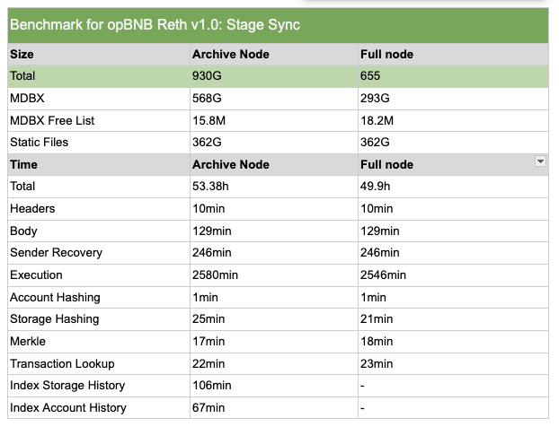

# opBNB için Reth Node

OpBNB Reth, opBNB ağına destek sağlamak için geliştirilen bir Rust istemcisidir. BNB Zinciri üzerindeki istemci çeşitliliğini ve performansını artırmayı hedefler.

## Donanım Özellikleri

OpBNB Reth'i etkili bir şekilde çalıştırmak için sisteminizin aşağıdaki donanım gereksinimlerini karşıladığından emin olun:

* 16+ çekirdekli CPU
* 128GB RAM
* En az 3TB boş alana sahip yüksek performanslı NVMe SSD
* 25 MB/s yükleme/indirme hızına sahip bir geniş bant internet bağlantısı

:::info
**Bu gereksinimlerin altında kalmanız durumunda, opBNB Reth'in performansı olumsuz etkilenebilir.**
:::

## opBNB Reth Node'u Çalıştırma

opBNB Reth, opBNB ağı için bir [execution client](https://ethereum.org/en/developers/docs/nodes-and-clients/#execution-clients) 'dir. opBNB ağı ile senkronize olmak için op-node ile op-reth'i birlikte çalıştırmanız gerekir.

**Her iki op-node ve op-reth'in kimlik doğrulaması için aynı JWT gizli dosyasını kullanması gerektiğini unutmayın.** JWT gizli dosyasını oluşturmak ve op-node ve op-reth'i çalıştırmak için çalışma dizinine kopyalamak için aşağıdaki komutu kullanabilirsiniz.
```shell
openssl rand -hex 32 > jwt.txt
```

### OP Node'u Çalıştırma
1. Kaynak kodunu indirin ve oluşturun
```shell
git clone https://github.com/bnb-chain/opbnb
cd opbnb
make op-node
```

2. op-node'u başlatın
```shell
# mainnet için
export network=mainnet
export L1_RPC=https://bsc-dataseed.bnbchain.org
export P2P_BOOTNODES="enr:-J24QA9sgVxbZ0KoJ7-1gx_szfc7Oexzz7xL2iHS7VMHGj2QQaLc_IQZmFthywENgJWXbApj7tw7BiouKDOZD4noWEWGAYppffmvgmlkgnY0gmlwhDbjSM6Hb3BzdGFja4PMAQCJc2VjcDI1NmsxoQKetGQX7sXd4u8hZr6uayTZgHRDvGm36YaryqZkgnidS4N0Y3CCIyuDdWRwgiMs,enr:-J24QPSZMaGw3NhO6Ll25cawknKcOFLPjUnpy72HCkwqaHBKaaR9ylr-ejx20INZ69BLLj334aEqjNHKJeWhiAdVcn-GAYv28FmZgmlkgnY0gmlwhDTDWQOHb3BzdGFja4PMAQCJc2VjcDI1NmsxoQJ-_5GZKjs7jaB4TILdgC8EwnwyL3Qip89wmjnyjvDDwoN0Y3CCIyuDdWRwgiMs"

# testnet için
# Stabilite için L1_RPC'yi kendi BSC Testnet RPC Uç Noktanızla değiştirmeniz daha iyidir
# export network=testnet
# export L1_RPC=https://bsc-testnet.bnbchain.org
# export P2P_BOOTNODES="enr:-J24QGQBeMsXOaCCaLWtNFSfb2Gv50DjGOKToH2HUTAIn9yXImowlRoMDNuPNhSBZNQGCCE8eAl5O3dsONuuQp5Qix2GAYjB7KHSgmlkgnY0gmlwhDREiqaHb3BzdGFja4PrKwCJc2VjcDI1NmsxoQL4I9wpEVDcUb8bLWu6V8iPoN5w8E8q-GrS5WUCygYUQ4N0Y3CCIyuDdWRwgiMr,enr:-J24QJKXHEkIhy0tmIk2EscMZ2aRrivNsZf_YhgIU51g4ZKHWY0BxW6VedRJ1jxmneW9v7JjldPOPpLkaNSo6cXGFxqGAYpK96oCgmlkgnY0gmlwhANzx96Hb3BzdGFja4PrKwCJc2VjcDI1NmsxoQMOCzUFffz04eyDrmkbaSCrMEvLvn5O4RZaZ5k1GV4wa4N0Y3CCIyuDdWRwgiMr"

./op-node/bin/op-node \
  --l1.trustrpc \
  --sequencer.l1-confs=15 \
  --verifier.l1-confs=15 \
  --l1.http-poll-interval 60s \
  --l1.epoch-poll-interval 180s \
  --l1.rpc-max-batch-size 20 \
  --rollup.config=./assets/${network}/rollup.json \
  --rpc.addr=0.0.0.0 \
  --rpc.port=8546 \
  --p2p.sync.req-resp \
  --p2p.listen.ip=0.0.0.0 \
  --p2p.listen.tcp=9003 \
  --p2p.listen.udp=9003 \
  --snapshotlog.file=./snapshot.log \
  --p2p.bootnodes=$P2P_BOOTNODES \
  --metrics.enabled \
  --metrics.addr=0.0.0.0 \
  --metrics.port=7300 \
  --pprof.enabled \
  --rpc.enable-admin \
  --l1=${L1_RPC} \
  --l2=http://localhost:8551 \
  --l2.jwt-secret=./jwt.txt \
  --syncmode=execution-layer
```

### opBNB Reth Arşiv Node'u Çalıştırma
1. Kaynak kodunu indirin ve oluşturun
```shell
git clone https://github.com/bnb-chain/reth.git
cd reth
make build-op
```

2. op-reth'i başlatın
```shell
# mainnet için
export network=mainnet
export L2_RPC=https://opbnb-mainnet-rpc.bnbchain.org

# testnet için
# export network=testnet
# export L2_RPC=https://opbnb-testnet-rpc.bnbchain.org

./target/release/op-reth node \
    --datadir=./datadir \
    --chain=opbnb-${network} \
    --rollup.sequencer-http=${L2_RPC} \
    --authrpc.addr="0.0.0.0" \
    --authrpc.port=8551 \
    --authrpc.jwtsecret=./jwt.txt \
    --http \
    --http.api="eth, net, txpool, web3, rpc" \
    --log.file.directory ./datadir/logs
```

3. Alternatif olarak, op-reth node'unu docker ile çalıştırabilirsiniz
```shell
# mainnet için
export network=mainnet
export L2_RPC=https://opbnb-mainnet-rpc.bnbchain.org

# testnet için
# export network=testnet
# export L2_RPC=https://opbnb-testnet-rpc.bnbchain.org

# docker imajının sürümünü kontrol etmek için, https://github.com/bnb-chain/reth/pkgs/container/op-reth
export version=latest

# reth verilerinin depolanacağı dizin
export data_dir=/xxx/xxx

# jwt.txt dosyasının depolandığı dizin
export jwt_dir=/xxx/xxx

docker run -d -p 8545:8545 -p 30303:30303 -p 30303:30303/udp -v ${data_dir}:/data -v ${jwt_dir}:/jwt \
    --name op-reth ghcr.io/bnb-chain/op-reth:${version} node \
    --datadir=/data \
    --chain=opbnb-${network} \
    --rollup.sequencer-http=${L2_RPC} \
    --authrpc.addr="0.0.0.0" \
    --authrpc.port=8551 \
    --authrpc.jwtsecret=/jwt/jwt.txt \
    --http \
    --http.api="eth, net, txpool, web3, rpc" \
    --log.file.directory /data/logs
```

### opBNB Reth Tam Node'u Çalıştırma

Bir tam node çalıştırmak için, op-reth node'unu başlatırken yalnızca `--full` bayrağını eklemeniz yeterlidir.

## Benchmark Sonuçları

[Reth(v1.0.0)](https://github.com/bnb-chain/reth/releases/tag/v1.0.0), [op-nodes(v0.4.2)](https://github.com/bnb-chain/opbnb/releases/tag/v0.4.2) AWS [i4g.4xlarge](https://instances.vantage.sh/aws/ec2/i4g.4xlarge)(16 çekirdek 128G) örneğinde NVMe SSD ile test edilmiştir. 

> Arşiv node için opBNB mainnet üzerinde en son bloğu senkronize etmek **yaklaşık 53 saat**, tam node için ise **50 saat** sürebilir.  
> — Benchmark Sonuçları

op-reth, başlangıç senkronizasyonu ve Canlı Senkronizasyon için daha iyi performans sağlamak amacıyla yeniden yapılandırılmış Aşama Senkronizasyonunu destekler. 

Aşağıdaki tablo, opBNB ağına yetiştikten sonra aşama senkronizasyonu ve depolama dağılımı için toplam süreyi göstermektedir:



Sonuç, son 1M blokta (tarihi senkronizasyon sayıları "backfills" sırasında saf yürütme süresini temsil eder) **690 MGas/s'lik** teşvik edici bir sonuç göstermektedir.

opBNB ağındaki canlı senkronizasyon performansı çok iyimser değildir. 

> [30467068, 30429919] blokları için metrikleri gözlemledik.  
> — Canlı Senkronizasyon Performansı


:::warning
Canlı senkronizasyonun düşük performansının ana nedeni, mdbx'in yazmaya dost bir veritabanı olmamasıdır. Blok yürütmesi sonunda commit db, birkaç on milisaniye alır ve bu, opBNB gibi hızlı engellemeli katman 2 çözümleri için daha belirgin bir zorluk oluşturur.
:::