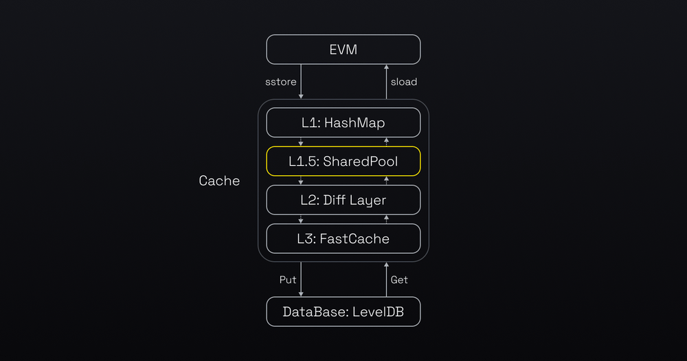
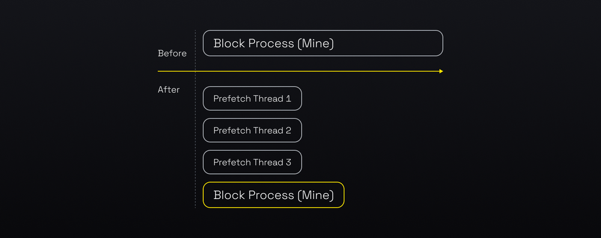
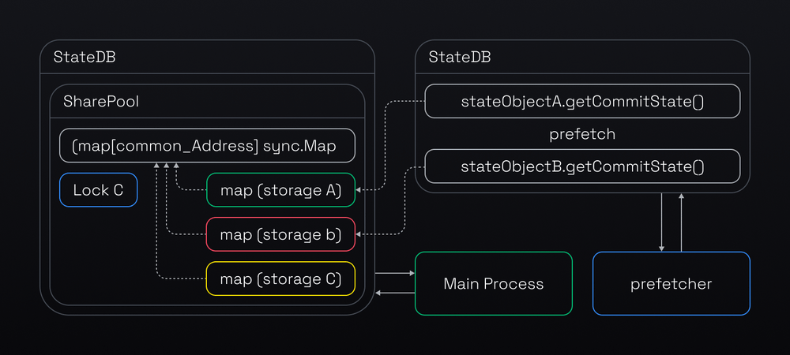

## OP Yığını Üzerinde Optimizasyonlar - opBNB

Bu belge, OP Yığını'na yapılan çeşitli optimizasyonları tartışmakta olup, bu optimizasyonların **performansı artırdığı** ve **süper ucuz gas ücretleri** sunmasına yardımcı olduğu belirtilmektedir. 

## opBNB, artırılmış performans ve ucuz gas ücretleri sunuyor

opBNB, OP Yığını'nın "İşlem Katmanı" ve "Türetim Katmanı"nın performansını artırmaktadır; bu durum [OP Yığını manzarası](https://stack.optimism.io/docs/understand/landscape/?ref=binance.ghost.io#existing-landscape) içerisinde vurgulanmıştır.

## İşlem Katmanının Optimizasyonu

opBNB protokolünü geliştirmenin ana zorluklarından biri **yüksek işlem hacmini sağlamak** olmuştur. Bunu başarmak için, opBNB daha önce [BSC için uygulanmış olan](https://nodereal.io/blog/en/bnb-smart-chain-performance-anatomy-series-chapter-ii-99-cache-hit-rate/?ref=binance.ghost.io) işlem optimizasyon tekniklerinden faydalanmıştır.

## EVM Durum Verisi Erişim Optimizasyonu

Optimizasyonların detaylarına girmeden önce, EVM'nin durum verisi ile nasıl başa çıktığını görelim. Aşağıdaki diagram, EVM'nin durum verilerine nasıl eriştiğini göstermektedir. EVM önce veriler için bellekteki önbelleği kontrol eder. Eğer veriler orada değilse, EVM disk IO’sunu içeren LevelDB'yi kullanır.

:::info
Önbellek verimliliğini artırarak ve veritabanı okuma ve yazmalarını hızlandırarak, opBNB, hem düğüm operatörlerine hem de son kullanıcılarına fayda sağlayan önemli performans ve ölçeklenebilirlik kazanımları elde etmektedir.
:::

*Standart Ethereum dünya durumu veri saklama modeli ile karşılaştırıldığında, BNB hit oranını artırmak için L1.5 önbellek olarak “SharedPool”u tanıtmıştır.*

## L2: Fark Katmanında [Bloom Filter](https://en.wikipedia.org/wiki/Bloom_filter?ref=binance.ghost.io) doğruluğunun artırılması

L2: Fark Katmanında [Bloom Filter](https://en.wikipedia.org/wiki/Bloom_filter?ref=binance.ghost.io) doğruluğunu artırarak gereksiz tekrar eden önbellek erişimlerini önlemek. Bloom filtreleri, bir öğenin bir veri setinde var olup olmadığını hızla doğrulayan olasılık temelli bir veri yapısıdır. Durum verilerine erişmek için EVM, Diff Katmanında anahtar-değer çiftinin var olup olmadığını doğrulamak için bloom filtresini kullanır ve ardından önbelleği tekrar eden bir şekilde arar; eğer bulamazsa, EVM doğrudan levelDB'den veriyi okur.

> **Yanlış pozitifler gereksiz tekrar eden erişimlere yol açabilir.**  
> — opBNB Takımı

Ancak, bloom filtreleri yanlış pozitifler verebilir. Ayrıca, yanlış pozitif oranı, bloom filtrelerin değerlendirdiği veri seti büyüdükçe artar. opBNB veri seti Ethereum'dan daha büyük olduğundan, yanlış pozitif olasılığı da daha büyük olabilir.

Yanlış pozitifler gereksiz tekrar eden erişimlere yol açabilir. Bunu hafifletmek için, opBNB varsayılan 128'den yapılandırılabilir bir parametre olan 32'ye düşürdü. Bu azalma, veri setinin boyutunu azaltarak, yanlış pozitif olasılığını düşürmekte ve durum verisinin geri alımını artırmak için gereksiz zaman alıcı işlemleri önlemektedir.

## L1.5 ve üst katmanlarının önbellek modelinde etkili öncü yükleme

Öncü yükleme, verileri diskten önceden önbelleğe yükleyerek işlem yürütme performansını artıran bir tekniktir. Bir blok tam senkron modda işlenmesi veya madencilik modunda madencilik yapılması gerektiğinde, opBNB düğümü durum öncü yüklemesi yapmak için N iş parçacığı başlatır.

İş parçacıkları bir blok veya TxPool işlemlerini yürütür ve sonuçları boşaltır, ancak verileri önbellekte saklar. Bu şekilde, düğüm veriye erişmesi gerektiğinde, veriyi önbellekte bulma olasılığı diskte bulma olasılığından daha yüksektir; bu da önbellek hit oranını artırır.

:::note
Ancak, orijinal öncü yükleme tasarımının bir performans sınırlaması vardı. Öncü yükleme ve ana süreçler için ayrı durum veritabanları kullanıyordu.
:::

Yeni tasarım, öncü yükleme ve ana EVM süreçleri arasında tüm dünya durumunu (originStorage) tutan bir havuz paylaşımı yaparak **performansı artırmaktadır**. Bu sayede, öncü yükleme iş parçacıkları önceden yüklenmiş verileri doğrudan L1.5'e (önbellek modelinin üst katmanı) yerleştirebilir, bu da ana sürecin erişimini hızlı hale getirir. Aşağıdaki detaylı sürece bakınız.

## Madencilik Süreci Optimizasyonu

OP Yığını'nın L2 bloklarının madencilik süreci [diagramda](https://github.com/ethereum-optimism/optimism/blob/33741760adce92c8bdf61f693058144bb6986e30/specs/assets/engine.svg?ref=binance.ghost.io) gösterilmiştir. Bu süreç, Rollup Sürücüsü (opNode) önceki blokları içe aktarırken ve ardından yeni bloklar oluşturmak için Engine API (op-geth) çağrısı yaparken bir döngüyü kapsamaktadır.

Rollup Sürücüsü (opNode), Engine API (op-geth) üzerinden engine_forkChoiceUpdatedv1 API'sini çağırarak op-geth üzerinde blok oluşturma sürecini başlatır. Bu, Engine API'sine (op-geth) işlemleri yürütme yoluyla bir başlangıç bloğu üretmesi için talimat verir. (Bakınız “**Engine API: Blok üretimini başlat**” [diagramda](https://github.com/ethereum-optimism/optimism/blob/33741760adce92c8bdf61f693058144bb6986e30/specs/assets/engine.svg?ref=binance.ghost.io)). Engine API (op-geth), Rollup Sürücüsü (opNode)'na bir yük ID'si döner.

Ancak, Engine API (op-geth) Rollup Sürücüsü (opNode) tarafından blokun taahhüdü için engine_newPayloadV1 çağrısını aldığında, işlemleri tekrar yürütmek zorundadır; bu da gereksiz ve zaman alıcıdır. **Tamamlanması yüzlerce milisaniye sürebilir.**

:::warning
Performansı optimize etmek için, ilk blok üretim aşamasında yürütme sonuçlarını saklamak için bir önbellek katmanı ekledik.
:::

Bu sayede, op-geth engine_newPayloadV1 çağrısını aldığında, verileri tekrar işlemleri yürütmek yerine önbellekten alabilir. Bu, sistem için zaman ve kaynak tasarrufu sağlar.

## Türetim Katmanı Optimizasyonu

Toplayıcı **performans darboğazı**, her işlem paketi için bir sonraki işlemi göndermeden önce L1 (BSC) üzerinde 15 blok (45 saniye) bekleme ihtiyacından kaynaklanıyordu. Bu, L1 zincirinde reorganizasyon olasılığı nedeniyleydi. Bu sorunu çözmek için, onay beklemeden paketler göndermelerini sağlayan asenkron gönderim özelliğini tanıttık.

Ayrı bir izleme süreci, L1’i takip eder ve bir reorganizasyon gerçekleşirse toplayıcıyı bilgilendirir, böylece toplayıcı etkilenen işlemleri yeniden gönderebilir. Bu özellik, toplayıcının verimliliğini artırmaktadır. Henüz test ağında mevcut değil ve hala geliştirilme aşamasındadır, ancak opBNB ana ağa dağıtılacaktır.