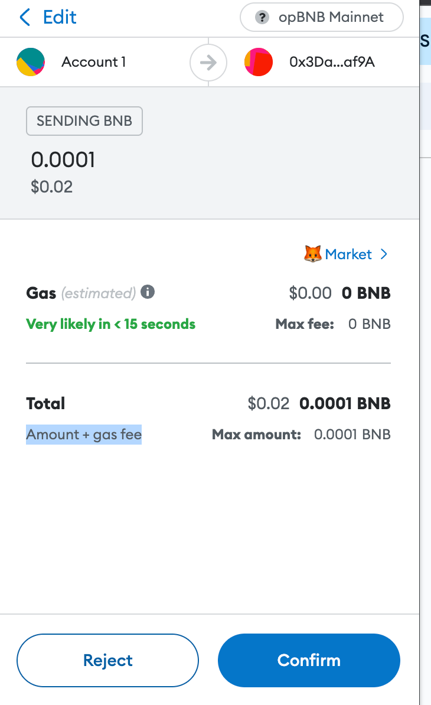

### opBNB'de transfer işleminin maliyeti nedir ve neden opBNB, günlük küçük miktar işlemlerinin kitlesel benimsenmesini sağlama kapasitesine sahiptir?

opBNB, işlem ücretleri çok düşük, işlem başına yaklaşık **$0.005** olduğu için günlük küçük işlemleri mümkün kılabilir. Bu, yaklaşık **%1-3** ücreti olan geleneksel ödeme yöntemlerinden çok daha düşüktür. opBNB'deki düşük ücretler, küçük satın alımlar ve günlük işlemler için ekonomik hale getirir.

### Gaz/stablelar için kanonik köprü bağlantısı nedir?

- **Testnet için:** 
- **Mainnet için:** 

### opBNB'de BNB token fiyatlarını nereden alabilirim?

opBNB'de BNB için token fiyatlarını [Coinmarketcap](https://coinmarketcap.com/currencies/bnb/) üzerinden alabilirsiniz.

### opBNB'deki blok gaz limiti nedir?

opBNB'deki blok gaz limiti **100M/blok**'tur ve opBNB'nin blok süresi **1 saniye**dir.

:::info
**Not:** OpBNB, saniyede yalnızca bir blok üretebilen bir yapıdadır, bu nedenle işlem gecikmeleri yaşanabilir.
:::

### opBNB'deki işlem ücretleri nasıl hesaplanır?

İşlem ücreti hesaplaması hakkında detayları `opBNB resmi belgelerinden` alabilirsiniz.

### Gaz hesaplamasında dikkate alınacak ek masraflar var mı?

Evet, L1 veri ücreti için _sabit bir ek masraf_ **2100**'dür ve _dinamik_ ek masraf (L1 Ücret Ölçeği) **1**'dir.

### Rolluplar için veri depolama ücretleri nasıl hesaplanır?

Rolluplar için veri depolama ücretleri aşağıdaki formül kullanılarak hesaplanır:

```math
l1_data_fee = l1_gas_price * (tx_data_gas + fixed_overhead) * dynamic_overhead

fixed_overhead = 2100

dynamic_overhead = 1

tx_data_gas = count_zero_bytes(tx_data) * 4 + count_non_zero_bytes(tx_data) * 16
```

### Ana zincirden katman 2 ağına opBNB varlıklarını çekerken hangi gaz ücretleri ilişkilidir?

Ana zincirden katman 2 ağına varlık çekme ile ilişkili gaz ücretleri, çekim sırasında BNB zincirinin gaz fiyatına bağlıdır. Bu ücretler, verileri zincir üzerinde sabitleme ve ağ durumunu güncelleme maliyetini kapsar.

### L2 gaz ücretleri hakkında daha fazla bilgi nerede bulabilirim?

Öne çıkan Katman 2 mainnet gaz ücretleri kaynağı:

* [opBNB](https://opbnbscan.com/tx/0xa9f32fc3ef0b3338032bffc95f1c93e4d4bf6bdf6f0225b47e3b543b5421fdc0)
* [Optimism](https://l2fees.info/) 
* [Arbitrum](https://l2fees.info/)
* [Base](https://basescan.org/tx/0xd360162fb3474308acdf707f730cbff993168ef46610f5453b3a10d7d76deaa2)
* [Starknet](https://l2fees.info/) 
* [Linea](https://l2fees.info/)
* [Polygon zkEVM](https://l2fees.info/) 
* [zkSync](https://l2fees.info/) 

BNB Zinciri'nin Katman 1'i, BSC'yi de kontrol etmek için [buraya](https://bscscan.com/tx/0x1515e830b352a76bab8468d39c4924e1d220578ab0bf69eb09914e877c0713e5) bakabilirsiniz.

### Neden opbnb işlemim reddedildi veya beklemede kalıyor?

opBNB işleminizin reddedilmesi veya beklemede kalmasının birkaç olası nedeni vardır. İşte en yaygın olanları:

* Hesabınızda işlem ücretini veya göndermek istediğiniz opBNB miktarını karşılayacak kadar bakiye yok.
* Ağ tıkanıklığı seviyesi için çok düşük bir gaz fiyatı veya gaz limiti belirlediniz ve bu da yavaş veya başarısız bir işleme neden oldu.
* Var olmayan bir fonksiyonu çağırmak veya desteklenmeyen bir token türü göndermek gibi sözleşme etkileşiminde bir hata yaptınız.
* Cüzdan sağlayıcınız, opBNB ağı veya etkileşimde bulunduğunuz akıllı sözleşme ile ilgili teknik bir sorunla karşılaştınız.

:::tip
**Öneri:** İşleminizi çözmek için cüzdan bakiyenizi kontrol edin ve ağ durumunu göz önünde bulundurarak gaz fiyatını ayarlayın.
:::

### Neden cüzdanımda tahmini işlem ücreti sıfır?

Cüzdanlar L2 ağlarına iyi uyum sağlamadığı için böyledir. Cüzdanlar, L1 ağları için tasarlanmıştır; burada toplam işlem maliyeti, L2 ağlarından farklı şekilde hesaplanır.

Örneğin, opBNB ağı üzerinde bazı opBNB tokenlerini göndermek istiyorsanız. İşlem onayını vermek için cüzdanınızı kullandığınızda tahmini gaz ücretinin 0BNB olduğunu göreceksiniz. Bu harika bir fırsat gibi görünebilir, ancak hikaye bu kadar basit değildir.

{: style="width:400px"}

Cüzdanınızdaki gaz ücreti, çok düşük olduğu için bir dizi işlemi bir araya getiren bir toplu işleme tekniği kullandığı için işlem ve L2 kısmına dayanmaktadır. İşlemin L2 kısmı iki bileşenden oluşur: temel ücret ve öncelik ücreti. Temel ücret, ağ tıkanıklığına bağlı olarak sabit bir miktardır ve öncelik ücreti, işleminizin hızını artırmak veya azaltmak için ayarlayabileceğiniz değişken bir miktardır. Örneğin, durumumuzda temel ücret 0.000000008 gwei ve öncelik ücreti 0.00001 gwei olduğundan, toplam L2 gaz fiyatı 0.000010008 gwei'dir. Kullanılan gaz 21000'dir; bu, bir transfer işlemi için standart miktardır. Bu nedenle, toplam L2 gaz ücreti 0.000010008 * 21000 = 0.210168 gwei'dir ve bu cüzdanınızda gösterilmeyecek kadar küçüktür.

{: style="width:400px"}

Ancak, işleminiz için ödemeniz gereken tek maliyet bu değildir. Ayrıca, veri maliyeti olan katman 1 (L1) kısmı da vardır. Çünkü her L2 işleminin veriler olarak blok zincirinde kaydedilmesi gerekmekte ve blok zincirinde veri depolamak ücretsiz değildir. İşlemin L1 kısmı, verilerin boyutuna ve gönderim zamanındaki L1 gaz fiyatına bağlıdır. Örneğin, durumumuzda veri boyutu 68 byte ve L1 gaz fiyatı 249 gwei olduğundan, toplam L1 gaz ücreti 68 * 249 = 16.932 gwei'dir.

:::note
Bu nedenle, işleminizin gerçek maliyeti, L2 ve L1 kısımlarının toplamıdır; bu da 0.210168 + 16.932 = 17.142168 gwei veya yaklaşık 0.00001698 BNB veya mevcut fiyatlarla yaklaşık 0.003 USD'dir. Bu, diğer blok zincirlerine kıyasla çok ucuzdur, ancak cüzdanınızın gösterdiği gibi sıfır değildir.
:::

Bunu doğrulamak için, işlem detaylarınızı opBNB gezgininde kontrol edebilir; burada L2 ve L1 maliyetlerini açıkça göreceksiniz.

{: style="width:400px"}

opBNB'nin nasıl çalıştığını ve neden cüzdanınızın yalnızca L2 maliyetini gösterdiğini anlamanıza yardımcı olacağını umuyoruz.

### Neden bir işlemin gaz ücretlerinden biri diğerlerinden bu kadar yüksek?

opBNB işlemlerinde düzensiz yüksek gaz fiyatlarına neden olabilecek bilinen bir sorun, L1 gaz fiyatının, blok işlem gaz fiyatlarının ortalamasını alarak hesaplanmasından kaynaklanabilir:
```(Txn Fee = Gaz Fiyatı * Gaz + L1 Gaz Fiyatı * L1 Gaz Kullanıldı * L1 Ücret Ölçeği)```
Bu, eğer L1 bloğunda olağandışı yüksek bir gaz fiyatı varsa, belirli bir L2 bloğu için gaz fiyatının yüksek olacağı anlamına gelir. Bu, statik bir L1 gaz fiyatı uygulayarak gelecekte düzeltilecektir.