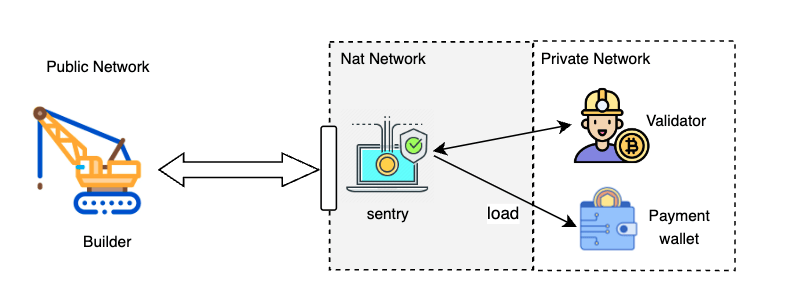

# Validator için Entegrasyon Kılavuzu

## Karar Verme

MEV işlevselliğini etkinleştirirken, validatörler bir dizi fırsat ve zorlukla karşılaşırlar. Bu özelliği etkinleştirmeden önce, validatörlerin bu riskleri dikkatlice değerlendirmesi gerekir:

1. Daha fazla bakım çalışması. Validatör dışında, Sentry hizmeti ve ilgili ağ bileşenlerinin ek bakımına ihtiyaç vardır.
2. Ağ riski. Sentry hizmetinin halka açık ağa maruz kalması, mümkün olan ağ saldırılarına karşı savunmasız olmasını kaçınılmaz kılar.
3. Finansal risk. Validatörlerin inşaatçılara ücret ödemesi gerekir; güvenli bir şekilde hesap yönetimi önemli bir konudur.

:::tip
Bu riskleri tanımladıktan sonra, yolculuğumuza başlayalım.
:::

---

## Validator Topolojisi



İç ağın iki parçaya ayrılması önerilmektedir:

1. **Özel ağ.** Özel ağ, halka açık ağdan izole edilmiştir. Bu ağ içinde bulunan bileşenlere erişim sıkı bir şekilde kısıtlanmıştır. Validator ve Ödeme cüzdanının bir özel ağ ortamında dağıtılması beklenmektedir.
2. **NAT ağı.** Bu ağdaki bileşenler belirli kısıtlamalar altında halka açık internetle iletişim kurabilir ve iletişim, çeşitli bulut platformları tarafından sağlanan yük dengeleyicileri aracılığıyla kurulabilir. Sentry hizmeti, bir NAT ağı ortamında dağıtılmalıdır. DoS saldırılarını ve diğer potansiyel tehditleri önlemek için ağ geçidinde uygun koruma önlemlerinin yapılandırılması esastır.

> Validator, RPC erişimini mev-sentry'ye açmalıdır. Mev-sentry, halka açık ağa bir alan adıyla RPC açmalıdır. Validatör bilgileri [bsc-mev-info](https://github.com/bnb-chain/bsc-mev-info) adresinde kaydedilmelidir. — Validator Entegrasyon Ekibi

### Donanım Özelliği

Mev-Sentry: Mev-sentry makinesi için önerilen özellikler 2 CPU ve 4 GB RAM'dir.

---

## Hazırlık

BNB Chain topluluğu, Sentry hizmetinin açık kaynaklı bir sürümünü sürdürmektedir. Kod deposunu [buradan](https://github.com/bnb-chain/bsc-mev-sentry) kopyalayabilirsiniz.

Sentry hizmetini gerçekten dağıtmadan önce, dikkatle düşünülmesi ve belirlenmesi gereken birkaç anahtar parametre vardır:

1. **BidFeeCeil.** Bu, bir validatörün bir inşaatçı tarafından önerilen bir blok için ödemeye istekli olduğu maksimum ücreti temsil eder. Bu değer 0 olduğunda, validatör inşaatçıdan herhangi bir ücret kabul etmemektedir.
2. **BidSimulationLeftOver.** Bu parametre, validatörün inşaatçıdan blok simülasyonunu durdurması gereken blok zamanından ne kadar önce durması gerektiğini gösterir. Genellikle birkaç on milisaniye olarak ayarlanması önerilir. Çok küçük bir değer ayarlamak, blokların çok geç yayılmasına ve ağ tıkanıklığı sırasında sonradan reddedilmesine neden olabilir.

:::warning
Validatörün takma adıyla ilgili bir alan adı satın alınması önerilir. İnşaatçılar bu alan adı üzerinden talepler gönderecektir. Ödeme hesabı olarak kullanılacak bir BSC hesabı önceden oluşturulmalıdır. **BidFeeCeil** sıfırsa, bu hesapta BNB gerekmemektedir; aksi takdirde, hesapta yeterli bakiye olduğundan emin olunmalıdır.
:::

Kurulum sırasında kullanılacak inşaatçılar hakkında daha fazla bilgi bulmak için [bsc-mev-info](https://github.com/bnb-chain/bsc-mev-info) deposuna gidin.

---

## Hızlı Kurulum

**Adım 1**: **Sentry'yi Kurun.**

Sentry hizmetini [sentry repo](https://github.com/bnb-chain/bsc-mev-sentry) için readme'ye göre dağıtın.

Aşağıda vurgulanacak birkaç anahtar nokta bulunmaktadır:

- ❗❗❗ **Bu önemli bir güvenlik duyurusudur:** Lütfen herhangi bir validatörün özel anahtarını sentry konfigürasyon dosyasına yapılandırmayın. Lütfen tamamen yeni hesaplar oluşturun ve ödemeleri bu hesaplarla yapın.
  
- Tek bir Sentry hizmeti, birden fazla validatörü yönetebilir.
- Validatörün **PrivateURL**si, Sentry'nin validatöre erişmesi için kullanılır; bu, IP:Port veya dahili alan adı URL'si olabilir.
- Validatörün **PublicHostName**si, inşaatçının validatöre erişmesi için kullanılır; Sentry, talebin farklı ana bilgisayar adına göre farklı validatörlere yönlendirmede bulunacaktır.
- Her bir İnşaatçı için, adresini ve kamu URL'sini belirleyin. Adres, inşaatçıların kimliğini yetkilendirmek için kullanılacaktır.

**Adım 2**: Validatörün Yapılandırmasını Değiştirin. 

Validatörleri v1.4.x veya daha yeni bir sürüme güncelleyin, config.toml dosyasına birkaç yeni bölüm ekleyin. Örnek:

```toml
  [Eth.Miner.Mev]
  Enabled = true # teklif alma açık
  ValidatorCommission = 100 # validatör blok ödülünden %1 talep ediyor
  BidSimulationLeftOver = 50000000 # 50ms, teklif simülasyonu için kalan süre
  SentryURL = "http://bsc-mev-sentry.io" # bu, validatörün sentry'ye erişmesini sağlar, özel bir URL veya IP:Port olmalıdır.

  # İnşaatçıları [bsc-mev-info](https://github.com/bnb-chain/bsc-mev-info) adresinde bulun

  [[Eth.Miner.Mev.Builders]]
  Address = "0x45EbEBe8...664D59c12" # validatörün teklif almayı kabul ettiği inşaatçı adresi

  [[Eth.Miner.Mev.Builders]]
  Address = "0x980A75eC...fc9b863D5" # validatörün teklif almayı kabul ettiği inşaatçı adresi
```

**Adım 3**: Bilgi Yayınlayın

Diğer inşaatçıların bunu bulabilmesi için bilgileri [bsc-mev-info](https://github.com/bnb-chain/bsc-mev-info) adresinde yayınlamanız şiddetle önerilir.