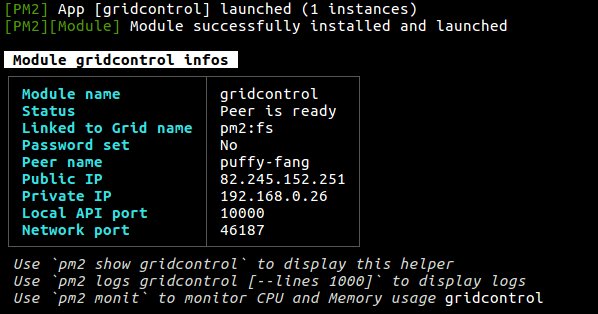

# PM2 Modülleri

PM2 modülü, PM2 tarafından kurulan ve yönetilen bağımsız bir yazılımdır. Bu yazılımlar NPM deposundan çekilir ve NPM'de ortak Javascript kütüphaneleri olarak yayınlanır.

[Herkes bir modül oluşturup yayınlayabilir](http://pm2.keymetrics.io/docs/advanced/pm2-module-system/#creating-a-module). **Bir modül**, [log döngü modülü](https://github.com/pm2-hive/pm2-logrotate), [bağımsız http proxy](https://github.com/gridcontrol/proxy-only), bir yük dengeleyici, Node.js tabanlı bir wikipedia, bir DNS sunucusu veya her türlü yardımcı program olabilir. **Yaratıcılığınız sınırdır!**

## Bir modülü yönetmek

Bir modülü yönetmek oldukça basittir:

```bash
# Kurulum
pm2 install <modül-ismi>

# Bir modülü güncelle
pm2 install <modül-ismi>

# GitHub'dan bir modül kur (kullanıcı adı/repo)
pm2 install pm2-hive/pm2-docker

# Modülün yeniden başlatılmasını zorla
pm2 restart <modül-ismi>

# Daha fazla bilgi al
pm2 describe <modül-ismi>

# Yerel klasörden geliştirme modunda bir modül kur
pm2 install .

# Bir modül iskeleti oluştur
pm2 module:generate <modül-ismi>

# Modülü kaldır
pm2 uninstall <modül-ismi>

# Yeni modül yayınla (Semver + Git push + NPM publish)
pm2 publish
```

## Bir modül oluşturmak

Bir modül örneği oluşturmak için:

```bash
pm2 module:generate <modül-ismi>
```

Artık bu modülü PM2 ile çalıştırabiliriz:

```bash
cd <modül-ismi>
pm2 install .
```

Artık kaynak kodunu düzenleyebilirsiniz ve bir şey değiştirdiğinizde, PM2 modülü otomatik olarak yeniden başlatacaktır ([watch seçeneği etkinleştirildi](http://pm2.keymetrics.io/docs/usage/watch-and-restart/)).

:::tip
Modül günlüklerini görüntülemek için:
:::

```bash
pm2 logs <modül-ismi>
```

Modülü kaldırmak için:

```
pm2 uninstall <modül-ismi>
```

## Package.json'da Şeker

**package.json** dosyasına ek bilgiler eklenebilir.

`config` özniteliği altında yapılandırma değerlerini tanımlayabilir ve modül davranışını ortak bir [pm2 yönetilen süreç](http://pm2.keymetrics.io/docs/usage/application-declaration/) gibi belirleyebilirsiniz.

**Örnek:**

```javascript
{
  "name": "pm2-logrotate",  // Modül adı olarak kullanılır
  "version": "1.0.0",       // Modül versiyonu olarak kullanılır
  "description": "my desc", // Modül yorumu olarak kullanılır
  "dependencies": {
    "pmx": "latest"
  },
  "config": {              // Varsayılan yapılandırma değerleri
                           // Bu değerler `pm2 set <modül-ismi>:<attr> <val>` ile geçersiz kılınabilir
     "days_interval" : 7,  // pmx.initModule() çağrıldığında döner
     "max_size" : 5242880
  },
  "apps" : [{              // Modül davranış seçenekleri
    "script"             : "index.js",
    "merge_logs"         : true,
    "max_memory_restart" : "200M"
  }],
  "author": "Gataca Sanders",
  "license": "MIT"
}
```

## Modül giriş noktası

Ana modül giriş noktanızda, modülünüzü başlatmak için `pmx.initModule(opts, fn(){});` çağrısını yapın:

```javascript
var pmx     = require('pmx');

var conf    = pmx.initModule({
  // İzlenecek PID'yi geçersiz kıl
  pid              : pmx.resolvePidPaths(['/var/run/redis.pid']),
}, function(err, conf) {
  // Artık modül başlatıldı
  require('./business_logic.js')(conf);
});
```

## Ek görüntüleme

PM2 modül yüklendikten sonra süreçlerinizi listelediğinde, isteğinize bağlı olarak içerik içeren bir tablo göstermek üzere davranışını değiştirebilirsiniz.

:::info
Bu davranışı etkinleştirmek için package.json dosyanızı düzenleyin ve **PM2_EXTRA_DISPLAY** bölümüne "true" değeri ekleyin:
:::

package.json:

```
{
  [...]
  "apps" : [{
    "script" : "index.js",
    "env"    : {
      "PM2_EXTRA_DISPLAY" : "true"
    }
  }],
  [...]
}
```

Ardından kodunuzda:

```javascript
var pmx = require('pmx');

pmx.configureModule({
  human_info : [
    ['Durum' , 'Modül hazır'],
    ['Yorum', 'Kullanıcının görmesi gereken muhteşem bir yorum'],
    ['IP'     , 'makinemin ip\'si!']
  ]
});
```

Artık modül yüklendiğinde bu tür bir tablo görebileceksiniz!

.

## Modül yapılandırması

package.json içinde, `config` özniteliği altında modülün erişilebilir varsayılan seçeneklerini tanımlayabilirsiniz. Bu değerler PM2 veya Keymetrics tarafından geçersiz kılınabilir.

### Varsayılan değerler

package.json dosyasındaki "config" özniteliği altında varsayılan yapılandırma değerlerini ekleyin:

```
{
 [...]
 "config": {             // Varsayılan yapılandırma değeri
    "days_interval" : 7,  // -> var ret = pmx.initModule() çağrıldığında döner
    "max_size" : 5242880  // -> örneğin ret.max_size
 }
 [...]
}
```

Bu değerler, pmx.initModule() ile dönen veriler aracılığıyla erişilebilir.

**Örnek:**

```javascript
var conf = pmx.initModule({[...]}, function(err, conf) {
  // Artık bu değerleri okuyabiliriz
  console.log(conf.days_interval);
});
```

### Değerleri değiştirmek

Bir modülün varsayılan değerlerini değiştirmek basittir, sadece şunu yapın:

```bash
pm2 set module_name:option_name <yeni_değer>
```

**Örnek:**

```bash
pm2 set server-monitoring:days_interval 2
```

- **NOT1**: Bu değişkenler `~/.pm2/module_conf.json` dosyasına yazılır, manuel olarak da düzenleyebilirsiniz
- **NOT2**: Yapılandırma değişkenlerini `pm2 conf [modül-ismi]` ile görüntüleyebilirsiniz
- **NOT3**: Yeni bir değer ayarladığınızda, hedef modül otomatik olarak yeniden başlatılır
- **NOT4**: Tür dönüşümü otomatik olarak yapılır (Boolean, Number, String)

## Bir modül yayınlama

Bir modülü güncellemek veya yayınlamak oldukça basittir. `pm2 publish` komutu, modülün küçük sürümünü artıracak, `git add . ; git commit -m "VERSION"; git push origin master` ardından `npm publish` komutunu çalıştıracaktır.

```bash
cd my-module
pm2 publish
```

## Modüller 
pm2-mongodb modülü


pm2-server-monit-modülü

### pmx.initModule ile seçenekler

```javascript
var pmx     = require('pmx');

var conf    = pmx.initModule({

    [...]

    // Bu modülün görünümünü ve hissini özelleştir
    widget : {
      // Sol üst blokta gösterilecek logo (https olmalıdır)
      logo  : 'https://image.url',
      theme : ['#9F1414', '#591313', 'white', 'white'],

      // Ana widget üstündeki yatay blokları toggleyin
      el : {
        probes : false,
        actions: false
      },

      block : {
        // Uzaktan eylem bloğunu göster
        actions : true,

        // CPU / Belleği göster
        cpu     : true,
        mem     : true,

        // Sorun sayısını göster
        issues  : true,

        // Meta bloğunu göster
        meta    : true,

        // Probenin meta verilerini göster (yeniden başlatma sayısı, yorumlayıcı...)
        meta_block : true,

        // "Ana ölçümler" olarak gösterilecek özel ölçümlerin adı
        main_probes : ['İşlemler']
      },
    },
}, function(err, conf) {
  /**
   * Ana modül girişi
   */
  console.log(conf);
  // İhtiyacınız olan her şeyi yapın
  require('./business_logic.js')(conf);
});
```

### Konfigürasyon değerlerini değiştirmek

Ana Keymetrics kontrol panelinde, modüllerin "Yapılandır" adında bir düğmesi olacaktır. Üzerine tıkladığınızda, package.json'da sergilenen tüm yapılandırma değişkenlerini erişebilir veya/veya değiştirebilirsiniz!

## Modülünüzü paylaşmak ister misiniz?

Bir modül oluşturduysanız, lütfen bize bir e-posta gönderin, modülünüzü tanıtacağız ve Keymetrics'e ekleyeceğiz: [https://keymetrics.io/contact/](https://keymetrics.io/contact/)

Eğlenceli zamanlar!