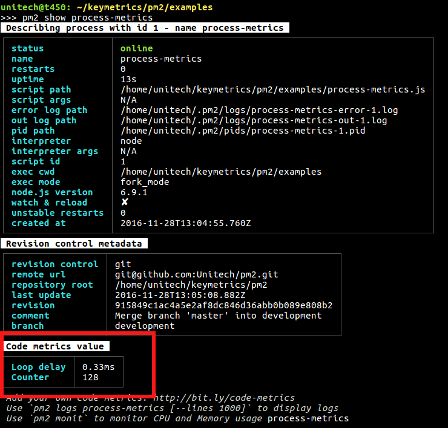

# Metreleri Açığa Çıkarma

Özel metrekleri kodunuza ekleyerek kod içindeki değerleri **gerçek zamanlı** olarak izleyebileceksiniz.

### Hızlı Başlangıç

Öncelikle [tx2](https://github.com/pm2/tx2) modülünü kurun:

```bash
$ npm install tx2
```

Sonra `monit.js` adında bir uygulama oluşturun:

```javascript
const tx2 = require('tx2')
const http = require('http')

let meter = tx2.meter({
  name      : 'req/sec',
  samples   : 1,
  timeframe : 60
})

http.createServer((req, res) => {
  meter.mark()
  res.writeHead(200, {'Content-Type': 'text/plain'})
  res.write('Merhaba Dünya!')
  res.end()
}).listen(6001)
```

Ve PM2 ile başlatın:

```bash
$ pm2 start monit.js
```

Şimdi metrikleri şu komutla gösterin:

```bash
$ pm2 show [app]
# pm2 show monit
```

:::note
*Not*: Metrikler "Özel Metrikler" bölümündedir.
:::



veya Terminal tabanlı arayüzü kullanabilirsiniz:

```bash
$ pm2 monit
```


## Metrik yardımcı mevcut

Sonra önemli bilgileri izlemek için kendi metriklerinizi programlayabilirsiniz. 4 farklı prob mevcut:

- **Basit metrikler**: Anında okunabilen değerler
    - örn. Değişken değerini izleme
- **Sayaç**: Artan veya azalan şeyler
    - örn. İşlenen indirmeler, bağlı kullanıcı
- **Metre**: Olaylar/interval olarak ölçülen şeyler
    - örn. bir http sunucusu için dakikada isteği
- **Histogram**: Son 5 dakikaya taraflı istatistiksel olarak ilgili değerlerin bir rezervuarını tutar ve dağılımlarını incelemek için kullanılır
    - örn. Veritabanına yapılan bir sorgunun yürütme ortalamasını izleme

### API Dokümantasyonu

**Not**: [TX2 API Dokümantasyonu](https://github.com/pm2/tx2/blob/main/API.md) kısmına bakın.

### Örnekler

#### Basit Metrik: Basit değer raporlama

Bu, anında okunabilen değerleri açıklığa çıkarmanızı sağlar.

```javascript
const tx2 = require('tx2')

// Burada değer fonksiyonu her saniye çağrılarak değeri elde eder
var metric = tx2.metric({
  name    : 'Gerçek Zamanlı kullanıcı',
  value   : function() {
    return Object.keys(users).length
  }
})

// Burada yeni değeri ayarlamak için valvar.set() fonksiyonunu çağıracağız
var valvar = tx2.metric({
  name    : 'Gerçek Zamanlı Değer'
})

valvar.set(23)
```

#### Sayaç: Ardışık değer değişimi

Artan veya azalan değerler.

Aktif HTTP İsteklerini saymak için örnek:

```javascript
const tx2 = require('tx2')
var http = require('http')

var counter = tx2.counter({
  name : 'Aktif istekler'
})

http.createServer(function (req, res) {
  counter.inc()

  req.on('end', function() {
    // Sayacı azalt, sayaç 0 olacak
    counter.dec()
  })
  res.writeHead(200, {'Content-Type': 'text/plain'})
  res.write('Merhaba Dünya!')
  res.end()
}).listen(6001)
```

#### Metre: Ortalama hesaplanan değerler

Olaylar/interval olarak ölçülen değerler.

Saniyede sorgu sayısını saymak için örnek:

```javascript
const tx2 = require('tx2')
var http = require('http')

var meter = tx2.meter({
  name      : 'req/sec',
  samples   : 1,
  timeframe : 60
})

http.createServer(function (req, res) {
  meter.mark()
  res.writeHead(200, {'Content-Type': 'text/plain'})
  res.write('Merhaba Dünya!')
  res.end()
}).listen(6001)
```

##### Seçenekler

**samples** seçeneği oran birimidir. Varsayılan olarak **1** sn olarak ayarlanmıştır.  
**timeframe** seçeneği olayların analiz edileceği zaman dilimidir. Varsayılan olarak **60** sn olarak ayarlanmıştır.

#### Histogram

Son 5 dakikaya taraflı istatistiksel olarak ilgili değerlerin bir rezervuarını tutar ve bunların dağılımlarını incelemek için kullanılır.

```javascript
const tx2 = require('tx2')

var histogram = tx2.histogram({
  name        : 'geçikme',
  measurement : 'ortalama'
})

var latency = 0

setInterval(function() {
  latency = Math.round(Math.random() * 100)
  histogram.update(latency)
}, 100)