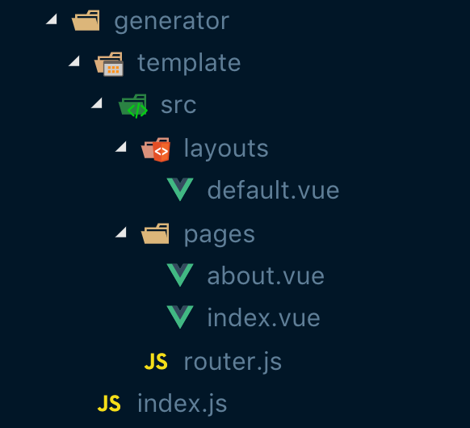
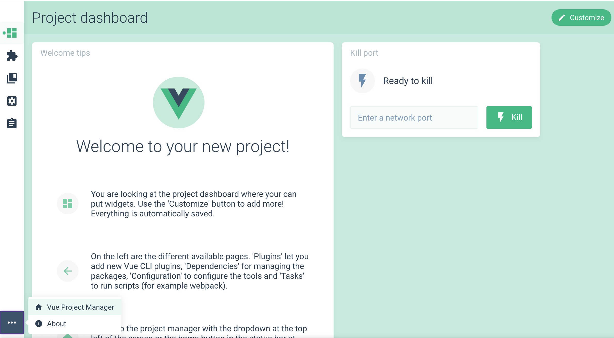
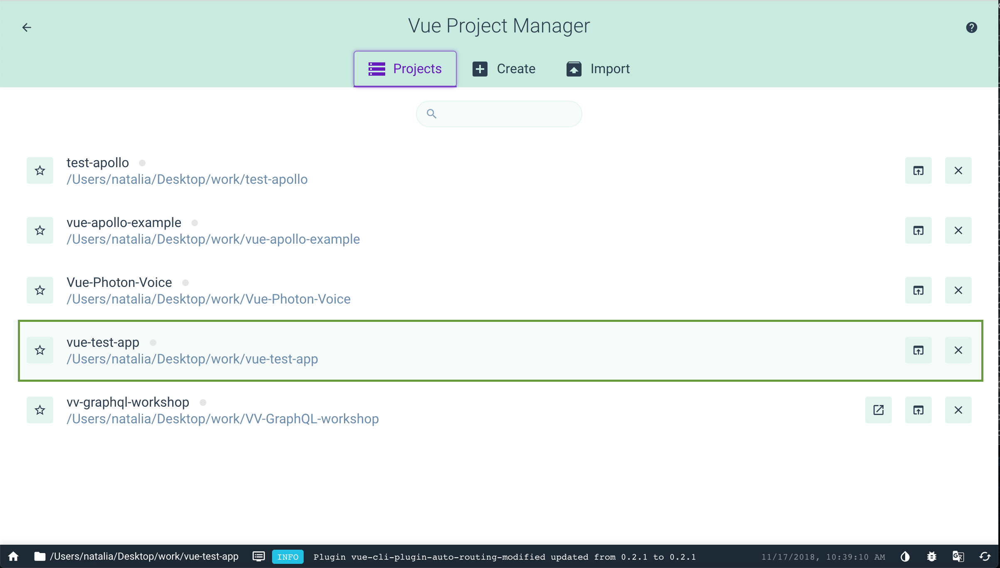
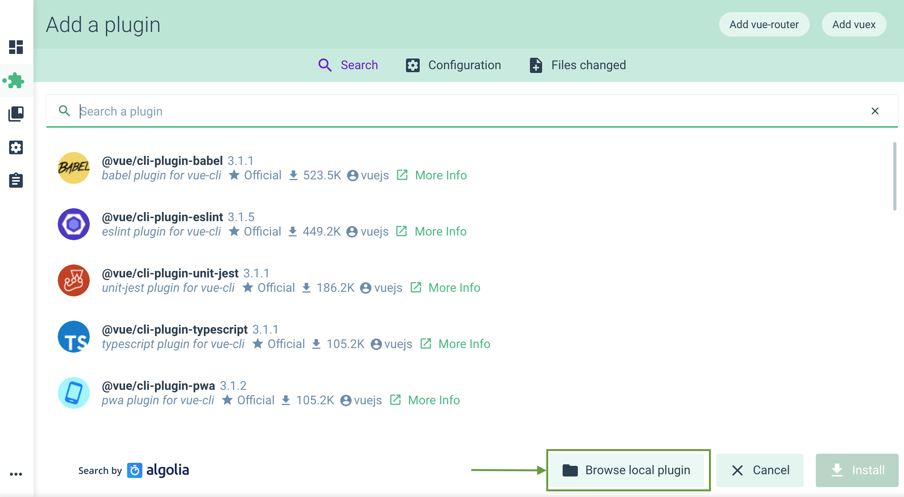
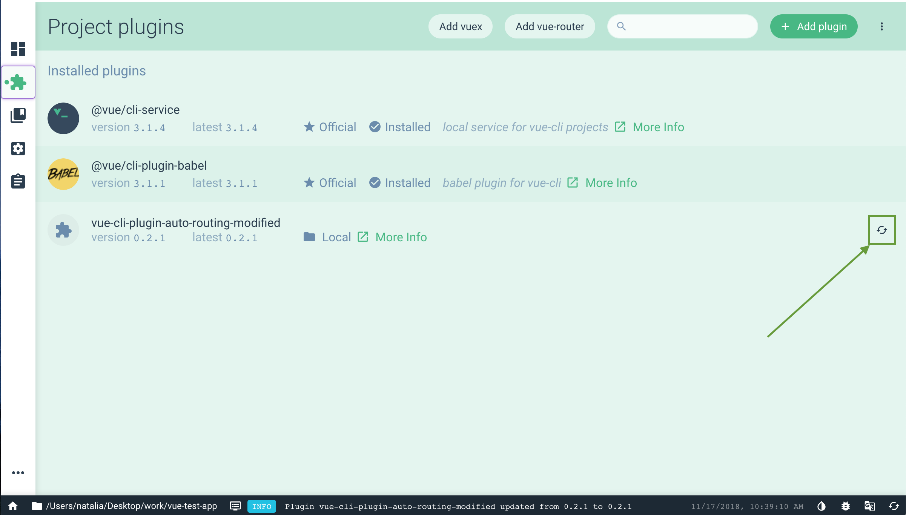
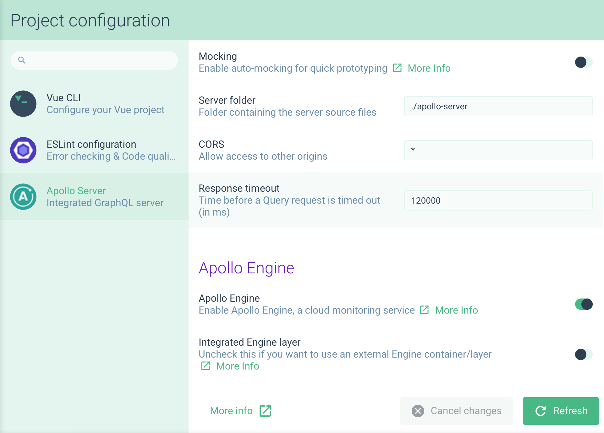
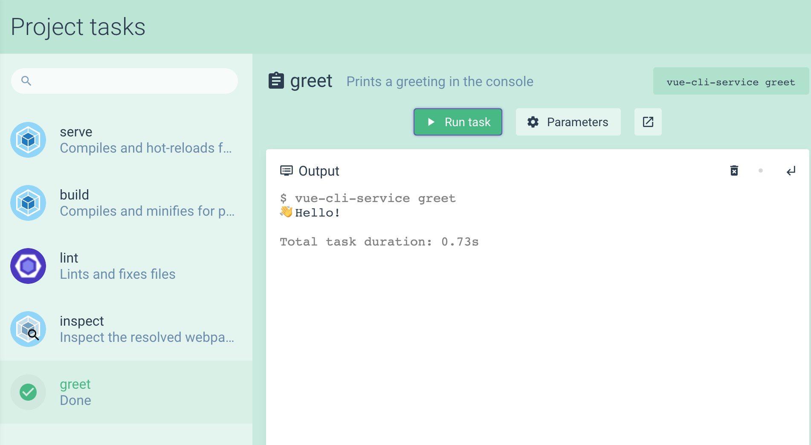
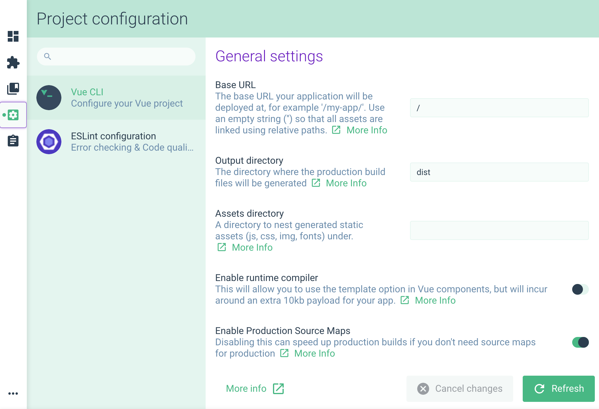
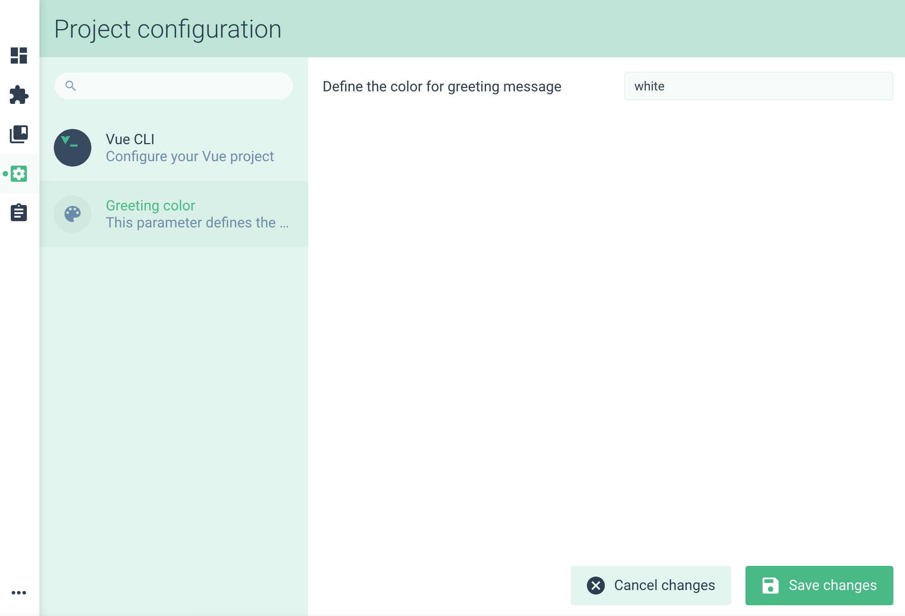
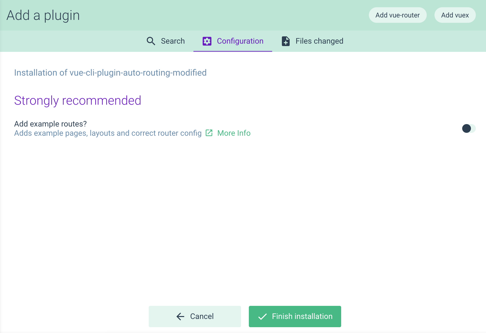

# Eklenti Geliştirme Rehberi

## Başlarken

CLI eklentisi, Vue CLI kullanarak projeye ek özellikler ekleyebilen bir npm paketidir. Bu özellikler şunları içerebilir:

- Proje webpack konfigürasyonunu değiştirmek - örneğin, eklentinizin bu tür dosyalarla çalışması gerekiyorsa, belirli bir dosya uzantısı için yeni bir webpack çözüm kuralı ekleyebilirsiniz. Örneğin, `@vue/cli-plugin-typescript` `.ts` ve `.tsx` uzantılarını çözmek için böyle bir kural ekler.
- Yeni bir vue-cli-service komutu eklemek - örneğin, `@vue/cli-plugin-unit-jest`, geliştiricinin birim testlerini çalıştırmasını sağlayan `test:unit` adlı yeni bir komut ekler.
- `package.json`’u genişletmek - projeye bazı bağımlılıklar ekliyorsanız ve bunları paket bağımlılıkları bölümüne eklemeniz gerekiyorsa faydalı bir seçenek.
- Projede yeni dosyalar oluşturmak ve/veya eski dosyaları değiştirmek. Bazen, bir örnek bileşen oluşturmak veya bazı içe aktarımlar eklemek için ana dosyayı değiştirmek iyi bir fikirdir.
- Kullanıcıdan belirli seçenekleri seçmesini istemek - örneğin, yukarıda bahsedilen örnek bileşeni oluşturmak isteyip istemediğini kullanıcıdan sorabilirsiniz.

:::tip
vue-cli eklentilerini aşırı kullanmayın! Sadece belirli bir bağımlılığı dahil etmek istiyorsanız, örneğin [Lodash](https://lodash.com/) - bunu manuel olarak npm ile yapmak, yalnızca bunu yapmak için belirli bir eklenti oluşturmaktan daha kolaydır.
:::

CLI eklentisi her zaman ana dışa aktarması olarak bir `Servis Eklentisi` içermelidir ve isteğe bağlı olarak bir `Üretici`, bir `İstem Dosyası` ve bir `Vue UI entegrasyonu` içerebilir.

Bir npm paketi olarak, CLI eklentisinin bir `package.json` dosyasına sahip olması gerekmektedir. Diğerlerinin npm'de eklentinizi bulmasına yardımcı olmak için `README.md` dosyasında bir eklenti tanımı olması da önerilir.

Tipik bir CLI eklentisi klasör yapısı şu şekildedir:

```bash
.
├── README.md
├── generator.js  # üreteci (isteğe bağlı)
├── index.js      # servis eklentisi
├── package.json
├── prompts.js    # istem dosyası (isteğe bağlı)
└── ui.js         # Vue UI entegrasyonu (isteğe bağlı)
```

## İsimlendirme ve keşfedilebilirlik

Bir CLI eklentisinin bir Vue CLI projesinde kullanılabilmesi için `vue-cli-plugin-` veya `@scope/vue-cli-plugin-` adlandırma kuralına uyması gerekir. Bu, eklentinizin aşağıdaki gibi olmasını sağlar:

- `@vue/cli-service` tarafından keşfedilebilir;
- Diğer geliştiriciler tarafından arama yoluyla keşfedilebilir;
- `vue add ` veya `vue invoke ` ile kurulabilir.

:::warning Uyarı
Eklentinin adını doğru koyduğunuzdan emin olun, aksi takdirde `vue add` komutuyla yüklenmesi veya Vue UI eklentileri arama ile bulunması imkansız olacaktır!
:::

Bir kullanıcı eklentinizi aradığında daha iyi keşfedilebilirlik sağlamak için, eklenti `package.json` dosyasının `description` alanında eklentinizi tanımlayan anahtar kelimeleri koyun.

Örnek:

```json
{
  "name": "vue-cli-plugin-apollo",
  "version": "0.7.7",
  "description": "Apollo ve GraphQL eklemek için vue-cli eklentisi"
}
```

Eklenti web sitesi veya deposunun URL'sini `homepage` veya `repository` alanına eklemelisiniz, böylece eklenti tanımında 'Daha fazla bilgi' düğmesi görüntülenecektir:

```json
{
  "repository": {
    "type": "git",
    "url": "git+https://github.com/Akryum/vue-cli-plugin-apollo.git"
  },
  "homepage": "https://github.com/Akryum/vue-cli-plugin-apollo#readme"
}
```


## Üretici

CLI eklentisinin Üretici kısmı, paketinize yeni bağımlılıklar eklemek, projede yeni dosyalar oluşturmak veya mevcut dosyaları düzenlemek istediğinizde genellikle gereklidir.

CLI eklentisi içinde üretici, `generator.js` veya `generator/index.js` dosyasına yerleştirilmelidir. İki olası senaryoda çağrılacaktır:

- Eklenti, proje oluşturma ön ayarı olarak kurulduğunda, projenin başlangıç ​​yaratımı sırasında.
- Eklenti, proje oluşturulduktan sonra kurulduğunda ve bireysel olarak `vue add` veya `vue invoke` ile çağrıldığında.

Bir üretici, üç argüman alan bir fonksiyonu dışa aktarmalıdır:

1. Bir `GeneratorAPI` örneği;
  
2. Bu eklentinin üretici seçenekleri. Bu seçenekler, proje oluşturma aşamasının `istek` aşamasında çözülür veya `~/.vuerc` dosyasında kaydedildiği durumda yüklenir. Örneğin, eğer kaydedilmiş `~/.vuerc` şu şekildeyse:

``` json
{
  "presets" : {
    "foo": {
      "plugins": {
        "@vue/cli-plugin-foo": { "option": "bar" }
      }
    }
  }
}
```

Ve kullanıcı `foo` ön ayarını kullanarak bir proje oluşturursa, o zaman `@vue/cli-plugin-foo` üreticisi ikinci argüman olarak `{ option: 'bar' }` alacaktır.

Bir üçüncü taraf eklentisi için, seçenehler, kullanıcı `vue invoke` komutunu yürüttüğünde istemlerden veya komut satırı argümanlarından çözülecektir (bkz. `İstekler`).

3. Tüm ön ayar (`presets.foo`), üçüncü argüman olarak geçilecektir.

### Yeni şablonlar oluşturma

`api.render('./template')` çağırdığınızda, üretici `./template` içindeki dosyaları (üretici dosyasına göre göreceli olarak bulunmuş) [EJS](https://github.com/mde/ejs) ile render eder.

Gelin, [vue-cli-auto-routing](https://github.com/ktsn/vue-cli-plugin-auto-routing) eklentisini oluşturduğumuzu düşünelim ve eklenti çağrıldığında projeye aşağıdaki değişiklikleri yapmak istiyoruz:

- Varsayılan bir düzen dosyasıyla birlikte bir `layouts` klasörü oluşturmak;
- `about` ve `home` sayfaları ile bir `pages` klasörü oluşturmak;
- `src` klasör köküne bir `router.js` eklemek.

Bu yapıyı oluşturmak için önce `generator/template` klasörünün içinde oluşturmalısınız:



Şablon oluşturulduktan sonra, `generator/index.js` dosyasına `api.render` çağrısını eklemelisiniz:

```js
module.exports = api => {
  api.render('./template')
}
```

### Mevcut şablonları düzenleme

Ayrıca, YAML ön belgesi kullanarak mevcut bir şablon dosyasının (başka bir paketten bile) kısımlarını miras alabilir ve değiştirebilirsiniz:

``` ejs
---
extend: '@vue/cli-service/generator/template/src/App.vue'
replace: !!js/regexp /<script>[^]*?<\/script>/
---

<script>
export default {
  // Varsayılan işlevi değiştir
}
</script>
```

Birden fazla değiştirme de mümkündür, ancak değiştirilecek dizeleri `` ve `` blokları içinde sarmanız gerekecektir:

``` ejs
---
extend: '@vue/cli-service/generator/template/src/App.vue'
replace:
  - !!js/regexp /Welcome to Your Vue\.js App/
  - !!js/regexp /<script>[^]*?<\/script>/
---

<%# REPLACE %>
Hoş Geldiniz Mesajını Değiştir
<%# END_REPLACE %>

<%# REPLACE %>
<script>
export default {
  // Varsayılan işlevi değiştir
}
</script>
<%# END_REPLACE %>
```

### Dosya adı kenar durumları

Bir şablon dosyasını render etmek istiyorsanız ve bu dosya bir noktada başlıyorsa (yani `.env`), belirli bir adlandırma kuralına uymalısınız çünkü nokta dosyaları npm'e eklentiyi yayımlarken görmezden gelinir:

```bash
# nokta dosyası şablonları noktanın yerine bir alt çizgi kullanmalıdır:

/generator/template/_env

# api.render('./template') çağırdığınızda, bu proje klasörüne şunu render edecektir:

/generator/template/.env
```

Sonuç olarak, aslında bir alt çizgi ile başlayan bir dosyayı render etmek istiyorsanız, özel bir adlandırma kuralını da izlemeniz gerekecektir:

```bash
# böyle şablonlar iki alt çizgi kullanmalıdır:

/generator/template/__variables.scss

# api.render('./template') çağırdığınızda, bu proje klasörüne şunu render edecektir:

/generator/template/_variables.scss
```

### Paketi genişletme

Projeye ek bir bağımlılık eklemeniz, yeni bir npm betiği oluşturmanız veya `package.json`'ı başka bir şekilde değiştirmeniz gerekiyorsa, API `extendPackage` yöntemini kullanabilirsiniz.

```js
// generator/index.js

module.exports = api => {
  api.extendPackage({
    dependencies: {
      'vue-router-layout': '^0.1.2'
    }
  })
}
```

Yukarıdaki örnekte bir bağımlılık ekledik: `vue-router-layout`. Eklenti çağrıldığında, bu npm modülü yüklenecek ve bu bağımlılık kullanıcının `package.json` dosyasına eklenecektir.

Aynı API yöntemiyle, projeye yeni npm görevleri de ekleyebiliriz. Bunu yapmak için, görev adını ve kullanıcının `package.json` dosyasının `scripts` bölümünde çalıştırılacak bir komutu belirlememiz gerekir:

```js
// generator/index.js

module.exports = api => {
  api.extendPackage({
    scripts: {
      greet: 'vue-cli-service greet'
    }
  })
}
```

Yukarıdaki örnekte, `Servis bölümünde` oluşturulmuş özel bir vue-cli hizmet komutunu çalıştırmak için yeni bir `greet` görevi ekliyoruz.

### Ana dosyayı değiştirme

Üretici yöntemleriyle proje dosyalarında değişiklikler yapabilirsiniz. En yaygın durum, `main.js` veya `main.ts` dosyasında bazı değişikliklerdir: yeni içe aktarmalar, yeni `Vue.use()` çağrıları vb.

Bir `router.js` dosyası oluşturduğumuzu ve şimdi bu yönlendiriciyi ana dosyaya içe aktarmak istediğimizi düşünelim. İki Üretici API yöntemini kullanacağız: `entryFile`, projenin ana dosyasını (`main.js` veya `main.ts`) döndürecek ve `injectImports`, bu dosyaya yeni içe aktarmalar eklemek için hizmet edecektir:

```js
// generator/index.js

api.injectImports(api.entryFile, `import router from './router'`)
```

Artık yönlendirici içe aktarıldığında, bu yönlendiriciyi ana dosyada Vue örneğine enjekte edebiliriz. Dosyaların diske yazıldığında çağrılacak `afterInvoke` kancasını kullanacağız.

Öncelikle ana dosya içeriğini Node'un `fs` modülüyle okumalıyız (bu, dosya sistemi ile etkileşim için bir API sağlar) ve bu içeriği satırlara ayırmalıyız:

```js
// generator/index.js

module.exports.hooks = (api) => {
  api.afterInvoke(() => {
    const fs = require('fs');
    const contentMain = fs.readFileSync(api.resolve(api.entryFile), { encoding: 'utf-8' });
    const lines = contentMain.split(/\r?\n/g);
  });
}
```

Ardından, `render` kelimesini içeren dizeyi bulmalı ve `router`'ı bir sonraki dize olarak eklemeliyiz:

```js{9-10}
// generator/index.js

module.exports.hooks = (api) => {
  api.afterInvoke(() => {
    const fs = require('fs');
    const contentMain = fs.readFileSync(api.resolve(api.entryFile), { encoding: 'utf-8' });
    const lines = contentMain.split(/\r?\n/g);

    const renderIndex = lines.findIndex(line => line.match(/render/));
    lines[renderIndex] += `\n  router,`;
  });
}
```

Son olarak, içeriği ana dosyaya geri yazmalısınız:

```js{12-13}
// generator/index.js

module.exports.hooks = (api) => {
  api.afterInvoke(() => {
    const { EOL } = require('os');
    const fs = require('fs');
    const contentMain = fs.readFileSync(api.resolve(api.entryFile), { encoding: 'utf-8' });
    const lines = contentMain.split(/\r?\n/g);

    const renderIndex = lines.findIndex(line => line.match(/render/));
    lines[renderIndex] += `${EOL}  router,`;

    fs.writeFileSync(api.resolve(api.entryFile), lines.join(EOL), { encoding: 'utf-8' });
  });
}
```

## Servis Eklentisi

Servis eklentisi, webpack konfigürasyonunu değiştirmek, yeni vue-cli hizmet komutları oluşturmak veya mevcut komutları (örneğin, `serve` ve `build`) değiştirmek için kullanılır.

Servis eklentileri, her zaman bir Servis örneği oluşturulduğunda, yani projede `vue-cli-service` komutu her çağrıldığında otomatik olarak yüklenir. CLI eklenti ana dizinindeki `index.js` dosyasında bulunur.

Bir servis eklentisi, iki argüman alan bir fonksiyon dışa aktarmalıdır:

- Bir `PluginAPI` örneği

- `vue.config.js` dosyasında belirtilen veya `package.json` dosyasındaki `"vue"` alanında belirtilen proje yerel seçeneklerini içeren bir nesne.

Servis eklentisi dosyasında gerekli minimum kod aşağıdaki gibidir:

```js
module.exports = () => {}
```

### Webpack konfigürasyonunu değiştirme

API, servis eklentilerinin farklı ortamlar için dahili webpack konfigürasyonunu genişletmesine/değiştirmesine olanak tanır. Örneğin, burada belirli parametrelerle `vue-auto-routing` webpack eklentisini içerecek şekilde webpack konfigürasyonunu değiştiriyoruz:

```js
const VueAutoRoutingPlugin = require('vue-auto-routing/lib/webpack-plugin');

module.exports = (api, options) => {
  api.chainWebpack(webpackConfig => {
    webpackConfig
      .plugin('vue-auto-routing')
        .use(VueAutoRoutingPlugin, [
          {
            pages: 'src/pages',
            nested: true
          }
        ]);
  });
}
```

Webpack konfigürasyonunu değiştirmek veya bir nesne döndürmek için `configureWebpack` yöntemini de kullanabilirsiniz.

### Yeni bir cli-service komutu ekleme

Servis eklentisi ile standartların yanına yeni bir cli-service komutu kaydedebilirsiniz (yani `serve` ve `build` gibi). Bunu `registerCommand` API yöntemiyle yapabilirsiniz.

Geliştirici konsoluna mesaj yazdıracak basit bir yeni komut oluşturmanın örneği aşağıdadır:

```js
api.registerCommand(
  'greet',
  {
    description: 'Konsola bir selam yazar',
    usage: 'vue-cli-service greet'
  },
  () => {
    console.log(`👋  Merhaba`);
  }
);
```

Bu örnekte, komut adını (`'greet'`), bir nesne olarak komut seçeneklerini `description` ve `usage` ile sağladık ve `vue-cli-service greet` komutu çalıştırıldığında çalışacak bir fonksiyon verdik.

:::tip
Projeye `package.json` dosyasında yeni komut eklemek için `Üretici` kısmını kullanabilirsiniz.
:::

Eğer eklentiniz kurulu olan projede yeni bir komut çalıştırmaya çalışırsanız, aşağıdaki çıktıyı göreceksiniz:

```bash
$ vue-cli-service greet
👋 Merhaba!
```

Yeni bir komut için mevcut seçeneklerin listesine belirtebilirsiniz. `--name` seçeneğini ekleyelim ve fonksiyonu, bu ad belirtilirse konsol mesajını yazdıracak şekilde değiştirelim.

```js
api.registerCommand(
  'greet',
  {
    description: 'Konsola bir selam yazar',
    usage: 'vue-cli-service greet [options]',
    options: { '--name': 'selam için bir isim belirtir' }
  },
  args => {
    if (args.name) {
      console.log(`👋 Merhaba, ${args.name}!`);
    } else {
      console.log(`👋 Merhaba!`);
    }
  }
);
```

Artık bir `greet` komutunu belirtilen `--name` seçeneği ile çalıştırdığınızda, bu isim konsol mesajına eklenecektir:

```bash
$ vue-cli-service greet --name 'John Doe'
👋 Merhaba, John Doe!
```

### Mevcut cli-service komutunu değiştirme

Eğer mevcut bir cli-service komutunu değiştirmek isterseniz, bunu `api.service.commands` ile alabilir ve bazı değişiklikler ekleyebilirsiniz. Uygulamanın çalıştığı portu konsola mesaj olarak yazdıracağız:

```js
const { serve } = api.service.commands;

const serveFn = serve.fn;

serve.fn = (...args) => {
  return serveFn(...args).then(res => {
    if (res && res.url) {
      console.log(`Proje şimdi ${res.url} adresinde çalışıyor`);
    }
  });
}
```

Yukarıdaki örnekte, mevcut komutlar listesinden `serve` komutunu alıyoruz; ardından `fn` kısmını değiştiriyoruz (`fn`, yeni bir komut oluşturduğunuzda geçen üçüncü parametredir; bu, komut çalıştığında çalışacak fonksiyonu belirler). Değişiklik yapıldıktan sonra, konsol mesajı `serve` komutu başarıyla çalıştırıldığında yazdırılacaktır.

### Komutlar için Mod belirtme

Eğer bir eklenti ile kaydedilen komut belirli bir varsayılan modda çalışması gerekiyorsa, eklenti bunu `{ [commandName]: mode }` biçiminde `module.exports.defaultModes` aracılığıyla ortaya koymalıdır:

``` js
module.exports = api => {
  api.registerCommand('build', () => {
    // ...
  });
}

module.exports.defaultModes = {
  build: 'production'
}
```

Bu, komutun beklenen modunun, çevre değişkenlerini yüklemeden önce biliniyor olması gerektiği anlamına gelir ki bu durum, kullanıcı seçenekleri yüklenmeden önce ve eklentileri uygulamadan önce de gerçekleşmelidir.

## İstekler

İstekler, yeni bir proje oluştururken veya mevcut bir projeye yeni bir eklenti eklerken kullanıcı seçimlerini işlemek için gereklidir. Tüm istek mantığı `prompts.js` dosyasında saklanır. İstekler, arka planda [inquirer](https://github.com/SBoudrias/Inquirer.js) kullanılarak sunulur.

Kullanıcı `vue invoke` çağrısıyla eklentiyi başlatırken, eklenti kök dizininde `prompts.js` içeriyorsa, bu istek kullanılacaktır. Dosya, Inquirer.js tarafından işlenecek bir dizi [Soru](https://github.com/SBoudrias/Inquirer.js#question) dışa aktarmalıdır.

Soruları doğrudan dizide dışa aktarmalı veya bu soruları döndüren bir fonksiyon dışa aktarmalısınız.

örneğin, doğrudan bir soru dizisi:
```js
// prompts.js

module.exports = [
  {
    type: 'input',
    name: 'locale',
    message: 'Proje yerelleştirme dil.',
    validate: input => !!input,
    default: 'en'
  },
  // ...
]
```

örneğin, soru dizisini döndüren bir fonksiyon:
```js
// prompts.js

// fonksiyon argümanına 'package.json' dosyasını geçin
module.exports = pkg => {
  const prompts = [
    {
      type: 'input',
      name: 'locale',
      message: 'Proje yerelleştirme dil.',
      validate: input => !!input,
      default: 'en'
    }
  ];

  // dinamik olarak istek ekleyin
  if ('@vue/cli-plugin-eslint' in (pkg.devDependencies || {})) {
    prompts.push({
      type: 'confirm',
      name: 'useESLintPluginVueI18n',
      message: 'Vue I18n için ESLint eklentisini kullanmak istiyor musunuz?'
    });
  }

  return prompts;
}
```

Çözümlenen cevap nesnesi, eklentinin üreticisine seçenekler olarak geçirilir.

Alternatif olarak, kullanıcı istemleri atlayabilir ve seçenekleri komut satırıyla aktararak doğrudan eklentiyi başlatabilir, örneğin:

```bash
vue invoke my-plugin --mode awesome
```

İstemlerin [farklı türleri](https://github.com/SBoudrias/Inquirer.js#prompt-types) olabilir, ancak CLI'de en yaygın olanları `checkbox` ve `confirm`'dır. Bir `confirm` istemi ekleyelim ve bunu eklenti üreticisinde `şablon render etme` koşulu oluşturmak için kullanalım.

```js
// prompts.js

module.exports = [
  {
    name: `addExampleRoutes`,
    type: 'confirm',
    message: 'Örnek yollar eklemek ister misiniz?',
    default: false
  }
];
```

Eklenti çağrıldığında kullanıcıya örnek yollar hakkında bir soru sorulacak ve varsayılan cevap `Hayır` olacaktır.


Kullanıcının seçimini üreticide kullanmak isterseniz, bu, istem adıyla erişilebilir olacaktır. `generator/index.js` dosyasına bir modifikasyon ekleyebiliriz:

```js
if (options.addExampleRoutes) {
  api.render('./template', {
    ...options
  });
}
```

Artık şablon yalnızca kullanıcı örnek yolları oluşturmayı kabul ettiğinde render edilecektir.


## Eklentiyi yerel olarak yükleme

Eklentiniz üzerinde çalışırken, bunu test etmeniz ve Vue CLI kullanarak bir projede nasıl çalıştığını kontrol etmeniz gerekir. Mevcut bir projeyi kullanabilir veya yalnızca test amaçlı yeni bir proje oluşturabilirsiniz:

```bash
vue create test-app
```

Eklentiyi eklemek için, projenin kök klasöründe aşağıdaki komutu çalıştırmalısınız:

```bash
npm install --save-dev file:/full/path/to/your/plugin
vue invoke <your-plugin-name>
```

Eklentinizde değişiklik yaptıkça bu adımları her seferinde tekrarlamanız gerekir.

Bir eklentiyi eklemenin başka bir yolu, Vue UI gücünden yararlanmaktır. Aşağıdaki komutu çalıştırabilirsiniz:

```bash
vue ui
```

Tarayıcı penceresinde `localhost:8000` adresinde bir arayüz açılacaktır. `Vue Proje Yöneticisi` sekmesine gidin:



Ve orada test proje adınızı arayın:



Uygulama adınıza tıklayın, Eklentiler sekmesine gidin (bir bulmaca simgesi var) ve ardından sağ üstteki `Yeni eklenti ekle` düğmesine tıklayın. Yeni görünümde, npm aracılığıyla erişilebilen Vue CLI eklentilerinin bir listesini göreceksiniz. Aşağıda bir `Yerel eklenti gez` düğmesi de var:



Buna tıkladıktan sonra, eklentinizi kolayca arayabilir ve projeye ekleyebilirsiniz. Bunu yaptıktan sonra, eklentiyi eklentiler listesinde görecek ve `Yenile` simgesine tıklayarak eklentide yapılan tüm değişiklikleri uygulayabileceksiniz:



---
description: Vue CLI ile UI entegrasyonu ve özel yapılandırmalar için kapsamlı bir rehber. Bu makale, Vue CLI eklentilerini nasıl geliştirebileceğinizi ve bunları Vue UI ile nasıl yönetebileceğinizi açıklamaktadır.
keywords: [Vue CLI, UI Entegrasyonu, Eklenti Geliştirme, Yapılandırma, Proje Yönetimi]
---

## UI Entegrasyonu

Vue CLI, kullanıcıların şık bir grafik arayüzle bir proje oluşturmasına ve yönetmesine olanak tanıyan harika bir UI aracına sahiptir. Vue CLI eklentisi bu arayüze entegre edilebilir. UI, CLI eklentilerine ek bir işlevsellik sağlar:

- UI'dan doğrudan eklentiye özel npm görevlerini çalıştırabilirsiniz;
- Eklentiniz için özel yapılandırmalar görüntüleyebilirsiniz. Örneğin, [vue-cli-plugin-apollo](https://github.com/Akryum/vue-cli-plugin-apollo), Apollo sunucu için aşağıdaki yapılandırma ekranını sağlar:



- Projeyi oluştururken, `uyarıları` görsel olarak gösterebilirsiniz.
- Birden fazla dili desteklemek istiyorsanız, eklentiniz için yerelleştirmeler ekleyebilirsiniz - Eklentinizi Vue UI arama sonucunda keşfedilebilir hale getirebilirsiniz.

:::info
Vue UI ile ilgili tüm mantık, kök klasördeki `ui.js` dosyasına veya `ui/index.js` dosyasına yerleştirilmelidir. Dosya, api nesnesini argüman olarak alan bir fonksiyonu dışa aktarmalıdır:
```js
module.exports = api => {
  // API'yi burada kullanın...
}
```
:::

### UI'de Görevi Artırma

Vue CLI eklentisi, projeye `Generator` aracılığıyla yeni npm görevleri eklemenin yanı sıra, bunlar için Vue UI içinde bir görünüm oluşturmanıza da olanak tanır. Bu, görevi doğrudan UI'dan çalıştırmak ve çıktısını orada görmek istediğinizde kullanışlıdır.

Generator ile oluşturulan `greet` görevini UI'ye ekleyelim. Görevler, projenin `package.json` dosyasındaki `scripts` alanından üretilir. Görevleri, `api.describeTask` metodu sayesinde ek bilgiler ve kancalar ile "artırabilirsiniz". Görevimiz hakkında bazı ek bilgiler sağlayalım:

```js
module.exports = api => {
  api.describeTask({
    match: /greet/,
    description: 'Konsolda bir selam yazdırır',
    link: 'https://cli.vuejs.org/dev-guide/plugin-dev.html#core-concepts'
  })
}
```

Artık projenizi Vue UI içinde keşfettiğinizde, görevinizin `Tasks` bölümüne eklendiğini göreceksiniz. Görevin adı, sağlanan açıklama, sağlanan URL'ye götüren bir bağlantı simgesi ve görevin çıktısını göstermek için bir çıktı ekranı göreceksiniz:



### Yapılandırma Ekranı Gösterimi

Bazen projeniz, farklı özellikler veya kütüphaneler için özel yapılandırma dosyalarına sahip olabilir. Vue CLI eklentisi ile bu yapılandırmayı Vue UI'da gösterebilir, değiştirebilir ve kaydedebilirsiniz (kaydetme, projedeki ilgili yapılandırma dosyasını değiştirecektir). Varsayılan olarak, Vue CLI projesinin `vue.config.js` ayarlarını temsil eden ana bir yapılandırma ekranına sahiptir. Projenize ESLint'i dahil ettiyseniz, bir ESLint yapılandırma ekranı da göreceksiniz:



Eklentimiz için özel bir yapılandırma oluşturalım. İlk olarak, eklentiyi mevcut projeye ekledikten sonra bu özel yapılandırmayı içeren bir dosya olmalıdır. Bu, `şablonlama adımında` bu dosyayı `template` klasörüne eklemeniz gerektiği anlamına gelir.

Varsayılan olarak, yapılandırma UI'sı aşağıdaki dosya türlerine okunabilir ve yazılabilir: `json`, `yaml`, `js`, `package`. Yeni dosyamıza `myConfig.js` diyelim ve bunu `template` klasörünün köküne yerleştirelim:

```
.
└── generator
    ├── index.js
    └── template
        ├── myConfig.js
        └── src
            ├── layouts
            ├── pages
            └── router.js
```

Artık bu dosyaya bazı gerçek yapılandırmalar eklemeniz gerekiyor:

```js
// myConfig.js

module.exports = {
  color: 'black'
}
```

Eklentiniz çalıştırıldığında, `myConfig.js` dosyası projenin kök dizininde oluşturulacaktır. Şimdi `ui.js` dosyasında `api.describeConfig` metodu ile yeni bir yapılandırma ekranı ekleyelim:

Öncelikle bazı bilgileri geçirmeniz gerekiyor:

```js
// ui.js

api.describeConfig({
  // Yapılandırma için benzersiz ID
  id: 'org.ktsn.vue-auto-routing.config',
  // Gösterilen isim
  name: 'Selamlaşma yapılandırması',
  // İsim altında gösterilen
  description: 'Bu yapılandırma, yazdırılan selamın rengini tanımlar',
  // "Daha fazla bilgi" bağlantısı
  link: 'https://github.com/ktsn/vue-cli-plugin-auto-routing#readme'
})
```

:::danger Uyarı
ID'nin benzersiz olmasını sağlamak için ad alanını doğru bir şekilde tanımlayın, çünkü tüm eklentiler arasında benzersiz olmalıdır. [ters alan adı notasyonunu](https://en.wikipedia.org/wiki/Reverse_domain_name_notation) kullanmanız önerilir.
:::

#### Yapılandırma logosu

Ayrıca yapılandırmanız için bir simge seçebilirsiniz. Bu, ya bir [Materyal simgesi](https://material.io/tools/icons/?style=baseline) kodu ya da özel bir resim olabilir (bkz. `Herkese Açık Statik Dosyalar`).

```js
// ui.js

api.describeConfig({
  /* ... */
  // Yapılandırma simgesi
  icon: 'color_lens'
})
```

Bir simge belirtmezseniz, eğer varsa eklenti logosu gösterilecektir (bkz. `Logo`).

#### Yapılandırma dosyaları

Artık yapılandırma dosyanızı UI'ye sağlamanız gerekiyor: bu şekilde içeriğini okuyabilir ve değişikliklerini kaydedebilirsiniz. Yapılandırma dosyanız için bir ad seçmeli, formatını belirlemeli ve dosyaya bir yol sağlamalısınız:

```js
api.describeConfig({
  // Diğer yapılandırma özellikleri
  files: {
    myConfig: {
      js: ['myConfig.js']
    }
  }
})
```

Birden fazla dosya sağlanabilir. Örneğin, `myConfig.json` dosyamız varsa, bunu `json: ['myConfig.json']` özelliği ile sağlayabiliriz. Sıralama önemlidir: listedeki ilk dosya adı, yapılandırma dosyası mevcut değilse oluşturulmak için kullanılacak.

#### Yapılandırma uyarılarını Göster

Yapılandırma ekranında renk özelliği için bir giriş alanı göstermek istiyoruz. Bunu yapmak için, gösterilecek bir dizi uyarıyı döndürecek bir `onRead` kancası gereklidir:

```js
api.describeConfig({
  // Diğer yapılandırma özellikleri
  onRead: ({ data }) => ({
    prompts: [
      {
        name: `color`,
        type: 'input',
        message: 'Selam mesajı için rengi tanımlayın',
        value: 'white'
      }
    ]
  })
})
```

Yukarıdaki örnekte, değeri 'white' olan bir giriş uyarısı tanımladık. Tüm bu ayarlarla yapılandırma ekranımız şu şekilde görünecektir:



:::tip
Artık sabit kodlanmış `white` değerini yapılandırma dosyasındaki özellik ile değiştirelim. `onRead` kancasındaki `data` nesnesi, her yapılandırma dosyasının içeriğinin JSON sonucunu içerir. Bizim durumumuzda, `myConfig.js` dosyasının içeriği 

```js
// myConfig.js

module.exports = {
  color: 'black'
}
```

Bu nedenle, `data` nesnesi şöyle olacaktır:

```js
{
  // Dosya
  myConfig: {
    // Dosya verisi
    color: 'black'
  }
}
```

`data.myConfig.color` özelliğini almanız gerektiğini görmek kolaydır. `onRead` kancasını değiştirelim:
```js
// ui.js

onRead: ({ data }) => ({
  prompts: [
    {
      name: `color`,
      type: 'input',
      message: 'Selam mesajı için rengi tanımlayın',
      value: data.myConfig && data.myConfig.color
    }
  ]
}),
```
:::

Yapılandırma ekranında `white`, `black` ile değiştirilmiştir.

Yapılandırma dosyası mevcut değilse varsayılan bir değeri de sağlayabiliriz:

```js
// ui.js

onRead: ({ data }) => ({
  prompts: [
    {
      name: `color`,
      type: 'input',
      message: 'Selam mesajı için rengi tanımlayın',
      value: data.myConfig && data.myConfig.color,
      default: 'black',
    }
  ]
}),
```

#### Yapılandırma değişikliklerini Kaydet

`myConfig.js` içeriğini okuduk ve bunu yapılandırma ekranında kullandık. Şimdi, renk giriş alanında yapılan herhangi bir değişikliği dosyaya kaydetmeyi deneyelim. Bunu `onWrite` kancasıyla yapabiliriz:

```js
// ui.js

api.describeConfig({
  /* ... */
  onWrite: ({ prompts, api }) => {
    // ...
  }
})
```

`onWrite` kancası birçok `argüman` alabilir ancak yalnızca iki tanesine ihtiyacımız olacak: `prompts` ve `api`. İlk olanı, mevcut uyarıların çalışma zamanındaki nesneleridir - bunlardan bir uyarı kimliğini alacağız ve bu kimlikle bir yanıt alacağız. Yanıtı almak için `api`'den `async getAnswer()` metodunu kullanacağız:

```js
// ui.js

async onWrite({ api, prompts }) {
  const result = {}
  for (const prompt of prompts) {
    result[`${prompt.id}`] = await api.getAnswer(prompt.id)
  }
  api.setData('myConfig', result)
}
```

Artık, yapılandırma ekranında renk giriş alanındaki değeri `black`'tan `red`'e değiştirdiğinizde ve `Değişiklikleri Kaydet` düğmesine bastığınızda, projenizdeki `myConfig.js` dosyasının da değiştiğini gözlemleyeceksiniz:

```js
// myConfig.js

module.exports = {
  color: 'red'
}
```

### Uyarıları Göster

İsterseniz, `uyarıları` Vue UI'da da gösterebilirsiniz. Eklentiyi UI üzerinden yüklerken, uyarılar eklentinin çağrı adımında gösterilecektir.

Ayrıca `inquirer nesnesini` ek özelliklerle genişletebilirsiniz. Bunlar isteğe bağlıdır ve yalnızca UI tarafından kullanılır:

```js
// prompts.js

module.exports = [
  {
    // Temel uyarı özellikleri
    name: `addExampleRoutes`,
    type: 'confirm',
    message: 'Örnek rotalar ekleyelim mi?',
    default: false,
    // UI ile ilgili uyarı özellikleri
    group: 'Güçle önerilen',
    description: 'Örnek sayfalar, düzenler ve doğru yönlendirme yapılandırması ekler',
    link:
      'https://github.com/ktsn/vue-cli-plugin-auto-routing/#vue-cli-plugin-auto-routing'
  }
]
```

Sonuç olarak, eklenti çağrısında bu ekranı elde etmiş olacaksınız:



### Logo

Yayınlanacak klasörün kök dizinine `logo.png` dosyası koyabilirsiniz. Bu, birkaç yerde gösterilecektir:
 - Eklenti ararken
 - Yüklenen eklenti listesinde
 - Yapılandırmalar listesinde (varsayılan olarak)
 - Artırılmış görevler için görev listesinde (varsayılan olarak)


Logonun kare, saydam olmayan bir görüntü olması gerekir (ideal olarak 84x84).

---

## Eklentiyi npm'ye Yayınla

Eklentinizi yayınlamak için, [npmjs.com](https://www.npmjs.com) üzerinde kayıtlı olmanız ve `npm`'nin küresel olarak kurulu olması gerekir. Eğer ilk npm modülünüzse, lütfen aşağıdaki komutu çalıştırın:

```bash
npm login
```

Kullanıcı adınızı ve şifrenizi girin. Bu, kimlik bilgilerini depolayarak her yayınlama işleminde tekrar girmenize gerek kalmayacaktır.

:::tip
Bir eklentiyi yayınlamadan önce, doğru bir isim seçtiğinizden emin olun! İsim sözleşmesi `vue-cli-plugin-` şeklindedir. Daha fazla bilgi için `Keşfedilebilirlik` bölümüne bakın.
:::

Bir eklentiyi yayınlamak için, eklentinin kök klasörüne gidin ve terminalde bu komutu çalıştırın:

```bash
npm publish
```

Başarılı bir yayınlamadan sonra, eklentinizi Vue CLI ile oluşturulmuş projeye `vue add ` komutu ile ekleyebilmelisiniz.