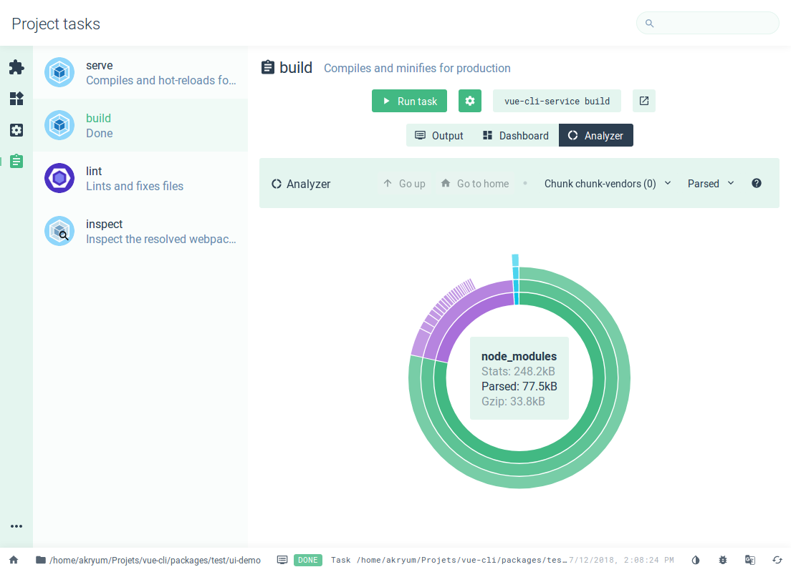

# CLI Servisi

## İkili Kullanımı

Bir Vue CLI projesinde, `@vue/cli-service` adında `vue-cli-service` adlı bir ikili dosya kurar. Bu ikili dosyaya npm betikleri içinde doğrudan `vue-cli-service` olarak erişebilir veya terminalden `./node_modules/.bin/vue-cli-service` olarak erişebilirsiniz.

Varsayılan ön ayarları kullanan bir projenin `package.json` dosyasında göreceğiniz şey budur:

```json
{
  "scripts": {
    "serve": "vue-cli-service serve",
    "build": "vue-cli-service build"
  }
}
```

Bu betikleri npm veya Yarn ile çağırabilirsiniz:

```bash
npm run serve
# VEYA
yarn serve
```

Eğer [npx](https://github.com/npm/npx) mevcutsa (güncel bir npm sürümü ile birlikte paketlenmelidir), ikili dosyayı doğrudan şu şekilde çağırabilirsiniz:

```bash
npx vue-cli-service serve
```

:::tip
`vue ui` komutu ile GUI kullanarak ek özelliklere sahip betikler çalıştırabilirsiniz.
:::

İşte GUI'den Webpack Analizörü'nün çalışırkenki görüntüsü:



## vue-cli-service serve

```
Kullanım: vue-cli-service serve [seçenekler] [giriş]

Seçenekler:

  --open         sunucu başlatıldığında tarayıcıyı aç
  --copy         sunucu başlatıldığında URL'yi panoya kopyala
  --mode         ortam modunu belirt (varsayılan: geliştirme)
  --host         ana bilgisayarı belirt (varsayılan: 0.0.0.0)
  --port         portu belirt (varsayılan: 8080)
  --https        https kullan (varsayılan: false)
  --public       HMR istemcisi için genel ağ URL'sini belirt
  --skip-plugins bu çalıştırma için atlanacak eklenti adlarının virgülle ayrılmış listesi
```

:::tip --copy
Panoya kopyalama bazı platformlarda çalışmayabilir. 
Eğer kopyalama başarılı olduysa, `(panoya kopyalandı)` ifadesi yerel geliştirme sunucusu URL'sinin yanında görünür.
:::

`vue-cli-service serve` komutu, Hot-Module-Replacement (HMR) ile birlikte kutudan çıkmış bir geliştirme sunucusu başlatır. [webpack-dev-server](https://github.com/webpack/webpack-dev-server).

Komut satırı bayraklarının yanı sıra, `vue.config.js` içindeki `devServer` alanını kullanarak geliştirme sunucusunu da yapılandırabilirsiniz.

CLI komutundaki `[giriş]`, *giriş dosyası* olarak tanımlanır (varsayılan: `src/main.js` veya TypeScript projesinde `src/main.ts`), *ek bir giriş dosyası* değil. CLI'de giriş dosyasını değiştirdiğinizde, `config.pages` alanındaki girişler dikkate alınmaz, bu da bir hata ile sonuçlanabilir.

> **Not:** Giriş dosyası olarak ayarlanan dosya, projenizin giriş noktasıdır. — Vue CLI Dokümantasyonu

## vue-cli-service build

```
Kullanım: vue-cli-service build [seçenekler] [giriş|desen]

Seçenekler:

  --mode         ortam modunu belirt (varsayılan: üretim)
  --dest         çıkış dizinini belirt (varsayılan: dist)
  --modern       modern tarayıcılar için otomatik geri dönüş ile uygulamayı oluştur
  --target       uygulama | kütüphane | wc | wc-async (varsayılan: uygulama)
  --formats      kütüphane yapıları için çıktı formatlarının listesi (varsayılan: commonjs, umd, umd-min)
  --inline-vue   kütüphane veya web bileşeni hedefinin son paketine Vue modülünü dahil et
  --name         kütüphane veya web-bileşeni modu için isim (varsayılan: "name" package.json'da veya giriş dosyası adında)
  --filename     çıktı için dosya adı, sadece 'lib' hedefi için kullanılabilir (varsayılan: --name değeridir),
  --no-clean     projeyi inşa etmeden önce dist dizini içeriklerini kaldırma
  --report       paket içeriğini analiz etmeye yardımcı olmak için report.html oluştur
  --report-json  paket içeriğini analiz etmeye yardımcı olmak için report.json oluştur
  --skip-plugins bu çalıştırma için atlanacak eklenti adlarının virgülle ayrılmış listesi
  --watch        değişiklikleri izle
```

`vue-cli-service build` üretime hazır bir paketi `dist/` dizininde oluşturur, JS/CSS/HTML için minifikasyon yaparak ve daha iyi önbellekleme için otomatik vendor chunk ayırma sağlar. Chunk manifesti HTML'ye inline olarak yerleştirilmiştir.

Bir kaç faydalı bayrak vardır:

- `--modern`, uygulamanızı `Modern Mod` kullanarak inşa eder ve bunu destekleyen modern tarayıcılara native ES2015 kodu gönderir, otomatik geri dönüş ile eski bir pakete geçiş yapar.

- `--target`, projedeki herhangi bir bileşeni kütüphane veya web bileşeni olarak oluşturmanıza olanak tanır. Daha fazla ayrıntı için `Build Targets` bölümüne bakın.

- `--report` ve `--report-json`, paketleme istatistiklerinize dayalı raporlar oluşturur, bu da paketinizdeki modüllerin boyutlarını analiz etmenize yardımcı olabilir.

## vue-cli-service inspect

```
Kullanım: vue-cli-service inspect [seçenekler] [...yollar]

Seçenekler:

  --mode    ortam modunu belirt (varsayılan: geliştirme)
```

`vue-cli-service inspect` komutunu kullanarak bir Vue CLI projesinde webpack yapılandırmasını inceleyebilirsiniz. Daha fazla ayrıntı için `Webpack Yapılandırmasını İnceleme` bölümüne bakın.

## Tüm Kullanılabilir Komutları Kontrol Etme

Bazı CLI eklentileri, `vue-cli-service` içine ek komutlar enjekte eder. Örneğin, `@vue/cli-plugin-eslint` `vue-cli-service lint` komutunu enjekte eder. Enjekte edilmiş tüm komutları görüntülemek için:

```bash
npx vue-cli-service help
```

Her bir komutun mevcut seçeneklerini öğrenmek için:

```bash
npx vue-cli-service help [komut]
```

## Eklentileri Atlama

Bir komutu çalıştırırken belirli eklentileri dışlamak için eklentinin ismini `--skip-plugins` seçeneğine geçebilirsiniz:

```bash
npx vue-cli-service build --skip-plugins pwa
```

:::tip
Bu seçenek, _her_ `vue-cli-service` komutu için, diğer eklentiler tarafından eklenen özel komutlar da dahil olmak üzere geçerlidir.
:::

Eklentileri atlamak için isimlerini virgülle ayrılmış bir liste olarak ya da argümanı tekrar ederek geçebilirsiniz:

```bash
npx vue-cli-service build --skip-plugins pwa,apollo --skip-plugins eslint
```

Eklenti isimleri kurulum sırasında açıklanan şekilde çözülür. `burada`

```bash
# bunların hepsi eşdeğerdir
npx vue-cli-service build --skip-plugins pwa

npx vue-cli-service build --skip-plugins @vue/pwa

npx vue-cli-service build --skip-plugins @vue/cli-plugin-pwa
```

## Önbellekleme ve Paralelleştirme

- `cache-loader`, Vue/Babel/TypeScript derlemeleri için varsayılan olarak etkinleştirilmiştir. Dosyalar `node_modules/.cache` içinde önbelleğe alınır - derleme sorunları ile karşılaşırsanız, öncelikle önbellek dizinini silmeyi deneyin.

- `thread-loader`, makinede 1'den fazla CPU çekirdeği varsa Babel/TypeScript derlemesi için etkinleştirilecektir.

## Git Kancaları

Yüklendiğinde, `@vue/cli-service`, Git kancalarını kolayca belirtmenizi sağlayan [yorkie](https://github.com/yyx990803/yorkie) kütüphanesini de yükler. Bu `package.json` dosyanızda `gitHooks` alanını kullanarak belirtebilirsiniz:

```json
{
  "gitHooks": {
    "pre-commit": "lint-staged"
  },
  "lint-staged": {
    "*.{js,vue}": "vue-cli-service lint"
  }
}
```

:::warning
`yorkie`, [`husky`](https://github.com/typicode/husky) kütüphanesinin bir çatallamasıdır ve buna uyumlu değildir.
:::

## Eject İşlemi Yapmadan Yapılandırma

`vue create` aracılığıyla oluşturulan projeler, ek yapılandırmaya ihtiyaç duymadan kullanılmaya hazırdır. Eklentiler, birbiriyle uyumlu çalışacak şekilde tasarlanmıştır, bu nedenle çoğu durumda, interaktif istemler sırasında istediğiniz özellikleri seçmeniz yeterlidir.

Ancak, her olası ihtiyaca karşılık vermenin imkansız olduğunu anlamaktayız ve bir projenin ihtiyaçları da zamanla değişebilir. Vue CLI ile oluşturulan projeler, hiçbir zaman eject yapmanıza gerek kalmadan, araçların neredeyse her yönünü yapılandırmanıza olanak tanır. Daha fazla ayrıntı için `Config Reference` bölümüne göz atın.