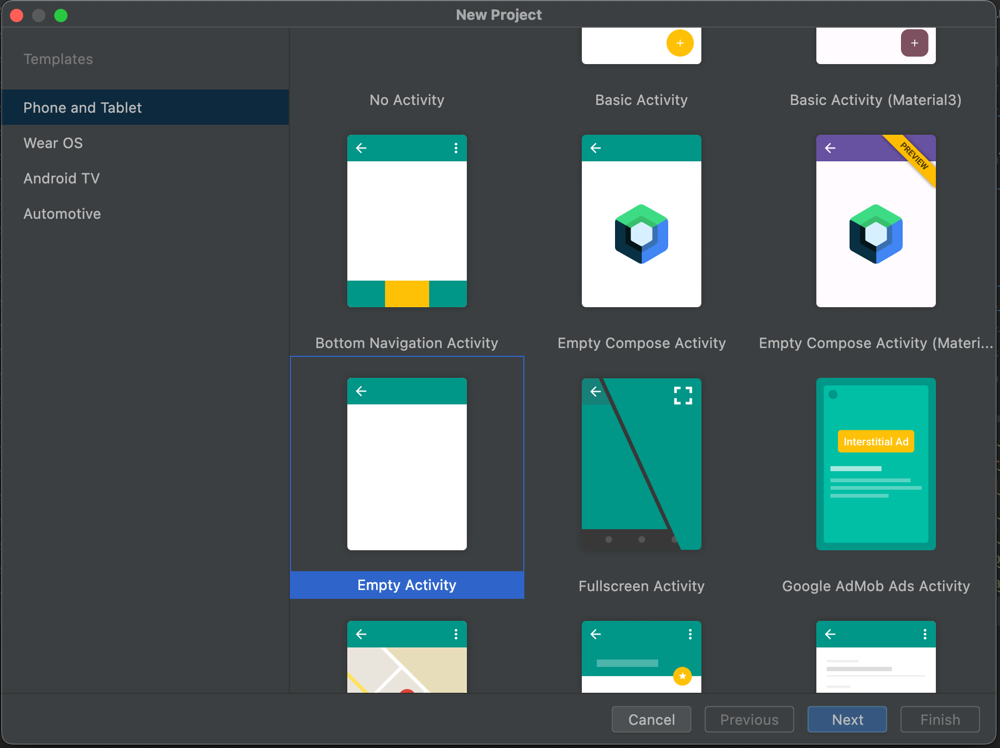
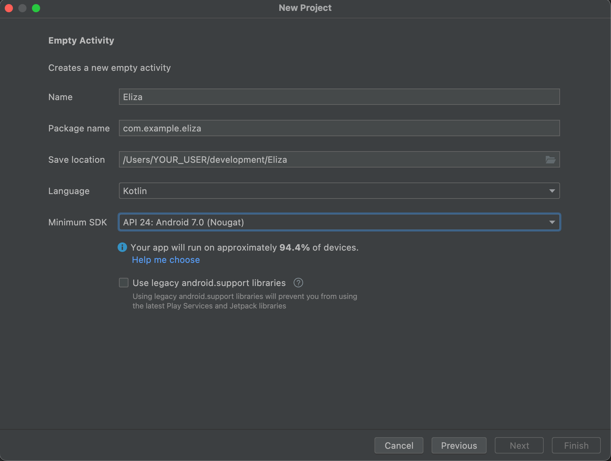

Connect-Kotlin, uygulamanın sunucularıyla iletişim kurmak için oluşturulmuş, tip güvenli ve idiomatik Kotlin API'lerini kullanmayı destekleyen ince bir kitaplıktır. [Protobuf][protobuf] ile çalışır.

Bu kılavuzda, Connect-Kotlin'i kullanarak [ELIZA](https://en.wikipedia.org/wiki/ELIZA) için bir sohbet uygulaması oluşturacağız. 1960'larda bir psikoterapisti temsil etmek için oluşturulmuş çok basit bir doğal dil işleyicisidir. **ELIZA servisi [Connect-Go kullanılarak uygulanmıştır][go-demo], [üretimde kullanılmakta](https://connectrpc.com/demo) ve [gRPC][grpc], [gRPC-Web][grpc-web] ve `Connect` protokollerini desteklemektedir - tüm bunlar bu eğitim için Connect-Kotlin ile kullanılabilir.** Kullanacağımız API'ler, bir Connect-Kotlin istemcisi oluşturmak için kullanacağımız bir Protobuf şemasında tanımlanmıştır.

## Ön Koşullar

* [Android Studio][android-studio] yüklü.
* [Buf CLI][buf-cli] yüklü ve `$PATH`'e dahil edilmelidir.
* Android Studio'da [Sanal Cihaz Yapılandırması][android-studio-virtual-device] ayarlanmalı veya fiziksel bir cihaz kullanılmalıdır.

## Android Studio'dan yeni bir Android projesi oluşturma

Android Studio kurulduktan sonra, yapılandırma sihirbazından geçin ve bir uygulama inşa etmeye başlamak için boş bir Etkinlik seçin:


1. Android Studio ile yeni bir proje oluşturun.
2. Proje için boş bir etkinlik seçin ve "İleri"ye tıklayın.

3. Proje adı olarak `Eliza` adını verin.
4. Paketin `com.example.eliza` olduğundan emin olun ve geri kalanını varsayılan değerlerde bırakın.


:::note
Varsayılan olarak, Android Studio'nun proje adı `My Application` ve paket `com.example.myapplication`'dır. Bu geçerli değilse, örneğin geri kalan kısmında `com.example.eliza` yerine `com.example.myapplication` kullanmanız gerekecektir.
:::

Gradle ve Android Studio ile bir Android uygulaması oluşturun. Şimdi Eliza ile konuşmak için yeni bir API tanımlamaya başlayabiliriz!

## Bir hizmet tanımlayın

Öncelikle, hizmet tanımımızı içeren bir Protobuf dosyası eklememiz gerekiyor. Bu eğitim için, ünlü doğal dil işleme programı ELIZA'nın sade bir uygulaması olan bir hizmet için unary bir uç nokta oluşturacağız.

```bash
$ mkdir -p proto && touch proto/eliza.proto
```

Yukarıdaki dosyayı açın ve aşağıdaki hizmet tanımını ekleyin:

```proto
syntax = "proto3";

package connectrpc.eliza.v1;

message SayRequest {
  string sentence = 1;
}

message SayResponse {
  string sentence = 1;
}

service ElizaService {
  rpc Say(SayRequest) returns (SayResponse) {}
}
```

Yeni oluşturulan `eliza.proto` dosyasını editörde açın. Bu dosya, `connectrpc.eliza.v1` Protobuf paketini, `ElizaService` adlı bir hizmeti ve `Say` adlı bir tek metodu tanımlar. Temelde, bu bileşenler API'nin HTTP URL'sinin yolunu oluşturmak için kullanılacak.

Dosya ayrıca `SayRequest` ve `SayResponse` adlı iki modeli içerir; bunlar `Say` RPC metodunun girişi ve çıkışıdır.

## Kod oluştur

Kodumuzu, Google'ın protobuf derleyicisine modern bir yedek olan [`buf`][buf] kullanarak oluşturacağız.

İlk olarak, deposunun kök dizininde `buf config init` çalıştırarak temel bir [`buf.yaml`][buf.yaml] oluşturun. Ardından, `buf.yaml` dosyasını `proto` dizinimizi kullanacak şekilde düzenleyin:

```yaml title=buf.yaml
version: v2
modules:
  - path: proto
lint:
  use:
    - DEFAULT
breaking:
  use:
    - FILE
```

Kod oluşturmak için [Buf Schema Registry][bsr]'nin _uzaktan eklentilerini_ kullanacağız. `buf`'a kodu nasıl oluşturacağını söylemek için bir [`buf.gen.yaml`][buf.gen.yaml] oluşturun:

```bash
$ touch buf.gen.yaml
```

```yaml title=buf.gen.yaml
version: v2
plugins:
  - remote: buf.build/protocolbuffers/java
    out: app/src/main/java
  - remote: buf.build/connectrpc/kotlin
    out: app/src/main/java
```

Yukarıdaki `buf.gen.yaml` yapılandırması iki şey yapar:

1. `.proto` dosyaları için Java'ya özgü kod oluşturmak üzere [protocolbuffers/java](https://buf.build/protocolbuffers/java) eklentisini çalıştırır ve çıktısını gen dizinine yerleştirir.
   :::note
   Eğer javalite seçeneği istenirse, yaml bloğuna `opt: javalite` eklenmelidir.
   :::

2. [connectrpc/kotlin](https://buf.build/connectrpc/kotlin) eklentisini çalıştırarak, belirtilen dizine Connect-Kotlin için istemciler oluşturur. Bu, gRPC, gRPC-Web ve Connect RPC protokolleri ile uyumludur. Connect, gRPC'yi - akış dahil - destekleyen bir RPC protokolüdür! Onlar, Envoy, grpcurl, gRPC Gateway ve diğer tüm gRPC uygulamalarıyla sorunsuz bir şekilde birlikte çalışır. Connect sunucuları gRPC-Web isteklerini doğrudan, bir çeviri proxy'si olmadan işler.

Bu yapılandırma dosyaları kurulduktan sonra, Kotlin kodu oluşturmamız oldukça kolaylaşır:

```bash
$ buf lint
$ buf generate
```

`app/src/main/java` dizininde artık bazı oluşturulmuş Java ve Kotlin dosyaları olmalıdır:

```
app/src/main/java
├── connectrpc
│   └── eliza
│       └── v1
│           ├── Eliza.java
│           ├── ElizaServiceClient.kt
│           └── ElizaServiceClientInterface.kt
└── com
    └── example
        └── eliza
            └── MainActivity.kt
```

`ElizaServiceClientInterface.kt` dosyası `ElizaServiceClient` için arayüzü içerir ve `ElizaServiceClient.kt` dosyası, bu arayüze uyan uygulamayı içermektedir.

`.java` dosyası, Google'ın [Java eklentisi][google-java-protobuf] tarafından oluşturulmuş olup, Protobuf dosyamızda tanımladığımız `SayRequest` ve `SayResponse` için karşılık gelen Java modellerini içerir.

## Uygulama bağımlılıklarını güncelle

Şimdi, Android uygulamasını başlatma zamanı. Uygulamamızın `build.gradle` dosyasına aşağıdaki ek bağımlılıkları bildirin.

:::note
Projede iki `build.gradle` dosyası bulunur. `./app/build.gradle` içinde bulunan `build.gradle` dosyasını kullanın ve kök dizinindeki dosyayı kullanmayın.
:::


  

```
dependencies {
  ...
  implementation 'androidx.recyclerview:recyclerview:1.2.1'
  implementation "androidx.lifecycle:lifecycle-runtime-ktx:2.5.1"
  implementation "com.squareup.okhttp3:okhttp:4.10.0"
  implementation "com.connectrpc:connect-kotlin-okhttp:0.1.11"
  // Java'ya özgü bağımlılıklar.
  implementation "com.connectrpc:connect-kotlin-google-java-ext:0.1.11"
  implementation "com.google.protobuf:protobuf-java:3.22.0"
}
```

  
  

```
dependencies {
  ...
  implementation 'androidx.recyclerview:recyclerview:1.2.1'
  implementation "androidx.lifecycle:lifecycle-runtime-ktx:2.5.1"
  implementation "com.squareup.okhttp3:okhttp:4.10.0"
  implementation "com.connectrpc:connect-kotlin-okhttp:0.1.11"
  // JavaLite'e özgü bağımlılıklar.
  implementation "com.connectrpc:connect-kotlin-google-javalite-ext:0.1.11"
  implementation "com.google.protobuf:protobuf-javalite:3.22.0"
}
```

  


Tüm bağımlılıklar bildirildikten sonra, Gradle'ın senkronize olduğundan emin olun.

:::note
Protobuf bağımlılığı mevcut projenin kullandığı şey olabilir. Çalışma zamanı ve Google Java eklenti sürümleri arasında tutarlılık sağlamak önemlidir. Burada en son sürümü kullanıyoruz.
:::


Gradle dosyalarıyla ilgili sorun mu yaşıyorsunuz? İşte biri nasıl görünebilir:

```groovy title="app/build.gradle"
plugins {
  id 'com.android.application'
  id 'org.jetbrains.kotlin.android'
}

android {
  namespace 'com.example.eliza'
  compileSdk 33

  defaultConfig {
    applicationId "com.example.eliza"
    minSdk 24
    targetSdk 33
    versionCode 1
    versionName "1.0"

    testInstrumentationRunner "androidx.test.runner.AndroidJUnitRunner"
  }

  buildTypes {
    release {
      minifyEnabled false
      proguardFiles getDefaultProguardFile('proguard-android-optimize.txt'), 'proguard-rules.pro'
    }
  }
  compileOptions {
    sourceCompatibility JavaVersion.VERSION_1_8
    targetCompatibility JavaVersion.VERSION_1_8
  }
  kotlinOptions {
    jvmTarget = '1.8'
  }
}

dependencies {
  implementation 'androidx.core:core-ktx:1.7.0'
  implementation 'androidx.appcompat:appcompat:1.6.1'
  implementation 'com.google.android.material:material:1.8.0'
  implementation 'androidx.constraintlayout:constraintlayout:2.1.4'

  implementation "androidx.recyclerview:recyclerview:1.2.1"
  implementation "androidx.lifecycle:lifecycle-runtime-ktx:2.5.1"

  implementation "com.squareup.okhttp3:okhttp:4.10.0"
  implementation "com.connectrpc:connect-kotlin-okhttp:$version"

  implementation "com.connectrpc:connect-kotlin-google-java-ext:$version"
  implementation "com.google.protobuf:protobuf-java:3.22.0"
}
```

:::note
Android Studio varsayılan olarak Gradle `kts` ile kurulmamıştır. Buradaki örnekler klasik Gradle ile Groovy kullanıyor. Gradle `kts` ile, bağımlılık bildirimleri için yapılan değişiklikler oldukça benzerdir.
:::


## Bir Android uygulamasını oluşturun

### Kaynakları ve Android XML'i kurun

Öncelikle, projenize aşağıdaki dosyaları oluşturup kopyalayarak `res` dizini dosyalarını ayarlayın:

Sohbet görünüm öğesi için `layout` dizininde `item.xml` adında yeni bir dosya oluşturun.

```bash
$ touch app/src/main/res/layout/item.xml
```

Aşağıdaki düzen XML'i, sohbet listesindeki öğe olarak kullanılacak. Bir sohbet kaydının tekil görünümünü temsil eden XML biçimidir.

```xml title="app/src/main/res/layout/item.xml"
<?xml version="1.0" encoding="utf-8"?>
<LinearLayout xmlns:android="http://schemas.android.com/apk/res/android"
              android:orientation="vertical"
              android:layout_width="match_parent"
              android:layout_height="wrap_content"
              android:padding="5dp"
>
  <TextView
    android:id="@+id/sender_name_text_view"
    android:layout_width="match_parent"
    android:layout_height="wrap_content"
    android:gravity="left"
    android:text="Eliza"
    android:textColor="#161EDE"
    android:visibility="gone"
  />
  <TextView
    android:id="@+id/message_text_view"
    android:layout_width="wrap_content"
    android:layout_height="wrap_content"
    android:textColor="@android:color/black"
  />
</LinearLayout>
```

Sonra, ana görünümün XML'ini ayarlamamız gerekiyor. Bu, uygulama açıldığında görüntülenecek olan görünüm olacaktır.

```xml title="app/src/main/res/layout/activity_main.xml"
<?xml version="1.0" encoding="utf-8"?>
<androidx.constraintlayout.widget.ConstraintLayout
  xmlns:android="http://schemas.android.com/apk/res/android"
  xmlns:app="http://schemas.android.com/apk/res-auto"
  xmlns:tools="http://schemas.android.com/tools"
  android:layout_width="match_parent"
  android:layout_height="match_parent"
  android:padding="5dp"
  tools:context=".MainActivity"
>
  <TextView
    android:id="@+id/title_text_view"
    android:layout_width="match_parent"
    app:layout_constraintTop_toTopOf="parent"
    android:gravity="center"
    android:layout_height="40dp"
  />
  <androidx.recyclerview.widget.RecyclerView
    android:id="@+id/recycler_view"
    android:layout_width="match_parent"
    android:layout_height="match_parent"
    app:layoutManager="LinearLayoutManager"
    app:layout_constraintTop_toBottomOf="@+id/title_text_view"
    app:layout_constraintBottom_toTopOf="@+id/edit_text_view"
  />
  <EditText
    android:id="@+id/edit_text_view"
    android:layout_height="wrap_content"
    android:layout_width="match_parent"
    app:layout_constraintBottom_toBottomOf="parent"
    android:inputType="text"/>
  <Button
    android:id="@+id/send_button"
    android:layout_width="50dp"
    android:layout_height="50dp"
    app:layout_constraintBottom_toBottomOf="parent"
    app:layout_constraintRight_toRightOf="parent"
  />
</androidx.constraintlayout.widget.ConstraintLayout>
```

:::note
Android Studio, varsayılan olarak bir XML dosyası açıldığında render edilmiş UI'yi göstermek ister. Ham kodu görmek için, yukarıdaki sağ üst köşede `Kod` butonuna tıklayın.
:::

Son olarak, `AndroidManifest.xml` dosyasının bir ağ isteği yapmak için gereken uygun izinleri bildirdiğinden emin olun. Uygulamayı ağırlamak için `AndroidManifest.xml` dosyasına aşağıdakileri ekleyin:

```xml title="app/src/main/AndroidManifest.xml"
<?xml version="1.0" encoding="utf-8"?>
<manifest xmlns:android="http://schemas.android.com/apk/res/android"
          package="com.example.eliza">

  <uses-permission android:name="android.permission.INTERNET"/>
  <uses-permission android:name="android.permission.ACCESS_NETWORK_STATE"/>

  <application
    android:allowBackup="true"
    android:label="Eliza Connect App"
    android:theme="@style/Theme.AppCompat.Light"
  >
    <activity
      android:name=".MainActivity"
      android:exported="true">
      <intent-filter>
        <action android:name="android.intent.action.MAIN"/>
        <category android:name="android.intent.category.LAUNCHER"/>
      </intent-filter>
      <meta-data
        android:name="android.app.lib_name"
        android:value=""/>
    </activity>
  </application>
</manifest>
```

Uygulamamızın kaynak dosyaları için hepsi bu kadar!

### Android Kotlin görünüm altyapısı

Artık bir ağ isteği oluşturmaya başlamadan önce bazı altyapıyı kurmamız gerekiyor. Dinamik bir sohbet mesajları listesi gösterebilmek için bir `RecyclerView` yapmamız ve onun bazı altyapısını ve standardını oluşturmamız gerekecek.

Bir `RecyclerView.ViewHolder` ve `RecyclerView.Adapter` tanımlamak için `ChatRecycler.kt` adında bir dosya oluşturun. Önümüzdeki bölümde dışarıdan kullanımını yönetmek için `MessageData` veri sınıfını tanımlayacağız.

```bash
$ touch app/src/main/java/com/example/eliza/ChatRecycler.kt
```

Ve aşağıdakileri ekleyin:

```kotlin title="app/src/main/java/com/example/eliza/ChatRecycler.kt"
package com.example.eliza

import android.view.Gravity
import android.view.LayoutInflater
import android.view.View
import android.view.ViewGroup
import android.widget.LinearLayout
import android.widget.TextView
import androidx.recyclerview.widget.RecyclerView


class Adapter : RecyclerView.Adapter<ViewHolder>() {

  private val messages = mutableListOf<MessageData>()

  fun add(message: MessageData) {
    messages.add(message)
    notifyItemInserted(messages.size - 1)
  }

  override fun onCreateViewHolder(viewGroup: ViewGroup, viewType: Int): ViewHolder {
    val view = LayoutInflater.from(viewGroup.context)
      .inflate(R.layout.item, viewGroup, false)
    return ViewHolder(view)
  }

  override fun onBindViewHolder(viewHolder: ViewHolder, position: Int) {
    val messageViewModel = messages[position]
    viewHolder.textView.setText(messageViewModel.message)
    val layoutParams = viewHolder.textView.layoutParams as LinearLayout.LayoutParams
    layoutParams.gravity = if (messageViewModel.isEliza) Gravity.LEFT else Gravity.RIGHT
    viewHolder.textView.layoutParams = layoutParams

    if (messageViewModel.isEliza) {
      viewHolder.senderNameTextView.visibility = View.VISIBLE
    }
  }

  override fun getItemCount(): Int {
    return messages.size
  }
}

class ViewHolder(view: View) : RecyclerView.ViewHolder(view) {
  val senderNameTextView: TextView
  val textView: TextView

  init {
    textView = view.findViewById(R.id.message_text_view)
    senderNameTextView = view.findViewById(R.id.sender_name_text_view)
  }
}

data class MessageData(
  val message: String,
  val isEliza: Boolean
)
```

### Android'da Eliza ile konuşun

Artık Eliza ile konuşmak için gerçek Kotlin koduna dalmaya hazırız!

`ProtocolClient` yapıcı, başlatılmak için bir `ProtocolClientConfig` gerektirir. Gerekli parametreler, ana makine, serileştirme stratejisi ve protokoldür:

- `host`: İsteğin ana makinesi (örneğin `https://demo.connectrpc.com`).
- `serializationStrategy`: `ProtocolClient`'in belirli bir temel veri türünü ve kodlamayı kullanmasını yapılandırır (örneğin, Google'ın Java'sı ve Google'ın JavaLite'ı).
- `protocol`: Kullanılacak olan alt ağ protokolü (örneğin, Connect, gRPC veya gRPC-Web).

Alternatif serileştirme stratejileri veya protokoller kullanmak için `ProtocolClientConfig`, farklı parametrelerle başlatılabilir:

```kotlin
val client = ProtocolClient(
  httpClient = ConnectOkHttpClient(OkHttpClient()),
  ProtocolClientConfig(
    host = host,
    serializationStrategy = GoogleJavaProtobufStrategy(),
    protocol = Protocol.CONNECT,
  ),
)
```