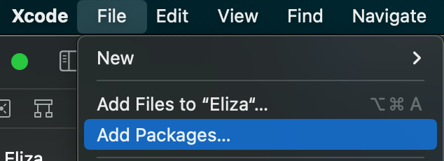
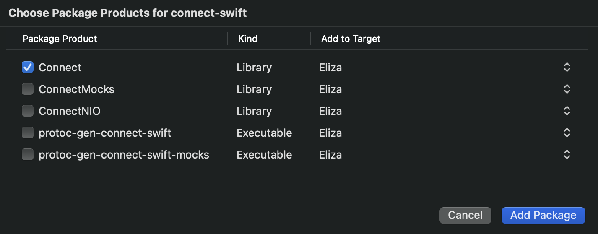
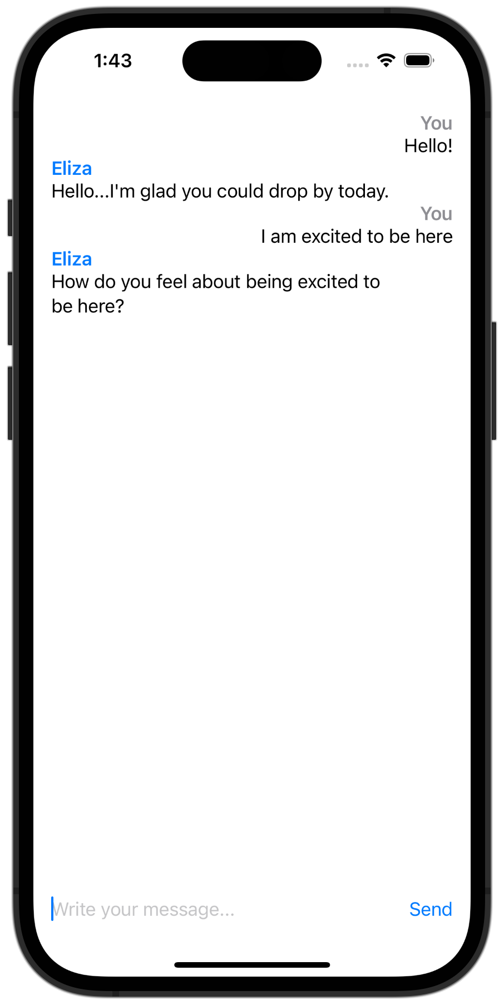

Connect-Swift, uygulamanızın sunucularıyla iletişim kurmak için üretilmiş, tip güvenli ve Swift özelliklerini kullanan API'leri destekleyen küçük bir kütüphanedir ( `Add Packages...` seçeneğine tıklayarak `Connect-Swift` paketine bağımlılık ekleyin:



Açılan pencerede, sağ üstteki `Search or Enter Package URL` metin alanına tıklayın ve Connect-Swift GitHub URL'sini yapıştırın:

```
https://github.com/connectrpc/connect-swift
```

`Connect` kütüphanesinin seçildiğinden emin olun, sonra paketi eklemek için `Add Package` butonuna tıklayın. Bu, gerekli `SwiftProtobuf` paketini de otomatik olarak ekleyecektir:




:::note
GRPC'yi taşıma protokolü olarak kullanmak isterseniz, `Connect-Swift` paketinden `ConnectNIO` kütüphanesini de eklemelisiniz; bu kütüphane, [SwiftNIO](https://github.com/apple/swift-nio) kullanarak gRPC desteği sağlar.
**Bu bağımlılık, Connect veya gRPC-Web protokolü kullanılırken gerekli değildir.**
:::

### Alternatif: CocoaPods kullanımı

CocoaPods, Swift Paket Yöneticisi'ne alternatif olarak desteklenmektedir. Connect-Swift'i CocoaPods ile kullanmak için, sadece `Podfile`'ınıza şu satırı ekleyin:

```rb
pod 'Connect-Swift'
pod 'SwiftProtobuf'
```

:::note
Connect-Swift, CocoaPods ile hem Connect hem de gRPC-Web protokollerini desteklese de, yalnızca Swift Paket Yöneticisi kullanılırken gRPC desteği mevcuttur; çünkü [SwiftNIO, CocoaPods'u desteklememektedir](https://github.com/apple/swift-nio/issues/2393).
:::

## Uygulamaya Entegre Edin

Öncelikle, önceki adımlardan üretilen `.swift` dosyalarını projenize ekleyin:

- `Generated` dizinini Xcode'a sürükleyip `ContentView.swift` dosyasının yanına bırakın.
- Sorulduğunda, Xcode'da `Add to targets:` altında `Eliza`'nın seçili olduğundan emin olun. Bu, üretilmiş kaynakların uygulama hedefinize derlenmesini sağlayacaktır.
- Xcode istemcisinde `Finish` butonuna tıklayın.

Bu noktada, uygulamanızın başarılı bir şekilde derlenmesi gerekir.

Sohbet görünümünü oluşturmak için, `ContentView.swift` dosyasının içeriğini aşağıdaki kod ile değiştirin:


    Üzerine tıklayın ContentView.swift genişletmek için


```swift
import Combine
import SwiftUI

struct Message: Identifiable {
    enum Author {
        case eliza
        case user
    }

    typealias ID = UUID // Gerekli 'Identifiable' için

    let id = UUID()
    let message: String
    let author: Author
}

final class MessagingViewModel: ObservableObject {
    private let elizaClient: Connectrpc_Eliza_V1_ElizaServiceClientInterface

    @MainActor @Published private(set) var messages = [Message]()

    init(elizaClient: Connectrpc_Eliza_V1_ElizaServiceClientInterface) {
        self.elizaClient = elizaClient
    }

    func send(_ sentence: String) async {
        let request = Connectrpc_Eliza_V1_SayRequest.with { $0.sentence = sentence }
        await self.addMessage(Message(message: sentence, author: .user))

        let response = await self.elizaClient.say(request: request, headers: [:])
        await self.addMessage(Message(
            message: response.message?.sentence ?? "Yanıt yok", author: .eliza
        ))
    }

    @MainActor
    private func addMessage(_ message: Message) {
        self.messages.append(message)
    }
}

struct ContentView: View {
    @State private var currentMessage = ""
    @ObservedObject private var viewModel: MessagingViewModel

    init(viewModel: MessagingViewModel) {
        self.viewModel = viewModel
    }

    var body: some View {
        VStack {
            ScrollViewReader { listView in
                // ScrollViewReader, iOS 16 ile ListView'de çöküyor:
                // https://developer.apple.com/forums/thread/712510
                // Bir alternatif olarak ScrollView + ForEach kullanıyoruz.
                ScrollView {
                    ForEach(self.viewModel.messages) { message in
                        VStack {
                            switch message.author {
                            case .user:
                                HStack {
                                    Spacer()
                                    Text("Siz")
                                        .foregroundColor(.gray)
                                        .fontWeight(.semibold)
                                }
                                HStack {
                                    Spacer()
                                    Text(message.message)
                                        .multilineTextAlignment(.trailing)
                                }
                            case .eliza:
                                HStack {
                                    Text("Eliza")
                                        .foregroundColor(.blue)
                                        .fontWeight(.semibold)
                                    Spacer()
                                }
                                HStack {
                                    Text(message.message)
                                        .multilineTextAlignment(.leading)
                                    Spacer()
                                }
                            }
                        }
                        .id(message.id)
                    }
                }
                .onChange(of: self.viewModel.messages.count) { messageCount in
                    listView.scrollTo(self.viewModel.messages[messageCount - 1].id)
                }
            }

            HStack {
                TextField("Mesajınızı yazın...", text: self.$currentMessage)
                    .onSubmit { self.sendMessage() }
                    .submitLabel(.send)
                Button("Gönder", action: { self.sendMessage() })
                    .foregroundColor(.blue)
            }
        }
        .padding()
    }

    private func sendMessage() {
        let messageToSend = self.currentMessage
        if messageToSend.isEmpty {
            return
        }

        Task { await self.viewModel.send(messageToSend) }
        self.currentMessage = ""
    }
}
```


Son olarak, `ElizaApp.swift` dosyasının içeriğini aşağıdaki kod ile değiştirin:


Üzerine tıklayın ElizaApp.swift genişletmek için


```swift
import Connect
import SwiftUI

@main
struct ElizaApp: App {
    @State private var client = ProtocolClient(
        httpClient: URLSessionHTTPClient(),
        config: ProtocolClientConfig(
            host: "https://demo.connectrpc.com",
            networkProtocol: .connect, // Ya da .grpcWeb
            codec: ProtoCodec() // Ya da JSONCodec()
        )
    )

    var body: some Scene {
        WindowGroup {
            ContentView(viewModel: MessagingViewModel(
                elizaClient: Connectrpc_Eliza_V1_ElizaServiceClient(client: self.client)
            ))
        }
    }
}
```


Uygulamayı derleyip çalıştırdığınızda, Eliza ile sohbet edebilmelisiniz! 🎉





## Kısaca

Yukarıdaki kodların neler yaptığını, özellikle Connect kütüphanesiyle etkileşimi hakkında detaylara göz atalım.

### Bir `ProtocolClient` oluşturma

Öncelikle, `ElizaApp` bir `ProtocolClient` örneği oluşturur ve saklar. Bu tür, hangi HTTP istemcisinin kullanılacağını (varsayılan olarak `URLSession`), verilerin nasıl kodlanacağı/çözümleneceği (yani JSON veya Protobuf ikili format) ve hangi protokolün kullanılacağının belirtildiği çeşitli seçeneklerle yapılandırılır (bu durumda, `Connect protokolü`).

Eğer Protobuf yerine JSON kullanmak ve istekleri gziplemek isteseydik, sadece iki satırlık basit bir değişiklik yapmamız yeterli olurdu:

```swift
private var client = ProtocolClient(
    httpClient: URLSessionHTTPClient(),
    config: ProtocolClientConfig(
        host: "https://demo.connectrpc.com",
        networkProtocol: .connect,
        //highlight-next-line
        codec: JSONCodec(),
        //highlight-next-line
        requestCompression: .init(minBytes: 50_000, pool: GzipCompressionPool())
    )
)
```

HTTP istemcisinin davranışı, `URLSessionHTTPClient`'in alt sınıfını oluşturarak, `ConnectNIO` kütüphanesindeki `NIOHTTPClient`'i kullanarak veya `HTTPClientInterface` protokolüne uyan yeni bir tür tanımlayarak ve bunu `httpClient` olarak geçirerek özelleştirilebilir. Daha fazla özelleştirme seçeneği için `istemci kullanımı belgelerine` göz atın.

### gRPC kullanımı

Yukarıdaki örnekte gRPC'yi taşıma protokolü olarak kullanmak isterseniz, aşağıdaki satırları değiştirerek bunu yapabilirsiniz; ayrıca, `ConnectNIO` kütüphanesi bağımlılığını eklediğinizden emin olun:


Üzerine tıklayın

```swift
//highlight-next-line
import ConnectNIO

...

private var client = ProtocolClient(
    //highlight-next-line
    httpClient: NIOHTTPClient(host: "https://demo.connectrpc.com"),
    config: ProtocolClientConfig(
        host: "https://demo.connectrpc.com",
        //highlight-next-line
        networkProtocol: .grpc,
        codec: JSONCodec(),
        requestCompression: .init(minBytes: 50_000, pool: GzipCompressionPool())
    )
)
```


### Üretilmiş kodu kullanma

Yukarıda `MessagingViewModel` sınıfına bir göz atın. Bu sınıf, `Connectrpc_Eliza_V1_ElizaServiceClientInterface` türünde bir örnek ile başlatılır - bu, `ElizaService` Protobuf servis tanımından üretilen Swift protokolüdür. Etkileşimli bir protokolü kabul etmek, üretilmiş `Connectrpc_Eliza_V1_ElizaServiceClient` somut türünü değil de protokole uyan türleri kullanmamıza olanak tanıyarak, testler için sahte sınıfların enjekte edilmesine olanak sağlar. Mocklar ve testler hakkında detaylara girmeyeceğiz, ancak daha fazla bilgi ve örnekler için `test belgelerine` bakabilirsiniz.

SwiftUI görünümünden `send(...)` fonksiyonu çağrıldığında, görünüm modelinin bir `Connectrpc_Eliza_V1_SayRequest` oluşturup bunu sunucudan bir yanıt almak için üretilmiş istemcideki `say(...)` fonksiyonuna ilettiğini göreceksiniz. Tüm bunlar, daha önce yazdığımız Protobuf dosyasından üretilmiş, tip güvenli API'ler kullanılarak yapılır.

Bu örnek Swift'in async/await API'lerini kullansa da, Connect-Swift, geleneksel kapalı fonksiyonlar/geri çağrılar için de üretim yapabilir ve üretilmiş `.connect.swift` dosyasını açtığınızda her iki arayüzü de göreceksiniz. Bu davranış, `üretici seçenekleriyle` özelleştirilebilir.

## Daha fazla örnek

İnceleyebileceğiniz daha fazla [detaylı örnek][more-examples] bulunmaktadır; bunlar Connect-Swift deposunda yer almaktadır. Bu örnekler:

- Akışa dayalı API'leri kullanma
- Swift Paket Yöneticisi ile entegrasyon
- CocoaPods ile entegrasyon
- `Connect protokolünü` kullanma
- [gRPC protokolünü][grpc] kullanma
- [gRPC-Web protokolünü][grpc-web] kullanma

## gRPC veya gRPC-Web kullanımı

Connect-Swift, `Connect`, [gRPC][grpc] ve [gRPC-Web][grpc-web] protokollerini destekler. Aralarındaki geçişleri sağlamak için talimatlar `burada` bulunabilir.

Bir dizi nedenden dolayı, gRPC protokolünü kullanıyorsanız bile, Connect-Swift'i [gRPC-Swift][grpc-swift] üzerinde kullanmanızı öneririz:

- **İdiomatik, tipli API'ler.** Artık REST/JSON uç noktalarını ve `Codable` uyumlarını elle yazmak yok. Connect-Swift, en son Swift özelliklerini kullanan ve serileştirme endişelerinizi ortadan kaldıran idiyomatik API'ler `üretiyor`.
- **Birinci sınıf test desteği.** Connect-Swift, aynı protokol arayüzlerine uyan hem üretim hem de sahte uygulamalar üreterek, `test edilebilirliği` sağlıyor ve minimum el yazımı boilerplate ile kolaylık sağlıyor.
- **Kullanımı kolay araçlar.** Connect-Swift, uzak kod üretimi yapmak için Buf CLI ile entegre olup, yerel bağımlılıkları yüklemeye ve yapılandırmaya gerek kalmadan kullanılabilir.
- **Esneklik.** Connect-Swift, `URLSession`'ı kullanıyor. Kütüphane, bunun `değiştirilmesini` ve özel `sıkıştırma algoritmalarını` ve `interceptor'leri` kaydetme seçeneğini sunuyor.
- **İkili boyut.** Connect-Swift kütüphanesi çok küçüktür (<200KB) ve Connect ve gRPC-Web protokolleriyle kullanıldığında herhangi bir üçüncü taraf ağ bağımlılığı gerektirmez. gRPC ile kullanıldığında ise, SwiftNIO bağımlılığı nedeniyle ikili boyut biraz daha büyük (~2.4MB) olacaktır; bu, HTTP trailer'larını desteklemek içindir.

Eğer arka uç hizmetleriniz halihazırda gRPC kullanıyorsa, [Envoy, requests](https://www.envoyproxy.io/docs/envoy/latest/configuration/http/http_filters/connect_grpc_bridge_filter) için Connect ve gRPC-Web protokollerini gRPC'ye dönüştüren destek sağlar; böylelikle SwiftNIO bağımlılığı olmadan Connect-Swift kullanabilirsiniz.

[buf]: https://buf.build/docs/
[buf-cli]: https://buf.build/docs/installation
[buf.gen.yaml]: https://buf.build/docs/configuration/v2/buf-gen-yaml
[buf.yaml]: https://buf.build/docs/configuration/v2/buf-yaml
[connect-go]: https://github.com/connectrpc/connect-go
[connect-swift]: https://github.com/connectrpc/connect-swift
[eliza-proto]: https://buf.build/connectrpc/eliza/file/main:connectrpc/eliza/v1/eliza.proto
[envoy-grpc-bridge]: https://www.envoyproxy.io/docs/envoy/latest/configuration/http/http_filters/connect_grpc_bridge_filter
[go-demo]: https://github.com/connectrpc/examples-go
[grpc]: https://github.com/grpc/grpc/blob/master/doc/PROTOCOL-HTTP2.md
[grpc-swift]: https://github.com/grpc/grpc-swift
[grpc-web]: https://github.com/grpc/grpc/blob/master/doc/PROTOCOL-WEB.md
[more-examples]: https://github.com/connectrpc/connect-swift/tree/main/Examples
[protobuf]: https://developers.google.com/protocol-buffers
[remote-plugins]: https://buf.build/docs/bsr/remote-plugins/usage
[swift-protobuf]: https://github.com/apple/swift-protobuf