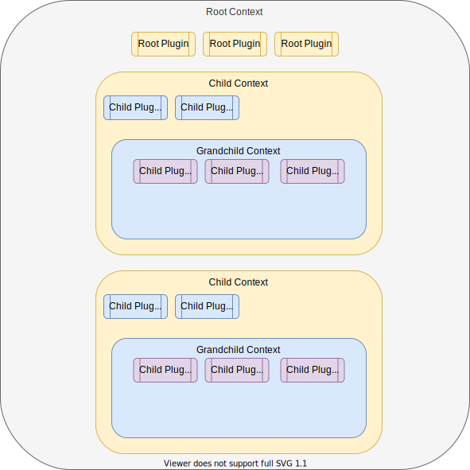

Fastify

## Encapsulation


Fastify'in temel özelliklerinden biri "kapsülleme bağlamı"dır. Kapsülleme bağlamı, hangi `decorators`, kayıtlı `hooks` ve `plugins` 'lerin `routes` için mevcut olduğunu yönetir. Kapsülleme bağlamının görsel temsili aşağıdaki şekilde gösterilmektedir:



Yukarıdaki şekil, birkaç varlığı içermektedir:

1. _kök bağlam_
2. Üç _kök eklentisi_
3. Her bir _çocuk bağlam_ için iki _çocuk bağlam_
    * İki _çocuk eklentisi_
    * Her bir _torun bağlamı için_ bir _torun bağlamı_ 
        - Üç _çocuk eklentisi_

Her _çocuk bağlam_ ve _torun bağlamı_, _kök eklentilerine_ erişebilir. Her _çocuk bağlam_ içinde, _torun bağlamları_ içindeki _çocuk eklentilerine_ sahipken, içindeki _çocuk bağlam_ **kendi _torun bağlamı_ içindeki _çocuk eklentilerine_ erişemez.**

> **Not:** Fastify içinde her şey bir `plugin` olduğundan apart, _kök bağlam_ tüm bu örnekteki her "bağlam" ve "eklentinin" bir eklenti olduğunu düşünelim ve bu eklenti decorator, hook, plugin ve route'ları kapsayabilir. 

Dolayısıyla bu örneği somut terimlerle açıklamak gerekirse, üç route'a sahip bir REST API sunucusunu düşünün: ilk route (`/one`) kimlik doğrulaması gerektiriyor, ikinci route (`/two`) gerektirmiyor ve üçüncü route (`/three`) ikinci route ile aynı bağlama erişiminin olduğu. Kimlik doğrulaması sağlamak için [@fastify/bearer-auth][bearer] kullanarak, bu örneğin kodu aşağıdaki gibidir:

```js
'use strict'

const fastify = require('fastify')()

fastify.decorateRequest('answer', 42)

fastify.register(async function authenticatedContext (childServer) {
  childServer.register(require('@fastify/bearer-auth'), { keys: ['abc123'] })

  childServer.route({
    path: '/one',
    method: 'GET',
    handler (request, response) {
      response.send({
        answer: request.answer,
        // request.foo publicContext içerisinde tanımlı olduğu için tanımsız olacaktır
        foo: request.foo,
        // request.bar torun bağlamında tanımlı olduğu için tanımsız olacaktır
        bar: request.bar
      })
    }
  })
})

fastify.register(async function publicContext (childServer) {
  childServer.decorateRequest('foo', 'foo')

  childServer.route({
    path: '/two',
    method: 'GET',
    handler (request, response) {
      response.send({
        answer: request.answer,
        foo: request.foo,
        // request.bar torun bağlamında tanımlı olduğu için tanımsız olacaktır
        bar: request.bar
      })
    }
  })

  childServer.register(async function grandchildContext (grandchildServer) {
    grandchildServer.decorateRequest('bar', 'bar')

    grandchildServer.route({
      path: '/three',
      method: 'GET',
      handler (request, response) {
        response.send({
          answer: request.answer,
          foo: request.foo,
          bar: request.bar
        })
      }
    })
  })
})

fastify.listen({ port: 8000 })
```

Yukarıdaki sunucu örneği, orijinal diyagramda belirtilen tüm kapsülleme kavramlarını göstermektedir:

1. Her _çocuk bağlam_ (`authenticatedContext`, `publicContext`, ve `grandchildContext`) _kök bağlamda_ tanımlanan `answer` istek decorator'ına erişebilir.
2. Sadece `authenticatedContext`, `@fastify/bearer-auth` eklentisine erişim sağlar.
3. Hem `publicContext` hem de `grandchildContext`, `foo` istek decorator'ına erişebilir.
4. Sadece `grandchildContext`, `bar` istek decorator'ına erişebilir.

Bunu görmek için sunucuyu başlatın ve istek gönderin:

```sh
## curl -H 'authorization: Bearer abc123' http://127.0.0.1:8000/one
{"answer":42}
# curl http://127.0.0.1:8000/two
{"answer":42,"foo":"foo"}
# curl http://127.0.0.1:8000/three
{"answer":42,"foo":"foo","bar":"bar"}
```

[bearer]: https://github.com/fastify/fastify-bearer-auth

## Sharing Between Contexts


Önceki örnekte her bağlamın yalnızca ebeveyn bağlamlardan miras aldığını unutmayın. Ebeveyn bağlamlar, alt bağlamlarındaki varlıklara erişemez. Bu varsayılan durum bazen istenmeyebilir. Bu gibi durumlarda, kapsülleme bağlamı, [fastify-plugin][fastify-plugin] kullanılarak kırılabilir; böylece alt bağlamda kayıtlı olan her şey içerideki ebeveyn bağlamına erişilebilir.

:::info
Eğer `publicContext`, önceki örnekteki `grandchildContext` içinde tanımlanan `bar` decorator'ına erişim gerektiriyorsa, kod şu şekilde yeniden yazılabilir:
:::

```js
'use strict'

const fastify = require('fastify')()
const fastifyPlugin = require('fastify-plugin')

fastify.decorateRequest('answer', 42)

// `authenticatedContext` açıklık için çıkarıldı

fastify.register(async function publicContext (childServer) {
  childServer.decorateRequest('foo', 'foo')

  childServer.route({
    path: '/two',
    method: 'GET',
    handler (request, response) {
      response.send({
        answer: request.answer,
        foo: request.foo,
        bar: request.bar
      })
    }
  })

  childServer.register(fastifyPlugin(grandchildContext))

  async function grandchildContext (grandchildServer) {
    grandchildServer.decorateRequest('bar', 'bar')

    grandchildServer.route({
      path: '/three',
      method: 'GET',
      handler (request, response) {
        response.send({
          answer: request.answer,
          foo: request.foo,
          bar: request.bar
        })
      }
    })
  }
})

fastify.listen({ port: 8000 })
```

Sunucuyu yeniden başlatıp `/two` ve `/three` için istekleri yenileyin:

```sh
# curl http://127.0.0.1:8000/two
{"answer":42,"foo":"foo","bar":"bar"}
# curl http://127.0.0.1:8000/three
{"answer":42,"foo":"foo","bar":"bar"}
```

[fastify-plugin]: https://github.com/fastify/fastify-plugin