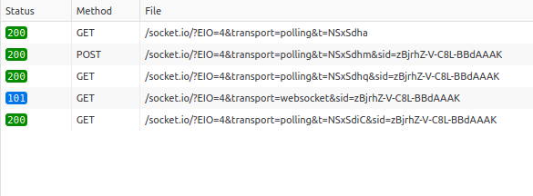

Socket.IO sunucusu (Node.js) ile Socket.IO istemcisi (tarayıcı, Node.js veya `başka bir programlama dili`) arasındaki iki yönlü kanal, mümkün olduğunda bir [WebSocket bağlantısı](https://developer.mozilla.org/en-US/docs/Web/API/WebSocket) ile kurulur ve geri düşüş olarak HTTP uzun-polling kullanılır.

Socket.IO kod tabanı iki ayrı katmana ayrılmıştır:

- düşük seviyeli borulama: Socket.IO içindeki motor olan Engine.IO
- yüksek seviyeli API: Socket.IO kendisi

## Engine.IO

Engine.IO, sunucu ile istemci arasındaki düşük seviyeli bağlantıyı kurmaktan sorumludur. Şunları yönetir:

- çeşitli `taşımaları` ve `yükseltme mekanizmasını`
- `bağlantısızlık tespiti`

Engine.IO protokolünün detaylı bir versiyonu `burada` bulunabilir.

Referans uygulamasının kaynak kodu (TypeScript ile yazılmıştır) burada bulunabilir:

- sunucu: https://github.com/socketio/engine.io
- istemci: https://github.com/socketio/engine.io-client
- ayrıştırıcı: https://github.com/socketio/engine.io-parser

### Taşımalar

Halen uygulanmış iki taşıma bulunmaktadır:

- `HTTP uzun-polling`
- `WebSocket`

#### HTTP uzun-polling

HTTP uzun-polling taşıması (basitçe "polling" olarak da anılır), ardışık HTTP isteklerinden oluşur:

- sunucudan veri almak için uzun süreli `GET` istekleri
- sunucuya veri göndermek için kısa süreli `POST` istekleri

Taşımaların doğası gereği, ardışık iletiler birleştirilip aynı HTTP isteği içinde gönderilebilir.

#### WebSocket

WebSocket taşıması, sunucu ile istemci arasındaki iki yönlü ve düşük gecikmeli iletişim kanalını sağlayan bir [WebSocket bağlantısı](https://developer.mozilla.org/en-US/docs/Web/API/WebSockets_API) içerir.

Taşımaların doğası gereği, her bir ilet kendi WebSocket çerçevesinde gönderilir (bazı iletiler hatta iki ayrı WebSocket çerçevesine neden olabilir; daha fazla bilgi `burada`).

### El Sıkışma

Engine.IO bağlantısının başlangıcında, sunucu bazı bilgiler gönderir:

```json
{
  "sid": "FSDjX-WRwSA4zTZMALqx",
  "upgrades": ["websocket"],
  "pingInterval": 25000,
  "pingTimeout": 20000
}
```

- `sid`, oturumun kimliğidir; sonraki HTTP isteklerinde `sid` sorgu parametresinde yer almalıdır.
- `upgrades` dizisi, sunucu tarafından desteklenen tüm "daha iyi" taşıma türlerini içerir.
- `pingInterval` ve `pingTimeout` değerleri, kalp atış mekanizmasında kullanılır.

### Yükseltme mekanizması

Varsayılan olarak, istemci bağlantıyı HTTP uzun-polling taşıması ile kurar.

**Ama, neden?**

WebSocket'in iki yönlü bir iletişimi kurmanın en iyi yolu olduğu açıkken, deneyimler WebSocket bağlantısını kurmanın her zaman mümkün olmadığını göstermiştir; bunun nedeni kurumsal proxy'ler, kişisel güvenlik duvarları, antivirüs yazılımları...

Kullanıcı perspektifinden, başarısız bir WebSocket bağlantısı, gerçek zamanlı uygulamanın veri alışverişine başlaması için 10 saniyeye kadar beklemeye neden olabilir. Bu, **algılanabilir şekilde** kullanıcı deneyimini olumsuz etkiler.

Özetle, Engine.IO ilk olarak güvenilirliğe ve kullanıcı deneyimine odaklanır, ikinci olarak marjinal potansiyel UX iyileştirmelerine ve artan sunucu performansına.

Yükseltmek için, istemci:

- çıkış tamponunun boş olduğunu kontrol eder
- mevcut taşıyıcıyı yalnızca okunabilir moda alır
- diğer taşıma ile bağlantı kurmaya çalışır
- başarılı olursa, ilk taşımayı kapatır

Tarayıcınızdaki Ağ İzleyicisinde kontrol edebilirsiniz:



1. el sıkışma (birleşik oturum kimliğini içerir — burada, `zBjrh...AAAK` — sonraki isteklerde kullanılacak)
2. veri gönderme (HTTP uzun-polling)
3. veri alma (HTTP uzun-polling)
4. yükseltme (WebSocket)
5. veri alma (HTTP uzun-polling, 4'teki WebSocket bağlantısı başarıyla kurulduktan sonra kapatılır)

### Bağlantısızlık tespiti

Engine.IO bağlantısı şu durumlarda kapalı kabul edilir:

- bir HTTP isteği (GET veya POST) başarısız olduğunda (örneğin, sunucu kapandığında)
- WebSocket bağlantısı kapandığında (örneğin, kullanıcı tarayıcısındaki sekmeyi kapattığında)
- sunucu tarafında veya istemci tarafında `socket.disconnect()` çağrıldığında

Ayrıca, sunucu ile istemci arasındaki bağlantının hala açık ve çalışır durumda olduğunu kontrol eden bir kalp atış mekanizması vardır:

Belirli bir aralıkta (el sıkışma sırasında gönderilen `pingInterval` değeri), sunucu bir PING paketi gönderir ve istemcinin birkaç saniye (PINGTimeout değeri) içinde bir PONG paketi geri göndermesi gerekir. Eğer sunucu PONG paketi almazsa, bağlantıyı kapalı olarak kabul edecektir. Tersi durumda, istemci `pingInterval + pingTimeout` içinde PING paketi almazsa, bağlantıyı kapalı olarak kabul edecektir.

Bağlantısızlık nedenleri `burada` (sunucu tarafında) ve `burada` (istemci tarafında) listelenmiştir.

## Socket.IO

Socket.IO, Engine.IO bağlantısına bazı ek özellikler sağlar:

- otomatik yeniden bağlantı
- `paket tamponlama`
- `onaylar`
- `tüm istemcilere` veya `belirli istemci alt gruplarına` yayın yapma (biz buna "Oda" diyoruz)
- `çoklama` (biz buna "Ad Alanı" diyoruz)

Socket.IO protokolünün detaylı bir versiyonu `burada` bulunabilir.

Referans uygulamasının kaynak kodu (TypeScript ile yazılmıştır) burada bulunabilir:

- sunucu: https://github.com/socketio/socket.io
- istemci: https://github.com/socketio/socket.io-client
- ayrıştırıcı: https://github.com/socketio/socket.io-parser