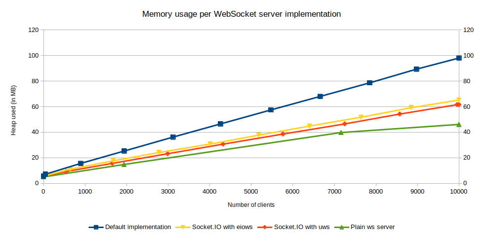

Socket.IO sunucunuzun tükettiği kaynaklar esasen şunlara bağlıdır:

- bağlı olan istemci sayısı
- alınan ve gönderilen mesajların (`temel yayma`, `onay ile yayma` ve `yayın`) saniye başına sayısı

:::info
Socket.IO sunucusunun bellek kullanımı, bağlı olan istemci sayısıyla **doğrusal** olarak ölçeklenmelidir.
:::

:::tip
Varsayılan olarak, her oturumun ilk HTTP isteğine bir referans bellekte tutulur. Bu referans, örneğin `express-session` ile çalışırken gereklidir (bkz. `burada`), ancak bellek tasarrufu sağlamak amacıyla atılabilir:

```js
io.engine.on("connection", (rawSocket) => {
  rawSocket.request = null;
});
```
:::

Bu sayfada sunulan sonuçları yeniden üretmek için gereken kaynak kodunu [oradan](https://github.com/socketio/socket.io-benchmarks) bulabilirsiniz.

Ayrıca bakınız:

- `Yük testleri`
- `Performans ayarlama`

## WebSocket sunucu uygulamasına göre bellek kullanımı

Socket.IO sunucusunun bellek kullanımı, altındaki WebSocket sunucu uygulamasının bellek kullanımına büyük ölçüde bağlıdır.

Aşağıdaki grafik, 0'dan 10.000'e kadar olan bağlı istemci sayısıyla birlikte Socket.IO sunucusunun bellek kullanımını göstermektedir:

- varsayılan olarak kullanılan [`ws`](https://github.com/websockets/ws) paketine dayanan bir Socket.IO sunucusu
- C++ WebSocket sunucu uygulamasına dayanan [`eiows`](https://github.com/mmdevries/eiows) paketine dayalı bir Socket.IO sunucusu (bkz. `kurulum adımları`)
- C++ alternatif Node.js yerel HTTP sunucusuna dayanan [`µWebSockets.js`](https://github.com/uNetworking/uWebSockets.js) paketine dayalı bir Socket.IO sunucusu (bkz. `kurulum adımları`)
- [`ws`](https://github.com/websockets/ws) paketine dayanan basit bir WebSocket sunucusu




`Ubuntu 22.04 LTS` üzerinde, Node.js `v20.3.0` ile, aşağıdaki paket versiyonlarıyla test edilmiştir:

- `socket.io@4.7.2`
- `eiows@6.7.2`
- `uWebSockets.js@20.33.0`
- `ws@8.11.0`

## Zamana göre bellek kullanımı

Aşağıdaki grafik, 0'dan 10.000'e kadar olan bağlı istemcilerle birlikte Socket.IO sunucusunun zaman içindeki bellek kullanımını göstermektedir.


:::note
Gösterim amaçlı olarak, her istemci dalgasının sonunda çöp toplayıcıyı manuel olarak çağırıyoruz:

```js
io.on("connection", (socket) => {
  socket.on("disconnect", () => {
    const lastToDisconnect = io.of("/").sockets.size === 0;
    if (lastToDisconnect) {
      gc();
    }
  });
});
```
Bu, son istemci bağlantısını kestiğinde bellek kullanımındaki temiz düşüşü açıklar. Bu, uygulamanızda gerekli değildir, çöp toplama otomatik olarak gerektiğinde tetiklenecektir.
:::