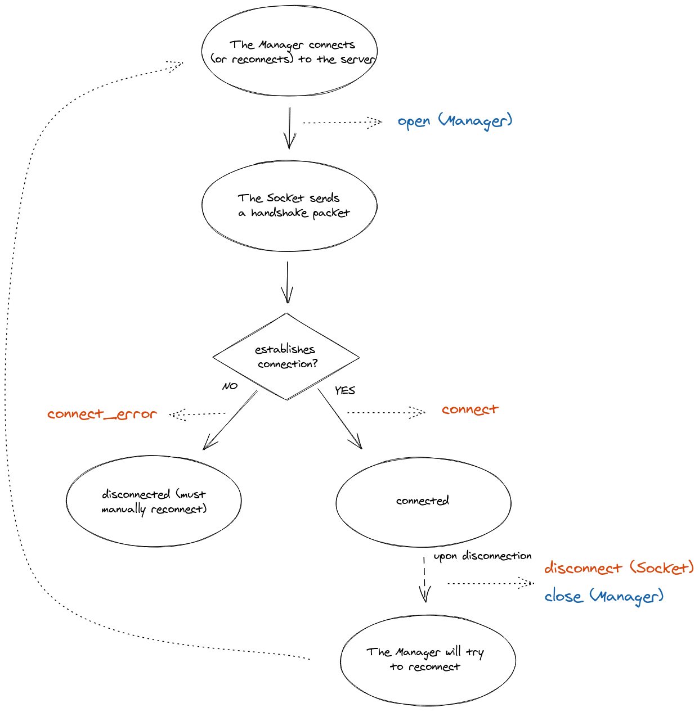

Bir `Socket`, sunucu ile etkileşimde bulunmak için temel sınıftır. Node.js [EventEmitter](https://nodejs.org/api/events.html#class-eventemitter) sınıfının `emit`, `on`, `once` veya `off` gibi çoğu yöntemini miras alır.


`Emitting` ve `listening to` olaylarının yanı sıra, Socket örneği uygulamanızda kullanışlı olabilecek birkaç niteliğe sahiptir:

## Socket#id

Her yeni bağlantı, rastgele 20 karakterden oluşan bir tanımlayıcıya atanır.

Bu tanımlayıcı, sunucu tarafındaki değerle senkronize edilir.

```js
// sunucu tarafı
io.on("connection", (socket) => {
  console.log(socket.id); // x8WIv7-mJelg7on_ALbx
});

// istemci tarafı
socket.on("connect", () => {
  console.log(socket.id); // x8WIv7-mJelg7on_ALbx
});

socket.on("disconnect", () => {
  console.log(socket.id); // undefined
});
```

:::caution
Lütfen, `bağlantı durumu kurtarma` etkinleştirilmemişse, `id` niteliğinin **geçici** bir ID olduğunu ve uygulamanızda kullanılmaması gerektiğini (yalnızca hata ayıklama amacıyla) dikkate alınız:

- Bu ID, her yeniden bağlantıda (örneğin, WebSocket bağlantısı kesildiğinde veya kullanıcı sayfayı yenilediğinde) yeniden oluşturulur.
- İki farklı tarayıcı sekmesi, iki farklı ID'ye sahip olacaktır.
- Sunucuda, belirli bir ID için saklanan bir mesaj kuyruğu yoktur (yani, istemci kesildiğinde, bu ID'ye gönderilen mesajlar kaybolur).

Bunun yerine, bir oturum ID'si kullanınız (ya bir çerez içinde gönderilir, ya da localStorage içinde saklanır ve `auth` yükü içinde gönderilir).

Ayrıca bakınız:

- `Özel mesaj kılavuzumuzun II. Bölümü`
- `Çerezlerle nasıl başa çıkılır`
:::

## Socket#connected

Bu nitelik, soketin şu anda sunucuya bağlı olup olmadığını tanımlar.

```js
socket.on("connect", () => {
  console.log(socket.connected); // true
});

socket.on("disconnect", () => {
  console.log(socket.connected); // false
});
```

## Socket#io

Altındaki `Manager` referansı.

```js
socket.on("connect", () => {
  const engine = socket.io.engine;
  console.log(engine.transport.name); // çoğu durumda, "polling" yazar

  engine.once("upgrade", () => {
    // taşıma yükseltildiğinde çağrılır (yani HTTP uzun-polling'den WebSocket'e)
    console.log(engine.transport.name); // çoğu durumda, "websocket" yazar
  });

  engine.on("packet", ({ type, data }) => {
    // alınan her paket için çağrılır
  });

  engine.on("packetCreate", ({ type, data }) => {
    // gönderilen her paket için çağrılır
  });

  engine.on("drain", () => {
    // yazma tamponu boşaltıldığında çağrılır
  });

  engine.on("close", (reason) => {
    // altındaki bağlantı kapandığında çağrılır
  });
});
```

## Yaşam Döngüsü



## Olaylar

Socket örneği üç özel olay yayar:

- `connect`
- `connect_error`
- `disconnect`

:::tip
Socket.IO v3'ten itibaren, Socket örneği yeniden bağlantı mantığı ile ilgili hiçbir olayı artık yaymaz. Olayları doğrudan Manager örneğinde dinleyebilirsiniz:

```js
socket.io.on("reconnect_attempt", () => {
  // ...
});

socket.io.on("reconnect", () => {
  // ...
});
```

Daha fazla bilgi için `göç kılavuzuna` bakabilirsiniz.
:::

### `connect`

Bu olay, Socket örneği bağlantı **ve** yeniden bağlantı sırasında tetiklenir.

```js
socket.on("connect", () => {
  // ...
});
```

:::caution
Olay işleyicileri `connect` işleyicisinde kaydedilmemelidir, çünkü soket örneği her yeniden bağlantıda yeni bir işleyici kaydedilecektir:

KÖTÜ :warning:

```js
socket.on("connect", () => {
  socket.on("data", () => { /* ... */ });
});
```

İYİ :+1:

```js
socket.on("connect", () => {
  // ...
});

socket.on("data", () => { /* ... */ });
```
:::

### `connect_error`

- `error` [``](https://developer.mozilla.org/en-US/docs/Web/JavaScript/Reference/Global_Objects/Error)

Bu olay, bağlantı hatası durumunda tetiklenir.

| Sebep                                                                                            | Otomatik yeniden bağlantı?  |
|--------------------------------------------------------------------------------------------------|------------------------------|
| Düşük seviyeli bağlantı kurulamadı (geçici hata)                                                 | :white_check_mark: EVET      |
| Bağlantı, sunucu tarafından bir `middleware işlevinde` reddedildi | :x: HAYIR                    |

`socket.active` niteliği, soketin küçük bir `rastgele gecikme` sonunda otomatik olarak yeniden bağlanıp bağlanmayacağını gösterir:

```js
socket.on("connect_error", (error) => {
  if (socket.active) {
    // geçici hata, soket otomatik olarak yeniden bağlanmaya çalışacak
  } else {
    // bağlantı sunucu tarafından reddedildi
    // bu durumda, yeniden bağlanmak için `socket.connect()` manuel olarak çağrılmalıdır
    console.log(error.message);
  }
});
```

### `disconnect`

- `reason` [``](https://developer.mozilla.org/en-US/docs/Web/JavaScript/Data_structures#string_type)
- `details` ``

Bu olay, bağlantı kesildiğinde tetiklenir.

```js
socket.on("disconnect", (reason, details) => {
  // ...
});
```

Olası nedenlerin listesi:

| Sebep                 | Açıklama                                                                                                                     | Otomatik yeniden bağlantı?  |
|-----------------------|-----------------------------------------------------------------------------------------------------------------------------|:-----------------------------|
| `io server disconnect` | Sunucu, `socket.disconnect()` ile soketi zorla kapatmıştır                     | :x: HAYIR                    |
| `io client disconnect` | Soket, `socket.disconnect()` kullanılarak manuel olarak kapatılmıştır                 | :x: HAYIR                    |
| `ping timeout`        | Sunucu, `pingInterval + pingTimeout` aralığında bir PING göndermemiştir                                                    | :white_check_mark: EVET      |
| `transport close`     | Bağlantı kapatılmıştır (örneğin: kullanıcı bağlantıyı kaybettiğinde veya ağ WiFi'den 4G'ye değiştiğinde)                    | :white_check_mark: EVET      |
| `transport error`     | Bağlantıda bir hata oluşmuştur (örneğin: sunucu HTTP uzun-polling döngüsü sırasında kapatıldığında)                          | :white_check_mark: EVET      |

`socket.active` niteliği, soketin küçük bir `rastgele gecikme` sonunda otomatik olarak yeniden bağlanıp bağlanmayacağını gösterir:

```js
socket.on("disconnect", (reason) => {
  if (socket.active) {
    // geçici kesinti, soket otomatik olarak yeniden bağlanmaya çalışacak
  } else {
    // bağlantı, sunucu veya istemci tarafından zorla kapatılmıştır
    // bu durumda, yeniden bağlanmak için `socket.connect()` manuel olarak çağrılmalıdır
    console.log(reason);
  }
});
```

:::caution
Aşağıdaki olay adları rezerve edilmiştir ve uygulamanızda kullanılmamalıdır:

- `connect`
- `connect_error`
- `disconnect`
- `disconnecting`
- `newListener`
- `removeListener`

```js
// KÖTÜ, hata fırlatacaktır
socket.emit("disconnect");
```
:::

## Tam API

Socket örneğinin sağladığı tam API `burada` bulunabilir.