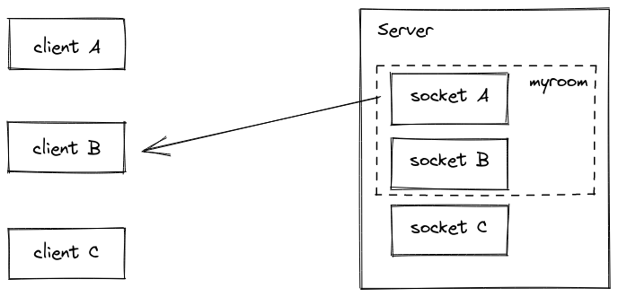
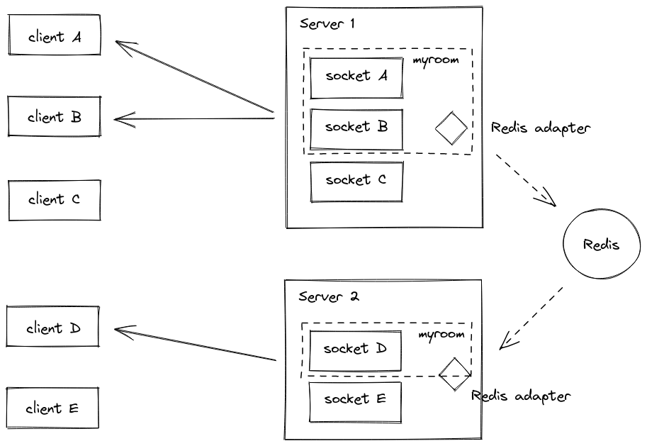

Bir *oda*, soketlerin `katılabileceği` ve `çıkabileceği` keyfi bir kanaldır. Belirli bir istemci alt kümesine olayları yayınlamak için kullanılabilir:


:::info
Lütfen odaların **sunucuya özgü** bir kavram olduğunu unutmayın (yani, istemci katıldığı odaların listesini göremez).
:::

## Katılma ve ayrılma

Bir soketi belirli bir kanala abone etmek için `katıl` fonksiyonunu çağırabilirsiniz:

```js
io.on("connection", (socket) => {
  socket.join("some room");
});
```

Ve ardından yayın yaparken veya gönderirken `to` veya `in` (ikisi de aynı) kullanın:

```js
io.to("some room").emit("some event");
```

Ya da bir odayı hariç tutabilirsiniz:

```js
io.except("some room").emit("some event");
```

Aynı anda birden fazla odaya da yayın yapabilirsiniz:

```js
io.to("room1").to("room2").to("room3").emit("some event");
```

Bu durumda, bir birleşim gerçekleştirilir: en az bir odada bulunan her soket olayı **bir kez** alır (soket iki veya daha fazla odadaysa bile).

Belirli bir soketten bir odaya yayın yapmak da mümkündür:

```js
io.on("connection", (socket) => {
  socket.to("some room").emit("some event");
});
```

Bu durumda, gönderici hariç odada bulunan her soket olayı alacaktır.



Bir kanaldan çıkmak için `katıl` ile aynı şekilde `çık` fonksiyonunu çağırırsınız.

## Örnek kullanım senaryoları

- belirli bir kullanıcıya ait her cihaz/tab için veri yayınlamak

```js
function computeUserIdFromHeaders(headers) {
  // implementasyon yapılacak
}

io.on("connection", async (socket) => {
  const userId = await computeUserIdFromHeaders(socket.handshake.headers);

  socket.join(userId);

  // ve daha sonra
  io.to(userId).emit("hi");
});
```

- belirli bir varlık hakkında bildirim göndermek

```js
io.on("connection", async (socket) => {
  const projects = await fetchProjects(socket);

  projects.forEach(project => socket.join("project:" + project.id));

  // ve daha sonra
  io.to("project:4321").emit("project updated");
});
```

## Bağlantının Kesilmesi

Bağlantı kesildiğinde, soketler otomatik olarak bulundukları tüm kanallardan `çık` yaparlar ve sizin tarafınızdan özel bir temizleme işlemi yapılması gerekmez.

Bir soketin bulunduğu odaları `disconnecting` olayını dinleyerek alabilirsiniz:

```js
io.on("connection", socket => {
  socket.on("disconnecting", () => {
    console.log(socket.rooms); // Set en az soket ID'sini içerir
  });

  socket.on("disconnect", () => {
    // socket.rooms.size === 0
  });
});
```

## Birden Fazla Socket.IO Sunucusuyla

`global broadcasting` gibi, odalara yayın yapmak da birden fazla Socket.IO sunucusuyla çalışır.

Sadece varsayılan `Adaptörü` Redis Adaptörü ile değiştirmelisiniz. Hakkında daha fazla bilgi `burada`.



## Uygulama Detayları

"Oda" özelliği, bir Adaptör olarak adlandırdığımız bir yapı ile uygulanır. Bu Adaptör, şu işlevlerden sorumlu bir sunucu tarafı bileşenidir:

- Soket örnekleri ile odalar arasındaki ilişkileri saklamak
- Olayları tüm (veya bir alt küme) istemcilere yayınlamak

Varsayılan bellek içi adaptörün kodunu [burada](https://github.com/socketio/socket.io-adapter) bulabilirsiniz.

Temelde, iki [ES6 Maps](https://developer.mozilla.org/en-US/docs/Web/JavaScript/Reference/Global_Objects/Map) içerir:

- `sids`: `Map>`
- `rooms`: `Map>`

`socket.join("the-room")` çağrısı aşağıdaki sonuçları doğurur:

- `sids` Haritasında, soket ID'siyle tanımlanan Set'e "the-room" eklenir
- `rooms` Haritasında, "the-room" dizgesiyle tanımlanan Set'e soket ID'si eklenir

Bu iki harita daha sonra yayınlama sırasında kullanılır:

- Tüm soketlere yayın (`io.emit()`) `sids` Haritasında döngü yapar ve paketi tüm soketlere gönderir
- Belirli bir odaya yayın (`io.to("room21").emit()`) `rooms` Haritasındaki Set'te döngü yaparak eşleşen tüm soketlere paketi gönderir

Bu nesnelere erişebilirsiniz:

```js
// ana isim alanı
const rooms = io.of("/").adapter.rooms;
const sids = io.of("/").adapter.sids;

// özel isim alanı
const rooms = io.of("/my-namespace").adapter.rooms;
const sids = io.of("/my-namespace").adapter.sids;
```

Notlar:

- Bu nesneler doğrudan değiştirilmemelidir; her zaman `socket.join(...)` ve `socket.leave(...)` kullanmalısınız.
- `çoklu sunucu` kurulumu sırasında, `rooms` ve `sids` nesneleri Socket.IO sunucuları arasında paylaşılmaz (bir oda yalnızca bir sunucuda "var" olabilir ve diğerinde olmayabilir).

## Oda Olayları

`socket.io@3.1.0` sürümünden itibaren, temel Adaptör aşağıdaki olayları yayar:

- `create-room` (argüman: oda)
- `delete-room` (argüman: oda)
- `join-room` (argüman: oda, id)
- `leave-room` (argüman: oda, id)

Örnek:

```js
io.of("/").adapter.on("create-room", (room) => {
  console.log(`room ${room} was created`);
});

io.of("/").adapter.on("join-room", (room, id) => {
  console.log(`socket ${id} has joined room ${room}`);
});
```