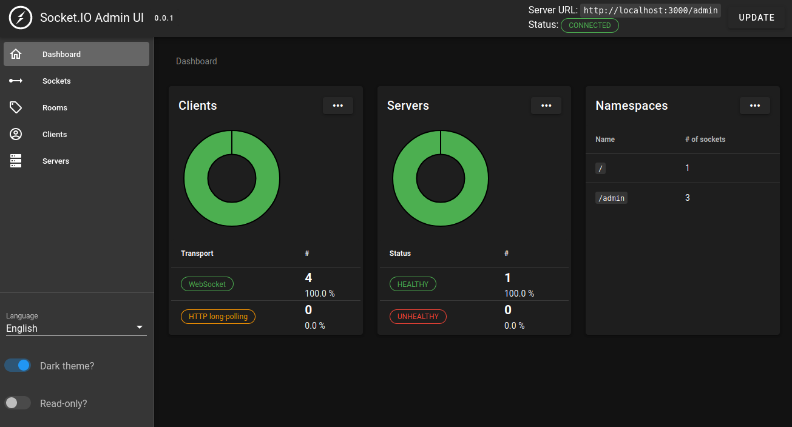
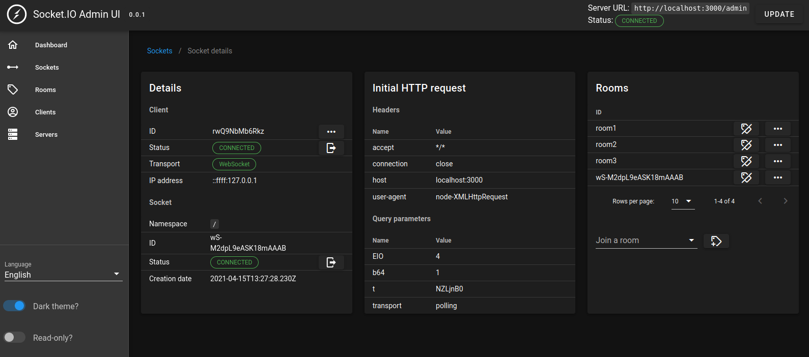
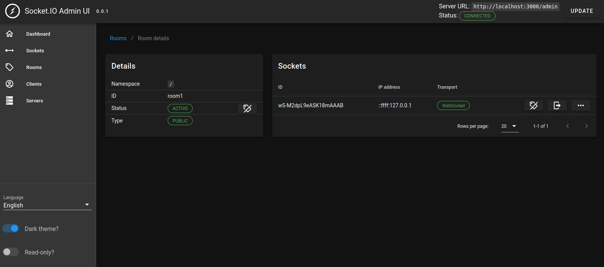
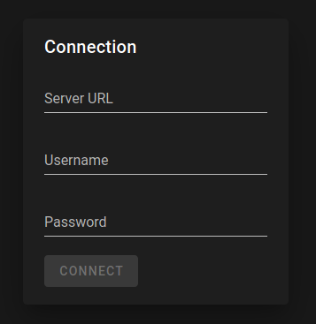

Socket.IO yönetim arayüzü, Socket.IO dağıtımınızın durumunu gözlemlemeniz için kullanılabilir.

Kaynak koduna buradan ulaşabilirsiniz: [https://github.com/socketio/socket.io-admin-ui/](https://github.com/socketio/socket.io-admin-ui/)

Barındırılan sürüme bağlantı: [https://admin.socket.io/](https://admin.socket.io/)

## Mevcut özellikler

- mevcut bağlantılı sunucular ve istemciler hakkında genel bakış



- her soket örneği hakkında detaylar (aktif taşıma, el sıkışma, odalar, ...)



- her oda hakkında detaylar



- sunucu tarafından yayımlanan veya alınan her olay hakkında detaylar


- yönetimsel işlemler (katılma, ayrılma, bağlantıyı kesme)

:::tip
Herhangi bir geri bildiriminiz veya öneriniz varsa lütfen belirtin!
:::

## Kurulum

### Sunucu tarafı

Öncelikle `@socket.io/admin-ui` paketini yükleyin:

```
npm i @socket.io/admin-ui
```

Ardından, Soket.IO sunucunuzda `instrument` yöntemini çağırın:

```js
const { createServer } = require("http");
const { Server } = require("socket.io");
const { instrument } = require("@socket.io/admin-ui");

const httpServer = createServer();

const io = new Server(httpServer, {
  cors: {
    origin: ["https://admin.socket.io"],
    credentials: true
  }
});

instrument(io, {
  auth: false,
  mode: "development",
});

httpServer.listen(3000);
```

Modül, aşağıdaki sürümlerle uyumludur:

- Socket.IO v4 sunucu
- Socket.IO v3 sunucu (>= 3.1.0), ancak odalar üzerindeki işlemler (katılma, ayrılma, bağlantıyı kesme) olmadan

[NestJS](https://docs.nestjs.com/websockets/gateways) ile örnek:

```ts
import { instrument } from "@socket.io/admin-ui";

@WebSocketGateway()
export class MyGateway {
    // ...
    afterInit() {
        instrument(this.server, {
            auth: false,
            mode: "development",
        });
    }
}
```

### İstemci tarafı

O halde [https://admin.socket.io](https://admin.socket.io) adresine gidebilir veya `ui/dist` klasöründe bulunan dosyaları [burada](https://github.com/socketio/socket.io-admin-ui/tree/main/ui/dist) barındırabilirsiniz.

**Önemli not**: [https://admin.socket.io](https://admin.socket.io) adresindeki web sitesi tamamen statiktir (Vercel'de barındırılmaktadır), sizin veya tarayıcınız hakkında herhangi bir bilgi depolamıyoruz (izleme yok, analiz yok, ...). Bununla birlikte, dosyaları kendiniz barındırmak tamamen mümkündür.

Aşağıdaki modali görmelisiniz:



Lütfen sunucunuzun URL'sini girin (örneğin, `http://localhost:3000` veya `https://example.com`) ve varsa kimlik bilgilerini girin (aşağıdaki `auth` seçeneğine bakın `below`).

### Mevcut seçenekler

#### `auth`

Varsayılan değer: `-`

Bu seçenek zorunludur. Kimlik doğrulamayı devre dışı bırakabilirsiniz (lütfen dikkatli kullanın):

```js
instrument(io, {
  auth: false
});
```

Ya da temel kimlik doğrulamayı kullanabilirsiniz:

```js
instrument(io, {
  auth: {
    type: "basic",
    username: "admin",
    password: "$2b$10$heqvAkYMez.Va6Et2uXInOnkCT6/uQj1brkrbyG3LpopDklcq7ZOS" // "changeit" bcrypt ile şifrelenmiş
  },
});
```

:::caution
Lütfen `bcrypt` paketinin şu anda `$2y$` öneki ile başlayan hash'leri desteklemediğini unutmayın; bu, bazı BCrypt uygulamaları tarafından kullanılmaktadır (örneğin [https://bcrypt-generator.com/](https://bcrypt-generator.com/) veya [https://www.bcrypt.fr/](https://www.bcrypt.fr/)). Hash'in geçerliliğini kontrol edebilirsiniz:

```
$ node
> require("bcryptjs").compareSync("<şifre>", "<hash>")
true
```

Geçerli bir hash oluşturabilirsiniz:

```
$ node
> require("bcryptjs").hashSync("changeit", 10)
'$2b$10$LQUE...'
```

Ayrıca bakınız:

- [https://github.com/kelektiv/node.bcrypt.js/issues/849](https://github.com/kelektiv/node.bcrypt.js/issues/849)
- [https://stackoverflow.com/a/36225192/5138796](https://stackoverflow.com/a/36225192/5138796)
:::

#### `namespaceName`

Varsayılan değer: `/admin`

Yönetim görevlerini yönetmek için oluşturulacak isim alanının adı.

```js
instrument(io, {
  namespaceName: "/custom"
});
```

Bu isim alanı, klasik bir Socket.IO isim alanıdır, ona erişebilirsiniz:

```js
const adminNamespace = io.of("/admin");
```

Daha fazla bilgi `burada`.

#### `readonly`

Varsayılan değer: `false`

Yönetim arayüzünü salt okunur modda açma (katılma, ayrılma veya bağlantıyı kesme işlemlerine izin verilmez).

```js
instrument(io, {
  readonly: true
});
```

#### `serverId`

Varsayılan değer: `require("os").hostname()`

Verilen sunucunun kimliği. Aynı makinede birden fazla Socket.IO sunucunuz varsa, onlara farklı bir kimlik vermeniz gerekecektir:

```js
instrument(io, {
  serverId: `${require("os").hostname()}#${process.pid}`
});
```

#### `store`

Varsayılan değer: `new InMemoryStore()`

Bu depolama alanı, kullanıcıların yeniden bağlantı kurduğunda kimlik bilgilerini tekrar yazmalarına gerek kalmaması için oturum kimliklerini saklamak için kullanılır.

Birden fazla sunucu kurulumunda temel kimlik doğrulamayı kullanıyorsanız, özel bir depolama alanı sağlamalısınız:

```js
const { instrument, RedisStore } = require("@socket.io/admin-ui");

instrument(io, {
  store: new RedisStore(redisClient)
});
```

#### `mode`

Varsayılan değer: `development`

Üretim modunda sunucu, soket örnekleri ve odalar hakkında tüm detayları göndermeyecek, böylece gözlemleme işleminin bellek ayak izini azaltacaktır.

```js
instrument(io, {
  mode: "production"
});
```

Üretim modu ayrıca NODE_ENV ortam değişkeni ile etkinleştirilebilir:

```
NODE_ENV=production node index.js
```

## Çalışma şekli

Kaynak koduna buradan ulaşabilirsiniz: [https://github.com/socketio/socket.io-admin-ui/](https://github.com/socketio/socket.io-admin-ui/)

`instrument` yöntemi basitçe:

- bir `isim alanı` oluşturur ve varsa bir kimlik doğrulama `middleware` ekler
- soket örneklerini izlemek için mevcut her isim alanı için `connection` ve `disconnect` olayları için dinleyiciler kaydeder
- sunucudan UI'ye istatistik gönderen bir zamanlayıcı kaydeder
- UI'den gönderilen `join`, `leave` ve `_disconnect` komutları için işleyiciler kaydeder

## Son sürümler

- `0.5.1` (Eki 2022): [GitHub sürümü](https://github.com/socketio/socket.io-admin-ui/releases/tag/0.5.1) / [diff](https://github.com/socketio/socket.io-admin-ui/compare/0.5.0...0.5.1)
- `0.5.0` (Eyl 2022): [GitHub sürümü](https://github.com/socketio/socket.io-admin-ui/releases/tag/0.5.0) / [diff](https://github.com/socketio/socket.io-admin-ui/compare/0.4.0...0.5.0)
- `0.4.0` (Haz 2022): [GitHub sürümü](https://github.com/socketio/socket.io-admin-ui/releases/tag/0.4.0) / [diff](https://github.com/socketio/socket.io-admin-ui/compare/0.3.0...0.4.0)