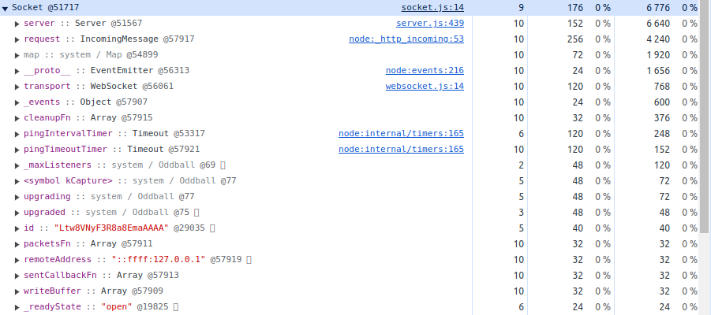
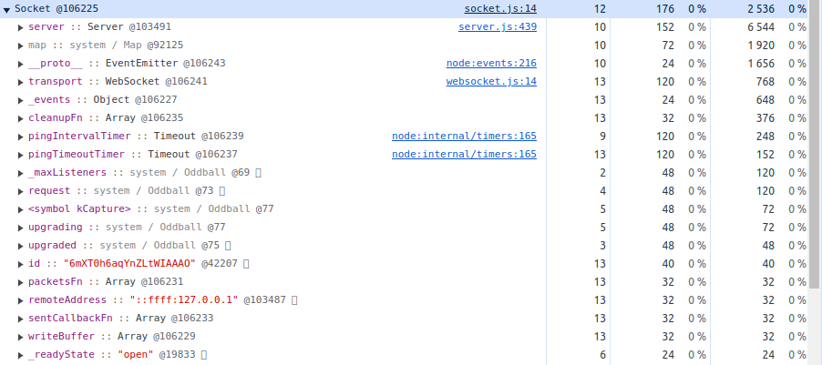

Socket.IO sunucunuzun performansını artırmak için bazı ipuçları:

- `Socket.IO seviyesinde`
- `OS seviyesinde`

Ayrıca `birden fazla düğüme ölçeklenme` ile de ilgileniyor olabilirsiniz.

## Socket.IO seviyesinde

Çoğu durumda, Socket.IO bağlantısı WebSocket ile kurulacağından, Socket.IO sunucunuzun performansı, altyapıdaki WebSocket sunucusunun performansına bağlı olacaktır ([`ws`](https://github.com/websockets/ws), varsayılan olarak).

### `ws` yerel eklentilerini yükleyin

`ws`, belirli işlemleri iyileştiren iki isteğe bağlı ikili eklenti ile birlikte gelir. En popüler platformlar için önceden oluşturulmuş ikili dosyalar mevcut olduğundan, makinenizde bir C++ derleyicisi kurmanız gerekmiyor.

- [bufferutil](https://www.npmjs.com/package/bufferutil): WebSocket çerçevelerinin veri yükünü maskeleme ve maske kaldırma gibi işlemleri verimli bir şekilde gerçekleştirmenizi sağlar.
- [utf-8-validate](https://www.npmjs.com/package/utf-8-validate): Bir mesajın, spesifikasyona göre geçerli UTF-8 içerip içermediğini verimli bir şekilde kontrol etmenizi sağlar.

:::tip
Bu paketleri yüklemek için:

```
$ npm install --save-optional bufferutil utf-8-validate
```
:::

Lütfen bu paketlerin isteğe bağlı olduğunu unutmayın, eğer mevcut değillerse WebSocket sunucusu Javascript uygulamasına geri dönecektir. Daha fazla bilgi [burada](https://github.com/websockets/ws/#opt-in-for-performance-and-spec-compliance) bulunabilir.

### Başka bir WebSocket sunucu uygulaması kullanın

Örneğin, (artık kullanılmayan) [uws](https://www.npmjs.com/package/uws) paketinin bir çatalı olan [eiows](https://www.npmjs.com/package/eiows) paketini kullanabilirsiniz:

```
$ npm install eiows
```

Ve ardından `wsEngine` seçeneğini kullanın:

```js
const { createServer } = require("http");
const { Server } = require("socket.io");

const httpServer = createServer();
const io = new Server(httpServer, {
  wsEngine: require("eiows").Server
});
```

### Özel bir ayrıştırıcı kullanın

Eğer Socket.IO bağlantısı üzerinden ikili veri gönderiyorsanız, varsayılan olarak her bir tampon kendi WebSocket çerçevesinde gönderileceğinden, `msgpack` temelli bir `özel ayrıştırıcı` kullanmak ilginç olabilir.

Kullanım:

*Sunucu*

```js
const { createServer } = require("http");
const { Server } = require("socket.io");
const parser = require("socket.io-msgpack-parser");

const httpServer = createServer();
const io = new Server(httpServer, {
  parser
});
```

*İstemci*

```js
const { io } = require("socket.io-client");
const parser = require("socket.io-msgpack-parser");

const socket = io("https://example.com", {
  parser
});
```

### İlk HTTP isteğini atlayın

Varsayılan olarak, her oturumun ilk HTTP isteğine bir referans bellekte tutulur. Bu referans, örneğin `express-session` ile çalışırken gereklidir (bkz. `burada`), ancak belleği tasarruf etmek için atılabilir:

```js
io.engine.on("connection", (rawSocket) => {
  rawSocket.request = null;
});
```

Önce:



Sonra:



## OS seviyesinde

Birçok bağlantıyı kabul etmek için işletim sisteminizi nasıl ayarlayacağınıza dair iyi makaleler bulunmaktadır. Lütfen [bu makaleye](https://blog.jayway.com/2015/04/13/600k-concurrent-websocket-connections-on-aws-using-node-js/) veya [şuna](https://medium.com/@elliekang/scaling-to-a-millions-websocket-concurrent-connections-at-spoon-radio-bbadd6ec1901) bakın.

Socket.IO sunucunuzu `yük testi` yaparken, muhtemelen aşağıdaki iki sınıra ulaşacaksınız:

- açık dosya sayısının maksimumu

Eğer 1000 eşzamanlı bağlantının (yeni istemciler bağlanamıyor) üzerine çıkamıyorsanız, büyük olasılıkla açık dosya sayısının maksimumuna ulaştınız:

```
$ ulimit -n
1024
```

Bu sayıyı artırmak için `/etc/security/limits.d/custom.conf` adında yeni bir dosya oluşturun ve aşağıdaki içeriği ekleyin (root yetkileri gereklidir):

```
* soft nofile 1048576
* hard nofile 1048576
```

Ardından oturumunuzu yenileyin. Yeni sınırınız şimdi güncellenmiş olmalı:

```
$ ulimit -n
1048576
```

- mevcut yerel portların maksimum sayısı

Eğer 28000 eşzamanlı bağlantının üzerine çıkamıyorsanız, büyük ihtimalle mevcut yerel portların maksimumuna ulaştınız:

```
$ cat /proc/sys/net/ipv4/ip_local_port_range
32768	60999
```

Bu sayıyı artırmak için `/etc/sysctl.d/net.ipv4.ip_local_port_range.conf` adında yeni bir dosya oluşturun ve aşağıdaki içeriği ekleyin (yine, root yetkileri gereklidir):

```
net.ipv4.ip_local_port_range = 10000 65535
```

Not: `10000` değerini alt sınır olarak kullandık böylece makinadaki hizmetler tarafından kullanılan portları (örneğin `5432` PostgreSQL sunucusu için) dahil etmez, ancak kesinlikle daha düşük bir değer (1024'e kadar) kullanabilirsiniz.

Makinenizi yeniden başlattıktan sonra, artık eşzamanlı 55k bağlantıya (gelen her IP için) ulaşabileceksiniz.

Ayrıca bakınız:

- https://unix.stackexchange.com/a/130798
- https://making.pusher.com/ephemeral-port-exhaustion-and-how-to-avoid-it/