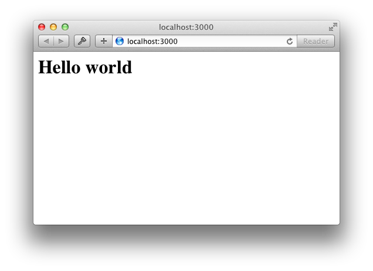

## Proje Başlatma

İlk hedef, bir form ve bir mesaj listesi sunan basit bir HTML web sayfası kurmaktır. Bu amaçla Node.JS web framework'ü olan `express`'i kullanacağız. [Node.JS](https://nodejs.org) kurulu olduğundan emin olun.

Öncelikle, projemizi tanımlayan bir `package.json` manifest dosyası oluşturalım. Bunu, kendi `socket-chat-example` adını verdiğim boş bir dizinde oluşturmanızı öneririm.


  

```json
{
  "name": "socket-chat-example",
  "version": "0.0.1",
  "description": "ilk socket.io uygulamam",
  "type": "commonjs",
  "dependencies": {}
}
```

  
  

```json
{
  "name": "socket-chat-example",
  "version": "0.0.1",
  "description": "ilk socket.io uygulamam",
  "type": "module",
  "dependencies": {}
}
```

  


:::caution
"name" niteliği benzersiz olmalıdır, "socket.io" veya "express" gibi bir değer kullanamazsınız, çünkü npm bağımlılığı yüklerken sorun yaşayacaktır.
:::

Şimdi, ihtiyacımız olan şeyleri kolayca `dependencies` niteliğine ekleyebilmek için `npm install` komutunu kullanacağız:

```
npm install express@4
```

Kurulum tamamlandıktan sonra, uygulamamızı kuracak bir `index.js` dosyası oluşturabiliriz.


  

```js
const express = require('express');
const { createServer } = require('node:http');

const app = express();
const server = createServer(app);

app.get('/', (req, res) => {
  res.send('<h1>Merhaba dünya</h1>');
});

server.listen(3000, () => {
  console.log('sunucu http://localhost:3000 adresinde çalışıyor');
});
```

  
  

```js
import express from 'express';
import { createServer } from 'node:http';

const app = express();
const server = createServer(app);

app.get('/', (req, res) => {
  res.send('<h1>Merhaba dünya</h1>');
});

server.listen(3000, () => {
  console.log('sunucu http://localhost:3000 adresinde çalışıyor');
});
```

  


Bu demektir ki:

- Express, `app`'i bir HTTP sunucusuna sağlayabileceğiniz bir fonksiyon işleyici olarak başlatır (5. satırda görüldüğü gibi).
- Web sitemizin ana sayfasına gittiğimizde çağrılan bir rota işleyicisi `/` tanımlıyoruz.
- HTTP sunucusu 3000 numaralı portta dinlemeye başlamaktadır.

> Eğer `node index.js` komutunu çalıştırırsanız şu sonucu görmelisiniz:
> 
> 

Ve tarayıcınızı `http://localhost:3000` adresine yönlendirirseniz:

> 

Şimdilik her şey yolunda!

:::info

  

Bu örneği doğrudan tarayıcınızda çalıştırabilirsiniz:

- [CodeSandbox](https://codesandbox.io/p/sandbox/github/socketio/chat-example/tree/cjs/step1?file=index.js)
- [StackBlitz](https://stackblitz.com/github/socketio/chat-example/tree/cjs/step1?file=index.js)

  
  

Bu örneği doğrudan tarayıcınızda çalıştırabilirsiniz:

- [CodeSandbox](https://codesandbox.io/p/sandbox/github/socketio/chat-example/tree/esm/step1?file=index.js)
- [StackBlitz](https://stackblitz.com/github/socketio/chat-example/tree/esm/step1?file=index.js)

  

:::