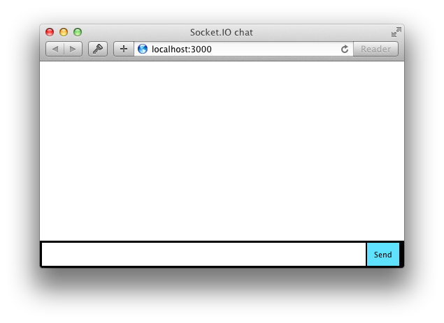

## HTML Sunumu

Şu ana kadar `index.js` dosyasında `res.send` çağrısı yapıyoruz ve ona bir HTML dizesi geçiriyoruz. Uygulamamızın tüm HTML'ini oraya yerleştirirsek kodumuz çok karmaşık hale gelecektir, bu yüzden bunun yerine bir `index.html` dosyası oluşturup bunu sunacağız.

Yol işleyicimizi `sendFile` kullanacak şekilde yeniden düzenleyelim.


  

```js
const express = require('express');
const { createServer } = require('node:http');
// highlight-start
const { join } = require('node:path');
// highlight-end

const app = express();
const server = createServer(app);

// highlight-start
app.get('/', (req, res) => {
  res.sendFile(join(__dirname, 'index.html'));
});
// highlight-end

server.listen(3000, () => {
  console.log('server running at http://localhost:3000');
});
```

  
  

```js
import express from 'express';
import { createServer } from 'node:http';
// highlight-start
import { fileURLToPath } from 'node:url';
import { dirname, join } from 'node:path';
// highlight-end

const app = express();
const server = createServer(app);

// highlight-start
const __dirname = dirname(fileURLToPath(import.meta.url));

app.get('/', (req, res) => {
  res.sendFile(join(__dirname, 'index.html'));
});
// highlight-end

server.listen(3000, () => {
  console.log('server running at http://localhost:3000');
});
```

  


`index.html` dosyanıza aşağıdakileri koyun:

```html
<!DOCTYPE html>
<html>
  <head>
    <meta name="viewport" content="width=device-width,initial-scale=1.0">
    <title>Socket.IO sohbeti</title>
    <style>
      body { margin: 0; padding-bottom: 3rem; font-family: -apple-system, BlinkMacSystemFont, "Segoe UI", Roboto, Helvetica, Arial, sans-serif; }

      #form { background: rgba(0, 0, 0, 0.15); padding: 0.25rem; position: fixed; bottom: 0; left: 0; right: 0; display: flex; height: 3rem; box-sizing: border-box; backdrop-filter: blur(10px); }
      #input { border: none; padding: 0 1rem; flex-grow: 1; border-radius: 2rem; margin: 0.25rem; }
      #input:focus { outline: none; }
      #form > button { background: #333; border: none; padding: 0 1rem; margin: 0.25rem; border-radius: 3px; outline: none; color: #fff; }

      #messages { list-style-type: none; margin: 0; padding: 0; }
      #messages > li { padding: 0.5rem 1rem; }
      #messages > li:nth-child(odd) { background: #efefef; }
    </style>
  </head>
  <body>
    <ul id="messages"></ul>
    <form id="form" action="">
      <input id="input" autocomplete="off" /><button>Gönder</button>
    </form>
  </body>
</html>
```

Süreci yeniden başlattığınızda (Control+C tuşuna basarak ve `node index.js` komutunu tekrar çalıştırarak) ve sayfayı yenilediğinizde görünüm şöyle olmalıdır:



:::info
Bu örneği doğrudan tarayıcınızda çalıştırabilirsiniz:

- [CodeSandbox](https://codesandbox.io/p/sandbox/github/socketio/chat-example/tree/cjs/step2?file=index.js)
- [StackBlitz](https://stackblitz.com/github/socketio/chat-example/tree/cjs/step2?file=index.js)
:::

:::info
Bu örneği doğrudan tarayıcınızda çalıştırabilirsiniz:

- [CodeSandbox](https://codesandbox.io/p/sandbox/github/socketio/chat-example/tree/esm/step2?file=index.js)
- [StackBlitz](https://stackblitz.com/github/socketio/chat-example/tree/esm/step2?file=index.js)
:::