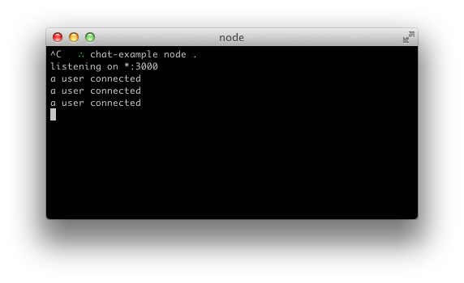
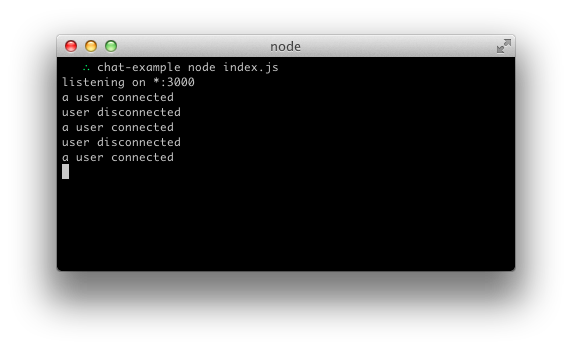

## Socket.IO'yu Entegre Etme

Socket.IO iki bölümden oluşur:

- Node.JS HTTP Sunucusu ile entegre olan (veya montaj yapılan) bir sunucu ([`socket.io`](https://www.npmjs.com/package/socket.io) paketi)
- Tarayıcı tarafında yüklenen bir istemci kütüphanesi ([`socket.io-client`](https://www.npmjs.com/package/socket.io-client) paketi)

Geliştirme sırasında, `socket.io` bizim için istemciyi otomatik olarak sunar, göreceğimiz gibi, bu nedenle şimdilik yalnızca bir modül yüklememiz yeterlidir:

```
npm install socket.io
```

Bu, modülü yükleyecek ve `package.json` dosyasına bağımlılığı ekleyecektir. Şimdi `index.js` dosyasını bunu eklemek için düzenleyelim:


  

```js
const express = require('express');
const { createServer } = require('node:http');
const { join } = require('node:path');
// highlight-start
const { Server } = require('socket.io');
// highlight-end

const app = express();
const server = createServer(app);
// highlight-start
const io = new Server(server);
// highlight-end

app.get('/', (req, res) => {
  res.sendFile(join(__dirname, 'index.html'));
});

// highlight-start
io.on('connection', (socket) => {
  console.log('a user connected');
});
// highlight-end

server.listen(3000, () => {
  console.log('server running at http://localhost:3000');
});
```

  
  

```js
import express from 'express';
import { createServer } from 'node:http';
import { fileURLToPath } from 'node:url';
import { dirname, join } from 'node:path';
// highlight-start
import { Server } from 'socket.io';
// highlight-end

const app = express();
const server = createServer(app);
// highlight-start
const io = new Server(server);
// highlight-end

const __dirname = dirname(fileURLToPath(import.meta.url));

app.get('/', (req, res) => {
  res.sendFile(join(__dirname, 'index.html'));
});

// highlight-start
io.on('connection', (socket) => {
  console.log('a user connected');
});
// highlight-end

server.listen(3000, () => {
  console.log('server running at http://localhost:3000');
});
```

  


`socket.io`'nun yeni bir örneğini `server` (HTTP sunucusu) nesnesini geçirerek başlattığımı unutmayın. Daha sonra gelen soketler için `connection` olayını dinliyorum ve bu durumu konsola yazdırıyorum.

Şimdi `index.html` dosyasına `` (gövde son etiketi) öncesinde aşağıdaki kodu ekleyin:


  

```html
<script src="/socket.io/socket.io.js"></script>
<script>
  const socket = io();
</script>
```

  
  

```html
<script src="/socket.io/socket.io.js"></script>
<script>
  var socket = io();
</script>
```

  


`socket.io-client`'i yüklemek için gereken her şey bu kadar; bu, `io` globalini (ve `GET /socket.io/socket.io.js` son noktasını) sunar ve ardından bağlantıyı kurar.

Yerel istemci tarafı JS dosyasını kullanmak isterseniz, `node_modules/socket.io/client-dist/socket.io.js` yolunda bulabilirsiniz.

:::tip
Yerel dosyalar yerine bir CDN kullanabilirsiniz (örn. ``).
:::

`io()` çağrısında herhangi bir URL belirlemediğimi unutmayın; çünkü bu, sayfayı sunan ana makineye bağlanmayı denemek için varsayılan ayardır.

:::note
Eğer apache veya nginx gibi bir ters proxy arkasındaysanız, lütfen `belgelere bakın`.

Uygulamanızı web sitenizin kökü olmayan bir klasörde (örn. `https://example.com/chatapp`) barındırıyorsanız, hem sunucuda hem de istemcide `yolu` belirtmeniz gerekir.
:::

Şimdi süreci yeniden başlatırsanız (Control+C tuşuna basarak ve `node index.js` komutunu tekrar çalıştırarak) ve ardından web sayfasını yenilerseniz, konsolda "a user connected" mesajını görmelisiniz.

Birden fazla sekme açmayı deneyin; birkaç mesaj göreceksiniz.



Her soket ayrıca özel bir `disconnect` olayını tetikler:

```js
io.on('connection', (socket) => {
  console.log('a user connected');
  socket.on('disconnect', () => {
    console.log('user disconnected');
  });
});
```

Ardından, bir sekmeyi birkaç kez yenilerseniz, bunu eylemde görebilirsiniz.



:::info

  
Bu örneği doğrudan tarayıcınızda çalıştırabilirsiniz:

- [CodeSandbox](https://codesandbox.io/p/sandbox/github/socketio/chat-example/tree/cjs/step3?file=index.js)
- [StackBlitz](https://stackblitz.com/github/socketio/chat-example/tree/cjs/step3?file=index.js)
  
  
Bu örneği doğrudan tarayıcınızda çalıştırabilirsiniz:

- [CodeSandbox](https://codesandbox.io/p/sandbox/github/socketio/chat-example/tree/esm/step3?file=index.js)
- [StackBlitz](https://stackblitz.com/github/socketio/chat-example/tree/esm/step3?file=index.js)
  

:::