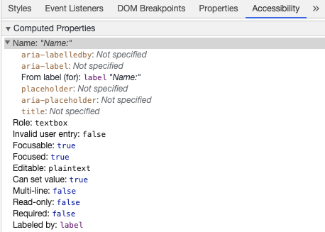
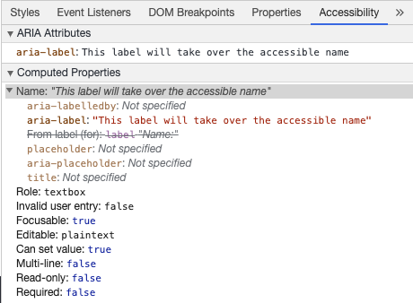
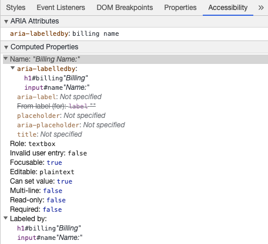

## Erişilebilirlik {#accessibility}

Web erişilebilirliği (a11y olarak da bilinir), engelli bir kişi, yavaş bir bağlantı, eski veya bozuk donanım veya sadece olumsuz bir ortamda bulunan biri gibi herkes tarafından kullanılabilir web siteleri oluşturma pratiğini ifade eder. Örneğin, bir videoya altyazı eklemek, hem işitme engelli kullanıcılarınıza hem de gürültülü bir ortamda bulunan kullanıcılarınıza telefonlarını duyamayacak kadar yardım eder. Benzer şekilde, metninizin çok düşük kontrastta olmamasını sağlamak, hem düşük görme yetisine sahip kullanıcılarınıza hem de parlak güneşte telefonlarını kullanmaya çalışan kullanıcılarınıza yardımcı olacaktır.

:::tip
Başlamak için hazır mısınız ama nereden başlayacağınızı bilmiyor musunuz? 
:::
[Web Erişilebilirliği Planlama ve Yönetim Rehberini](https://www.w3.org/WAI/planning-and-managing/) inceleyin. [Dünya Çapında Web Konsorsiyumu (W3C)](https://www.w3.org/) tarafından sağlanmıştır.

## Atla bağlantısı {#skip-link}

Her sayfanın üst kısmına, kullanıcıların birden fazla web sayfasında tekrar eden içeriği atlayabilmesi için doğrudan ana içerik alanına giden bir bağlantı eklemelisiniz.

Bu genellikle `App.vue` dosyasının üst kısmında yapılır çünkü tüm sayfalarınızda ilk odaklanabilir öğe olacaktır:

```vue-html
<ul class="skip-links">
  <li>
    <a href="#main" ref="skipLink" class="skip-link">Ana içeriğe atla</a>
  </li>
</ul>
```

Bağlantıyı yalnızca odaklandığında gizlemek için, aşağıdaki stili ekleyebilirsiniz:

```css
.skip-link {
  white-space: nowrap;
  margin: 1em auto;
  top: 0;
  position: fixed;
  left: 50%;
  margin-left: -72px;
  opacity: 0;
}
.skip-link:focus {
  opacity: 1;
  background-color: white;
  padding: 0.5em;
  border: 1px solid black;
}
```

Bir kullanıcı rota değiştirdiğinde, odakı atla bağlantısına geri getirin. Bu, atla bağlantısının şablon referansına odaklanmayı çağırarak başarılabilir (varsayılan olarak `vue-router` kullanıldığını varsayıyoruz):


Composition API Örneği

```vue
<script setup>
import { ref, watch } from 'vue'
import { useRoute } from 'vue-router'

const route = useRoute()
const skipLink = ref()

watch(
  () => route.path,
  () => {
    skipLink.value.focus()
  }
)
</script>
```


Options API Örneği

```vue
<script>
export default {
  watch: {
    $route() {
      this.$refs.skipLink.focus()
    }
  }
}
</script>
```


[Ana içeriğe atla bağlantısı ile ilgili dökümana bakın](https://www.w3.org/WAI/WCAG21/Techniques/general/G1.html)

## İçerik Yapısı {#content-structure}

Erişilebilirliğin en önemli unsurlarından biri, tasarımın erişilebilir uygulamayı destekleyebileceğinden emin olmaktır. Tasarım, sadece renk kontrastı, yazı tipi seçimi, metin boyutu ve dil değil, aynı zamanda içeriğin uygulamadaki yapısını da göz önünde bulundurmalıdır.

### Başlıklar {#headings}

Kullanıcılar bir uygulamayı başlıklar aracılığıyla gezinebilirler. Uygulamanızın her bölümüne açıklayıcı başlıklar koymak, kullanıcıların her bölümün içeriğini tahmin etmesini kolaylaştırır. Başlıklar söz konusu olduğunda, birkaç önerilen erişilebilirlik uygulaması vardır:

- Başlıkları sıralama düzeninde iç içe yerleştirin: `` - ``
- Bir bölüm içinde başlık atlamayın
- Görsel başlık görünümünü vermek için metin stilini kullanacağına gerçek başlık etiketlerini kullanın

[Daha fazla başlık bilgisi için tıklayın](https://www.w3.org/TR/UNDERSTANDING-WCAG20/navigation-mechanisms-descriptive.html)

```vue-html
<main role="main" aria-labelledby="main-title">
  <h1 id="main-title">Ana başlık</h1>
  <section aria-labelledby="section-title-1">
    <h2 id="section-title-1">Bölüm Başlığı</h2>
    <h3>Bölüm Alt Başlığı</h3>
    <!-- İçerik -->
  </section>
  <section aria-labelledby="section-title-2">
    <h2 id="section-title-2">Bölüm Başlığı</h2>
    <h3>Bölüm Alt Başlığı</h3>
    <!-- İçerik -->
    <h3>Bölüm Alt Başlığı</h3>
    <!-- İçerik -->
  </section>
</main>
```

### Yer İşaretleri {#landmarks}

[Yer işaretleri](https://developer.mozilla.org/en-US/docs/Web/Accessibility/ARIA/Roles/landmark_role), bir uygulamadaki bölümlere programlı erişim sağlar. Yardımcı teknolojilere bağımlı kullanıcılar, uygulamanın her bölümüne gidebilir ve içeriği atlayabilirler. Bunu başarmak için [ARIA rollerini](https://developer.mozilla.org/en-US/docs/Web/Accessibility/ARIA/Roles) kullanabilirsiniz.

| HTML            | ARIA Rolü           | Yer İşareti Amacı                                                                                                       |
| --------------- | -------------------- | ----------------------------------------------------------------------------------------------------------------------- |
| header          | role="banner"        | Ana başlık: sayfanın başlığı                                                                                            |
| nav             | role="navigation"    | Belge veya ilgili belgelerde gezinirken kullanıma uygun bağlantılar koleksiyonu                                         |
| main            | role="main"          | Belgenin ana veya merkezi içeriği.                                                                                     |
| footer          | role="contentinfo"   | Ebeveyn belgesi hakkında bilgi: dipnotlar/telif hakları/gizlilik beyanına bağlantılar                                    |
| aside           | role="complementary" | Ana içeriği destekler, ancak kendi başına ayrı ve anlamlı bir içeriğe sahiptir                                           |
| search          | role="search"        | Bu bölüm, uygulama için arama işlevini içerir.                                                                          |
| form            | role="form"          | Form ile ilişkilendirilmiş öğelerin koleksiyonu                                                                         |
| section         | role="region"        | İlgili içerik ve kullanıcıların muhtemelen gezinmek isteyeceği içerik. Bu öğe için bir etiket sağlanmalıdır.            |

[Daha fazla yer işareti bilgisi için tıklayın](https://www.w3.org/TR/wai-aria-1.2/#landmark_roles)

## Anlamlı Formlar {#semantic-forms}

Bir form oluştururken, şu öğeleri kullanabilirsiniz: ``, ``, ``, `` ve ``

Etiketler genellikle form alanlarının üstünde veya solunda yer alır:

```vue-html
<form action="/dataCollectionLocation" method="post" autocomplete="on">
  <div v-for="item in formItems" :key="item.id" class="form-item">
    <label :for="item.id">{{ item.label }}: </label>
    <input
      :type="item.type"
      :id="item.id"
      :name="item.id"
      v-model="item.value"
    />
  </div>
  <button type="submit">Gönder</button>
</form>
```

Form öğesi üzerine `autocomplete='on'` dahil edebileceğinizi ve bunun formunuzdaki tüm girdi öğelerine uygulanacağını unutmayın. Ayrıca her bir girdi için farklı [otomatik tamamlama özelliği değerleri](https://developer.mozilla.org/en-US/docs/Web/HTML/Attributes/autocomplete) ayarlayabilirsiniz.

### Etiketler {#labels}

Tüm form kontrolünün amacını açıklamak için etiketler sağlayın; `for` ve `id` bağlayarak:

```vue-html
<label for="name">İsim: </label>
<input type="text" name="name" id="name" v-model="name" />
```

Bu öğeyi Chrome Geliştirici Araçları'nda denetlerseniz ve Elemanlar sekmesi içindeki Erişilebilirlik sekmesini açarsanız, girdinin adını etiketin nasıl aldığını göreceksiniz:



:::warning Uyarı:
Girdi alanlarının etiketleri bu şekilde sarılı halde gördüğünüzde:

```vue-html
<label>
  İsim:
  <input type="text" name="name" id="name" v-model="name" />
</label>
```

Eşleşen bir kimlik ile etiketlerin açıkça ayarlanması, yardımcı teknoloji tarafından daha iyi desteklenmektedir.
:::

#### `aria-label` {#aria-label}

Girdiye bir erişilebilir isim vermek için [`aria-label`](https://developer.mozilla.org/en-US/docs/Web/Accessibility/ARIA/Attributes/aria-label) özelliğini de kullanabilirsiniz.

```vue-html
<label for="name">İsim: </label>
<input
  type="text"
  name="name"
  id="name"
  v-model="name"
  :aria-label="nameLabel"
/>
```

Erişilebilir ismin nasıl değiştiğini görmek için bu öğeyi Chrome Geliştirici Araçları'nda incelerken çekinmeyin:



#### `aria-labelledby` {#aria-labelledby}

[`aria-labelledby`](https://developer.mozilla.org/en-US/docs/Web/Accessibility/ARIA/Attributes/aria-labelledby) kullanmak, etiket metni ekranda görünür olduğunda `aria-label` ile benzerdir. Diğer öğelerle `id`’lerine göre eşleştirilir ve birden fazla `id` bağlayabilirsiniz:

```vue-html
<form
  class="demo"
  action="/dataCollectionLocation"
  method="post"
  autocomplete="on"
>
  <h1 id="billing">Fatura</h1>
  <div class="form-item">
    <label for="name">İsim: </label>
    <input
      type="text"
      name="name"
      id="name"
      v-model="name"
      aria-labelledby="billing name"
    />
  </div>
  <button type="submit">Gönder</button>
</form>
```



#### `aria-describedby` {#aria-describedby}

[`aria-describedby`](https://developer.mozilla.org/en-US/docs/Web/Accessibility/ARIA/Attributes/aria-describedby), `aria-labelledby` ile aynı şekilde kullanılır fakat kullanıcıların ihtiyaç duyabileceği ek bilgiler içeren bir açıklama sağlar. Bu, herhangi bir girdi için kriterleri açıklamak için kullanılabilir:

```vue-html
<form
  class="demo"
  action="/dataCollectionLocation"
  method="post"
  autocomplete="on"
>
  <h1 id="billing">Fatura</h1>
  <div class="form-item">
    <label for="name">Tam İsim: </label>
    <input
      type="text"
      name="name"
      id="name"
      v-model="name"
      aria-labelledby="billing name"
      aria-describedby="nameDescription"
    />
    <p id="nameDescription">Lütfen adınızı ve soyadınızı belirtin.</p>
  </div>
  <button type="submit">Gönder</button>
</form>
```

Açıklamayı Chrome Geliştirici Araçları'nda inceleyerek görebilirsiniz:


### Yer Tutucu {#placeholder}

Yer tutucuları kullanmaktan kaçının, çünkü birçok kullanıcıyı yanıltabilir.

Yer tutucularıyla ilgili sorunlardan biri, varsayılan olarak [renk kontrastı kriterlerini](https://www.w3.org/WAI/WCAG21/Understanding/contrast-minimum.html) karşılamamalarıdır; renk kontrastını düzeltmek, yer tutucunun girdi alanlarındaki önceden doldurulmuş veriler gibi görünmesini sağlar. Aşağıdaki örneğe baktığınızda, renk kontrastı kriterini karşılayan Soyad yer tutucusunun önceden doldurulmuş veri gibi göründüğünü görebilirsiniz:


```vue-html
<form
  class="demo"
  action="/dataCollectionLocation"
  method="post"
  autocomplete="on"
>
  <div v-for="item in formItems" :key="item.id" class="form-item">
    <label :for="item.id">{{ item.label }}: </label>
    <input
      type="text"
      :id="item.id"
      :name="item.id"
      v-model="item.value"
      :placeholder="item.placeholder"
    />
  </div>
  <button type="submit">Gönder</button>
</form>
```

```css
/* https://www.w3schools.com/howto/howto_css_placeholder.asp */

#lastName::placeholder {
  /* Chrome, Firefox, Opera, Safari 10.1+ */
  color: black;
  opacity: 1; /* Firefox */
}

#lastName:-ms-input-placeholder {
  /* Internet Explorer 10-11 */
  color: black;
}

#lastName::-ms-input-placeholder {
  /* Microsoft Edge */
  color: black;
}
```

Kullanıcının formu doldurması için ihtiyaç duyduğu tüm bilgilerin, herhangi bir girdi dışındaki alanlarda sağlanması daha iyidir.

### Talimatlar {#instructions}

Girdi alanlarınız için talimatlar eklerken, bunları girdi ile doğru bir şekilde bağladığınızdan emin olun. Ek talimatlar sağlayabilir ve birden fazla `id`'yi [`aria-labelledby`](https://developer.mozilla.org/en-US/docs/Web/Accessibility/ARIA/Attributes/aria-labelledby) özelliği ile bağlayabilirsiniz. Bu, daha esnek bir tasarım sağlar.

```vue-html
<fieldset>
  <legend>aria-labelledby kullanımı</legend>
  <label id="date-label" for="date">Mevcut Tarih: </label>
  <input
    type="date"
    name="date"
    id="date"
    aria-labelledby="date-label date-instructions"
  />
  <p id="date-instructions">AA/GG/YYYY</p>
</fieldset>
```

Alternatif olarak, talimatları [`aria-describedby`](https://developer.mozilla.org/en-US/docs/Web/Accessibility/ARIA/Attributes/aria-describedby) ile girdiye ekleyebilirsiniz:

```vue-html
<fieldset>
  <legend>aria-describedby kullanımı</legend>
  <label id="dob" for="dob">Doğum Tarihi: </label>
  <input type="date" name="dob" id="dob" aria-describedby="dob-instructions" />
  <p id="dob-instructions">AA/GG/YYYY</p>
</fieldset>
```

### İçeriği Gizleme {#hiding-content}

Genellikle, etiketleri görsel olarak gizlemek önerilmez, hatta girdi erişilebilir bir adı olsa bile. Ancak, girdinin işlevi çevresindeki içerikle anlaşılabiliyorsa, o zaman görsel etiketi gizleyebiliriz.

Bu arama alanına bakalım:

```vue-html
<form role="search">
  <label for="search" class="hidden-visually">Arama: </label>
  <input type="text" name="search" id="search" v-model="search" />
  <button type="submit">Ara</button>
</form>
```

Bunu yapabiliriz çünkü arama butonu, görsel kullanıcıların girdi alanının amacını belirlemesine yardımcı olacaktır.

CSS kullanarak öğeleri görsel olarak gizleyebiliriz ancak bunları yardımcı teknoloji için erişilebilir kılabiliriz:

```css
.hidden-visually {
  position: absolute;
  overflow: hidden;
  white-space: nowrap;
  margin: 0;
  padding: 0;
  height: 1px;
  width: 1px;
  clip: rect(0 0 0 0);
  clip-path: inset(100%);
}
```

#### `aria-hidden="true"` {#aria-hidden-true}

`aria-hidden="true"` eklemek, öğeyi yardımcı teknolojiden gizler ancak diğer kullanıcılar için görsel olarak erişilebilir bırakır. Bunu odaklanabilir öğeler üzerinde kullanmayın; yalnızca dekoratif, kopyalanmış veya ekran dışı içerikler için kullanın.

```vue-html
<p>Bu, ekran okuyuculardan gizlenmemiştir.</p>
<p aria-hidden="true">Bu, ekran okuyuculardan gizlenmiştir.</p>
```

### Butonlar {#buttons}

Bir form içinde buton kullanırken, formu göndermemek için türü ayarlamanız gerekir.
Butonlar oluşturmak için bir girdi de kullanabilirsiniz:

```vue-html
<form action="/dataCollectionLocation" method="post" autocomplete="on">
  <!-- Butonlar -->
  <button type="button">İptal</button>
  <button type="submit">Gönder</button>

  <!-- Girdi butonları -->
  <input type="button" value="İptal" />
  <input type="submit" value="Gönder" />
</form>
```

### Fonksiyonel Resimler {#functional-images}

Fonksiyonel görüntüler oluşturmak için bu tekniği kullanabilirsiniz.

- Girdi alanları

  - Bu resimler, formlarda bir gönderim türü düğmesi olarak işlev görecektir.

  ```vue-html
  <form role="search">
    <label for="search" class="hidden-visually">Arama: </label>
    <input type="text" name="search" id="search" v-model="search" />
    <input
      type="image"
      class="btnImg"
      src="https://img.icons8.com/search"
      alt="Arama"
    />
  </form>
  ```

- İkonlar

```vue-html
<form role="search">
  <label for="searchIcon" class="hidden-visually">Arama: </label>
  <input type="text" name="searchIcon" id="searchIcon" v-model="searchIcon" />
  <button type="submit">
    <i class="fas fa-search" aria-hidden="true"></i>
    <span class="hidden-visually">Arama</span>
  </button>
</form>
```

## Standartlar {#standards}

Dünya Çapında Web Konsorsiyumu (W3C) Web Erişilebilirliği İnisiyatifi (WAI), farklı bileşenler için web erişilebilirlik standartlarını geliştirmektedir:

- [Kullanıcı Aracı Erişilebilirlik Rehberi (UAAG)](https://www.w3.org/WAI/standards-guidelines/uaag/)
  - web tarayıcıları ve medya oynatıcılar, bazı yardımcı teknolojiler de dahil
- [Yazar Aracı Erişilebilirlik Rehberi (ATAG)](https://www.w3.org/WAI/standards-guidelines/atag/)
  - yazar araçları
- [Web İçeriği Erişilebilirlik Rehberi (WCAG)](https://www.w3.org/WAI/standards-guidelines/wcag/)
  - web içeriği - geliştiriciler, yazar araçları ve erişilebilirlik değerlendirme araçları tarafından kullanılır

### Web İçeriği Erişilebilirlik Rehberi (WCAG) {#web-content-accessibility-guidelines-wcag}

[WCAG 2.1](https://www.w3.org/TR/WCAG21/) [WCAG 2.0](https://www.w3.org/TR/WCAG20/) üzerine eklenir ve webdeki değişiklikleri ele alarak yeni teknolojilerin uygulanmasını sağlar. W3C, web erişilebilirliği politikalarını geliştirirken veya güncellerken en güncel WCAG sürümünün kullanılmasını teşvik etmektedir.

#### WCAG 2.1 Dört Ana Yönerge İlkesi (kısaca POUR): {#wcag-2-1-four-main-guiding-principles-abbreviated-as-pour}

- [Algılanabilir](https://www.w3.org/TR/WCAG21/#perceivable)
  - Kullanıcılar, sunulan bilgiyi algılayabilmelidir.
- [İşlevsel](https://www.w3.org/TR/WCAG21/#operable)
  - Arayüz biçimleri, kontrol ve navigasyon işlevsel olmalıdır.
- [Anlaşılır](https://www.w3.org/TR/WCAG21/#understandable)
  - Bilgi ve kullanıcı arayüzünün işleyişi, tüm kullanıcılar için anlaşılır olmalıdır.
- [Sağlam](https://www.w3.org/TR/WCAG21/#robust)
  - Kullanıcılar, teknolojiler geliştikçe içeriğe erişebilmelidir.

#### Web Erişilebilirliği İnisiyatifi – Erişilebilir Zengin Internet Uygulamaları (WAI-ARIA) {#web-accessibility-initiative-–-accessible-rich-internet-applications-wai-aria}

W3C'nin WAI-ARIA'sı, dinamik içerik ve gelişmiş kullanıcı arayüzü kontrolleri nasıl oluşturulacağı konusunda rehberlik sağlar.

- [Erişilebilir Zengin Internet Uygulamaları (WAI-ARIA) 1.2](https://www.w3.org/TR/wai-aria-1.2/)
- [WAI-ARIA Yazarlık Uygulamaları 1.2](https://www.w3.org/TR/wai-aria-practices-1.2/)

## Kaynaklar {#resources}

### Dokümantasyon {#documentation}

- [WCAG 2.0](https://www.w3.org/TR/WCAG20/)
- [WCAG 2.1](https://www.w3.org/TR/WCAG21/)
- [Erişilebilir Zengin Internet Uygulamaları (WAI-ARIA) 1.2](https://www.w3.org/TR/wai-aria-1.2/)
- [WAI-ARIA Yazarlık Uygulamaları 1.2](https://www.w3.org/TR/wai-aria-practices-1.2/)

### Yardımcı Teknolojiler {#assistive-technologies}

- Ekran Okuyucular
  - [NVDA](https://www.nvaccess.org/download/)
  - [VoiceOver](https://www.apple.com/accessibility/mac/vision/)
  - [JAWS](https://www.freedomscientific.com/products/software/jaws/?utm_term=jaws%20screen%20reader&utm_source=adwords&utm_campaign=All+Products&utm_medium=ppc&hsa_tgt=kwd-394361346638&hsa_cam=200218713&hsa_ad=296201131673&hsa_kw=jaws%20screen%20reader&hsa_grp=52663682111&hsa_net=adwords&hsa_mt=e&hsa_src=g&hsa_acc=1684996396&hsa_ver=3&gclid=Cj0KCQjwnv71BRCOARIsAIkxW9HXKQ6kKNQD0q8a_1TXSJXnIuUyb65KJeTWmtS6BH96-5he9dsNq6oaAh6UEALw_wcB)
  - [ChromeVox](https://chrome.google.com/webstore/detail/chromevox-classic-extensi/kgejglhpjiefppelpmljglcjbhoiplfn?hl=en)
- Yakınlaştırma Araçları
  - [MAGic](https://www.freedomscientific.com/products/software/magic/)
  - [ZoomText](https://www.freedomscientific.com/products/software/zoomtext/)
  - [Büyüteç](https://support.microsoft.com/en-us/help/11542/windows-use-magnifier-to-make-things-easier-to-see)

### Test {#testing}

- Otomatik Araçlar
  - [Lighthouse](https://chrome.google.com/webstore/detail/lighthouse/blipmdconlkpinefehnmjammfjpmpbjk)
  - [WAVE](https://chrome.google.com/webstore/detail/wave-evaluation-tool/jbbplnpkjmmeebjpijfedlgcdilocofh)
  - [ARC Toolkit](https://chrome.google.com/webstore/detail/arc-toolkit/chdkkkccnlfncngelccgbgfmjebmkmce?hl=en-US)
- Renk Araçları
  - [WebAim Renk Kontrastı](https://webaim.org/resources/contrastchecker/)
  - [WebAim Bağlantı Renk Kontrastı](https://webaim.org/resources/linkcontrastchecker)
- Diğer Yararlı Araçlar
  - [HeadingMap](https://chrome.google.com/webstore/detail/headingsmap/flbjommegcjonpdmenkdiocclhjacmbi?hl=en…)
  - [Renk Oracle](https://colororacle.org)
  - [NerdeFocus](https://chrome.google.com/webstore/detail/nerdefocus/lpfiljldhgjecfepfljnbjnbjfhennpd?hl=en-US…)
  - [Görsel Aria](https://chrome.google.com/webstore/detail/visual-aria/lhbmajchkkmakajkjenkchhnhbadmhmk?hl=en-US)
  - [Silktide Web Erişilebilirlik Simülatörü](https://chrome.google.com/webstore/detail/silktide-website-accessib/okcpiimdfkpkjcbihbmhppldhiebhhaf?hl=en-US)