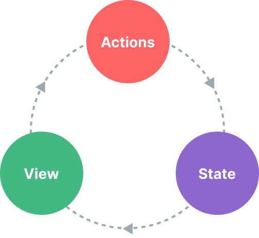

## Durum Yönetimi Nedir? {#what-is-state-management}

Teknik olarak, her Vue bileşeni örneği zaten kendi reaktif durumunu "yönetir". Basit bir sayaç bileşenini örnek alalım:


```vue
<script setup>
import { ref } from 'vue'

// durum
const count = ref(0)

// işlemler
function increment() {
  count.value++
}
</script>

<!-- görünüm -->
<template>{{ count }}</template>
```


```vue
<script>
export default {
  // durum
  data() {
    return {
      count: 0
    }
  },
  // işlemler
  methods: {
    increment() {
      this.count++
    }
  }
}
</script>

<!-- görünüm -->
<template>{{ count }}</template>
```


Bu, aşağıdaki parçalara sahip kendi kendine yeterli bir birimdir:

- **durum**, uygulamamızı yönlendiren gerçek kaynak;
- **görünüm**, **durum**un açıklayıcı bir eşlemesi;
- **işlemler**, görünümden kullanıcı girişlerine tepki olarak durumun değişebileceği olası yollar.

Bu, "tek yönlü veri akışı" kavramının basit bir temsilidir:


  


Ancak, **ortak bir durumu paylaşan birden fazla bileşen** olduğunda basitlik bozulmaya başlar:

1. Birden fazla görünüm, aynı duruma bağlı olabilir.
2. Farklı görünümlerden gelen işlemler, aynı durumu değiştirmek zorunda kalabilir.

Birinci durum için, ortak durumu "kaldırmak" ve bunu ortak bir üst bileşene taşımak mümkündür ve ardından bunu prop olarak aşağı gönderebiliriz. Ancak, bu hızlı bir şekilde derin hiyerarşilere sahip bileşen ağaçlarında sıkıcı hale gelir ve `Prop Drilling` olarak bilinen başka bir soruna yol açar.

İkinci durum için, genellikle doğrudan ebeveyn / çocuk örneklerine ulaşmak için şablon referansları kullanma veya yayımlanan olaylar aracılığıyla birden fazla durum kopyasını değiştirme ve senkronize etme gibi çözümlere başvururuz. Bu desenlerin her ikisi de kırılgandır ve hızlı bir şekilde sürdürülemez kodla sonuçlanır.

Daha basit ve daha açık bir çözüm, ortak durumu bileşenlerden çıkarmak ve onu küresel bir singleton'da yönetmektir. Bunu yaptığımızda, bileşen ağacımız büyük bir "görünüm" haline gelir ve her bileşen duruma erişebilir veya nerede olurlarsa olsunlar işlemleri tetikleyebilir!

## Reaktif API ile Basit Durum Yönetimi {#simple-state-management-with-reactivity-api}


Seçenekler API'sinde, reaktif veriler `data()` seçeneği kullanılarak tanımlanır. İçeride, `data()` tarafından döndürülen nesne `reactive()` fonksiyonu aracılığıyla reaktif hale getirilir ve bu, kamu API'si olarak da mevcuttur.


Birden fazla örnekte paylaşılması gereken bir durum varsa, reaktif bir nesne oluşturmak için `reactive()` kullanabilir ve ardından bunu birden fazla bileşene içe aktarabilirsiniz:

```js
// store.js
import { reactive } from 'vue'

export const store = reactive({
  count: 0
})
```


```vue
<!-- ComponentA.vue -->
<script setup>
import { store } from './store.js'
</script>

<template>A'dan: {{ store.count }}</template>
```

```vue
<!-- ComponentB.vue -->
<script setup>
import { store } from './store.js'
</script>

<template>B'den: {{ store.count }}</template>
```


```vue
<!-- ComponentA.vue -->
<script>
import { store } from './store.js'

export default {
  data() {
    return {
      store
    }
  }
}
</script>

<template>A'dan: {{ store.count }}</template>
```

```vue
<!-- ComponentB.vue -->
<script>
import { store } from './store.js'

export default {
  data() {
    return {
      store
    }
  }
}
</script>

<template>B'den: {{ store.count }}</template>
```


Artık `store` nesnesi değiştirildiğinde, hem `` hem de ``, görünümlerini otomatik olarak güncelleyerek artık tek bir gerçek kaynak olarak hizmet etmektedir.

Ancak, bu aynı zamanda `store`'u içe aktaran herhangi bir bileşenin onu dilediği gibi değiştirebileceği anlamına gelir:

```vue-html{2}
<template>
  <button @click="store.count++">
    B'den: {{ store.count }}
  </button>
</template>
```

Bu basit durumlarda işe yarasa da, herhangi bir bileşenin keyfi olarak değiştirebileceği küresel bir durum uzun vadede sürdürülebilir olmayacaktır. Durum değiştirme mantığının, durumun kendisi gibi merkezileştirilmesi için, mağazada işlemlerin amacını ifade eden adlar tanımlaması önerilir:

```js{6-8}
// store.js
import { reactive } from 'vue'

export const store = reactive({
  count: 0,
  increment() {
    this.count++
  }
})
```

```vue-html{2}
<template>
  <button @click="store.increment()">
    B'den: {{ store.count }}
  </button>
</template>
```


[Playground'da dene](https://play.vuejs.org/#eNrNkk1uwyAQha8yYpNEiUzXllPVrtRTeJNSqtLGgGBsVbK4ewdwnT9FWWSTFczwmPc+xMhqa4uhl6xklRdOWQQvsbfPrVadNQ7h1dCqpcYaPp3pYFHwQyteXVxKm0tpM0krnm3IgAqUnd3vUFIFUB1Z8bNOkzoVny+wDTuNcZ1gBI/GSQhzqlQX3/5Gng81pA1t33tEo+FF7JX42bYsT1BaONlRguWqZZMU4C261CWMk3EhTK8RQphm8Twse/BscoUsvdqDkTX3kP3nI6aZwcmdQDUcMPJPabX8TQphtCf0RLqd1csxuqQAJTxtYnEUGtIpAH4pn1Ou17FDScOKhT+QNAVM)


[Playground'da dene](https://play.vuejs.org/#eNrdU8FqhDAU/JVHLruyi+lZ3FIt9Cu82JilaTWR5CkF8d8bE5O1u1so9FYQzAyTvJnRTKTo+3QcOMlIbpgWPT5WUnS90gjPyr4ll1jAWasOdim9UMum3a20vJWWqxSgkvzTyRt+rocWYVpYFoQm8wRsJh+viHLBcyXtk9No2ALkXd/WyC0CyDfW6RVTOiancQM5ku+x7nUxgUGlOcwxn8Ppu7HJ7udqaqz3SYikOQ5aBgT+OA9slt9kasToFnb5OiAqCU+sFezjVBHvRUimeWdT7JOKrFKAl8VvYatdI6RMDRJhdlPtWdQf5mdQP+SHdtyX/IftlH9pJyS1vcQ2NK8ZivFSiL8BsQmmpMG1s1NU79frYA1k8OD+/I3pUA6+CeNdHg6hmoTMX9pPSnk=)


:::tip
Tıklama işlemcisinin `store.increment()` ile parantez kullanarak çağrılması gerektiğini unutmayın - bu, doğru `this` bağlamıyla yöntemi çağırmak içindir çünkü bu, bir bileşen yöntemi değildir.
:::

Burada bir mağaza olarak tek bir reaktif nesne kullansak da, `ref()` veya `computed()` gibi diğer `Reaktivite API'leri` kullanılarak oluşturulmuş reaktif durumu paylaşabilir veya hatta `Composable` kullanarak küresel durumu döndürebilirsiniz:

```js
import { ref } from 'vue'

// modül kapsamındaki küresel durum
const globalCount = ref(1)

export function useCount() {
  // her bileşen için oluşturulan yerel durum
  const localCount = ref(1)

  return {
    globalCount,
    localCount
  }
}
```

Vue'nun reaktivite sisteminin bileşen modelinden bağımsız olması, son derece esnek hale getirir.

## SSR Düşünceleri {#ssr-considerations}

`Sunucu Tarafı Renderı (SSR)` kullanan bir uygulama geliştiriyorsanız, yukarıdaki desen, mağazanın bir singleton olarak birden fazla istek arasında paylaşılması nedeniyle sorunlara yol açabilir. Bu, SSR kılavuzunda `daha fazla detayda` tartışılmaktadır.

## Pinia {#pinia}

Kendi oluşturduğumuz durum yönetimi çözümümüz basit senaryolar için yeterli olsa da, büyük ölçekli üretim uygulamalarında dikkate alınması gereken daha birçok şey vardır:

- Ekip işbirliği için daha güçlü kurallar
- Vue Geliştirici Araçları ile entegrasyon, zaman çizelgesi, bileşen içi inceleme ve zaman yolculuğu hata ayıklama dahil
- Sıcak Modül Değiştirme
- Sunucu Tarafı Render Desteği

[Pinia](https://pinia.vuejs.org) yukarıdakilerin hepsini uygulayan bir durum yönetimi kütüphanesidir. Vue çekirdek ekibi tarafından korunmaktadır ve hem Vue 2 hem de Vue 3 ile çalışmaktadır.

Mevcut kullanıcılar, Vue için önceki resmi durum yönetimi kütüphanesi olan [Vuex](https://vuex.vuejs.org/) ile tanışık olabilir. Pinia, ekosistemde aynı rolü üstlendiği için Vuex artık bakım modundadır. Hala çalışıyor, ancak artık yeni özellikler almayacak. Yeni uygulamalar için Pinia kullanılması önerilmektedir.

Pinia, Vuex'in bir sonraki iterasyonunun neye benzeyebileceğini araştırma süreci olarak başlamış olup, Vuex 5 için çekirdek takım tartışmalarından birçok fikri içermektedir. Sonunda, Pinia'nın zaten Vuex 5'te istemediğimiz çoğu şeyi uyguladığını fark ettik ve bunun yerine yeni öneri olarak planladık.

Vuex'e kıyasla, Pinia daha az ritüelle daha basit bir API sunar, Composition-API tarzı API'ler sunar ve en önemlisi, TypeScript ile kullanıldığında sağlam bir tür çıkarım desteğine sahiptir.