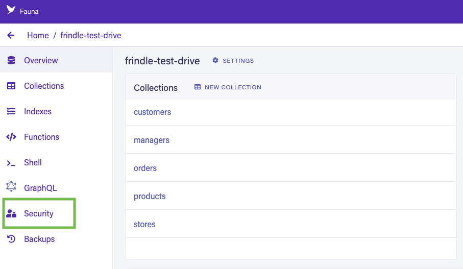

FaunaDB kendisini "modern uygulamalar için veri API'si" olarak tanımlar. **GraphQL** arayüzüne sahip bir veritabanıdır ve sizin GraphQL kullanarak onunla etkileşimde bulunmanızı sağlar. HTTP istekleri kullanarak onunla iletişim kurduğunuz için bağlantıları yönetmeniz gerekmez, bu da sunucusuz uygulamalar için işe yarar.

:::info
Bu eğitim, Deno Deploy'de dağıtılan bir uygulamadan bir Fauna veritabanına nasıl bağlanacağınızı ele alır.
:::

Fauna'nın üzerine bir örnek uygulama inşa eden daha kapsamlı bir eğitime `buradan` ulaşabilirsiniz.

## Fauna'dan kimlik bilgileri alın

Bir Fauna örneğini zaten oluşturduğunuzu varsayıyoruz [https://dashboard.fauna.com](https://dashboard.fauna.com) adresinde.

Fauna veritabanınıza programatik olarak erişmek için bir kimlik bilgisi oluşturmanız gerekiyor:

1. Belirli veritabanınızın içindeki **Güvenlik** bölümüne tıklayın ve **Yeni Anahtar** seçeneğine tıklayın. 

2. **Sunucu** rolünü seçin ve **Kaydet** butonuna tıklayın. Gizli anahtarı kopyalayın. **Bunu bir sonraki adımda kullanmanız gerekecek.**

## Deno Deploy'de bir proje oluşturun

Sonraki adımda, Deno Deploy'de bir proje oluşturalım ve gerekli ortam değişkenleri ile ayarlayalım:

1. [https://dash.deno.com/new](https://dash.deno.com/new) adresine gidin (henüz giriş yapmadıysanız GitHub ile giriş yapın) ve **Komut satırından Dağıt** altında **+ Boş Proje** seçeneğine tıklayın.
   
2. Şimdi proje sayfasında bulunan **Ayarlar** butonuna tıklayın.

3. **Ortam Değişkenleri** bölümüne gidin ve aşağıdaki gizli anahtarları ekleyin:

   - `FAUNA_SECRET` - Değer, bir önceki adımda oluşturduğumuz gizli anahtar olmalıdır. 

## Fauna'ya bağlanan kod yazın

Node ile birlikte bir Fauna JavaScript sürücüsü olmasına rağmen, Deno ile **graphql** uç noktasını kullanmalısınız.

Fauna'nın veritabanı için bir graphql uç noktası vardır ve şemada tanımlanan bir veri türü için `create`, `update`, `delete` gibi temel mutasyonlar üretir. **Örneğin, Fauna `Quote` veri türünde veritabanında yeni bir alıntı oluşturmak için `createQuote` adlı bir mutasyon üretecektir.**

Fauna ile etkileşimde bulunmak için uygun sorgu ve parametrelerle graphql uç noktasına bir POST isteği göndermemiz gerekiyor. Bu yüzden, bu işlemleri yönetecek genel bir fonksiyon oluşturalım.

```javascript
import query from "https://esm.sh/faunadb@4.7.1";
import Client from "https://esm.sh/faunadb@4.7.1";

// Ortamdan gizli anahtarı al.
const token = Deno.env.get("FAUNA_SECRET");
if (!token) {
  throw new Error("environment variable FAUNA_SECRET not set");
}

var client = new Client.Client({
  secret: token,
  // Bölge Grupları kullanıyorsanız uç noktayı ayarlayın
  endpoint: "https://db.fauna.com/",
});
// HEAD
client.query(query.ToDate("2018-06-06"));
//
client
  .query(query.ToDate("2018-06-06"))
  //1e2f378 (Biraz daha sayfa ekleyin)
  .then(function (res) {
    console.log("Sonuç:", res);
  })
  .catch(function (err) {
    console.log("Hata:", err);
  });
```

## Uygulamayı Deno Deploy'e dağıtın

Uygulamanızı yazmayı bitirdiğinizde, Deno Deploy'de dağıtabilirsiniz.

Bunu yapmak için proje sayfanıza geri dönün [https://dash.deno.com/projects/](https://dash.deno.com/projects/).

Dağıtmak için birkaç seçeneği göreceksiniz:

- `Github entegrasyonu`
- `deployctl`
  ```sh
  deployctl deploy --project=<project-name> <application-file-name>
  ```

:::tip
Bir derleme adım eklemek istemiyorsanız, Github entegrasyonunu seçmenizi öneririz.
:::

Deno Deploy'de dağıtım yapmanın farklı yolları ve farklı yapılandırma seçenekleri hakkında daha fazla ayrıntı için `buradan` okuyun.