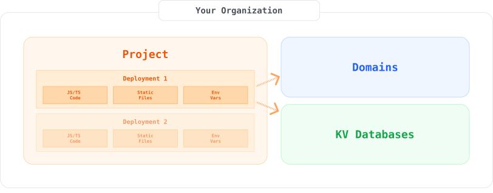

Deno Deploy ile Subhosting oluşturmak için, sistem içindeki bazı **temel kaynakları** anlamak yardımcı olur. Bu kaynaklar aynı zamanda `REST API` içinde temsil edilmektedir.



## Organizasyonlar

[**Organizasyonlar**](https://apidocs.deno.com/#get-/organizations/-organizationId-) bir subhosting uygulamasıyla ilgili tüm verileri barındıran bir konteynırdır. Sizin organizasyonunuzun bir adı ve bir kimliği olacaktır. Her organizasyonun, organizasyon genelindeki metrikleri (istek sayısı ve kullanılan bant genişliği gibi) alabilmek için kullanılabilecek bir analiz uç noktası vardır.

:::info
Diğer Deploy kullanıcıları bir organizasyonda işbirliği yapmaları için davet edilebilir ve [erişim belirteçleri](https://dash.deno.com/account#access-tokens) API aracılığıyla org içinde kaynakları değiştirme yeteneğine sahip geliştiricilere organizasyon erişimi verebilir.
:::

Yeni organizasyonlar [Deploy kontrol panelinde](https://dash.deno.com/orgs/new) oluşturulabilir.

---

## Projeler

[**Projeler**](https://apidocs.deno.com/#get-/organizations/-organizationId-/projects), dağıtımlar için organizasyonel konteynırlar işlevi görür. Bir proje, dağıtımlarını ve bu dağıtımlar için analitik ve kullanım bilgilerini içerir.

Projeler ücretsizdir ve gerektiği gibi kurulabilir.

Fatura için bireysel kullanıcıların kullanımını takip etmek amacıyla, her proje için **15 dakikalık granülarite** ile analitik raporlama yapan bir API uç noktası bulunmaktadır.

> Tüm dağıtımlar (aynı projelerde veya farklı projeler arasında) varsayılan olarak hiçbir şeyi paylaşmaz. Projeler, dağıtımlarınızı organize etmenin bir yoludur ve hiçbir maliyeti yoktur. Ancak analitik, proje bazında raporlanmaktadır; birden fazla kiracınız varsa, her biri için bir proje kurmanızı öneririz. Özellikle kullanıcılarınıza kullanım için fatura kesmeyi düşünüyorsanız.

---

## Dağıtımlar

[**Dağıtımlar**](https://apidocs.deno.com/#get-/projects/-projectId-/deployments): bir dağıtım, Deno Deploy'da bir izolasyonda çalışabilen bir dizi yapılandırma, çalıştırılabilir kod ve destekleyici statik dosyaları içerir. Dağıtımlar, bir sunucuyu başlatabilen bir giriş dosyasına sahip olabilir, onlarla ilişkili bir `Deno KV` veritabanına sahip olabilir ve özel alan adlarında çalışacak şekilde ayarlanabilir.

Bir dağıtım, aşağıdakilerden oluşan değiştirilemez bir nesnedir:

- Çalıştırılacak kaynak kodu
- Statik varlıklar
- Ortam değişkenleri
- Veritabanı bağlantıları
- Diğer ayarlar

Sorgulama veya akış yapılandırma günlükleri ile sorgulama veya akış yürütme günlükleri için uç noktalar sağlıyoruz.

:::tip
Bir dağıtımı engellemeniz veya engeli kaldırmanız gerekiyorsa, engellemek istediğiniz dağıtımı silerek veya alan adlarını atayarak bunu yapabilirsiniz. Bu, dağıtımın erişilemez hale gelmesini sağlar.
:::

Subhosting sistemi, bir dağıtım üzerindeki davranışın veya yükün diğer dağıtımları etkilememesi için inşa edilmiştir. Bu, aynı organizasyon içinde farklı dağıtımlar için de geçerlidir. Kapasite talebe göre otomatik olarak ölçeklendirilir. Belirli bir dağıtım veya uygulama için kaynakları sınırlamak isterseniz, analitik API'yi kullanarak detaylı metrikler (istek sayısı, bant genişliği vb.) sağlayabilirsiniz. Bunu dağıtımları kapatmayı ve erişilemez hale getirmeyi karar vermek için kullanabilirsiniz.

> NB. **Dağıtımlar değiştirilemezdir**, ancak yeni bir dağıtım oluşturabilir ve ardından alan adını yeni dağıtıma yeniden yönlendirebilirsiniz. Yeniden dağıtım uç noktası, mevcut bir dağıtımdan farklı ayarlarla yeni bir dağıtım oluşturabilir.

---

## Özel alan adları

[**Özel alan adları**](https://apidocs.deno.com/#get-/organizations/-organizationId-/domains), dağıtımlara dinamik olarak eşlenebilir ve onlara benzersiz bir URL (örneğin `mycompany.com`) verir.

Bir alan adı kullanılmadan önce, [sahipliği doğrulamanız ve TLS sertifikaları sağlamanız veya yüklemeniz gerekir](https://github.com/denoland/deploy-api/blob/main/samples.ipynb).

Eğer [Builder katmanındaysanız](https://deno.com/deploy/pricing?subhosting), wildcard alan adlarını kullanabilirsiniz. Bir wildcard alan adı kaydettikten sonra, onu iki şekilde kullanabilirsiniz:

- `*.mycompany.com` için tüm istekleri belirli bir dağıtıma yönlendirin
- (Yakında) Farklı alt alan adlarını (örneğin `foo.mycompany.com` ve `bar.mycompany.com`) ayrı dağıtımlara atayın.

### Staging ve Üretim Ortamları

Deno Deploy son kullanıcı platformu, bir geliştirici bir github pull isteği açtığında otomatik olarak önizleme dağıtımları oluşturur ve "ana" dalda yapılan taahhütler otomatik olarak üretim dağıtımlarına dönüştürülür. Subhosting, kutudan çıkar çıkmaz github entegrasyonu sağlamasa da, önizleme ve üretim dağıtımlarını oluşturmak için kendi anlamlarınızı tanımlamanız için gereken tüm ilkeleri sağlar.

---

## KV Veritabanına Bağlanma

Bir (KV) veritabanı, anahtar-değer çiftlerini depolar. Bir dağıtım oluşturduğunuzda bir veritabanını dağıtıma erişilebilir hale getirebilirsiniz. KV veritabanları, aynı anda birden fazla dağıtım tarafından kullanılabilir.

Subhosting ile KV kullanmak için:

- [API kullanarak bir veritabanı oluşturun](https://docs.deno.com/deploy/kv/manual)
- Subhosting API'sini kullanarak bir dağıtım oluşturduğunuzda, oluşturduğunuz veritabanını belirtin.

> NB. Deno Cron ve Kuyruklar şu anda Subhosting için geçerli değildir.

## OpenAPI spesifikasyonu ve araçları

Daha önceki Deploy API için [OpenAPI spesifikasyonu](https://www.openapis.org/) burada bulunmaktadır:

```console
https://api.deno.com/v1/openapi.json
```

Bu spesifikasyon belgesi, [büyük sayıdaki OpenAPI uyumlu araçlarla](https://openapi.tools/) kullanılabilir. Burada tutulan REST API belgelerine ek olarak, [burada](https://apidocs.deno.com/) otomatik oluşturulan API belgeleri (bir tarayıcı tabanlı test aracı dahil) bulabilirsiniz.