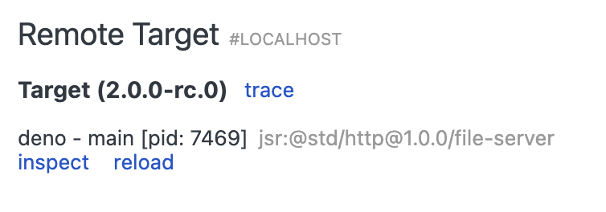

Deno, Chrome, Edge ve Node.js tarafından kullanılan [V8 Inspector Protocol](https://v8.dev/docs/inspector) desteği sunar. Bu, Deno programlarını Chrome DevTools veya protokolü destekleyen diğer istemciler (örneğin, VSCode) kullanarak hata ayıklamayı mümkün kılar.

:::tip
Hata ayıklama yeteneklerini aktive etmek için Deno'yu aşağıdaki bayraklardan biriyle çalıştırın:
- `--inspect`
- `--inspect-wait`
- `--inspect-brk`
:::

## --inspect

`--inspect` bayrağını kullanmak, V8 Inspector Protocol'ü destekleyen araçlardan istemci bağlantılarına izin veren bir denetleyici sunucusu ile programınızı başlatır, örneğin Chrome DevTools.

Deno'yu denetleyici sunucusuna bağlamak için bir Chromium türevi tarayıcıda `chrome://inspect` adresini ziyaret edin. Bu, kodunuzu incelemenize, kesme noktaları eklemenize ve kodunuzda adım adım ilerlemenize olanak tanır.

```sh
deno run --inspect your_script.ts
```

:::note
Eğer `--inspect` bayrağını kullanıyorsanız, kod hemen çalışmaya başlayacaktır. Programınız kısaysa, program tamamlanmadan önce hata ayıklayıcıya bağlanmak için yeterli zamanınız olmayabilir. Bu gibi durumlarda `--inspect-wait` veya `--inspect-brk` bayrağını kullanmayı deneyin veya kodunuzun sonuna bir zaman aşımı ekleyin.
:::

## --inspect-wait

`--inspect-wait` bayrağı, kodunuzu çalıştırmadan önce bir hata ayıklayıcının bağlanmasını bekler.

```sh
deno run --inspect-wait your_script.ts
```

## --inspect-brk

`--inspect-brk` bayrağı, bir hata ayıklayıcının bağlanmasını bekler ve ardından bağlandığınızda programınızda bir kesme noktası koyar, böylece ek kesme noktaları ekleyebilir veya yürütmeyi sürdürmeden önce ifadeleri değerlendirebilirsiniz.

**Bu en yaygın kullanılan inspect bayrağıdır**. JetBrains ve VSCode IDE'leri, bu bayrağı varsayılan olarak kullanır.

```sh
deno run --inspect-brk your_script.ts
```

## Chrome DevTools ile Örnek

Chrome Devtools kullanarak bir programı hata ayıklamayı deneyelim. Bunun için [@std/http/file-server](https://jsr.io/@std/http#file-server) adlı statik dosya sunucusunu kullanacağız.

İlk satırda yürütmeyi durdurmak için `--inspect-brk` bayrağını kullanın:

```sh
$ deno run --inspect-brk -RN jsr:@std/http@1.0.0/file-server
Debugger listening on ws://127.0.0.1:9229/ws/1e82c406-85a9-44ab-86b6-7341583480b1
...
```

Google Chrome veya Microsoft Edge gibi bir Chromium türevi tarayıcıda `chrome://inspect` adresini açın ve hedefin yanındaki `Inspect` butonuna tıklayın:



Tüm modüllerin yüklenmesi için DevTools'u açtıktan sonra birkaç saniye beklemeniz gerekebilir.


DevTools'un `_constants.ts` dosyasının ilk satırında yürütmeyi durdurduğunu görebilirsiniz, bu `file_server.ts`'nin yerine. Bu, ES modüllerinin JavaScript'te değerlendirildiği şekilde neden kaynaklandığı beklenen bir davranıştır (`_constants.ts`, `file_server.ts`'nin en solda, en altta bağımlılığı olduğu için önce değerlendirilir).

:::info
Bu noktada tüm kaynak kod DevTools'ta mevcut, bu yüzden `file_server.ts` dosyasını açalım ve oraya bir kesme noktası ekleyelim; "Sources" paneline gidin ve ağacı genişletin:
:::


_Dikkatlice bakarsanız, her dosya için bir tane normal bir şekilde yazılmış ve bir tane italik yazılmış olmak üzere çift girişler bulacaksınız. İlk olan derlenmiş kaynak dosyasıdır (yani `.ts` dosyalarının durumunda JavaScript kaynağı olarak çıkarılacaktır), diğeri ise dosya için bir kaynak haritasıdır._

Sonraki adımda `listenAndServe` metodunda bir kesme noktası ekleyin:


Kesme noktasını eklediğimiz anda, DevTools otomatik olarak kaynak haritası dosyasını açar ve türleri içeren gerçek kaynak kodu adım adım izlemenizi sağlar.

Artık kesme noktalarımız ayarlandığına göre, bir gelen isteği incelemek için scriptimizin yürütmesini devam ettirebiliriz. Bunu yapmak için "Resume script execution" butonuna basın. Belki iki kez basmanız gerekebilir!

Scriptimiz çalıştığında, bir istek gönderin ve DevTools'ta inceleyin:

```sh
curl http://0.0.0.0:4507/
```


Bu noktada isteğin içeriğini inceleyebilir ve kodu adım adım hata ayıklayabilirsiniz.

## VSCode

Deno, VSCode kullanılarak hata ayıklanabilir. Bunu yapmak için en iyi yol, resmi `vscode_deno` eklentisinden yardım almaktır. Bu konuda belgeler `burada` bulunmaktadır.

## JetBrains IDE'leri

_**Not**: Lütfen [bunun Deno eklentisini](https://plugins.jetbrains.com/plugin/14382-deno) yüklediğinizden ve Tercihler / Ayarlar | Eklentiler altında etkinleştirdiğinizden emin olun. Daha fazla bilgi için, [bu blog yazısını](https://blog.jetbrains.com/webstorm/2020/06/deno-support-in-jetbrains-ides/) okuyun._

Deno'yu JetBrains IDE'nizde hata ayıklamak için, hata ayıklamak istediğiniz dosyaya sağ tıklayın ve `Debug 'Deno: '` seçeneğini seçin.


Bu, izin bayrağı olmadan bir çalıştırma/hata ayıklama yapılandırması oluşturacaktır. Eğer bunları yapılandırmak istiyorsanız, çalıştırma/hata ayıklama yapılandırmanızı açın ve `Command` alanına gerekli bayrakları ekleyin.

## --log-level=debug

Eğer denetleyiciye bağlanmakta zorluk yaşıyorsanız, olan biten hakkında daha fazla bilgi edinmek için `--log-level=debug` bayrağını kullanabilirsiniz. Bu, modül çözümü, ağ istekleri ve diğer izin kontrolleri gibi bilgileri gösterecektir.

```sh
deno run --inspect-brk --log-level=debug your_script.ts
```

## --strace-ops

Deno ops, JavaScript ile Rust arasında bir [RPC](https://en.wikipedia.org/wiki/Remote_procedure_call) mekanizmasıdır. Dosya G/Ç'si, ağ iletişimi ve zamanlayıcılar gibi işlevsellikleri JavaScript'e sağlar. `--strace-ops` bayrağı, bir program çalıştırıldığında Deno tarafından yürütülen tüm ops'ların ve zamanlamalarının çıktısını yazdırır.

```sh
deno run --strace-ops your_script.ts
```

Her op'un bir `Dispatch` ve bir `Complete` olayı olmalıdır. Bu iki olay arasındaki zaman, op'un yürütülmesi için geçen süredir. Bu bayrak, performans profilleme, asılı kalan programları hata ayıklama veya Deno'nun iç işleyişini anlama açısından yararlı olabilir.