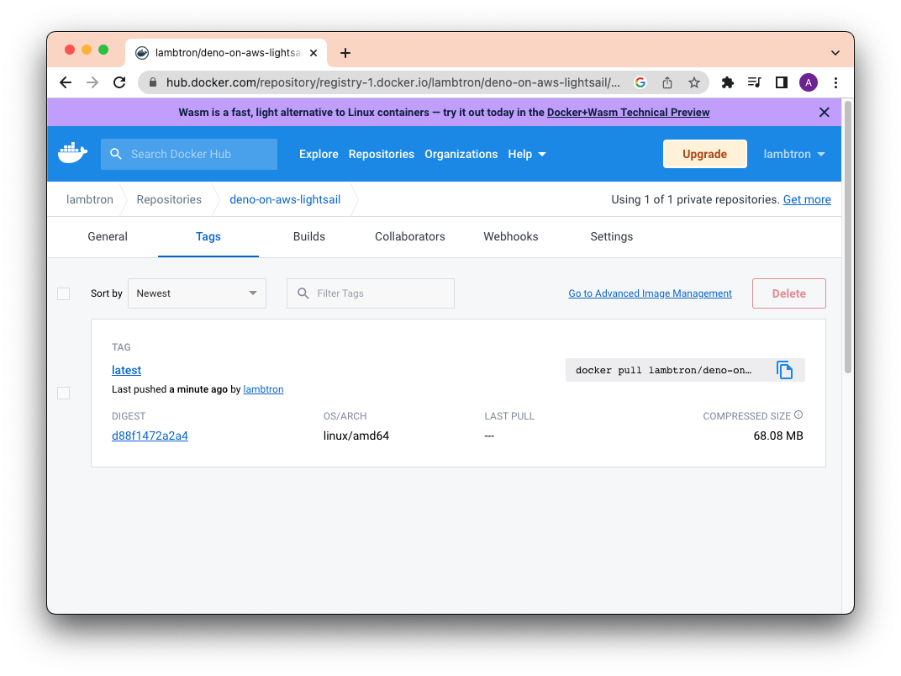

[Amazon Lightsail](https://aws.amazon.com/lightsail/) en kolay ve en ucuz Amazon Web Services ile başlamanın yoludur. Sanal makineleri ve hatta tüm konteyner hizmetlerini barındırmanıza olanak tanır.

Bu **Nasıl Yapılır** kılavuzu, Docker, Docker Hub ve GitHub Actions kullanarak Deno uygulamanızı Amazon Lightsail'e nasıl dağıtacağınızı gösterecektir.

:::tip
Devam etmeden önce, aşağıdakilerin mevcut olduğundan emin olun:
- [`docker` CLI](https://docs.docker.com/engine/reference/commandline/cli/)
- bir [Docker Hub hesabı](https://hub.docker.com)
- bir [GitHub hesabı](https://github.com)
- bir [AWS hesabı](https://aws.amazon.com/)
:::

## Dockerfile ve docker-compose.yml Oluşturma

Dağıtıma odaklanmak için, uygulamamız yalnızca bir `main.ts` dosyası olacak ve bir dizgeyi HTTP yanıtı olarak döndürecektir:

```ts
import { Application } from "https://deno.land/x/oak/mod.ts";

const app = new Application();

app.use((ctx) => {
  ctx.response.body = "Deno'dan ve AWS Lightsail'den merhaba!";
});

await app.listen({ port: 8000 });
```

Ardından, Docker görüntüsünü oluşturmak için `Dockerfile` ve `docker-compose.yml` adında iki dosya oluşturacağız.

`Dockerfile` dosyamıza şu satırları ekleyelim:

```Dockerfile
FROM denoland/deno

EXPOSE 8000

WORKDIR /app

ADD . /app

RUN deno install --entrypoint main.ts

CMD ["run", "--allow-net", "main.ts"]
```

Daha sonra, `docker-compose.yml` dosyamıza:

```yml
version: "3"

services:
  web:
    build: .
    container_name: deno-container
    image: deno-image
    ports:
      - "8000:8000"
```

Bunu yerel olarak test edelim; `docker compose -f docker-compose.yml build` komutunu çalıştırdıktan sonra, `docker compose up` komutunu çalıştırın ve `localhost:8000` adresine gidin.


Çalışıyor!

## Docker Hub'a Kaydetme, Etiketleme ve Yükleme

Öncelikle, [Docker Hub](https://hub.docker.com/repositories) hesabımıza giriş yapalım ve bir depo oluşturalım. Bunu `deno-on-aws-lightsail` olarak adlandıralım.

Ardından, `username` kısmını kendi kullanıcı adınızla değiştirerek yeni görüntümüzü etiketleyip itelim:

Öncelikle, görüntüyü yerel olarak oluşturalım. `docker-compose.yml` dosyamızın görüntüsü `deno-image` olarak adlandırılacaktır.

```shell
docker compose -f docker-compose.yml build
```

Yerel görüntüyü `{{ username }}/deno-on-aws-lightsail` ile [etiketleyelim](https://docs.docker.com/engine/reference/commandline/tag/):

```shell
docker tag deno-image {{ username }}/deno-on-aws-lightsail
```

Şimdi görüntüyü Docker Hub'a yükleyebiliriz:

```shell
docker push {{ username }}/deno-on-aws-lightsail
```

Bu başarıyla tamamlandıktan sonra, yeni görüntüyü Docker Hub deponuzda görebilirsiniz:



## Lightsail Konteyneri Oluşturma ve Dağıtma

[Amazon Lightsail konsoluna](https://lightsail.aws.amazon.com/ls/webapp/home/container-services) gidelim.

Ardından "Konteynerler" seçeneğine tıklayın ve "Konteyner hizmeti oluştur" seçeneğine tıklayın. Sayfanın ortasında "İlk Dağıtımınızı Ayarlayın" seçeneğine tıklayın ve "Özel bir dağıtım belirtin" seçeneğini seçin.

İstediğiniz konteyner adını yazabilirsiniz.

`Image` kısmında, Docker Hub'ınızda belirlediğiniz `{{ username }}/{{ image }}` değerini kullandığınızdan emin olun. Bu örnekte `lambtron/deno-on-aws-lightsail`.

Açık portları eklemek için `Açık portları ekle` kısmına tıklayın ve `8000` ekleyin.

:::info
Son olarak, `KAMU SON NOKTASI` altında yeni oluşturduğunuz konteyner adını seçin.
:::

Tam form aşağıdaki gibi görünmelidir:


Hazır olduğunuzda "Konteyner hizmeti oluştur" butonuna tıklayın.

Birkaç dakika içinde yeni konteyneriniz dağıtılmalıdır. Kamu adresine tıkladığınızda Deno uygulamanızı görmelisiniz:


## GitHub Actions ile Otomatikleştirme

Bu süreci otomatikleştirmek için `aws` CLI'yi [`lightsail` alt komutuyla](https://awscli.amazonaws.com/v2/documentation/api/latest/reference/lightsail/push-container-image.html) kullanacağız.

GitHub Actions iş akışımızdaki adımlar:

1. Repo'yu kontrol et
2. Uygulamamızı yerel olarak bir Docker görüntüsü olarak oluştur
3. AWS CLI'yi yükle ve kimlik doğrulamasını yap
4. Yerel Docker görüntüsünü AWS Lightsail Konteyner Servisine CLI aracılığıyla yükle

:::warning
Bu GitHub Action iş akışının çalışması için ön koşullar:
- AWS Lightsail Konteyner Örneği oluşturulmuş olmalıdır (yukarıdaki bölüme bakın)
- IAM kullanıcısı ve ilgili izinler ayarlanmalıdır.
  ([IAM kullanıcısı için Amazon Lightsail erişim yönetimi hakkında daha fazla bilgi edinin.](https://docs.aws.amazon.com/lightsail/latest/userguide/amazon-lightsail-managing-access-for-an-iam-user.html))
- İzinleri olan kullanıcı için `AWS_ACCESS_KEY_ID` ve `AWS_SUCCESS_ACCESS_KEY` oluşturulmalıdır. (`AWS_ACCESS_KEY_ID` ve `AWS_SUCCESS_ACCESS_KEY` oluşturmak için
  [bu AWS kılavuzunu](https://lightsail.aws.amazon.com/ls/docs/en_us/articles/lightsail-how-to-set-up-access-keys-to-use-sdk-api-cli) takip edin.)
:::

Yeni bir `container.template.json` dosyası oluşturalım. Bu dosya, hizmet konteyneri dağıtımını nasıl yapacağımıza dair yapılandırmayı içerir. Bu seçenek değerlerinin, önceki bölümde manuel olarak girdiğimiz girişlerle benzerliklerine dikkat edin.

```json
{
  "containers": {
    "app": {
      "image": "",
      "environment": {
        "APP_ENV": "release"
      },
      "ports": {
        "8000": "HTTP"
      }
    }
  },
  "publicEndpoint": {
    "containerName": "app",
    "containerPort": 8000,
    "healthCheck": {
      "healthyThreshold": 2,
      "unhealthyThreshold": 2,
      "timeoutSeconds": 5,
      "intervalSeconds": 10,
      "path": "/",
      "successCodes": "200-499"
    }
  }
}
```

`.github/workflows/deploy.yml` dosyanıza aşağıdakini ekleyelim:

```yml
name: AWS Lightsail'e Oluştur ve Dağıt

on:
  push:
    branches:
      - main

env:
  AWS_REGION: us-west-2
  AWS_LIGHTSAIL_SERVICE_NAME: container-service-2
jobs:
  build_and_deploy:
    name: Oluştur ve Dağıt
    runs-on: ubuntu-latest
    steps:
      - name: Ana Dalı Kontrol Et
        uses: actions/checkout@v2

      - name: Araçları Yükle
        run: |
          sudo apt-get update
          sudo apt-get install -y jq unzip
      - name: AWS İstemcisini Yükle
        run: |
          curl "https://awscli.amazonaws.com/awscli-exe-linux-x86_64.zip" -o "awscliv2.zip"
          unzip awscliv2.zip
          sudo ./aws/install || true
          aws --version
          curl "https://s3.us-west-2.amazonaws.com/lightsailctl/latest/linux-amd64/lightsailctl" -o "lightsailctl"
          sudo mv "lightsailctl" "/usr/local/bin/lightsailctl"
          sudo chmod +x /usr/local/bin/lightsailctl
      - name: AWS kimlik bilgilerini yapılandır
        uses: aws-actions/configure-aws-credentials@v1
        with:
          aws-region: ${{ env.AWS_REGION }}
          aws-access-key-id: ${{ secrets.AWS_ACCESS_KEY_ID }}
          aws-secret-access-key: ${{ secrets.AWS_SECRET_ACCESS_KEY }}
      - name: Docker Görüntüsünü Oluştur
        run: docker build -t ${{ env.AWS_LIGHTSAIL_SERVICE_NAME }}:release .
      - name: Yükle ve Dağıt
        run: |
          service_name=${{ env.AWS_LIGHTSAIL_SERVICE_NAME }}
          aws lightsail push-container-image \
            --region ${{ env.AWS_REGION }} \
            --service-name ${service_name} \
            --label ${service_name} \
            --image ${service_name}:release
          aws lightsail get-container-images --service-name ${service_name} | jq --raw-output ".containerImages[0].image" > image.txt
          jq --arg image $(cat image.txt) '.containers.app.image = $image' container.template.json > container.json
          aws lightsail create-container-service-deployment --service-name ${service_name} --cli-input-json file://$(pwd)/container.json
```

Vay canına burada çok şey oluyor! Son iki adım en önemlileri: `Docker Görüntüsünü Oluştur` ve `Yükle ve Dağıt`.

```shell
docker build -t ${{ env.AWS_LIGHTSAIL_SERVICE_NAME }}:release .
```

Bu komut, Docker görüntümüzü `container-service-2` adıyla oluşturur ve `release` etiketi ile işaretler.

```shell
aws lightsail push-container-image ...
```

Bu komut, yerel görüntüyü Lightsail konteynerimize gönderir.

```shell
aws lightsail get-container-images --service-name ${service_name} | jq --raw-output ".containerImages[0].image" > image.txt
```

Bu komut, görüntü bilgilerini alır ve [`jq`](https://stedolan.github.io/jq/) kullanarak ayrıştırır ve görüntü adını yerel bir `image.txt` dosyasına kaydeder.

```shell
jq --arg image $(cat image.txt) '.containers.app.image = $image' container.template.json > container.json
```

Bu komut `image.txt` dosyasına kaydedilen görüntü adını kullanır ve `container.template.json` ile birlikte yeni bir seçenek dosyası olan `container.json` oluşturur. Bu seçenek dosyası, bir sonraki adımda `aws lightsail`'e son dağıtım için geçirilecektir.

```shell
aws lightsail create-container-service-deployment --service-name ${service_name} --cli-input-json file://$(pwd)/container.json
```

Son olarak, bu komut `service_name` ile yeni bir dağıtım oluşturur ve yapılandırma ayarlarını `container.json` ile beraber kullanır.

GitHub'a push yaptığınızda ve işlem başarılı olduğunda, Deno uygulamanızı AWS'de görebilirsiniz:


🦕 Artık Docker, Docker Hub ve GitHub Actions kullanarak Deno uygulamanızı Amazon Lightsail'e dağıtabilirsiniz.