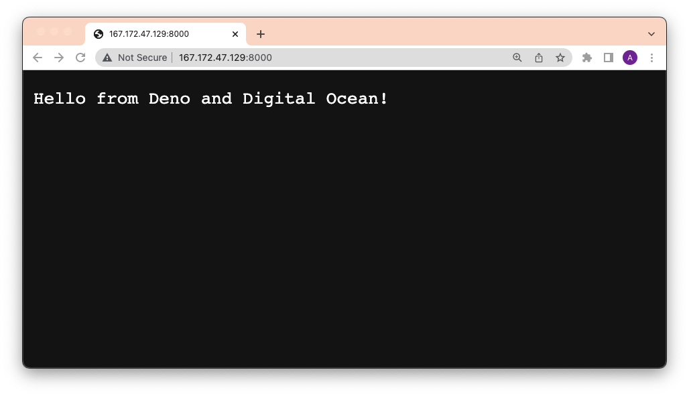

Digital Ocean, ağdan hesaplamaya, depolamaya kadar çeşitli barındırma hizmetleri sunan popüler bir bulut altyapı sağlayıcısıdır.

:::info
Docker ve GitHub Actions kullanarak bir Deno uygulamasını Digital Ocean'a dağıtmak için adım adım bir kılavuz.
:::

Bunun için ön koşullar şunlardır:

- [`docker` CLI](https://docs.docker.com/engine/reference/commandline/cli/)
- bir [GitHub hesabı](https://github.com)
- bir [Digital Ocean hesabı](https://digitalocean.com)
- [`doctl` CLI](https://docs.digitalocean.com/reference/doctl/how-to/install/)

## Dockerfile ve docker-compose.yml Oluşturma

Dağıtım odaklı kalmak için, uygulamamız yalnızca bir HTTP yanıtı olarak bir dize döndüren `main.ts` dosyası olacaktır:

```ts title="main.ts"
import { Application } from "https://deno.land/x/oak/mod.ts";

const app = new Application();

app.use((ctx) => {
  ctx.response.body = "Deno ve Digital Ocean'dan merhaba!";
});

await app.listen({ port: 8000 });
```

Sonra, Docker görüntüsünü oluşturmak için `Dockerfile` ve `docker-compose.yml` adında iki dosya oluşturacağız.

`Dockerfile` dosyamıza şunları ekleyelim:

```Dockerfile title="Dockerfile"
FROM denoland/deno

EXPOSE 8000

WORKDIR /app

ADD . /app

RUN deno install --entrypoint main.ts

CMD ["run", "--allow-net", "main.ts"]
```

Daha sonra `docker-compose.yml` dosyamıza:

```yml
version: "3"

services:
  web:
    build: .
    container_name: deno-container
    image: deno-image
    ports:
      - "8000:8000"
```

Bunu yerel olarak test edelim: `docker compose -f docker-compose.yml build` komutunu çalıştırdığımızda, ardından `docker compose up` komutunu çalıştırıp `localhost:8000` adresine gideceğiz.


Harika!

## Docker görüntünüzü Digital Ocean Container Registry'ye Oluşturma, Etiketleme ve Gönderme

Digital Ocean, Docker görüntülerini gönderebileceğimiz ve çekebileceğimiz kendi özel Container Registry'sine sahiptir. Bu kayıt defterini kullanabilmek için,
[komut satırında `doctl` yükleyip kimlik doğrulaması yapalım](https://docs.digitalocean.com/reference/doctl/how-to/install/).

:::note
Bundan sonra, `deno-on-digital-ocean` adında yeni bir özel kayıt oluşturacağız:
:::

```shell
doctl registry create deno-on-digital-ocean
```

`Dockerfile` ve `docker-compose.yml` kullanarak yeni bir görüntü oluşturacağız, etiketleyeceğiz ve kayda göndereceğiz. Unutmayın ki `docker-compose.yml` yerel olarak görüntüyü `deno-image` olarak adlandıracaktır.

```shell
docker compose -f docker-compose.yml build
```

Bunu `new` ile [etiketleyelim](https://docs.docker.com/engine/reference/commandline/tag/):

```shell
docker tag deno-image registry.digitalocean.com/deno-on-digital-ocean/deno-image:new
```

Şimdi bunu kayda gönderebiliriz.

```shell
docker push registry.digitalocean.com/deno-on-digital-ocean/deno-image:new
```

Yeni `deno-image`'inizi `new` etiketiyle birlikte [Digital Ocean container registry](https://cloud.digitalocean.com/registry) kısmında görmelisiniz:


Mükemmel!

## Digital Ocean'a SSH Üzerinden Dağıtım

`deno-image` kayıt defterinde bulunduğuna göre, `docker run` kullanarak bunu her yerde çalıştırabiliriz. Bu durumda, bunu [Digital Ocean Droplet](https://www.digitalocean.com/products/droplets) üzerinde çalıştıracağız, yani onların barındırdığı sanal makine.

:::tip
[Droplet sayfanızda](https://cloud.digitalocean.com/droplets) Droplet'inize tıklayıp `console` seçeneği ile sanal makineye SSH bağlanın. (Ya da [komut satırından doğrudan ssh ile bağlanabilirsiniz](https://docs.digitalocean.com/products/droplets/how-to/connect-with-ssh/).)
:::

`deno-image` görüntüsünü almak ve çalıştırmak için şunları çalıştıralım:

```shell
docker run -d --restart always -it -p 8000:8000 --name deno-image registry.digitalocean.com/deno-on-digital-ocean/deno-image:new
```

Tarayıcımızda Digital Ocean adresine gittiğimizde artık şunu görüyoruz:



Harika!

## Dağıtımı GitHub Actions ile Otomatikleştirme

Bu tüm süreci GitHub Actions ile otomatikleştirelim.

İlk olarak, `doctl`'ye ve Droplet'e SSH ile bağlanmak için gerekli tüm çevresel değişkenleri almamız gerekiyor:

- [DIGITALOCEAN_ACCESS_TOKEN](https://docs.digitalocean.com/reference/api/create-personal-access-token/)
- DIGITALOCEAN_HOST (Droplet'inizin IP adresi)
- DIGITALOCEAN_USERNAME (varsayılan `root`'dur)
- DIGITALOCEAN_SSHKEY (bununla ilgili aşağıda daha fazla bilgi)

### `DIGITALOCEAN_SSHKEY` Oluşturma

`DIGITALOCEAN_SSHKEY`, sanal makinedeki `~/.ssh/authorized_keys` dosyasında bulunan kamu anahtarının özel anahtarıdır.

Bunu yapmak için önce yerel makinenizde `ssh-keygen` komutunu çalıştıralım:

```shell
ssh-keygen
```

E-posta için istenildiğinde, **GitHub email adresinizi kullanmaya özen gösterin**; böylece GitHub Action doğru bir şekilde kimlik doğrulaması yapabilir. Sonuç çıktınız buna benzer olmalıdır:

```console
Output
Your identification has been saved in /your_home/.ssh/id_rsa
Your public key has been saved in /your_home/.ssh/id_rsa.pub
The key fingerprint is:
SHA256:/hk7MJ5n5aiqdfTVUZr+2Qt+qCiS7BIm5Iv0dxrc3ks user@host
The key's randomart image is:
+---[RSA 3072]----+
|                .|
|               + |
|              +  |
| .           o . |
|o       S   . o  |
| + o. .oo. ..  .o|
|o = oooooEo+ ...o|
|.. o *o+=.*+o....|
|    =+=ooB=o.... |
+----[SHA256]-----+
```

Ardından, yeni oluşturulan kamu anahtarını Droplet'inize yüklememiz gerekecek. Bunu [`ssh-copy-id`](https://www.ssh.com/academy/ssh/copy-id) kullanarak veya manuel olarak kopyalayarak yapabilirsiniz; SSH ile Droplet'inize gidip `~/.ssh/authorized_keys` dosyasına yapıştırabilirsiniz.

`ssh-copy-id` kullanarak:

```shell
ssh-copy-id {{ username }}@{{ host }}
```

Bu komut sizden parolayı isteyecektir. Bu aynı anda yerel makinenizdeki `id_rsa.pub` anahtarını alıp Droplet'inizin `~/.ssh/authorized_keys` dosyasına yapıştıracaktır. Anahtarınızı `id_rsa` dışındaki bir adla adlandırdıysanız, `-i` bayrağı ile komuta belirtebilirsiniz:

```shell
ssh-copy-id -i ~/.ssh/mykey {{ username }}@{{ host }}
```

Bunun başarılı bir şekilde yapıldığını test etmek için:

```shell
ssh -i ~/.ssh/mykey {{ username }}@{{ host }}
```

Harika!

### YML Dosyasını Tanımlama

Son adım, hepsini bir araya getirmektir. Temelde, manuel dağıtım sırasında her adımı alıp bir GitHub Actions iş akışı yml dosyasına ekliyoruz:

```yml
name: Deploy to Digital Ocean

on:
  push:
    branches:
      - main

env:
  REGISTRY: "registry.digitalocean.com/deno-on-digital-ocean"
  IMAGE_NAME: "deno-image"

jobs:
  build_and_push:
    name: Build, Push, and Deploy
    runs-on: ubuntu-latest
    steps:
      - name: Checkout main
        uses: actions/checkout@v2

      - name: Set $TAG from shortened sha
        run: echo "TAG=`echo ${GITHUB_SHA} | cut -c1-8`" >> $GITHUB_ENV

      - name: Build container image
        run: docker compose -f docker-compose.yml build

      - name: Tag container image
        run: docker tag ${{ env.IMAGE_NAME }} ${{ env.REGISTRY }}/${{ env.IMAGE_NAME }}:${{ env.TAG }}

      - name: Install `doctl`
        uses: digitalocean/action-doctl@v2
        with:
          token: ${{ secrets.DIGITALOCEAN_ACCESS_TOKEN }}

      - name: Log in to Digital Ocean Container Registry
        run: doctl registry login --expiry-seconds 600

      - name: Push image to Digital Ocean Container Registry
        run: docker push ${{ env.REGISTRY }}/${{ env.IMAGE_NAME }}:${{ env.TAG }}

      - name: Deploy via SSH
        uses: appleboy/ssh-action@master
        with:
          host: ${{ secrets.DIGITALOCEAN_HOST }}
          username: ${{ secrets.DIGITALOCEAN_USERNAME }}
          key: ${{ secrets.DIGITALOCEAN_SSHKEY }}
          script: |
            # Digital Ocean Container Registry'ye giriş yap
            docker login -u ${{ secrets.DIGITALOCEAN_ACCESS_TOKEN }} -p ${{ secrets.DIGITALOCEAN_ACCESS_TOKEN }} registry.digitalocean.com
            # Çalışan bir görüntüyü durdur ve kaldır.
            docker stop ${{ env.IMAGE_NAME }}
            docker rm ${{ env.IMAGE_NAME }}
            # Yeni bir görüntüden yeni bir konteyner çalıştır
            docker run -d --restart always -it -p 8000:8000 --name ${{ env.IMAGE_NAME }} ${{ env.REGISTRY }}/${{ env.IMAGE_NAME }}:${{ env.TAG }}
```

GitHub'a gönderdiklerinde, bu yml dosyası otomatik olarak tespit edilerek Dağıtım eylemini tetikler.