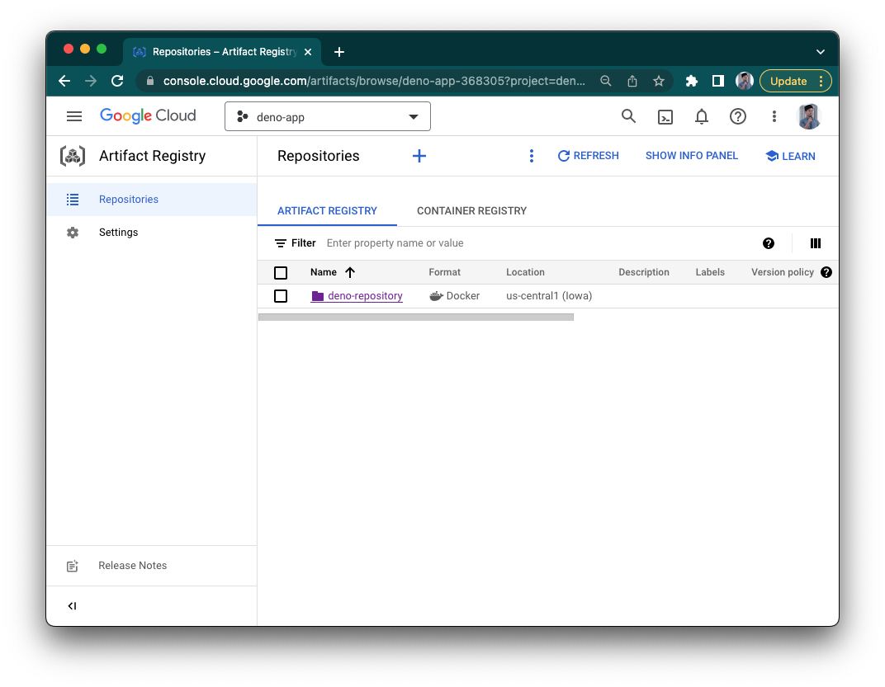

[Google Cloud Run](https://cloud.google.com/run), Google'ın ölçeklenebilir altyapısında konteyner çalıştırmanıza olanak tanıyan yönetilen bir hesaplama platformudur.

Bu nasıl yapılır kılavuzu, Docker kullanarak Deno uygulamanızı Google Cloud Run'a nasıl dağıtacağınızı gösterecektir.

Önce manuel dağıtımı göstereceğiz, ardından bunu GitHub Actions ile otomatikleştireceğiz.

### Ön koşullar

- [Google Cloud Platform hesabı](https://cloud.google.com/gcp)
- [`docker` CLI](https://docs.docker.com/engine/reference/commandline/cli/) yüklü
- [`gcloud`](https://cloud.google.com/sdk/gcloud) yüklü

## Manuel Dağıtım

### `Dockerfile` ve `docker-compose.yml` oluşturun

Dağıtıma odaklanmak için, uygulamamız sadece bir string döndüren `main.ts` dosyası olacaktır:

```ts title="main.ts"
import { Application } from "https://deno.land/x/oak/mod.ts";

const app = new Application();

app.use((ctx) => {
  ctx.response.body = "Deno'dan ve Google Cloud Run'dan merhaba!";
});

await app.listen({ port: 8000 });
```

:::note
Ardından, Docker imajını oluşturmak için iki dosya - `Dockerfile` ve `docker-compose.yml` - oluşturacağız.
:::

`Dockerfile` dosyamıza şunları ekleyelim:

```Dockerfile
FROM denoland/deno

EXPOSE 8000

WORKDIR /app

ADD . /app

RUN deno install --entrypoint main.ts

CMD ["run", "--allow-net", "main.ts"]
```

Ardından, `docker-compose.yml` dosyamıza şunları ekleyelim:

```yml
version: "3"

services:
  web:
    build: .
    container_name: deno-container
    image: deno-image
    ports:
      - "8000:8000"
```

Bunu yerel olarak test edelim: `docker compose -f docker-compose.yml build` komutunu çalıştırın, ardından `docker compose up` komutunu çalıştırın ve `localhost:8000` adresine gidin.


**Çalışıyor!**

### Artifact Registry'yi ayarlayın

Artifact Registry, GCP'nin özel Docker görüntüleri deposudur.

Kullanabilmemiz için önce GCP'nin [Artifact Registry](https://console.cloud.google.com/artifacts) sayfasına gidip "Repository oluştur" butonuna tıklayın. Sizden bir isim (`deno-repository`) ve bir bölge (`us-central1`) istenecek. Ardından "Oluştur" butonuna tıklayın.



### Artifact Registry'ye imajı oluştur, etiketle ve gönder

Bir depo oluşturduktan sonra, imajları bu depoya göndermeye başlayabiliriz.

Öncelikle, depo adresini `gcloud`'a ekleyelim:

```shell
gcloud auth configure-docker us-central1-docker.pkg.dev
```

Sonra, Docker imajınızı oluşturun. (İmaj adı, `docker-compose.yml` dosyamızda tanımlıdır.)

```shell
docker compose -f docker-compose.yml build
```

Sonra, [etiketleyin](https://docs.docker.com/engine/reference/commandline/tag/) ve yeni Google Artifact Registry adresi, depo ve isimle etiketleyin. İmaj adı şu yapıyı izlemelidir:
`{{ location }}-docker.pkg.dev/{{ google_cloudrun_project_name }}/{{ repository }}/{{ image }}`.

```shell
docker tag deno-image us-central1-docker.pkg.dev/deno-app-368305/deno-repository/deno-cloudrun-image
```

Bir etiket belirtmezseniz, varsayılan olarak `:latest` kullanılır.

Sonraki adımda, imajı gönderin:

```shell
docker push us-central1-docker.pkg.dev/deno-app-368305/deno-repository/deno-cloudrun-image
```

_[Google Artifact Registry'ye imaj göndermek ve almak hakkında daha fazla bilgi edinmek için buraya tıklayın.](https://cloud.google.com/artifact-registry/docs/docker/pushing-and-pulling)._

**İmajınız şimdi Google Artifact Registry'de görünmelidir!**


### Google Cloud Run Servisi Oluşturun

Bu imajları oluşturabileceğimiz bir örneğe ihtiyacımız var, bu yüzden [Google Cloud Run](https://console.cloud.google.com/run) sayfasına gidin ve "Servis Oluştur" butonuna tıklayın.

Buna "hello-from-deno" adını verelim.

"Mevcut bir konteyner imajından bir revizyon dağıt" seçeneğini seçin. `deno-repository` Artifact Registry'den imajı seçmek için açılır menüyü kullanın.

"Kimlik doğrulama gerektirmeyen isteklere izin ver" seçeneğini seçin ve ardından "Servis Oluştur" butonuna tıklayın. Portun `8000` olduğundan emin olun.

Tamamlandığında, uygulamanız artık çevrimiçi olmalıdır:


**Harika!**

### `gcloud` ile Dağıtım Yapın

Artık oluşturulduğuna göre, bu servise `gcloud` CLI'den dağıtım yapabileceğiz. Komut şu yapıyı izler:
`gcloud run deploy {{ service_name }} --image={{ image }} --region={{ region }} --allow-unauthenticated`.
Not: `image` adı yukarıdaki yapıyı izler.

Bu örnek için komut:

```shell
gcloud run deploy hello-from-deno --image=us-central1-docker.pkg.dev/deno-app-368305/deno-repository/deno-cloudrun-image --region=us-central1 --allow-unauthenticated
```


**Başarı!**

## GitHub Actions ile Dağıtımı Otomatikleştir

Otomasyonun çalışabilmesi için, öncelikle bu ikisinin oluşturulduğundan emin olmamız gerekiyor:

- Google Artifact Registry
- Google Cloud Run servis örneği

(Eğer bunu yapmadıysanız, lütfen önceki bölüme bakın.)

Ahora que bunu yaptıysak, bir GitHub iş akışı ile otomatikleştirebiliriz. İşte yaml dosyası:

```yml
name: Build and Deploy to Cloud Run

on:
  push:
    branches:
      - main

env:
  PROJECT_ID: { { PROJECT_ID } }
  GAR_LOCATION: { { GAR_LOCATION } }
  REPOSITORY: { { GAR_REPOSITORY } }
  SERVICE: { { SERVICE } }
  REGION: { { REGION } }

jobs:
  deploy:
    name: Deploy
    permissions:
      contents: "read"
      id-token: "write"

    runs-on: ubuntu-latest
    steps:
      - name: Checkout
        uses: actions/checkout@v3

      - name: Google Auth
        id: auth
        uses: "google-github-actions/auth@v0"
        with:
          credentials_json: "${{ secrets.GCP_CREDENTIALS }}"

      - name: Login to GAR
        uses: docker/login-action@v2.1.0
        with:
          registry: ${{ env.GAR_LOCATION }}-docker.pkg.dev
          username: _json_key
          password: ${{ secrets.GCP_CREDENTIALS }}

      - name: Build and Push Container
        run: |-
          docker build -t "${{ env.GAR_LOCATION }}-docker.pkg.dev/${{ env.PROJECT_ID }}/${{ env.REPOSITORY }}/${{ env.SERVICE }}:${{ github.sha }}" ./
          docker push "${{ env.GAR_LOCATION }}-docker.pkg.dev/${{ env.PROJECT_ID }}/${{ env.REPOSITORY }}/${{ env.SERVICE }}:${{ github.sha }}"

      - name: Deploy to Cloud Run
        id: deploy
        uses: google-github-actions/deploy-cloudrun@v0
        with:
          service: ${{ env.SERVICE }}
          region: ${{ env.REGION }}
          image: ${{ env.GAR_LOCATION }}-docker.pkg.dev/${{ env.PROJECT_ID }}/${{ env.REPOSITORY }}/${{ env.SERVICE }}:${{ github.sha }}

      - name: Show Output
        run: echo ${{ steps.deploy.outputs.url }}
```

Ayarlamamız gereken ortam değişkenleri şunlardır (parantez içindeki örnekler bu depo için):

- `PROJECT_ID`: proje kimliğiniz (`deno-app-368305`)
- `GAR_LOCATION`: Google Artifact Registry'nizin ayarlandığı konum (`us-central1`)
- `GAR_REPOSITORY`: Google Artifact Registry'ye verdiğiniz ad (`deno-repository`)
- `SERVICE`: Google Cloud Run servisinin adı (`hello-from-deno`)
- `REGION`: Google Cloud Run servisinizin bölgesi (`us-central1`)

Ayrıca ayarlamamız gereken gizli değişkenler şunlardır:

- `GCP_CREDENTIALS`: bu [hizmet hesabı](https://cloud.google.com/iam/docs/service-accounts) json anahtarıdır. Hizmet hesabını oluşturduğunuzda, Artifact Registry ve Google Cloud Run için gerekli [rol ve izinleri eklediğinizden](https://cloud.google.com/iam/docs/granting-changing-revoking-access#granting_access_to_a_user_for_a_service_account) emin olun.

[GitHub Actions'dan Cloud Run'a dağıtım hakkında daha fazla ayrıntı ve örnekler için buraya bakın.](https://github.com/google-github-actions/deploy-cloudrun)

Referans için:
https://github.com/google-github-actions/example-workflows/blob/main/workflows/deploy-cloudrun/cloudrun-docker.yml