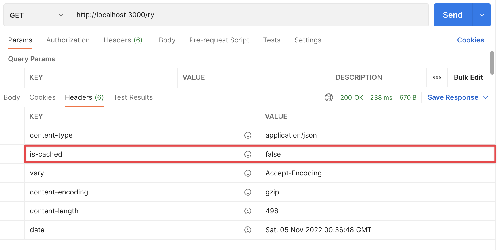
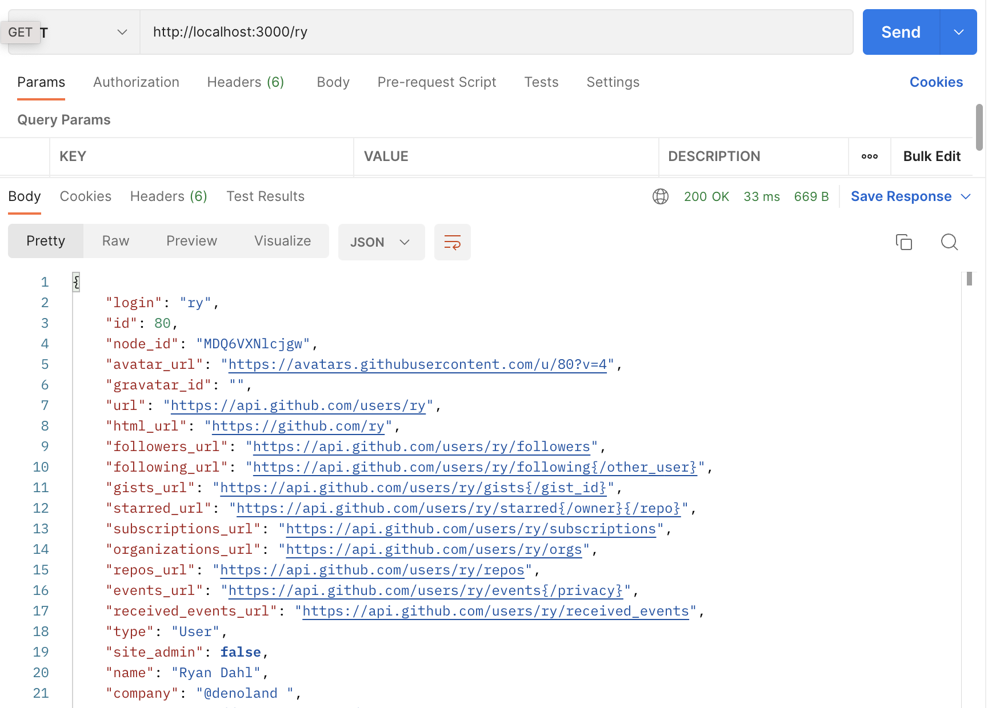
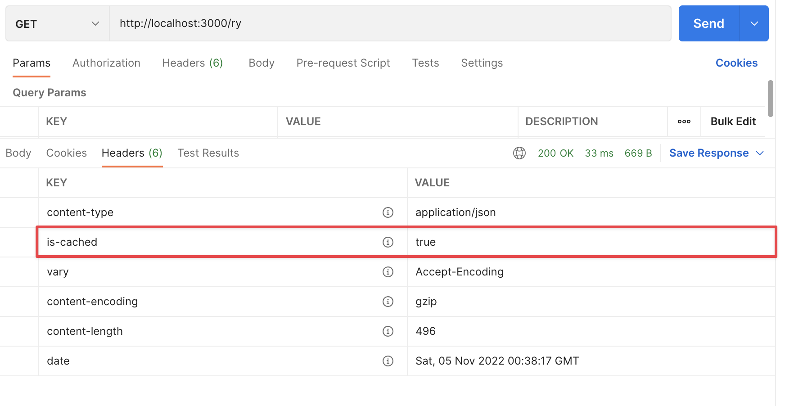

[Redis](https://redis.io/) önbellekleme, mesaj aracılığı veya veri akışı için kullanabileceğiniz bir bellek içindeki veri deposudur.

[Kaynağı buradan görüntüleyin.](https://github.com/denoland/examples/tree/main/with-redis)

Burada, verileri hızlıca almak için bir API çağrısından veri önbelleğe almak üzere Redis'i kuracağız. Şunları yapacağız:

- Her API çağrısından veri kaydetmek için bir Redis istemcisi kurmak
- Bazı verileri kolayca talep edebilmek için bir Deno sunucusu kurmak
- Sunucu işleyicisinde Github API'sini çağırarak ilk talepte verileri almak
- Her sonraki talepte verileri Redis'den sunmak

Bunu tek bir dosyada gerçekleştirebiliriz, `main.ts`.

## Redis istemcisine bağlanma

İki modüle ihtiyacımız var. İlk olarak Deno sunucusu. Kullanıcının API'mizi sorgulamak için bilgi alabilmesi için bunu kullanacağız. İkincisi Redis. Redis için node paketini `npm:` modifikatörü ile alabiliriz:

```tsx
import { createClient } from "npm:redis@^4.5";
```

`createClient` kullanarak bir Redis istemcisi oluşturuyoruz ve yerel Redis sunucumuza bağlanıyoruz:

```tsx
// yerel redis örneğine bağlantı yap
const client = createClient({
  url: "redis://localhost:6379",
});

await client.connect();
```

Ayrıca, bu [konfigürasyon](https://github.com/redis/node-redis/blob/master/docs/client-configuration.md) nesnesinde host, kullanıcı, şifre ve portu ayrı ayrı ayarlayabilirsiniz.

## Sunucuyu kurma

Sunucumuz Github API'sinin etrafında bir sarıcı olarak görev yapacak. Bir istemci, URL yol adında bir Github kullanıcı adı ile sunucumuzu çağırabilir, örneğin `http://localhost:3000/{username}`.

Yol adını ayrıştırmak ve Github API'sini çağırmak, sunucumuzda bir işleyici işlevinde gerçekleşecek. Önde gelen eğik çizgiyi çıkarıyoruz, böylece Github API'sine kullanıcı adı olarak geçirebileceğimiz bir değişken kalıyor. Daha sonra yanıtı kullanıcının geri vereceğiz.

```tsx
Deno.serve({ port: 3000 }, async (req) => {
  const { pathname } = new URL(req.url);
  // önde gelen eğik çizgiyi çıkar
  const username = pathname.substring(1);
  const resp = await fetch(`https://api.github.com/users/${username}`);
  const user = await resp.json();
  return new Response(JSON.stringify(user), {
    headers: {
      "content-type": "application/json",
    },
  });
});
```

Bunu şu şekilde çalıştıracağız:

```tsx
deno run --allow-net main.ts
```

Daha sonra [http://localhost:3000/ry](http://localhost:3000/ry) adresine Postman ile gittiğimizde, Github yanıtını alacağız:


:::tip
Bu yanıtı Redis kullanarak önbelleğe alalım.
:::

## Önbelleği kontrol etme

Github API'sinden yanıt aldığımızda, bunu `client.set` kullanarak Redis içinde önbelleğe alabiliriz, kullanıcı adımız anahtar ve kullanıcı nesnesi değer olarak:

```tsx
await client.set(username, JSON.stringify(user));
```

Aynı kullanıcı adını tekrar talep ettiğimizde, önbelleğe alınmış kullanıcıyı almak için `client.get` kullanabiliriz:

```tsx
const cached_user = await client.get(username);
```

Anahtar mevcut değilse bu null döndürür. Böylece bunu bazı akış kontrolünde kullanabiliriz. Kullanıcı adını aldığımızda, önce önbellekte o kullanıcıyı zaten bulup bulmadığımızı kontrol edeceğiz. Eğer bulursak, önbelleğe alınmış sonucu sunacağız. Aksi takdirde, kullanıcıyı almak için Github API'sini çağıracağız, önbelleğe alacağız ve API sonucunu sunacağız. Her iki durumda da hangi sürümü sunduğumuzu göstermek için özel bir başlık ekleyeceğiz:

```tsx
const server = new Server({
  handler: async (req) => {
    const { pathname } = new URL(req.url);
    // önde gelen eğik çizgiyi çıkar
    const username = pathname.substring(1);
    const cached_user = await client.get(username);
    if (cached_user) {
      return new Response(cached_user, {
        headers: {
          "content-type": "application/json",
          "is-cached": "true",
        },
      });
    } else {
      const resp = await fetch(`https://api.github.com/users/${username}`);
      const user = await resp.json();
      await client.set(username, JSON.stringify(user));
      return new Response(JSON.stringify(user), {
        headers: {
          "content-type": "application/json",
          "is-cached": "false",
        },
      });
    }
  },

  port: 3000,
});

server.listenAndServe();
```

Bunu ilk kez çalıştırdığımızda, yukarıda aldığımız aynı yanıtı alırız ve `is-cached` başlığının `false` olarak ayarlandığını görürüz:



Ancak aynı kullanıcı adı ile tekrar çağırdığımızda, önbelleğe alınmış sonucu alırız. Gömü aynı kalır:



Ancak başlık önbelleğe sahip olduğumuzu gösterir:



Ayrıca yanıtın ~200ms daha hızlı olduğunu görebiliriz!

:::info
Redis belgelerini [buradan](https://redis.io/docs/) ve Redis node paketini [buradan](https://github.com/redis/node-redis) kontrol edebilirsiniz.
:::