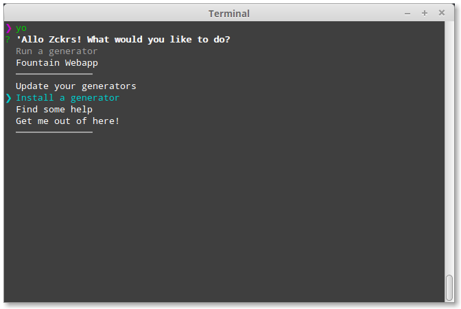

# Jeneratör Kurun

Geleneksel bir web geliştirme iş akışında, web uygulamanız için çok fazla zaman harcayarak **temel kod yapısını** kurmanız, bağımlılıkları indirmeniz ve manuel olarak web klasör yapınızı oluşturmanız gerekir. Yeoman jeneratörleri imdadınıza yetişiyor! FountainJS projeleri için bir jeneratör kuralım.


Yeoman jeneratörlerini [npm](https://www.npmjs.com/) komutunu kullanarak kurabilirsiniz ve şu anda `3500'den fazla jeneratör` mevcuttur, bunların birçoğu açık kaynak topluluğu tarafından yazılmıştır.

Bu komutu kullanarak [generator-fountain-webapp](https://www.npmjs.com/package/generator-fountain-webapp) kurun:

```sh
npm install --global generator-fountain-webapp
```

Bu, jeneratör için gerekli olan Node paketlerini kurmaya başlayacaktır.


Hatalar mı?

- Eğer izin veya erişim hataları (örneğin, EPERM veya EACCESS) görürseniz, bir çözüm olarak sudo kullanmayın.
- Daha sağlam bir çözüm için [bu kılavuza](https://github.com/sindresorhus/guides/blob/master/npm-global-without-sudo.md) danışabilirsiniz.


:::tip
**Jeneratörleri Arayın**  
npm install komutunu doğrudan kullanmanın yanı sıra, Yeoman etkileşimli menüsü aracılığıyla jeneratörleri arayabilirsiniz. yo komutunu çalıştırın ve **Bir jeneratör kur** seçeneğini seçerek yayımlanan jeneratörler arasında arama yapın.


:::

