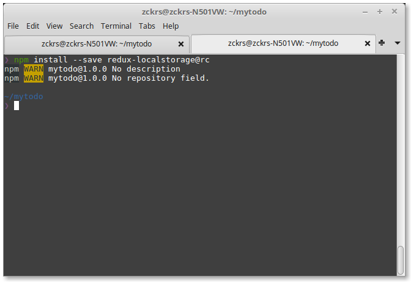
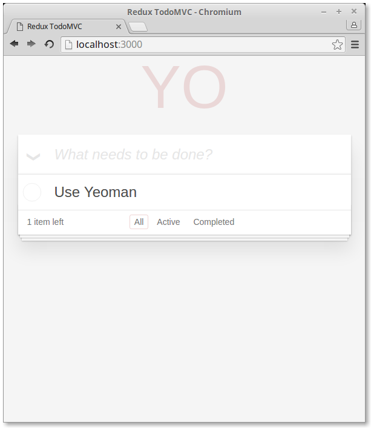
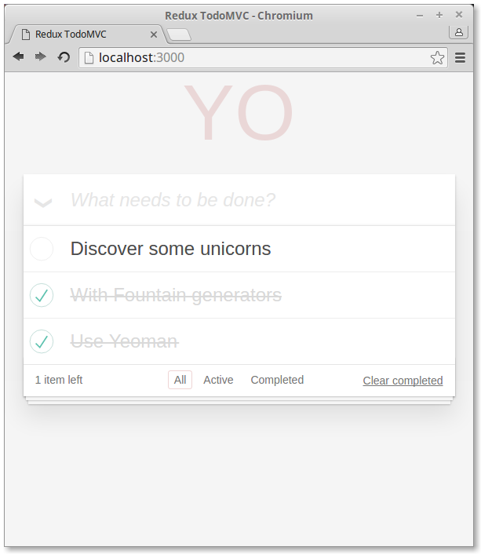
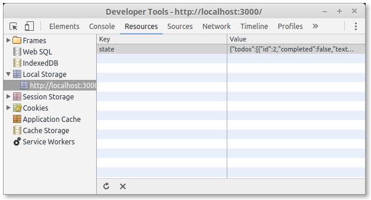

# Yerel Depolama

React/Redux *mytodo* uygulamamızla tarayıcı yenilendiğinde öğelerin kalıcı olmaması sorununu yeniden ele alalım.


  Eğer kalıcılık sizin için bir sorun değilse veya zamanınız kısıtlıysa, bu adımı atlayabilir ve doğrudan Adım 8 "Üretime hazır olun"'a geçebilirsiniz.


## npm paketini yükleyin

Bunu kolayca gerçekleştirmek için "[redux-localstorage](https://github.com/elgerlambert/redux-localstorage/tree/1.0-breaking-changes)" adlı başka bir Redux modülünü kullanabiliriz. Bu modül, [yerel depolama](http://diveintohtml5.info/storage.html) uygulamamıza hızla uygulanmasını sağlayacaktır.

Aşağıdaki komutu çalıştırın:

```sh
npm install --save redux-localstorage@rc
```



## redux-localstorage kullanın

Redux deposunun depolama kullanacak şekilde yapılandırılması gerekir. Aşağıdaki kod ile `src/app/store/configureStore.js` dosyanızın tamamını değiştirin:

```js
import {compose, createStore} from 'redux';
import rootReducer from '../reducers';

import persistState, {mergePersistedState} from 'redux-localstorage';
import adapter from 'redux-localstorage/lib/adapters/localStorage';

export default function configureStore(initialState) {
  const reducer = compose(
    mergePersistedState()
  )(rootReducer, initialState);

  const storage = adapter(window.localStorage);

  const createPersistentStore = compose(
    persistState(storage, 'state')
  )(createStore);

  const store = createPersistentStore(reducer);
  if (module.hot) {
    // Reducer'lar için Webpack sıcak modül değiştirme yeteneğini etkinleştir
    module.hot.accept('../reducers', () => {
      const nextReducer = require('../reducers').default;
      store.replaceReducer(nextReducer);
    });
  }

  return store;
}
```

Tarayıcıda uygulamanıza baktığınızda, görev listesindeki "Yeoman Kullan" öğesinin olduğunu göreceksiniz. 

> **Önemli:** Uygulama, yerel depolama boşsa görevler deposunu başlatıyor ve henüz herhangi bir görev öğesi vermediğimiz için başlangıçta sadece bir öğe var.  
> — Önemli Not



Şimdi listeye birkaç öğe ekleyin:



Tarayıcımızı yenilediğimizde öğeler artık kalıcıdır. Yaşasın!

Verilerimizin yerel depolamaya kalıcı hale gelip gelmediğini doğrulamak için Chrome Geliştirici Araçları'ndaki **Resources** panelini kontrol edip sol taraftan **Local Storage**'ı seçebiliriz:




  Birim testleri yazın

  Ek bir zorluk için, Adım 6'da birim testlerini tekrar gözden geçirin ve kod yerel depolama kullanmaya başladığından, testlerinizi nasıl güncelleyebileceğinizi düşünün.


 Genel görünüm sayfasına dön
  veya
  Sonraki adıma geçin 
