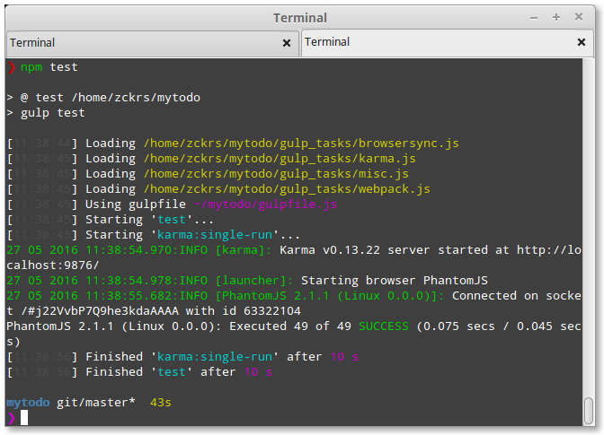

# Unit Testlerini Çalıştırma

[Karma](http://karma-runner.github.io) ile tanışmayanlar için, Karma, test framework'ünden bağımsız bir JavaScript test çalıştırıcısıdır. Fountainjs oluşturucusu, test framework'ü olarak [Jasmine](http://jasmine.github.io) dahil etmiştir. Bu codelab'de `yo fountain-webapp` komutunu çalıştırdığımızda, oluşturucu `mytodo` klasörünün kaynak klasöründe `*.spec.js` desenine sahip dosyalar oluşturmuş, `conf/karma.conf.js` dosyası yaratmış ve Karma için Node modüllerini eklemiştir. Yakında testlerimizi tanımlamak için bir Jasmine betiği düzenleyeceğiz ama önce testleri nasıl çalıştırabileceğimize bakalım.

## Birim testlerini çalıştırın

Komut satırına geri dönelim ve yerel sunucumuzu Ctrl+C tuşlarıyla kapatalım. Testleri çalıştırmak için `package.json` dosyamızda önceden yapılandırılmış bir npm script'i var. Aşağıdaki gibi çalıştırılabilir:

```sh
npm test
```

Tüm testler geçmelidir.

## Birim testlerini güncelleyin

:::info
Yapmanız gereken ilk şey oluşturulmuş birim testlerini bulmaktır. 
:::

`src` klasöründe oluşturulmuş birim testlerini bulacaksınız, bu yüzden **src/app/reducers/todos.spec.js** dosyasını açın. Bu, Todos reducer'ınız için birim testidir. Örneğin, başlangıç durumunu doğrulayan ilk teste odaklanalım. (Not: Windows'ta, [hosts dosyanıza `127.0.0.1 localhost` eklemeniz gerekebilir](https://github.com/karma-runner/karma-phantomjs-launcher/issues/84))

```js
it('should handle initial state', () => {
  expect(todos(undefined, {})).toEqual([
    {
      text: 'Use Redux',
      completed: false,
      id: 0
    }
  ]);
});
```

Ve bu testi aşağıdaki ile değiştirelim:

```js
it('should handle initial state', () => {
  expect(todos(undefined, {})).toEqual([
    {
      text: 'Use Yeoman', // <=== BURADA
      completed: false,
      id: 0
    }
  ]);
});
```

:::warning
Testinizi çalıştırmadan önce değişiklikleri kaydetmeyi unutmayın. 
:::

`npm test` ile testlerimizi yeniden çalıştırdığımızda, testlerimizin artık başarısız olduğunu görmeliyiz.


  Değişiklik yapıldığında testleri otomatik olarak çalıştırmak isterseniz npm run test:auto kullanabilirsiniz.


`src/app/reducers/todos.js` dosyasını açın.

Başlangıç durumunu şu şekilde değiştirin:

```js
const initialState = [
  {
    text: 'Use Yeoman',
    completed: false,
    id: 0
  }
];
```

Harika, testi düzelttiniz:



> Birim testleri yazmak, uygulamanız büyüdükçe ve daha fazla geliştirici ekibinize katıldıkça hataları yakalamayı kolaylaştırır. — Bu, yazılım geliştirme sürecinin önemli bir parçasıdır.

Yeoman'ın iskelet oluşturma özelliği, birim testleri yazmayı daha kolay hale getirir, bu yüzden kendi testlerinizi yazmamak için bir bahaneniz yok! ;

