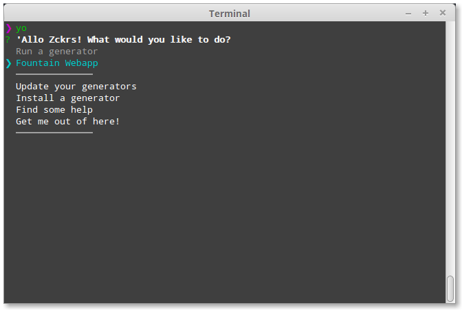
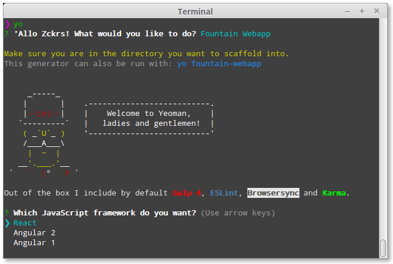
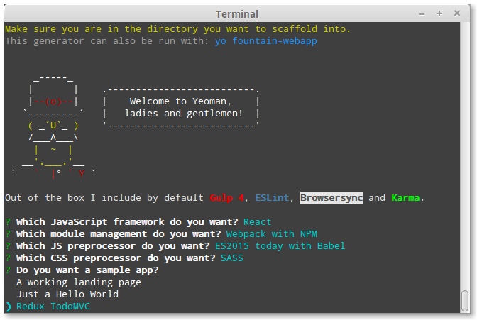
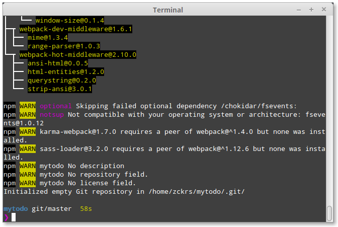

# Scaffold Uygulaması

"İskelet" kelimesini birkaç kez kullandık ama bunun ne anlama geldiğini bilmiyor olabilirsiniz. **İskelet oluşturma**, Yeoman anlamında, web uygulamanız için belirli yapılandırma taleplerinize dayalı dosyaları oluşturmaktır. Bu adımda Yeoman'ın, en sevdiğiniz kütüphane veya çerçeve için dosyaları nasıl oluşturabileceğini göreceksiniz - Webpack, Babel ve SASS gibi diğer harici kütüphaneleri kullanmak için seçeneklerle - minimum çabayla.

## Bir proje klasörü oluşturun

Tüm codelab çalışmalarınız için bir `mytodo` klasörü oluşturun:

```sh
mkdir mytodo && cd mytodo
```

Bu klasör, jeneratörün iskelet projeniz dosyalarını yerleştireceği yerdir.

## Jeneratörlere Yeoman menüsü aracılığıyla erişim

Jeneratörlerinizi görmek için `yo` komutunu tekrar çalıştırın:

```sh
yo
```

Birkaç jeneratörünüz yüklüyse, bunlar arasından etkileşimli olarak seçim yapabilirsiniz. **Fountain Webapp**'i vurgulayın. Jeneratörü çalıştırmak için **enter** tuşuna basın.




  Jeneratörleri doğrudan kullanın

  yo ile daha fazla tanıştıkça, etkileşimli menüyü kullanmadan doğrudan jeneratörleri çalıştırabilirsiniz, şöyle:

Jeneratörünüzü yapılandırın

Bazı jeneratörler, geliştirme ortamınızın başlangıç ayarını hızlandırmak için uygulamanızı özelleştirmek için bazı isteğe bağlı ayarlar sağlar.

> **Önemli:** FountainJS jeneratörü, en sevdiğiniz şunlarla kullanmak için bazı seçenekler sunar:

* çerçeve ([React](https://facebook.github.io/react/), [Angular2](https://angular.io/) veya [Angular1](https://angularjs.org/))
* modül yönetimi ([Webpack](https://webpack.github.io/), [SystemJS](https://github.com/systemjs/systemjs) veya [Bower ile hiçbiri](http://bower.io/))
* javascript ön işleyici ([Babel](https://babeljs.io/), [TypeScript](https://www.typescriptlang.org/) veya hiçbiri)
* css ön işleyici ([SASS](http://sass-lang.com/), [LESS](http://lesscss.org/) veya hiçbiri)
* üç örnek uygulama (bir açılış sayfası, merhaba dünya ve TodoMVC)

Bu codelab için **React**, **Webpack**, **Babel**, **SASS** ve **Redux TodoMVC** örneğini kullanacağız.



Kuşak anahtarlarıyla bu seçenekleri ardışık olarak seçin ve **enter** tuşuna basarak sihrin gerçekleşmesini izleyin.



Yeoman, uygulamanızı otomatik olarak iskelet oluşturacak ve bağımlılıklarınızı alacaktır. **Birkaç dakika içinde bir sonraki adıma geçmeye hazır olmalıyız.**

