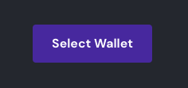
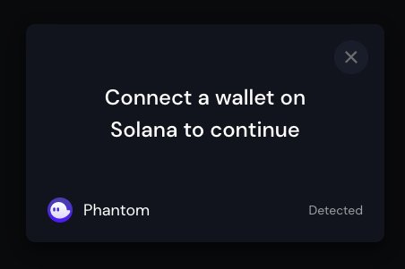
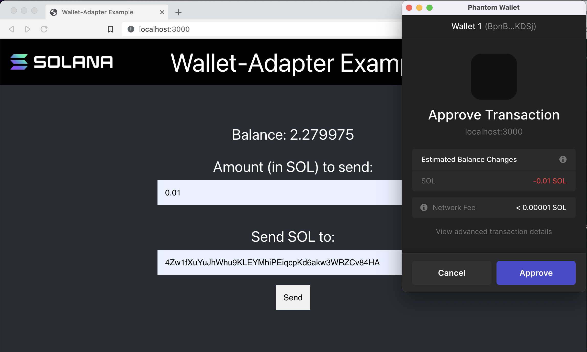

## Özeti

- **Cüzdanlar** gizli anahtarınızı saklar ve kullanıcıların işlemleri imzalamasına olanak tanır.
- **Donanım cüzdanları** gizli anahtarınızı ayrı bir cihazda saklar.
- **Yazılım cüzdanları**, güvenli depolama için bilgisayarınızı kullanır. Masaüstünde, yazılım cüzdanları genellikle bir web sitesinden cüzdanla bağlantı kurulmasına ekleme yapan **tarayıcı uzantıları** olarak gelir. Mobilde, cüzdan uygulamaları kendi tarayıcılarına sahiptir.
- Solana'nın **Wallet Adapter'ı**, kullanıcıların cüzdan adreslerini talep edebilecek ve imzalamaları için işlemler önerebilecek web siteleri oluşturmanıza olanak tanır.

---

## Ders

### Cüzdanlar

Önceki iki derste, anahtar çiftlerini tartıştık. Anahtar çiftleri hesapları bulmak ve işlemleri imzalamak için kullanılır. Bir anahtar çiftinin genel anahtarı paylaşılmak için tamamen güvenli olsa da, gizli anahtar her zaman güvenli bir yerde saklanmalıdır. Eğer bir kullanıcının gizli anahtarı açığa çıkarsa, kötü niyetli bir aktör o kullanıcının yetkisiyle işlemler gerçekleştirebilir ve içindeki tüm varlıkları transfer edebilir.

> **Not:** Bir "cüzdan," gizli anahtarı güvenli bir şekilde saklayan her şeyi ifade eder. 

Bu güvenli depolama seçenekleri genellikle "donanım" veya "yazılım" cüzdanları olarak tanımlanabilir. Donanım cüzdanları bilgisayarınızdan ayrı saklama cihazlarıdır. Yazılım cüzdanları, mevcut cihazlarınıza kurabileceğiniz uygulamalardır.

- Mobilde, yazılım cüzdanları tipik olarak iOS App Store veya Google Play üzerinden kurulan mobil uygulamalardır. Bunlar kendi web tarayıcılarına sahiptir.
- Masaüstünde, yazılım cüzdanları genellikle bir tarayıcı uzantısı olarak gelir.

Her iki teknik de web sitelerinin cüzdanla kolay etkileşimde bulunmasına olanak tanır, örneğin:

1. Cüzdanın cüzdan adresini görme (genel anahtarları).
2. Kullanıcının onayına sunulmak üzere işlemler gönderme.
3. İmzalanmış işlemleri ağa gönderme.

İşlemleri imzalamak, gizli anahtarınızı kullanmayı gerektirir. Bir sitenin cüzdanınıza bir işlem göndermesine izin vererek ve cüzdanın imzalamayı yapmasına izin vererek, gizli anahtarınızı asla web sitesine açığa çıkarmadığınızdan emin olursunuz. Bunun yerine, gizli anahtarı yalnızca cüzdan uygulamasıyla paylaşırsınız.

:::tip
Kendiniz bir cüzdan uygulaması oluşturmuyorsanız, kodunuzun asla bir kullanıcıdan gizli anahtarlarını istemesi gerekmez. Bunun yerine, kullanıcılardan itibarlı bir cüzdanla sitenize bağlantı kurmalarını isteyebilirsiniz.
:::

## Solana'nın Wallet Adapter'ı

Eğer web uygulamaları geliştiriyorsanız ve kullanıcıların cüzdanlarına bağlanmalarını ve uygulamalarınız üzerinden işlemleri imzalamalarını sağlamanız gerekiyorsa, Solana'nın Wallet Adapter'ını kullanmalısınız. Wallet Adapter, modüler paketlerin bir setidir:

- Temel işlevsellik `@solana/wallet-adapter-base` paketinde bulunur.
- React desteği `@solana/wallet-adapter-react` ile eklenir.
- Ek paketler, yaygın UI çerçeveleri için bileşenler sağlar. Bu derste ve bu kurs boyunca,
  `@solana/wallet-adapter-react-ui` paketinden bileşenler kullanacağız.

Son olarak, bazı paketler belirli cüzdan uygulamaları için adaptörlerdir. Çoğu durumda bunlar artık gerekli değildir - aşağıya bakın.

### React için Wallet-Adapter Kütüphanelerini Kurun

Mevcut bir React uygulamasına cüzdan desteği eklerken, uygun paketleri kurarak başlarsınız. `@solana/wallet-adapter-base`,
`@solana/wallet-adapter-react` paketlerine ihtiyacınız var. Sağlanan React bileşenlerini kullanmayı planlıyorsanız, ayrıca `@solana/wallet-adapter-react-ui` paketini de eklemeniz gerekecek.

> **Not:** Wallet Standard'ı destekleyen tüm cüzdanlar,
[Wallet Standard](https://github.com/wallet-standard/wallet-standard) kutudan çıktığı gibi desteklenmektedir ve tüm popüler Solana cüzdanları Wallet Standard'ı desteklemektedir. Ancak standartı desteklemeyen cüzdanlar için destek eklemek isterseniz, bu cüzdanlar için bir paket ekleyin.

```
npm install @solana/wallet-adapter-base \
    @solana/wallet-adapter-react \
    @solana/wallet-adapter-react-ui
```


Wallet Adapter Hakkında Daha Fazla Bilgi
Wallet Adapter hakkında öğrenmek amacıyla bunu manuel olarak yapıyoruz, ancak
[create-solana-dapp](https://github.com/solana-developers/create-solana-dapp) kullanarak Solana cüzdanlarını destekleyen yepyeni bir React veya NextJS uygulaması oluşturabilirsiniz.


### Cüzdanlara Bağlan

`@solana/wallet-adapter-react`, cüzdan bağlantı durumlarını sürdürebilmek ve erişebilmek için `useWallet` ve `useConnection` adlı işlevler sunar:

- `useWallet`
- `WalletProvider`
- `useConnection`
- `ConnectionProvider`

Bunların düzgün çalışabilmesi için `useWallet` ve `useConnection` kullanımlarının `WalletProvider` ve `ConnectionProvider` içinde sarılmış olması gerekir. Bunu sağlamanın en iyi yollarından biri, tüm uygulamanızı `ConnectionProvider` ve `WalletProvider` içinde sarmaktır:

```tsx
import { NextPage } from "next";
import { FC, ReactNode, useMemo } from "react";
import {
  ConnectionProvider,
  WalletProvider,
} from "@solana/wallet-adapter-react";
import { clusterApiUrl } from "@solana/web3.js";
import "@solana/wallet-adapter-react-ui/styles.css";

export const Home: NextPage = props => {
  const endpoint = clusterApiUrl("devnet");
  const wallets = useMemo(() => [], []);

  return (
    <ConnectionProvider endpoint={endpoint}>
      <WalletProvider wallets={wallets}>
        <p>Uygulamanızın geri kalanını buraya ekleyin</p>
      </WalletProvider>
    </ConnectionProvider>
  );
};
```

`ConnectionProvider` için bir `endpoint` özelliği gereklidir ve `WalletProvider` için `wallets` özelliği gereklidir. Devnet kümesi için endpoint kullanmaya devam ediyoruz ve tüm büyük Solana cüzdan uygulamaları Wallet Standard'ı desteklediğinden, cüzdan belirli adaptörlere ihtiyacımız yok. Bu noktada, `wallet.connect()` ile bağlanabilirsiniz ve bu, cüzdanın kullanıcıdan genel anahtarlarını görüntüleme izni istemesini ve işlemler için onay talep etmesini sağlar.


Bunu bir `useEffect` kancasında yapabileceğiniz halde, genellikle daha fazla ve karmaşık işlevsellik sağlamayı istersiniz. Örneğin, kullanıcıların desteklenen cüzdan uygulamaları listesinden seçim yapabilmelerini veya zaten bağlantı kurduktan sonra bağlantılarının koparılmasını isteyebilirsiniz.

### @solana/wallet-adapter-react-ui

Bunun için özel bileşenler oluşturabilirsiniz ya da `@solana/wallet-adapter-react-ui` tarafından sağlanan bileşenleri kullanabilirsiniz. Tam özelliklere sahip bir cüzdan deneyimi sağlamak için en basit yol `WalletModalProvider` ve `WalletMultiButton` kullanmaktır:

```tsx
import { NextPage } from "next";
import { FC, ReactNode, useMemo } from "react";
import {
  ConnectionProvider,
  WalletProvider,
} from "@solana/wallet-adapter-react";
import {
  WalletModalProvider,
  WalletMultiButton,
} from "@solana/wallet-adapter-react-ui";
import {
  clusterApiUrl,
  Transaction,
  PublicKey,
  SystemProgram,
} from "@solana/web3.js";
import "@solana/wallet-adapter-react-ui/styles.css";

const Home: NextPage = props => {
  const endpoint = clusterApiUrl("devnet");
  const wallets = useMemo(() => [], []);

  return (
    <ConnectionProvider endpoint={endpoint}>
      <WalletProvider wallets={wallets}>
        <WalletModalProvider>
          <WalletMultiButton />
          <p>Uygulamanızın geri kalanını buraya ekleyin</p>
        </WalletModalProvider>
      </WalletProvider>
    </ConnectionProvider>
  );
};

export default Home;
```

`WalletModalProvider`, kullanıcıların hangi cüzdanı kullanacaklarını seçmeleri için bir modal ekranı sunma işlevselliği ekler. `WalletMultiButton` ise bağlantı durumuna göre davranışını değiştirir:






Daha spesifik işlevsellik gerektiriyorsa daha ayrıntılı bileşenler de kullanabilirsiniz:

- `WalletConnectButton`
- `WalletModal`
- `WalletModalButton`
- `WalletDisconnectButton`
- `WalletIcon`

### Hesap Bilgilerine Erişim

Siteniz bir cüzdana bağlandığında, `useConnection` bir `Connection` nesnesi alır ve `useWallet` `WalletContextState`'i alır. `WalletContextState`'in `publicKey` özelliği, cüzdana bağlı olmadığında `null` değerini alır ve bir cüzdan bağlı olduğunda kullanıcının hesabının genel anahtarını tutar. 

> **Önemli:** Bir genel anahtar ve bir bağlantı ile hesap bilgilerini ve daha fazlasını alabilirsiniz.

```tsx
import { useConnection, useWallet } from "@solana/wallet-adapter-react";
import { LAMPORTS_PER_SOL } from "@solana/web3.js";
import { FC, useEffect, useState } from "react";

export const BalanceDisplay: FC = () => {
  const [balance, setBalance] = useState(0);
  const { connection } = useConnection();
  const { publicKey } = useWallet();

  useEffect(() => {
    const updateBalance = async () => {
      if (!connection || !publicKey) {
        console.error("Cüzdan bağlı değil veya bağlantı mevcut değil");
      }

      try {
        connection.onAccountChange(
          publicKey,
          updatedAccountInfo => {
            setBalance(updatedAccountInfo.lamports / LAMPORTS_PER_SOL);
          },
          "confirmed",
        );

        const accountInfo = await connection.getAccountInfo(publicKey);

        if (accountInfo) {
          setBalance(accountInfo.lamports / LAMPORTS_PER_SOL);
        } else {
          throw new Error("Hesap bilgileri bulunamadı");
        }
      } catch (error) {
        console.error("Hesap bilgileri alma hatası:", error);
      }
    };

    updateBalance();
  }, [connection, publicKey]);

  return (
    <div>
      <p>{publicKey ? `Bakiye: ${balance} SOL` : ""}</p>
    </div>
  );
};
```

`connection.onAccountChange()` çağrısına dikkat edin; bu, ağ işlemi onayladıktan sonra gösterilen hesap bakiyesini günceller.

### İşlemleri Gönderme

`WalletContextState` ayrıca onay için işlemleri göndermek üzere kullanabileceğiniz bir `sendTransaction` işlevi sağlar.

```tsx
const { publicKey, sendTransaction } = useWallet();
const { connection } = useConnection();

const sendSol = async event => {
  event.preventDefault();

  if (!publicKey) {
    console.error("Cüzdan bağlı değil");
    return;
  }

  try {
    const recipientPubKey = new PublicKey(event.currentTarget.recipient.value);

    const transaction = new Transaction();
    const sendSolInstruction = SystemProgram.transfer({
      fromPubkey: publicKey,
      toPubkey: recipientPubKey,
      lamports: 0.1 * LAMPORTS_PER_SOL,
    });

    transaction.add(sendSolInstruction);

    const signature = await sendTransaction(transaction, connection);
    console.log(`İşlem imzası: ${signature}`);
  } catch (error) {
    console.error("İşlem başarısız oldu", error);
  }
};
```

Bu işlev çağrıldığında, bağlı cüzdan kullanıcının onayına sunmak için işlemi görüntüleyecektir. Onaylanırsa, işlem gönderilecektir.


---

## Laboratuvar

Son dersten Ping programını alalım ve kullanıcıların programı pingleyen bir işlemi onaylamasını sağlayan bir frontend oluşturalım. Hatırlatmak gerekirse, programın genel anahtarı `ChT1B39WKLS8qUrkLvFDXMhEJ4F1XZzwUNHUt4AU9aVa` ve veri hesabının genel anahtarı `Ah9K7dQ8EHaZqcAsgBW8w37yN2eAy3koFmUn4x3CJtod`'tur.


### Solana cüzdanı indirin

Bir Solana cüzdan uygulamasına ihtiyacınız olacak. Çeşitli
[Solana cüzdanları](https://solana.com/docs/intro/wallets) mevcuttur. Bu durumda bir tarayıcı uzantısı cüzdanı kullanacağız, çünkü muhtemelen bir dizüstü veya masaüstü bilgisayarında kod yazıyorsunuz!

Yeni bir hesap ve yeni bir cüzdan oluşturmak için cüzdan yönergelerini takip edin.

Sonra cüzdanınızı, örneğin Devnet kullanacak şekilde ayarlayın:

- Phantom'da **Ayarlar** -> **Geliştirici Ayarları** -> **Testnet modu**'na tıklayın. 'Testnet modu', Solana'yı Devnet olarak ayarlar.
- Solflare'da **Ayarlar** -> **Genel** -> **Ağ** -> **DevNet**'e tıklayın.
- Backpack'te **Tercihler** -> **Geliştirici Modu**'na tıklayın.

Bu, cüzdan uygulamanızın bu laboratuvarda kullanacağımız aynı ağa bağlı olmasını sağlar.

### Başlangıç kodunu indirin


Bu
[bu projenin başlangıç kodunu indirin](https://github.com/Unboxed-Software/solana-ping-frontend/tree/starter). Bu proje basit bir Next.js uygulamasıdır. Çoğunlukla boş, sadece `AppBar` bileşeni vardır. Geri kalanı bu laboratuvar boyunca inşa edeceğiz.

Mevcut durumunu, konsolda `npm run dev` komutuyla görebilirsiniz.

### Uygulamayı bağlam sağlayıcıları içinde sarın

Başlamak için, kullanacağımız çeşitli Wallet-Adapter sağlayıcılarını içeren yeni bir bileşen oluşturacağız. `components` klasöründe `WalletContextProvider.tsx` adında yeni bir dosya oluşturun.

Fonksiyonel bir bileşen için bazı başlangıç şablonu ile başlayalım:

```tsx
import { FC, ReactNode } from "react";

const WalletContextProvider: FC<{ children: ReactNode }> = ({ children }) => {
  return (

  );
};

export default WalletContextProvider;
```

Kullanıcının cüzdanına düzgün bağlanmak için `ConnectionProvider`,
`WalletProvider` ve `WalletModalProvider`'a ihtiyacımız olacak. Bunları `@solana/wallet-adapter-react` ve `@solana/wallet-adapter-react-ui`'dan içe aktararak başlayın. Ardından bunları `WalletContextProvider` bileşenine ekleyin. Dikkat edin, `ConnectionProvider` `endpoint` parametresine ihtiyaç duyar ve `WalletProvider` bir `wallets` dizisine ihtiyaç duyar. Şimdilik, her ikisine de sırasıyla boş bir dize ve boş bir dizi kullanın.

```tsx
import { FC, ReactNode } from "react";
import {
  ConnectionProvider,
  WalletProvider,
} from "@solana/wallet-adapter-react";
import { WalletModalProvider } from "@solana/wallet-adapter-react-ui";

const WalletContextProvider: FC<{ children: ReactNode }> = ({ children }) => {
  return (
    <ConnectionProvider endpoint={""}>
      <WalletProvider wallets={[]}>
        <WalletModalProvider>{children}</WalletModalProvider>
      </WalletProvider>
    </ConnectionProvider>
  );
};

export default WalletContextProvider;
```

Son olarak, `ConnectionProvider` için gerçek bir endpoint ve `WalletProvider` için desteklenen cüzdanlar gereklidir.

Endpoint için, daha önce kullandığımız `@solana/web3.js` kütüphanesindeki `clusterApiUrl` işlevini kullanacağız, bu nedenle onu içe aktarmanız gerekecek. Desteklenen cüzdanlar dizisi için de `@solana/wallet-adapter-wallets` kütüphanesini içe aktarmanız gerekecek.

Bu kütüphaneleri içe aktardıktan sonra, Devnet URL'sini almak için `clusterApiUrl` işlevini kullanan bir `endpoint` sabiti oluşturun. Sonra `wallets` adında bir sabit oluşturun ve bunu boş bir dizi olarak ayarlayın - zira tüm cüzdanlar Wallet Standard'ı desteklediğinden artık özel bir cüzdan adaptörüne ihtiyacımız yok. Son olarak, `ConnectionProvider` ve `WalletProvider`'da sırasıyla boş dize ve boş diziyi değiştirin.

Bu bileşeni tamamlamak için, Wallet Adapter kütüphanesi bileşenlerinin doğru stillenmesi ve işlevselliği için, içe aktarımlarınızın altına `require('@solana/wallet-adapter-react-ui/styles.css');` ekleyin.

```tsx
import { FC, ReactNode, useMemo } from "react";
import {
  ConnectionProvider,
  WalletProvider,
} from "@solana/wallet-adapter-react";
import { WalletModalProvider } from "@solana/wallet-adapter-react-ui";
import { clusterApiUrl } from "@solana/web3.js";
import * as walletAdapterWallets from "@solana/wallet-adapter-wallets";
require("@solana/wallet-adapter-react-ui/styles.css");

const WalletContextProvider: FC<{ children: ReactNode }> = ({ children }) => {
  const endpoint = clusterApiUrl("devnet");
  const wallets = useMemo(() => [], []);

  return (
    <ConnectionProvider endpoint={endpoint}>
      <WalletProvider wallets={wallets}>
        <WalletModalProvider>{children}</WalletModalProvider>
      </WalletProvider>
    </ConnectionProvider>
  );
};

export default WalletContextProvider;
```

### Cüzdan çoklu butonunu ekle

Sonraki adım, Bağlan butonunu ayarlamak. Mevcut buton yalnızca bir yer tutucudur çünkü standart bir buton kullanmak yerine veya özel bir bileşen oluşturmak yerine, Wallet-Adapter'ın "çoklu butonunu" kullanacağız. Bu buton, `WalletContextProvider` içinde ayarladığımız sağlayıcılarla arayüz kurar ve kullanıcılara cüzdan seçme, cüzdanla bağlantı kurma ve cüzdanı koparma imkanı tanır. Daha özel bir işlevsellikye ihtiyacınız varsa, bunu yönetmek için özel bir bileşen oluşturabilirsiniz.

"Çoklu buton" eklemeden önce, uygulamayı `WalletContextProvider` içinde sarmamız gerekecek. Bunu `index.tsx`'te içe aktararak ve kapanış `` etiketinden sonra ekleyerek yapın:

```tsx
import { NextPage } from "next";
import styles from "../styles/Home.module.css";
import WalletContextProvider from "../components/WalletContextProvider";
import { AppBar } from "../components/AppBar";
import Head from "next/head";
import { PingButton } from "../components/PingButton";

const Home: NextPage = props => {
  return (
    <div className={styles.App}>
      <Head>
        <title>Cüzdan-Adapter Örneği</title>
        <meta name="description" content="Cüzdan-Adapter Örneği" />
      </Head>
      <WalletContextProvider>
        <AppBar />
        <div className={styles.AppBody}>
          <PingButton />
        </div>
      </WalletContextProvider>
    </div>
  );
};

export default Home;
```

Uygulamayı çalıştırdığınızda, her şey aynı görünmelidir çünkü sağ üstteki mevcut buton hala sadece bir yer tutucudur. Bunu düzeltmek için, `AppBar.tsx`'i açın ve `Bağlan` ifadesini `` ile değiştirin. `WalletMultiButton`'ı `@solana/wallet-adapter-react-ui`'dan içe aktarmanız gerekecek.

```tsx
import { FC } from "react";
import styles from "../styles/Home.module.css";
import Image from "next/image";
import { WalletMultiButton } from "@solana/wallet-adapter-react-ui";

export const AppBar: FC = () => {
  return (
    <div className={styles.AppHeader}>
      <Image src="/solanaLogo.png" height={30} width={200} />
      <span>Cüzdan-Adapter Örneği</span>
      <WalletMultiButton />
    </div>
  );
};
```

Bu noktada, uygulamayı çalıştırıp ekranın sağ üst köşesindeki çoklu butonla etkileşime geçebileceksiniz. Artık "Cüzdan Seç" yazısını görmelisiniz. Eğer bir cüzdan yüklüyse, bu butonu kullanarak cüzdanınızı siteye bağlayabilirsiniz.

### Programı pinglemek için buton oluştur

Artık uygulamamız cüzdanımıza bağlanabildiğine göre, “Ping!” butonunun gerçekten bir şeyler yapmasını sağlayalım.

Öncelikle `PingButton.tsx` dosyasını açarak başlayalım. `onClick` içindeki `console.log` ifadesini, bir işlem oluşturacak ve bunu son kullanıcı onayı için cüzdan uygulamasına gönderecek kod ile değiştireceğiz.

Öncelikle bir bağlantıya, cüzdanın genel anahtarına ve Wallet-Adapter'ın `sendTransaction` fonksiyonuna ihtiyacımız var. Bunu elde etmek için `@solana/wallet-adapter-react`'ten `useConnection` ve `useWallet`'ı içe aktarmamız gerekiyor. Bu arada, işlemi oluşturmak için ihtiyaç duyacağımız `@solana/web3.js`'i de içe alalım.

```tsx
import { useConnection, useWallet } from "@solana/wallet-adapter-react";
import {
  PublicKey,
  Transaction,
  TransactionInstruction,
  sendTransaction,
} from "@solana/web3.js";
import { FC, useState } from "react";
import styles from "../styles/PingButton.module.css";

export const PingButton: FC = () => {
  const onClick = () => {
    console.log("Ping!");
  };

  return (
    <div className={styles.buttonContainer} onClick={onClick}>
      <button className={styles.button}>Ping!</button>
    </div>
  );
};
```

Şimdi `useConnection` kancasını kullanarak bir `connection` sabiti ve `useWallet` kancasını kullanarak `publicKey` ile `sendTransaction` sabitlerini oluşturalım.

```tsx
import { useConnection, useWallet } from "@solana/wallet-adapter-react";
import {
  PublicKey,
  Transaction,
  TransactionInstruction,
  sendTransaction,
} from "@solana/web3.js";
import { FC, useState } from "react";

import styles from "../styles/PingButton.module.css";
export const PingButton: FC = () => {
  const { connection } = useConnection();
  const { publicKey, sendTransaction } = useWallet();

  const onClick = () => {
    console.log("Ping!");
  };

  return (
    <div className={styles.buttonContainer} onClick={onClick}>
      <button className={styles.button}>Ping!</button>
    </div>
  );
};
```

Bu aşamada, `onClick` fonksiyonunun gövdesini doldurabiliriz.

**Öncelikle**, `connection` ve `publicKey`'nin bulunduğundan emin olun (eğer herhangi biri yoksa, kullanıcının cüzdanı henüz bağlı değildir).

**Sonra**, program ID'si için `ChT1B39WKLS8qUrkLvFDXMhEJ4F1XZzwUNHUt4AU9aVa` ve veri hesabı için `Ah9K7dQ8EHaZqcAsgBW8w37yN2eAy3koFmUn4x3CJtod` olan iki `PublicKey` örneği oluşturun.

Ardından, bir `Transaction` oluşturun ve veri hesabını yazılabilir bir anahtar olarak içeren yeni bir `TransactionInstruction` oluşturun.

Son olarak, bu talimatı işlemin içine ekleyin.

Ve `sendTransaction` fonksiyonunu çağırın.

```tsx
const onClick = async () => {
  if (!connection || !publicKey) {
    console.error("Cüzdan bağlı değil veya bağlantı mevcut değil");
    return; // :::warning Kullanıcının cüzdanı bağlı değil
  }

  try {
    const programId = new PublicKey(PROGRAM_ID);
    const programDataAccount = new PublicKey(DATA_ACCOUNT_PUBKEY);
    const transaction = new Transaction();

    const instruction = new TransactionInstruction({
      keys: [
        {
          pubkey: programDataAccount,
          isSigner: false,
          isWritable: true,
        },
      ],
      programId,
    });

    transaction.add(instruction);

    const signature = await sendTransaction(transaction, connection);
    console.log("İşlem İmzası:", signature);
  } catch (error) {
    console.error("İşlem başarısız oldu:", error);
  }
};
```

Ve hepsi bu kadar! Sayfayı yenilediğinizde, cüzdanınızı bağlayın ve ping butonuna tıkladığınızda, cüzdanınız size işlemi onaylamanız için bir açılır pencere sunacaktır.

### Biraz cilalayın

Kullanıcı deneyimini daha iyi hale getirmek için yapabileceğiniz birçok şey var. Örneğin, cüzdan bağlı olduğunda sadece Ping butonunu gösteren bir UI oluşturabilir ve aksi takdirde başka bir talimat gösterebilirsiniz. Kullanıcı işlem onayladığında Solana Explorer'da işlemi görüntülemek için bir bağlantı verebilirsiniz, böylece işlem detaylarına kolayca bakabilir. Ne kadar çok denerseniz, o kadar rahat edeceksiniz, bu yüzden yaratıcı olun!

Tüm bunları bağlam içinde anlamak için bu laboratuvarın [tam kaynak kodunu buradan indirin](https://github.com/Unboxed-Software/solana-ping-frontend).

---

## Meydan Okuma

Şimdi bağımsız olarak bir şey inşa etme sırası sizde. Kullanıcının cüzdanına bağlanmasına ve başka bir hesaba SOL göndermesine izin veren bir uygulama oluşturun.



1. Bunu sıfırdan oluşturabilirsiniz veya
   [başlangıç kodunu indirebilirsiniz](https://github.com/Unboxed-Software/solana-send-sol-frontend/tree/starter).
2. Başlangıç uygulamasını uygun bağlam sağlayıcılarına sarın.
3. Form bileşeninde işlemi ayarlayın ve kullanıcının cüzdanına onay için gönderin.
4. Kullanıcı deneyimi ile yaratıcı olun. Kullanıcının işlemi Solana Explorer'da görüntülemesine izin veren bir bağlantı ekleyin veya hoşunuza giden başka bir şey yapın!

**Gerçekten zorlandığınızda, lütfen** [çözüm koduna bakın](https://github.com/Unboxed-Software/solana-send-sol-frontend/tree/main).

:::tip
Laboratuvarı tamamladınız mı? Kodunuzu GitHub'a itelemeniz ve [bize bu dersle ilgili düşüncelerinizi söylemeniz](https://form.typeform.com/to/IPH0UGz7#answers-lesson=69c5aac6-8a9f-4e23-a7f5-28ae2845dfe1)!
:::