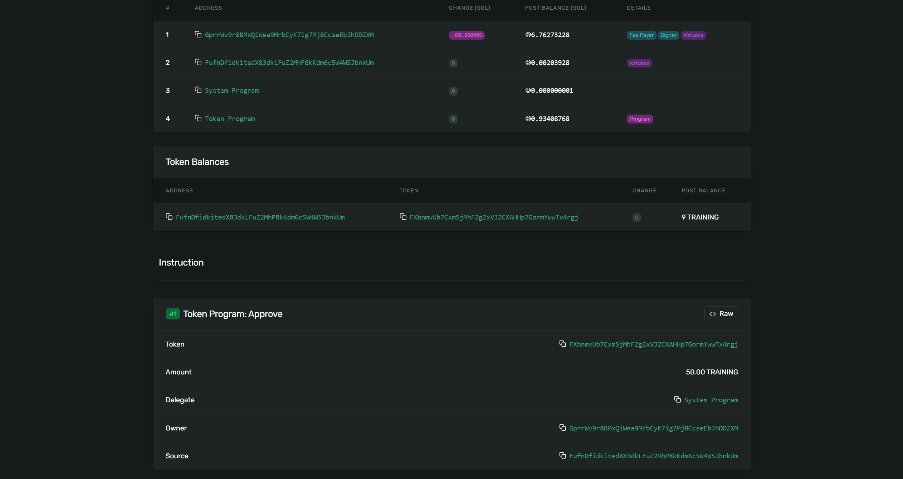
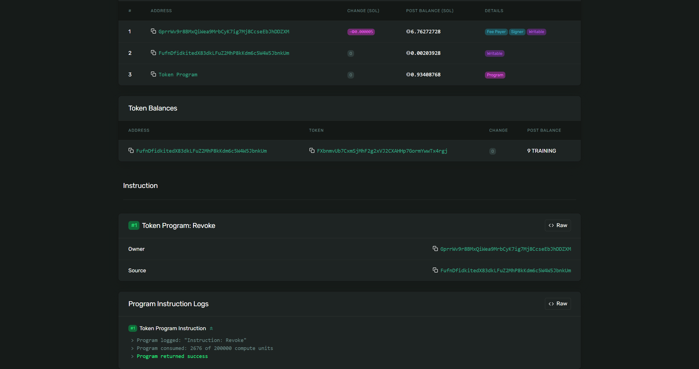
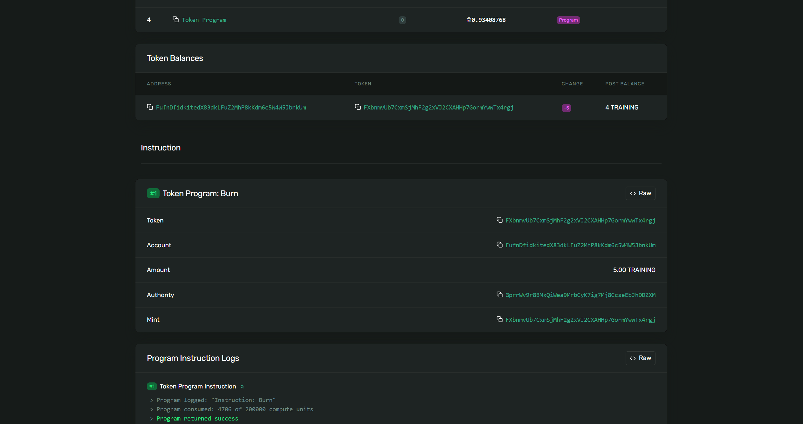

### Özet

- **Token'ları yakmak**, bir token'ın toplam arzını dolaşımdan çıkararak azaltır.
- **Bir delegayı onaylamak**, başka bir hesaba, belirli bir miktar token'ı token hesabından transfer etmesine veya yakmasına izin verirken, orijinal hesap mülkiyetini korur.
- **Bir delegayı iptal etmek**, token hesap sahibi adına hareket etme yetkisini kaldırır.
- Bu işlemlerin her biri, her işlemi gerçekleştirmek için belirli işlevleri kullanan `spl-token` kütüphanesi aracılığıyla gerçekleştirilir.

---

### Ders

Bu derste, token yakımı ve yetkilendirmeyi ele alacağız. Kendi uygulamanızda bunlara ihtiyaç duymayabilirsiniz, bu yüzden daha çok NFT'lerle ilgileniyorsanız, `Metaplex ile NFT oluşturma` geçmekte özgürsünüz!

#### Token Yakmak

Token'ları yakmak, belirli bir token mint'inin token arzını azaltma sürecidir. Token'ları yakmak, belirli bir token hesabından ve genel dolaşımdan token'ları çıkarır.

:::info
**Not:** Token'ları `spl-token` kütüphanesini kullanarak yakmak için [`burn()`](https://solana-labs.github.io/solana-program-library/token/js/functions/burn.html#burn) işlevini kullanmalısınız.
:::

```typescript
import { burn } from "@solana/spl-token";
```

```typescript
const transactionSignature = await burn(
  connection,
  payer,
  account,
  mint,
  owner,
  amount,
);
```

`burn()` işlevi aşağıdaki argümanları gerektirir:

- `connection`: Küme için JSON-RPC bağlantısı.
- `payer`: İşlem ücretlerini ödemekten sorumlu hesap.
- `account`: Token'ların yakılacağı token hesabı.
- `mint`: Token hesabıyla ilişkili token mint'i.
- `owner`: Token hesabının sahibi.
- `amount`: Yakılacak token sayısı.

:::tip
Temel düzeyde, `burn()` işlevi, [`createBurnInstruction()`](https://solana-labs.github.io/solana-program-library/token/js/functions/createBurnInstruction.html#createBurnInstruction) işlevinden alınan talimatı kullanarak bir işlem oluşturur.
:::

```typescript
import { PublicKey, Transaction } from "@solana/web3.js";
import { createBurnInstruction } from "@solana/spl-token";

async function buildBurnTransaction(
  account: PublicKey,
  mint: PublicKey,
  owner: PublicKey,
  amount: number,
): Promise<Transaction> {
  const transaction = new Transaction().add(
    createBurnInstruction(account, mint, owner, amount),
  );

  return transaction;
}
```

#### Delegayı Onaylama

Delegayı onaylamak, başka bir hesaba token hesabından token transfer etmesine veya yakmasına yetki verme sürecidir. Token hesabı üzerindeki yetki orijinal sahibinde kalır. Bir delegenin transfer edebileceği veya yakabileceği maksimum token sayısı, sahibin delegayı onayladığında tanımlanır. Aynı anda bir token hesabına yalnızca bir delegat atanabilir.

:::warning
Delegayı onaylamak için `spl-token` kütüphanesini kullanarak [`approve()`](https://solana-labs.github.io/solana-program-library/token/js/functions/approve.html#approve) işlevini kullanın.
:::

```typescript
const transactionSignature = await approve(
  connection,
  payer,
  account,
  delegate,
  owner,
  amount,
);
```

`approve()` işlevi, Solana Explorer'da görüntülenebilecek bir `TransactionSignature` döndürür. Aşağıdaki argümanlara ihtiyaç duyar:

- `connection`: Küme için JSON-RPC bağlantısı.
- `payer`: İşlem için ödeme yapan hesabın hesabı.
- `account`: Token'ların devredileceği token hesabı.
- `delegate`: Token transferine veya yakmaya yetkili hesap.
- `owner`: Token hesabının sahibinin hesabı.
- `amount`: Deleganın transfer edebileceği veya yakabileceği maksimum token sayısı.

:::note
Alt düzeyde, `approve()` işlevi, [`createApproveInstruction()`](https://solana-labs.github.io/solana-program-library/token/js/functions/createApproveInstruction.html#createApproveInstruction) işlevinden alınan talimatlarla bir işlem oluşturur.
:::

```typescript
import { PublicKey, Transaction } from "@solana/web3.js";
import { createApproveInstruction } from "@solana/spl-token";

async function buildApproveTransaction(
  account: PublicKey,
  delegate: PublicKey,
  owner: PublicKey,
  amount: number,
): Promise<web3.Transaction> {
  const transaction = new Transaction().add(
    createApproveInstruction(account, delegate, owner, amount),
  );

  return transaction;
}
```

#### Delegayı İptal Etme

Önceden onaylanmış bir deleganın bir token hesabı için yetkisi iptal edilebilir. İptal edildikten sonra, delege, sahibin token hesabından token transfer edemez. Daha önce onaylanmış tokenlardan transfer edilmeyen herhangi bir miktar, artık delege tarafından erişilemez.

:::tip
Delegayı iptal etmek için `spl-token` kütüphanesini kullanarak [`revoke()`](https://solana-labs.github.io/solana-program-library/token/js/functions/revoke.html#revoke) işlevini kullanın.
:::

```typescript
import { revoke } from "@solana/spl-token";

const transactionSignature = await revoke(connection, payer, account, owner);
```

`revoke()` işlevi, Solana Explorer'da görüntülenebilecek bir `TransactionSignature` döndürür. Bu işlev aşağıdaki argümanlara ihtiyaç duyar:

- `connection`: Küme için JSON-RPC bağlantısı.
- `payer`: İşlem ücretlerini ödemekten sorumlu hesap.
- `account`: Delegasyon yetkisini iptal edecek token hesabı.
- `owner`: Token hesabının sahibinin hesabı.

:::note
Alt düzeyde, `revoke()` işlevi, [`createRevokeInstruction()`](https://solana-labs.github.io/solana-program-library/token/js/functions/createRevokeInstruction.html#createRevokeInstruction) işlevinden alınan talimatları kullanarak bir işlem oluşturur.
:::

```typescript
import { PublicKey, Transaction } from "@solana/web3.js";
import { createRevokeInstruction } from "@solana/spl-token";

async function buildRevokeTransaction(
  account: PublicKey,
  owner: PublicKey,
): Promise<web3.Transaction> {
  const transaction = new Transaction().add(
    createRevokeInstruction(account, owner),
  );

  return transaction;
}
```

### Lab

Bu laboratuvar, önceki derste kapsanan `Token Programı` konseptlerini genişletir.

#### 1. Token Delegasyonu

`approve()` işlevini `spl-token` kütüphanesinden kullanarak, bir delegeye token hesabımızdan 50 token'a kadar transfer etme veya yakma yetkisi vereceğiz.

Önceki laboratuvarda `Token Aktarımı` sürecine benzer olarak, isterseniz `Devnet'te ikinci bir hesap ekleyebilirsiniz` veya Devnet hesabına sahip bir arkadaşınızla iş birliği yapabilirsiniz.

:::details
**Yeni Dosya Oluşturma:**
`delegate-tokens.ts` adında yeni bir dosya oluşturun. Bu örnek için gösterim amaçlı olarak System Program ID'sini delege olarak kullanıyoruz, ancak gerçek bir adres de kullanabilirsiniz.
:::

```typescript filename="delegate-tokens.ts"
import "dotenv/config";
import {
  getExplorerLink,
  getKeypairFromEnvironment,
} from "@solana-developers/helpers";
import {
  Connection,
  PublicKey,
  clusterApiUrl,
  SystemProgram,
} from "@solana/web3.js";
import { approve, getOrCreateAssociatedTokenAccount } from "@solana/spl-token";

const DEVNET_URL = clusterApiUrl("devnet");
const TOKEN_DECIMALS = 2;
const DELEGATE_AMOUNT = 50;
const MINOR_UNITS_PER_MAJOR_UNITS = 10 ** TOKEN_DECIMALS;

// Bağlantıyı başlat ve kullanıcı anahtar çiftini yükle
const connection = new Connection(DEVNET_URL);
const user = getKeypairFromEnvironment("SECRET_KEY");

console.log(`🔑 Anahtar çift yüklendi. Genel anahtar: ${user.publicKey.toBase58()}`);

// Bunu kendi gerçek adresinizle değiştirin
// Bu örnek için, anlatım amacıyla System Program'ın ID'sini delege olarak kullanacağız
const delegatePublicKey = new PublicKey(SystemProgram.programId);

// Token mint adresinizi buraya yerleştirin
const tokenMintAddress = new PublicKey("YOUR_TOKEN_MINT_ADDRESS_HERE");

try {
  // Kullanıcının token hesabını alın veya oluşturun
  const userTokenAccount = await getOrCreateAssociatedTokenAccount(
    connection,
    user,
    tokenMintAddress,
    user.publicKey,
  );

  // Delegayı onayla
  const approveTransactionSignature = await approve(
    connection,
    user,
    userTokenAccount.address,
    delegatePublicKey,
    user.publicKey,
    DELEGATE_AMOUNT * MINOR_UNITS_PER_MAJOR_UNITS,
  );

  const explorerLink = getExplorerLink(
    "transaction",
    approveTransactionSignature,
    "devnet",
  );

  console.log(`✅ Delege onaylandı. İşlem: ${explorerLink}`);
} catch (error) {
  console.error(
    `Hata: ${error instanceof Error ? error.message : String(error)}`,
  );
}
```

`YOUR_TOKEN_MINT_ADDRESS_HERE` kısmını, önceki dersten `Token Programı` aldığınız token mint adresinizle değiştirin.

Scripti `npx esrun delegate-tokens.ts` komutuyla çalıştırın. Şunları görmelisiniz:

```bash
🔑 Anahtar çift yüklendi. Genel anahtar: GprrWv9r8BMxQiWea9MrbCyK7ig7Mj8CcseEbJhDDZXM
✅ Delege onaylandı. İşlem: https://explorer.solana.com/tx/21tX6L7zk5tkHeoD7V1JYYW25VAWRfQrJPnxDcMXw94yuFbHxX4UZEgS6k6co9dBWe7PqFoMoWEVfbVA92Dk4xsQ?cluster=devnet
```

Explorer bağlantısını açtığınızda, onay bilgilerini göreceksiniz.



#### 2. Delegayı İptal Etme

`delegate`'yi `spl-token` kütüphanesinin `revoke()` işlevini kullanarak iptal edelim.

İptal, token hesabının delegesini null olarak ayarlayacak ve delegasyondaki miktarı 0 olarak sıfırlayacaktır.

:::details
**Yeni Dosya Oluşturma:**
`revoke-approve-tokens.ts` adında yeni bir dosya oluşturun.
:::

```typescript filename="revoke-approve-tokens.ts"
import "dotenv/config";
import {
  getExplorerLink,
  getKeypairFromEnvironment,
} from "@solana-developers/helpers";
import { Connection, PublicKey, clusterApiUrl } from "@solana/web3.js";
import { revoke, getOrCreateAssociatedTokenAccount } from "@solana/spl-token";

const DEVNET_URL = clusterApiUrl("devnet");
// Token mint adresinizi buraya yerleştirin
const TOKEN_MINT_ADDRESS = "YOUR_TOKEN_MINT_ADDRESS_HERE";

const connection = new Connection(DEVNET_URL);
const user = getKeypairFromEnvironment("SECRET_KEY");

console.log(`🔑 Anahtar çift yüklendi. Genel anahtar: ${user.publicKey.toBase58()}`);

try {
  const tokenMintAddress = new PublicKey(TOKEN_MINT_ADDRESS);

  const userTokenAccount = await getOrCreateAssociatedTokenAccount(
    connection,
    user,
    tokenMintAddress,
    user.publicKey,
  );

  const revokeTransactionSignature = await revoke(
    connection,
    user,
    userTokenAccount.address,
    user.publicKey,
  );

  const explorerLink = getExplorerLink(
    "transaction",
    revokeTransactionSignature,
    "devnet",
  );

  console.log(`✅ Delegayı İptal Etme İşlemi: ${explorerLink}`);
} catch (error) {
  console.error(
    `Hata: ${error instanceof Error ? error.message : String(error)}`,
  );
}
```

`YOUR_TOKEN_MINT_ADDRESS_HERE` kısmını, önceki dersten `Token Programı` aldığınız mint token adresinizle değiştirin.

Scripti `npx esrun revoke-approve-tokens.ts` komutuyla çalıştırın. Şunları görmelisiniz:

```bash
🔑 Anahtar çift yüklendi. Genel anahtar: GprrWv9r8BMxQiWea9MrbCyK7ig7Mj8CcseEbJhDDZXM
✅ Delegayı İptal Etme İşlemi: https://explorer.solana.com/tx/YTc2Vd41SiGiHf3iEPkBH3y164fMbV2TSH2hbe7WypT6K6Q2b3f31ryFWhypmBK2tXmvGYjXeYbuwxHeJvnZZX8?cluster=devnet
```

Explorer bağlantısını açtığınızda, iptal bilgilerini göreceksiniz.



#### 3. Token Yakma

Son olarak, bazı token'ları yakarak dolaşımdan çıkaralım.

`spl-token` kütüphanesinin `burn()` işlevini kullanarak token'larınızı dolaşımdan çıkarmak için yarısını yakın. Şimdi, bu işlevi çağırarak kullanıcının token'larından 5'ini yakın.

:::details
**Yeni Dosya Oluşturma:**
`burn-tokens.ts` adında yeni bir dosya oluşturun.
:::

```typescript filename="burn-tokens.ts"
import "dotenv/config";
import {
  getExplorerLink,
  getKeypairFromEnvironment,
} from "@solana-developers/helpers";
import { Connection, PublicKey, clusterApiUrl } from "@solana/web3.js";
import { getOrCreateAssociatedTokenAccount, burn } from "@solana/spl-token";

const DEVNET_URL = clusterApiUrl("devnet");
const TOKEN_DECIMALS = 2;
const BURN_AMOUNT = 5;
// Token mint adresinizi buraya yerleştirin
const TOKEN_MINT_ADDRESS = "YOUR_TOKEN_MINT_ADDRESS_HERE";

const connection = new Connection(DEVNET_URL);
const user = getKeypairFromEnvironment("SECRET_KEY");

console.log(`🔑 Anahtar çift yüklendi. Genel anahtar: ${user.publicKey.toBase58()}`);

try {
  const tokenMintAccount = new PublicKey(TOKEN_MINT_ADDRESS);

  const userTokenAccount = await getOrCreateAssociatedTokenAccount(
    connection,
    user,
    tokenMintAccount,
    user.publicKey,
  );

  const burnAmount = BURN_AMOUNT * 10 ** TOKEN_DECIMALS;

  const transactionSignature = await burn(
    connection,
    user,
    userTokenAccount.address,
    tokenMintAccount,
    user,
    burnAmount,
  );

  const explorerLink = getExplorerLink(
    "transaction",
    transactionSignature,
    "devnet",
  );

  console.log(`✅ Yakma İşlemi: ${explorerLink}`);
} catch (error) {
  console.error(
    `Hata: ${error instanceof Error ? error.message : String(error)}`,
  );
}
```

`YOUR_TOKEN_MINT_ADDRESS_HERE` kısmını, önceki bölümden `Token Programı` aldığınız mint token adresinizle değiştirin.

Scripti `npx esrun burn-tokens.ts` komutuyla çalıştırın. Şunları görmelisiniz:

```bash
🔑 Anahtar çift yüklendi. Genel anahtar: GprrWv9r8BMxQiWea9MrbCyK7ig7Mj8CcseEbJhDDZXM
✅ Yakma İşlemi: https://explorer.solana.com/tx/5Ufipgvsi5aLzzcr8QQ7mLXHyCwBDqsPxGTPinvFpjSiARnEDgFiPbD2ZiaDkkmwKDMoQ94bf5uqF2M7wjFWcKuv?cluster=devnet
```

Explorer bağlantısını açtığınızda, yakma bilgilerini göreceksiniz.



---

Aferin! Artık laboratuvarı tamamladınız.

:::success
**Laboratuvarı tamamladınız mı?**
Kodunuzu GitHub'a gönderin ve [bu dersi nasıl bulduğunuzu bize söyleyin](https://form.typeform.com/to/IPH0UGz7#answers-lesson=72cab3b8-984b-4b09-a341-86800167cfc7)!
:::