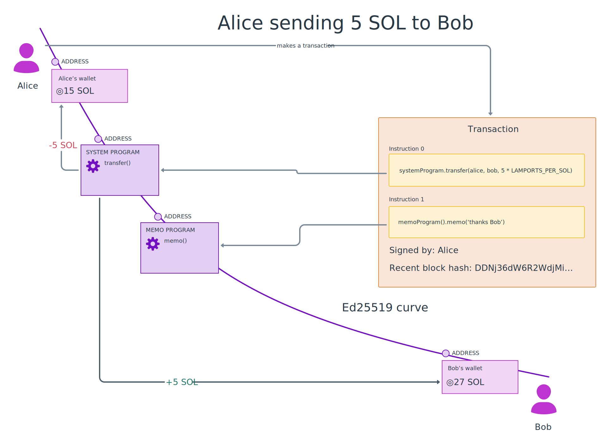

## Özet

- **Onchain programları** (bazen 'akıllı sözleşmeler' olarak adlandırılır) Solana üzerinde doğrudan çalışır, tıpkı bilgisayarınızdaki programlar gibi. 
- Bu programlar, işlemlerden gelen talimatları işleyen **talimat yöneticileri** - işlevler içerir. 
- Programlar, Solana **hesapları** ile okumak ve yazmak suretiyle blockchain ile etkileşimde bulunur. 
- Solana programları genellikle **Rust** dilinde yazılır ve daha basit geliştirme için sıklıkla **Anchor** çerçevesi kullanılır. 

:::tip
Anchor, aşağıdaki işlevleri olan **Arayüz Tanım Dili (IDL)** dosyaları oluşturur:
- Programın yapısını ve işlevselliğini açıklar
- JavaScript/TypeScript istemci kütüphanelerinin otomatik oluşturulmasını sağlar
:::

- Solana'nın mimarisi, çakışmayan işlemlerin paralel olarak yürütülmesine olanak tanır, bu da hız ve verimliliğini artırır.
- Kiralama, Solana’da hesapların blockchain üzerinde hayatta kalmak için minimum bir bakiyeyi koruması gereken bir kavramdır.

---

## Genel Bakış

Solana, her biri birleşik ve küresel olarak senkronize bir sistem olarak işlev gören çeşitli kümeler üzerinde çalışmaktadır:

- **mainnet-beta**: Ana üretim ağı
- **testnet**: Yeni özellikleri test etmek için
- **devnet**: Uygulama geliştirme için
- **localnet**: Yerel testler için

Solana üzerinde çalışan programlar - token oluşturan, token takas eden, sanat pazarları, escrow, piyasa yapıcıları, DePIN uygulamaları, açık artırmalar, perakende ödeme platformları vb. - **Solana uygulamaları** olarak adlandırılır.

Onchain uygulamalar oluşturmanın en popüler yolu, **Rust** dili ve **Anchor** çerçevesini kullanmaktır. Bununla birlikte, **yerel onchain program geliştirme** kullanarak Solana programları geliştirmenin başka bir yolu da vardır; ancak **Anchor** işleri çok daha basit ve güvenli hale getirir. 

:::info
Anchor kullanmanın bazı avantajları şunlardır:
- Güvenlik kontrolleri otomatik olarak uygulanır
- Gelen talimatların doğru talimat yöneticisine otomatik yönlendirilmesi
- İşlemlerdeki verilerin otomatik seri hale getirilmesi ve seriden çıkarılması
- Hesap doğrulaması, dahil olmak üzere:
  - Tür kontrolü
  - Hesap benzersizliğini sağlama
:::

Hangi dil ve çerçeve seçerseniz seçin, Solana aynı şekilde çalışır. Şimdi Solana'da programların nasıl çalıştığını hatırlayalım.



### Programlar adreslerde dağıtılır

Kullanıcılara token göndermenin yanı sıra, programların ortak anahtarı kullanarak bulunabilmesi için programın ortak anahtarı ile program bulabiliriz. Anchor kullanıldığında, `anchor init` sırasında bir anahtar çifti oluşturulur ve özel anahtar projenizin `target/deploy` dizininde saklanır.

> Bir programın ortak anahtarı bazen 'program kimliği' veya 'program adresi' olarak adlandırılır. Bu, `programs//src/lib.rs` ve `Anchor.toml` dosyalarında görülebilir. 
> — Solana Dokümantasyonu

### Programların talimat yöneticileri vardır

Örneğin, 'teşekkürler' diyen bir notla bazı USDC transfer eden bir Solana istemcisi iki talimat içerir:

- Token programının `transfer` talimat yöneticisi için bir talimat
- Memo programının `memo` talimat yöneticisi için diğer talimat.

Bu iki talimatın da işlemin yürütülmesi için başarıyla tamamlanması gerekmektedir. 

Talimat yöneticileri, blockchain programlarının istemcilerden gelen talimatları nasıl işlediğini gösterir. Her borsa, borç verme protokolü, escrow, oracle vb. işlevselliğini talimat yöneticileri aracılığıyla sunar.

### Talimat yöneticileri durumlarını Solana hesaplarına yazar

Daha önce web geliştirme yaptıysanız, talimat yöneticilerini HTTP yönlendirme yöneticileri gibi düşünün ve gelen talimatları HTTP istekleri olarak düşünün.

Ancak, HTTP yönlendirme yöneticilerinin aksine, Solana talimat yöneticileri veri döndürmez. Bunun yerine, verilerini Solana üzerindeki hesaplara yazarlar.

- Solana üzerindeki programlar, kullanıcı cüzdan adreslerine (SOL için) veya kullanıcı token hesaplarına (diğer tokenlar için) token transferi yapabilir.
- Daha önemlisi, programlar ihtiyaç duydukça veri depolamak için ek adresler oluşturabilir.

Bu, Solana programlarının durumlarını nasıl depoladıklarını gösterir.

### Program Türetilmiş Adresleri (PDA): Solana'nın Anahtar-Değer Deposu

Solana programları için veriler **program türetilmiş adreslerde (PDA)** saklanır. Solana'nın PDALarı bir **anahtar/değer deposu** olarak düşünülebilir. Bir PDA, programın gerektirdiği herhangi bir türde veriyi saklayacak şekilde tasarlanabilir.

#### Temel Kavramlar

1. **Yapı**
   - **Anahtar**: PDA'nın adresi
   - **Değer**: O adresteki hesapta saklanan veriler

2. **Adres Üretimi**
   - **Tohum**: programcı tarafından seçilir
   - **Bump**: Eşsiz PDA oluşturmayı sağlamak için ek bir değer
   - **Belirleyici**: Aynı tohum ve bump kombinasyonu her zaman aynı adresi üretir. Bu, programın ve istemcinin verilerin adresini doğru bir şekilde belirlemesine yardımcı olur.

3. **Veri Saklama**
   - Programcılar, PDAlarda saklanan verilerin yapısını tanımlar
   - Herhangi bir türde program spesifik bilgiyi saklayabilir

4. **Bazı özellikler**:
   - PDAlar Ed25519 eliptik eğrisi dışındadır. web3.js tarafından kullanılan veri türü `PublicKey` olsa da, PDA adresleri birer ortak anahtar değildir ve eşleşen bir özel anahtara sahip değildir.
   - Bir programın PDAları benzersizdir; bu nedenle, diğer programlarla çakışmaz.
   - PDAlar ayrıca bir talimatta imzalayıcı olarak da hareket edebilir. Bunu daha sonraki derslerde daha fazla öğreneceğiz.

:::details
#### PDA Kullanımına Dair Örnekler

| Amaç               | Tohumlar                    | Ortaya Çıkan PDA              |
| -------------------| --------------------------- | ------------------------------ |
| Döviz Kuru         | `"USD"`, `"AUD"`           | USD'den AUD'ye oranı depolar  |
| Kullanıcı İlişkisi | Kullanıcı1 cüzdanı, Kullanıcı2 cüzdanı | İlişki verilerini saklar     |
| Ürün İncelemesi    | Kullanıcı cüzdanı, Ürün Kimliği | Kullanıcının incelemesini saklar  |
| Küresel Ayar       | `"config"`                 | Program genel ayarlarını depolar |
:::

#### Avantajlar

1. **Benzersizlik**: PDAlar programınıza özgüdür, çakışmaları önler
2. **Belirleyicilik**: İstemciler ve on-chain programlar arasında tutarlı adres üretimi
3. **Esneklik**: Çeşitli veri yapıları saklayabilir
4. **Verimlilik**: Program spesifik verilere hızlı erişim sağlar

### Solana talimatları kullanacakları tüm hesapları belirtmelidir

Biliyorsanız, Solana hızlıdır çünkü çakışmayan işlemleri aynı anda işleyebilir; yani, gerçek dünyada olduğu gibi, Alice'in Bob'a göndermesi, Chris'in Diana'ya bir şey göndermesini engellemez. Ön uç uygulamalarınız, kullanacakları tüm hesapların adreslerini belirtmelidir.

Bu, oluşturduğunuz PDAları da içerir. Neyse ki, verileri buraya yazmadan önce, ön uç kodunuzda PDAların adresini hesaplayabilirsiniz!

```typescript
// Şu anda bu adresin üzerinde hiçbir şey yok, ancak bunu işlemlerimizde kullanacağız.
const address = findProgramAddressSync(["seed", "another seed"], PROGRAM_ID);
```

### Onchain geliştirmek için birden fazla yol vardır, ancak Anchor'ı öneriyoruz

Şu anda onchain program geliştirme için iki seçeneğiniz var:

- Yeni onchain programcıların
  `Anchor ile başlamasını öneriyoruz`.
  Anchor'ın varsayılanları, güvenli programlar oluşturmayı kolaylaştırır.
  
:::warning
Ayrıca ayrı bir
  `yerel onchain program geliştirme`
  kursu da bulunmaktadır.
:::

Hangi yolu seçerseniz seçin, Solana Vakfı
[her iki dilde de örnekler tutar](https://github.com/solana-developers/program-examples) ve [Solana Stack Exchange](https://solana.stackexchange.com/) size yardımcı olmak için buradadır.

Şimdilik,
`bilgisayarınızı ayarlayalım`!