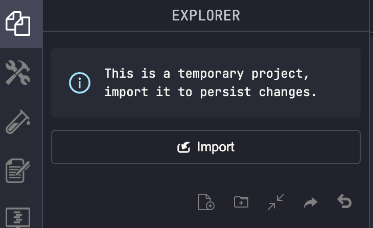
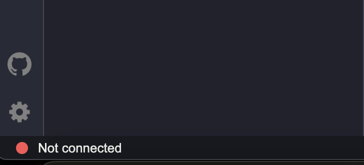
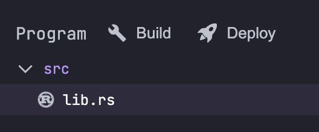
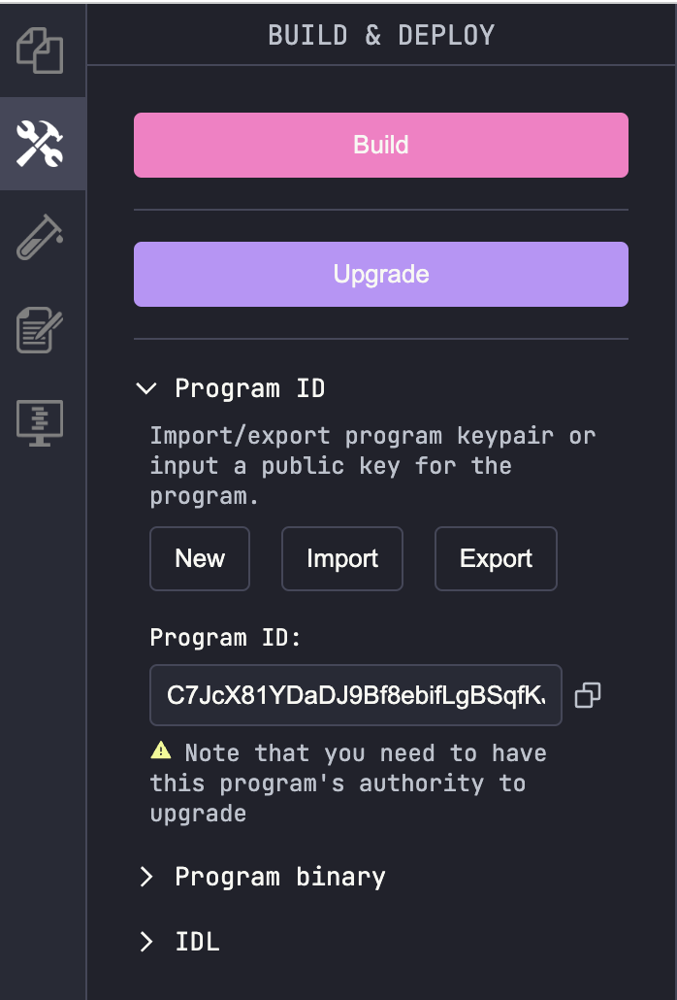

Bu "merhaba dünya" hızlı başlangıç kılavuzunda, ilk Solana programımızı geliştirmek ve dağıtmak için bir tarayıcı tabanlı IDE olan
[Solana Playground](https://beta.solpg.io/https://github.com/solana-developers/hello_world_pg)'ı kullanacağız. Bunu yapmak için bilgisayarınıza
herhangi bir yazılım yüklemeniz **GEREKMEZ**. Tarayıcınızda Solana Playground'u açın ve Solana programları yazıp dağıtmaya hazır olun.

## Ne öğreneceksiniz

- Solana Playground ile nasıl başlanır
- Playground'da bir Solana cüzdanı nasıl oluşturulur
- Rust'ta temel bir Solana programı nasıl programlanır
- Solana Rust programı nasıl inşa edilir ve dağıtılır
- JavaScript kullanarak onchain programınızla nasıl etkileşimde bulunulur

## Solana Playground Kullanımı

[Solana Playground](https://beta.solpg.io/https://github.com/solana-developers/hello_world_pg), onchain Solana programları yazmanıza, inşa etmenize ve dağıtmanıza olanak tanıyan tarayıcı tabanlı bir uygulamadır. Hepsi tarayıcınızdan. Yükleme gerekli değildir.

Solana geliştirmeye başlamak için harika bir geliştirici kaynağıdır,
özellikle Windows üzerinde.

### Örnek projemizi içe aktarın

Tarayıcınızda yeni bir sekmede, örnek "_Merhaba Dünya_" [projemizi Solana Playground'da](https://beta.solpg.io/https://github.com/solana-developers/hello_world_pg) açın.

Sonraki adım olarak, projeyi yerel çalışma alanınıza `hello_world` adıyla içe aktarmak için "**İçe Aktar**" simgesine tıklayın.



> Eğer programı **kendi** Solana Playground'unuza içe aktarmazsanız,
> kodda değişiklik yapamazsınız. Ancak, kodu bir Solana kümesine derleyip dağıtmayı
> **yapabilirsiniz**.

### Playground cüzdanı oluşturun

Normalde `yerel geliştirme` ile, Solana CLI için kullanılacak bir dosya sistemi cüzdanı oluşturmanız gerekecektir. Ancak Solana Playground ile, sadece birkaç düğmeye tıklayarak tarayıcı tabanlı bir cüzdan oluşturmanız yeterlidir.

> _Playground Cüzdanınız_, tarayıcınızın yerel depolamasında saklanacaktır.
> Tarayıcı önbelleğinizi temizlemek, kayıtlı cüzdanınızı siler. Yeni bir cüzdan oluşturduğunuzda,
> cüzdanınızın anahtar dosyasının yerel bir kopyasını saklama seçeneğiniz olacaktır.

Ekranın sol alt köşesindeki kırmızı durum gösterge düğmesine tıklayın,
(isteğe bağlı olarak) cüzdanınızın anahtar dosyasını bilgisayarınıza yedeklemek için kaydedin, ardından "**Devam Et**"e tıklayın.



Playground Cüzdanınız oluşturulduktan sonra, pencerelerin en alt kısmında cüzdan adresinizin, SOL bakiyenizin ve bağlı olduğunuz Solana kümesinin (Devnet genellikle varsayılan/tavsiye edilen, ancak "localhost" `test doğrulayıcısı` da kabul edilebilir) belirtildiğini göreceksiniz.

## Bir Solana programı oluşturun

Rust tabanlı Solana programınızın kodu, `src/lib.rs` dosyanızda yer alacaktır. `src/lib.rs` içinde Rust paketlerinizi içe aktarabilir ve mantığınızı tanımlayabilirsiniz. Solana Playground içinde `src/lib.rs` dosyanızı açın.

### `solana_program` paketini içe aktarın

`lib.rs`'nin en üstünde `solana-program` paketini içe aktarır ve ihtiyacımız olan öğeleri yerel isim alanına getiririz:

```rust
use solana_program::{
    account_info::AccountInfo,
    entrypoint,
    entrypoint::ProgramResult,
    pubkey::Pubkey,
    msg,
};
```

### Program mantığınızı yazın

Her Solana programının, onchain kodunuzu çalıştırmaya başlaması için Solana çalışma zamanına başlangıç noktası belirten bir `entrypoint` tanımlaması gereklidir. Programınızın giriş noktası, `process_instruction` adlı bir yayımlanmış işlev sunmalıdır:

```rust
// programın giriş noktasını bildirin ve yayınlayın
entrypoint!(process_instruction);

// program giriş noktasının uygulanması
pub fn process_instruction(
    program_id: &Pubkey,
    accounts: &[AccountInfo],
    instruction_data: &[u8]
) -> ProgramResult {
    // blockchain'e bir mesaj kaydet
    msg!("Merhaba, dünya!");

    // programdan nazikçe çık
    Ok(())
}
```

Her onchain program `Ok` [sonuç enum'u](https://doc.rust-lang.org/std/result/) ile `()` değerini döndürmelidir. Bu, Solana çalışma zamanına programınızın hatasız bir şekilde başarıyla çalıştığını belirtir.

Yukarıdaki programımız, basitçe "_Merhaba, dünya!_" mesajını blockchain kümesine kaydedecek ve ardından `Ok(())` ile nazikçe çıkacaktır.

### Programınızı inşa edin

Solana Playground'daki `lib.rs` dosyasının üst kısmındaki sol kenar çubuğunda `Build` düğmesine tıklayın.

Playable'un terminaline bakarsanız, Solana programınızın derlenmeye başladığını görmelisiniz. Tamamlandığında, bir başarı mesajı göreceksiniz.



### Programınızı dağıtın

İlk programınızı Solana blockchain'ine dağıtmak için "Dağıt" düğmesine tıklayabilirsiniz. Özellikle seçtiğiniz kümeye (örneğin, Devnet, Testnet, vb.) dağıtılacaktır.

Her dağıtımdan sonra, Playground Cüzdanı bakiyenizin değiştiğini göreceksiniz. Varsayılan olarak, Solana Playground otomatik olarak sizin adınıza SOL hava tahsisleri talep eder, böylece cüzdanınızın dağıtım masraflarını karşılayacak kadar SOL bulundurmasını sağlar.

Programınızı dağıtmak için daha fazla devnet SOL'e ihtiyacınız varsa, playground terminaline hava tahsisi komutunu yazarak daha fazla SOL talep edebilirsiniz:

```shell
solana airdrop 2
```

> Devnet SOL talep ederken bir hız limit hatası alırsanız, terminalde sadece `run` yazarak bir
> [web faucet](https://faucet.solana.com/) bağlantısı alabilirsiniz. Ayrıca
> playground penceresinin alt kısmında cüzdan adresinizi bulabilirsiniz.

`Dağıtım başarılı` mesajını göreceksiniz:


> Playground'daki düğmeleri kullanmak yerine terminalde `build` ve
> `deploy` yazarak da çalıştırabilirsiniz. Terminalde kullanabileceğiniz tüm komutların
> listesini almak için `help` yazabilirsiniz.

#### Tebrikler!

Tarayıcınızdaki Rust dilini kullanarak bir Solana programını başarıyla kurdunuz, inşa ettiniz ve dağıttınız. Sırada, onchain programınızla etkileşimde bulunarak 'Merhaba Dünya'mızı nasıl göreceğinizi göstereceğiz.

## Onchain programınızla etkileşime geçin

Solana programını blockchain'e başarıyla dağıttıktan sonra, o programla etkileşimde bulunmak isteyeceksiniz.

:::tip
Çoğu geliştirici gibi dApp'ler ve web siteleri oluştururken, onchain programımızla JavaScript kullanarak etkileşimde bulunacağız. Özellikle, istemci uygulamamızda yardımcı olmak için açık kaynaklı [NPM paketi](https://www.npmjs.com/package/@solana/web3.js) `@solana/web3.js`'yi kullanacağız.
:::

> Bu web3.js paketi, yaygın şablonların yeniden yazım ihtiyacını azaltarak
> `JSON RPC API` üzerinde bir soyutlama katmanıdır ve istemci tarafı uygulama
> kodunuzu basitleştirmeye yardımcı olur.

### JavaScript istemcisi

Artık istemcinin nasıl çalıştığını öğrendiğimize göre, programımızı nasıl çağıracağımıza bakalım. Örnek, merhaba dünya programımızı çağıracak bir JavaScript istemcisi ile gelir. `client.ts` dosyasını playground'da sol tarafta bulabilirsiniz.

### Programı çağırın

Onchain programınızı yürütmek için, ağa bir `işlem` göndermeniz gerekir. Solana blockchain'ine gönderilen her işlem, bir dizi `talimat` içerir.

Burada yeni bir işlem oluşturup bir tane `talimat` ekliyoruz:

```js
// boş bir işlem oluştur
const transaction = new web3.Transaction();

// işlemi merhaba dünya program talimatıyla doldur
transaction.add(
  new web3.TransactionInstruction({
    keys: [],
    programId: new web3.PublicKey(pg.PROGRAM_ID),
  }),
);
```

Her `talimat`, işlemin gerçekleşmesinde yer alan tüm anahtarları ve yürütmek istediğimiz program kimliğini içermelidir. Bu örnekte `keys` boş çünkü programımız sadece `merhaba dünya` kaydediyor ve herhangi bir hesaba ihtiyacı yok.

İşlemimizi oluşturduktan sonra, kümeye gönderebiliriz:

```js
// işlemi Solana kümesine gönder
console.log("İşlem gönderiliyor...");
const txHash = await web3.sendAndConfirmTransaction(
  pg.connection,
  transaction,
  [pg.wallet.keypair],
);
console.log("İşlem hash ile gönderildi:", txHash);
```

> İmzacıların dizisindeki ilk imzacı, varsayılan olarak işlem ücretini ödeyandır.
> `pg.wallet.keypair` ile imza atıyoruz.

### Uygulamayı çalıştırın

Artık istemcinin nasıl çalıştığını bildiğinize göre, kodu `run` komutuyla çalıştırabilirsiniz. Sadece bunu playground terminaline yazın ve enter tuşuna basın.

```shell
run
```

Uygulamanız tamamlandığında, aşağıdaki benzer bir çıktı göreceksiniz:

```shell
$ run
İstemci çalışıyor...
  client.ts:
    ProgramID:  C7JcX81YDaDJ9Bf8ebifLgBSqfKJxETek6qyTuPGJE1f
    İşlem hash ile gönderildi: m7f7dszzdNshMZo5u2gRKjbyURk1tQHj7Hmeh3AbH7wUdnmDXmCJhA8cXJjYwVN7foJaLQiPYhEFTn6F5mWSeCb
    Tebrikler! İşleminizi Solana Explorer'da görün:
  https://explorer.solana.com/tx/m7f7dszzdNshMZo5u2gRKjbyURk1tQHj7Hmeh3AbH7wUdnmDXmCJhA8cXJjYwVN7foJaLQiPYhEFTn6F5mWSeCb?cluster=devnet
```

Artık işleminizi Solana Explorer'da görüntülemek için sağlanan bağlantıya tıklayabilirsiniz. Sayfanın altına kaydırdığınızda **Log Mesajları** bölümünde `Merhaba, dünya!` mesajını görmelisiniz. 🎉

#### Tebrikler!!!

Artık bir Solana programı yazdınız, devnet'e dağıttınız ve programı çağırdınız. Artık bir Solana geliştiricisiniz!

:::note
Not: Programınızın mesajını güncellemeyi deneyin, ardından yeniden oluşturun, yeniden dağıtın ve programınızı yeniden çalıştırın.
:::

### Dağıtılan programa bakın

Artık programımızı çağırdığımıza göre, programın gerçekten saklandığı hesaba bir göz atalım.

`web3.js` kullanarak bir program yürütürken veya `başka bir Solana programından`, `program id`'yi (yani programınızın kamu adresi) sağlamanız gerekecektir.

Solana Playground'un **Build & Deploy** yan çubuğunda, `program id`'nizi **Program Kimlik Bilgileri** açılır kısmının altında bulabilirsiniz.



Bu program kimliğini kopyalayabilir ve arama çubuğuna yapıştırarak programınızı [solana explorer](https://explorer.solana.com/?cluster=devnet) üzerinde görüntüleyebilirsiniz.

### Playground global değişkenleri

Playground'da, kurulum veya ayar yapmadan kullanabileceğimiz birçok yardımcı program var. `merhaba dünya` programımız için en önemli olanları `@solana/web3.js` için `web3` ve Solana Playground yardımcı programları için `pg`dir.

> Mevcut tüm global değişkenleri `Ctrl+Space` (veya
> macOS'te `Cmd+Space`) tuşlarına basarak editör içinde gözden geçirebilirsiniz.

## Sonraki adımlar

Solana programları yazmayı ve yerel geliştirme ortamınızı kurmayı öğrenmek için aşağıdaki bağlantılara göz atın:

- `Solana Hızlı Başlangıç Kılavuzu`
- `Yerel geliştirme ortamınızı kurun`
- `Token'lerle ve NFT'lerle Etkileşim`
- `Geliştirici Kılavuzları`
- `Oyun Geliştirme`