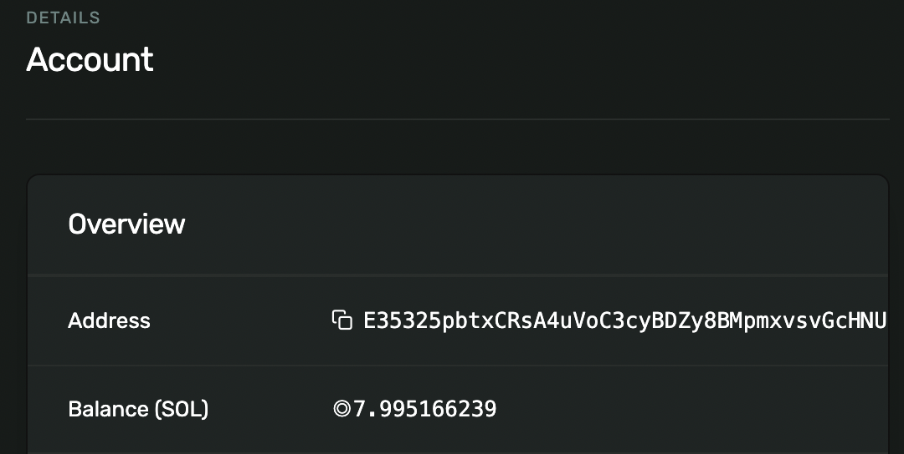
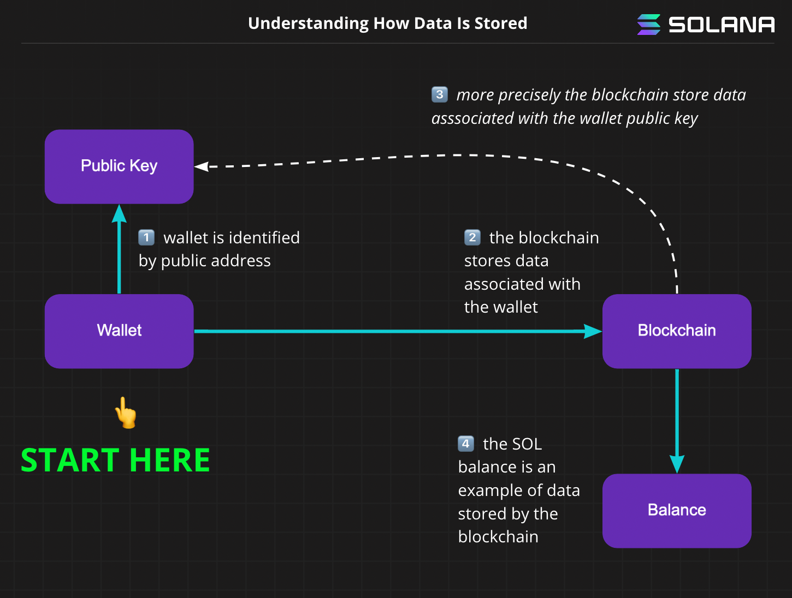
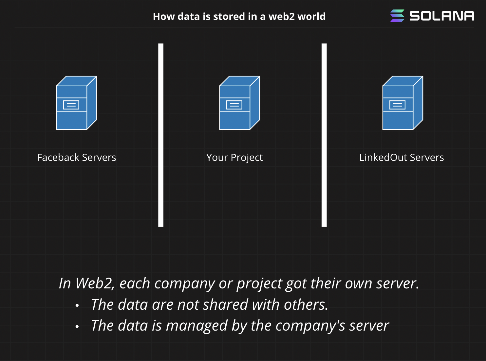
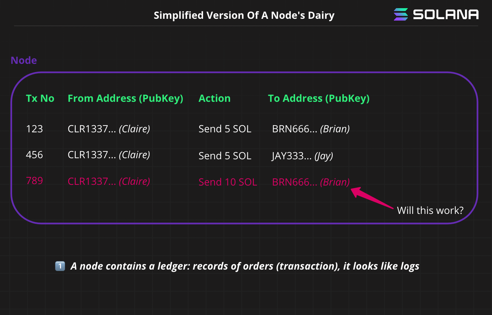
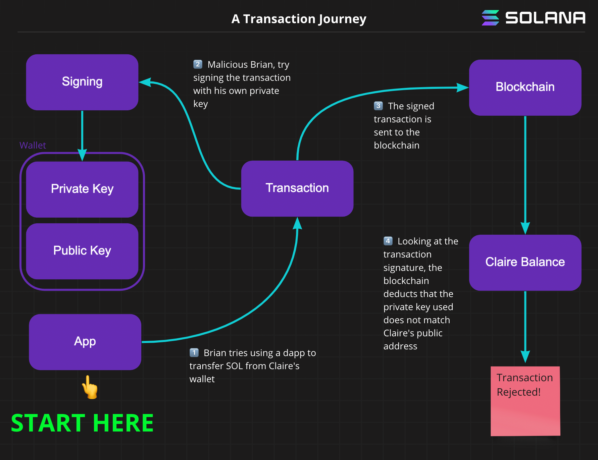
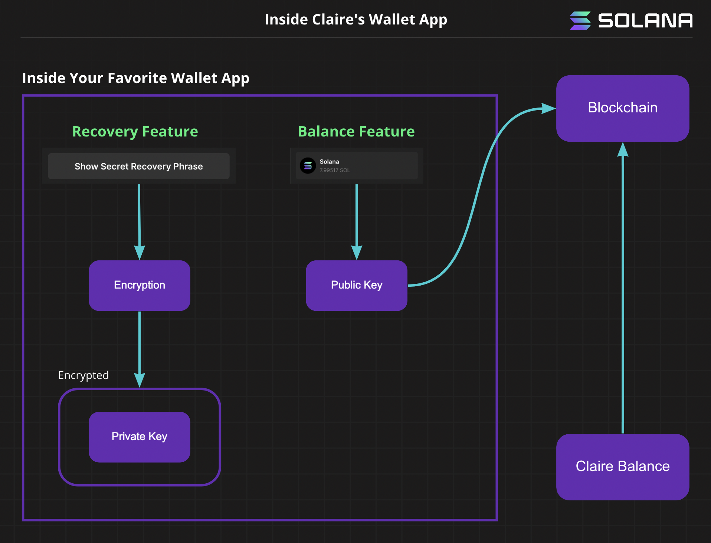

Bu makalede, sizi tavşan deliğinden çıkaracağım. Birlikte, cüzdanların gerçek amacını ortaya çıkararak tüm blockchain kavramlarının parçalarını tekrar bir araya getireceğiz.

:::tip
Cüzdanlar, boğa pazarında kayıplarınızı göstermek için burada değil 😅, blockchain'e erişmek ve inşa etmek içindir!
:::

## Yapboz Parçası 1: Bakiye Mitolojisi

🤫 Size bir sır vereyim, cüzdanlar yanıltıcıdır. Kriptonuzu depolamazlar. Aslında, hiçbir şey tutmazlar. Peki, dapps ve blockchain'de neden onlara ihtiyacımız var?

Şüpheci mi? [Bu hesabın bakiyesine](https://explorer.solana.com/address/E35325pbtxCRsA4uVoC3cyBDZy8BMpmxvsvGcHNUa18k?cluster=devnet) bir bakın. Eğer kriptom bir cüzdanın içinde saklanıyorsa, nasıl olur da cüzdanımın içindekileri İnternet'te görebilirsiniz?

Cüzdan bakiyesi hakkında neden konuşmaya başladığımı sorabilirsiniz. Çünkü "cüzdan" terimi yanıltıcı! Günlük bir kripto sahibi için, bu token depolama düşüncesi yeterli olabilir. Ama geliştiriciler olarak, bu hiçbir anlam ifade etmiyor. Bu yüzden, cüzdanların nasıl veri ve bakiyelerin saklandığını araştırarak tüm mitleri çürütelim.

> Cüzdan bakiyeniz **blockchain**'de saklanır, Phantom uygulamanızın içinde değil, nano ledger'ınızın içinde de değil. Yani, sadece blockchain'den sorgulayabileceğiniz bir veridir ve herkes bunu görebilir!  
> — Kredi: Eğitim Notları

Daha önce, [cüzdanımın SOL bakiyesini kontrol etmek için Solana explorer'ı kullandım](https://explorer.solana.com/address/E35325pbtxCRsA4uVoC3cyBDZy8BMpmxvsvGcHNUa18k?cluster=devnet). Bir cüzdan hakkında veri elde edebilmek için onu kamu anahtarıyla tanımlıyoruz.

Cüzdan tanımımızı güncelleyelim:

- Bir cüzdan, bir kamu anahtarıyla (adres) tanımlanabilir.
- Bir cüzdan bakiyesi, blockchain'de saklanan bir veriden ibarettir.

---

## Yapboz Parçası 2: Blockchain

:::tip
“Yani Blockchain Dediğimiz Şey…” bknz. Solana ve Token’lar
:::

İşlem yapmaya başlayalım. Bakiyenin blockchain'de saklandığını ve bilgisayarınızın içinde olmadığını belirledik. Takip edebileceğimiz bir sonraki heyecan verici yol, verilerin genel olarak blockchain'de nasıl saklandığını sormaktır.

**Cüzdanlara neden ihtiyaç duyduğumuzu anlamak için, önce verilerin blockchain'lerde nasıl saklandığını anlamamız gerekiyor.**

_Ama önce, bir adım geri atıp bir web2 dünyasında verilerin nasıl saklandığını karşılaştıralım:_

Web2'de, veriler bir şirketin sunucusunda kapalıdır ve veriler şirket tarafından yönetilir. Yani, yarın sansür için silmeye karar verirlerse ya da yanlışlıkla verilerinizi yok ederlerse, bu mümkün! (Bu, blockchain'in yararına bir yorum değil, bu sadece bir gerçek 😅).

_Şimdi, bir blockchain'de verilerin nasıl saklandığını karşılaştıralım:_

**Bir blockchain, dağıtılmış bir defterdir:**

1. Bir blockchain tek bir şey değildir. Bir grup sunucudan oluşur, tıpkı 🐝 arılar gibi.
2. Bu sunucular birlikte "bir blockchain"i temsil eder, tıpkı bir arı kovanı gibi 👁‍🗨.
3. Bu sunucular kimseye ait değildir ya da daha doğrusu herkesindir.
4. Herkes blockchain'in bir parçası olabilir ve büyükannenizin dizüstü bilgisayarını bu sunuculardan biri olarak kullanabilirsiniz.
5. Tüm düğümler verinin bir kopyasını saklar.

> Aslında, büyükannenizin donanımı muhtemelen buna uygun olmayacak, ama benim noktamı anladınız!

💡 **Düşünün**

- Bir blockchain'in internet üzerinde olması zorunlu mu?
- Verileri kimseyle paylaşmanın sorunu nedir?

---

## Yapboz Parçası 3: İmza

Eğer blockchain'ler hakkında öğrendiklerimizi özetlersek, tüm düğümler verinizin bir kopyasını içerir. Ama benim için burada bir şeyler tuhaflaşıyor...

**Bu, en iyi arkadaşınızdan en kötü düşmanınıza kadar herkesin bilgisayarını kullanarak bir düğüm oluşturup böylece verinizi sahiplenebileceği anlamına gelir!**

Veri herkes tarafından paylaşıldığı için, anarşiyi nasıl önlüyoruz ve insanların başkalarının verilerini değiştirmesini ya da sistemi dolandırmasını engelliyoruz:

- Eğer bir Instagram klonu blockchain üzerinde yapılsaydı, hiç kimsenin fotoğraflarınızı değiştirmesini veya silmesini istemezdiniz, değil mi?
- Ya da eğer blockchain üzerinde bir Paypal versiyonu oluşturuyorsak, birinin hesabınızdan para çekmesini nasıl önleyeceğiz? Sonuçta, veri (bakiye) herkes arasında çoğaltılıyor ve dağıtılıyor.

Bir cüzdan bakiyesi örneğini ele alalım, bu sefer bir blockchain düğümüne daha yakından bakalım:

Claire, Jay ve Brian adında 3 ana karakterimiz olduğunu varsayalım. Claire mutlu bir şekilde 5 SOL gönderir, hem Jay'e hem de Brian'a. Ama Brian (hikayemdeki kötü adam) 5 SOL'dan fazlasını ister. Bu yüzden Claire olduğunu iddia eder ve blockchain'den kendisine ek olarak 10 SOL göndermesini ister.

**Peki, onu bunu yapmaktan ne engelliyor?**

Eğer web2 olsaydı, "bunu yapabilmemiz için kullanıcı oturum açtığını kontrol etmeliyiz, eğer oturum açmayı başarırlarsa, bakiye sahibinin gerçekten de kullanıcı olduğunu kontrol edebiliriz" derdiniz; burada iki problem var:

1. "Oturum" yoktur; blockchain, kimin şu anda "oturum açtığını" takip etmez.
2. Daha önce cüzdan bakiyesini doğruladığımızda, cüzdan kamu anahtarını kullandık; kamu anahtarı ise, işte … herkesin görmesine açık; başkalarının benim gibi olduğunu iddia etmek için benim kamu anahtarımı kullanabilirsiniz.

**Yeterince alay ettik. Peki, çözüm nedir?**

Evet! Anahtar, gizli anahtar kullanarak imzalamaktır! Asimetrik şifreleme büyüsü sayesinde verilerimizi "şifre korumalı" hale getirebiliriz, şifreyi iletişim kurmadan.

Asimetrik ne demek? _SSH anahtarlarını düşünün_.

Bunu anlamakta zorlanıyor musunuz? İşte, gerçek dünyayı düşünün. Örneğin, eğer kötü niyetli bir sahtekar bankanızdaki parayı çekmek isterse, bunu yapmak için imzanıza ihtiyaç duyar. İşte, burada da tam olarak böyle: kamu anahtarıyla tanımlanan verilere yapılacak herhangi bir değişiklik de ilgili gizli anahtarla imzalanmalıdır.

Evet, bu, mobil bankacılığın olmadığı bir dünya vardı.

:::note
**Cüzdanların gerçek doğası budur!!** Verilere erişimi imzalamak için buradalar. Onlar imzalar ya da mührlerdir.
:::

Bu tamamen farklı bir paradigmadır. Web2'de, kimlik doğrulama ve yetkilendirme sunucu tarafından sağlanıyordu. Ancak web3'de, bu doğrudan şifreleme ile anahtarlarınızın elinde yapılır!

Tebrikler! Güvensiz ve merkeziyetsiz sistemlerin doğasını keşfettiniz.

---

## Yapboz Parçası 4: İşlem

Yukarıda cüzdanların gerçek doğasını öğrendik. Ama tam olarak neyi imzalıyoruz? Gizli anahtarlar işlemleri imzalamak için kullanılır. İşlem, bir blockchain'den bir şey yapmasını isteyebileceğimiz yoldur.

İyi olan şu ki, blockchain'ler emir almak için her zaman hazırdır. Genel olarak, bir blockchain ya da daha doğru bir ifade ile bir blockchain düğümü, günlükler veya kayıtlar saklar. Bu gündemler çok uzun bir emir listesi (işlemler) içerir. Bu işlemler bir araya geldiğinde dünyanın durumunu temsil eder. Bu nedenle, blockchain'lere durum makineleri diyoruz:

- Maverick, 10 SOL'u Iceman'a gönderir.
- Claire, 5 SOL'u Laura'ya gönderir.
- Michael B., Wakanda NFT'sini satın alır.

> Blockchain aslında bir bloklar zincirini saklar. İşlemler bloklar halinde bir araya getirilir. Ama bu başka bir zamanın hikayesi.

:::warning
Yetki ve imza nasıl çalışıyor? Diyelim ki Brian, Claire'yi taklit etmeye çalışarak, Claire'in cüzdanından kendisine ekstra SOL göndermeye çalışıyor (Unutmayın? Cüzdan adresleri herkese açıktır).
:::

> Solana, yalnızca **Token** Transferi yapmakla kalmaz, ama aynı mantık her eylem için geçerlidir, özellikle de verileri değiştirmek için, bunu yapma iznine sahip olduğunuzu kanıtlamanız gerekir. Bu nedenle, bu eylemi **(işlem)** imzalamanız gerekmektedir.

💡 **Düşünün**

- İşlemleri ne zaman imzalamamız gerekiyor?
- Ve ne zaman imzalamamız gerekmiyor?

**... (denemeden önce aşağıya bakmayın!)**

- _Verileri değiştirdiğimizde imzalamamız gerekir. Verileri oluşturuyorsak ya da değiştiriyorsak, bunu yapma yetkisine sahip olmamız gerekir._
- _Sadece verileri okuma durumunda imzalamaya gerek yoktur._

---

## Yapboz Parçası 5: Cüzdan Uygulamaları

Sonunda döngüyü tamamlamak için, [Phantom](https://phantom.app/) veya [Solflare](https://solflare.com/) gibi cüzdan uygulamalarından bahsedelim. Artık anladığınız gibi, blockchain dünyasının gizli sosu gerçekten kamu anahtarı ve gizli anahtar kullanarak imzalamaktır.

Cüzdan Uygulamaları, mobil cüzdan, tarayıcı uzantısı veya masaüstü uygulaması olup olmaması fark etmeksizin, gerçekten sadece bir uygulamadır.

Bu uygulamalar, anahtarlarınızı sarar ve aşağıdaki gibi UX iyilikleri ekler:

- Gizli anahtarınızı şifrelenmiş bir şekilde saklamak ve bir şifreyle kilitlemek.
- Anahtarı geri yüklemek için bir kurtarma kelime grubu eklemek.
- Cüzdan bakiyenizi görüntülemek için blockchain'den veri çekmek.
- Borsa ile bağlantı kurarak bir token takası yapmanıza izin vermek.
- Vs.

:::details
_Geri yükleme ve bakiye özelliklerinin nasıl çalıştığına dair bir örnek:_

Gördüğünüz gibi, temel veriler blockchain'de yaşıyor. Cüzdanlar, gizli anahtarınızı şifrelenmiş bir şekilde saklayan kolaylık kasalarıdır. Bu, yalnızca standart endüstri şifrelemesiyle ilgilidir ve blockchain ile ilgili değildir. Gerçekten sağladığı en önemli özellik, gizli anahtar kullanarak imzalamaktır.
:::

---

## Şeyleri Tekrar Düzene Koymak

1. Veri, sunucuların (düğümler) sürüsünde saklanır; bu doğrulayıcılar blockchain'i oluşturur.
2. Herkes bir doğrulayıcı düğümü olabilir. Bu nedenle, verilere herkes erişebilir.
3. Bir blockchain'deki değişiklikler emirlerle gerçekleşir: talimatlar/işlemler.
4. Kaosu önlemek için, kimin neyi değiştirebileceğini belirlemenin bir yoluna ihtiyacımız var: işte burada imzalama devreye girer.
5. Şifreleme sayesinde, işlem (değişiklik) imzalamak için bir kamu/gizli anahtar çifti kullanabiliriz: bu mühür (veya imza), verileri "şifre korumalı" hale getirmemizi sağlar, şifreyi dünyaya iletmeden.
6. Bir blockchain, her işlemin kayıtlarını, günlüklerini veya defterlerini saklayan bir durum makinesidir. Blockchain, bir işlem imzasını kontrol ederek verilere erişimi doğrular.
7. **Bu yüzden cüzdanlar var! Gizli anahtar ile imzalama yoluyla erişimi kimlik doğrulamak ve yetkilendirmek için!**
8. Bir cüzdan, gizli anahtarı saran ve gizli anahtarı güvenli bir şekilde saklamak (şifre korumalı) veya token hesap bakiyesini göstermek gibi iyilikler eklemek için yarattığımız basit bir kolaylıktır. Evet, cüzdanlar gizli anahtarınızın şifrelenmiş versiyonunu saklar.
9. Solflare veya Phantom gibi bir cüzdan uygulaması olmadan blockchain ile etkileşimde bulunabilirsiniz! Bu sadece korkunç bir kullanıcı deneyimi olur. ;)

> Bu nedenle, burada kamu/gizli anahtar çiftleri, blockchain'in sizi tanımlamasını ve yapmanız gereken bir şeyi yapma izniniz olduğundan emin olmanıza olanak tanır!  
> — Öğrenme Düzeyi

**Cüzdanlar, ilk kullanımı tarihi olarak bakiyenizi kilitlemek için bu şekilde adlandırılmıştır. Ama zincir üzerindeki program dünyasında, hala verinizi kilitlemekle ilgilidir, sadece bakiyelerle değil. Eğer bir şey varsa, cüzdanlar gerçekten mühürler veya imza kalemleri olarak adlandırılmalıdır! ✍️.**

---

## Sırada Ne Var?

Solana üzerinde inşa etmeye mi başlamak istiyorsunuz?

- Solana'ya nazik bir giriş:
  `Hızlı Başlangıç kılavuzları`
- `Solana CLI'yi yükleyin`

### Blockchain ve blockchain

- 10000 fit yüksekliğinden, makro terim olarak blockchain bir dizi sunucu, doğrulayıcı düğümlerden oluşur.
- 100 fit yüksekliğinden, bir blockchain düğümü bir bloklar zincirini içerir.
- 1 mm'de, bir blok bir dizi işlem/talimatı paketler.
- 10000 fit yüksekliğe geri döndüğümüzde, bir blockchain bir dizi düğümden oluşur ve blok zincirlerini senkronize ederler.

Blockchain terimi, bir araya getirilmiş blokların icadından gelmektedir. Ancak genel olarak, blockchain dediğimizde tüm düğüm sürüsünü düşünüyoruz, çünkü herkes diğer düğümün bir kopyası olmak zorundadır. Dolayısıyla hepsi aynı.

### Hesaplar

Verilerin nasıl saklandığını tam olarak bahsetmediğimi fark ettim. Solana dünyasında, her şey hesaplarda saklanır. Linux verileri dosyalara saklarken, Solana verileri hesaplarda saklar; bir dosya sistemi gibi. Dosyaların bir dosya adı olurken, hesapların bir kamu adresi vardır:

- Dolayısıyla SOL bakiyeniz, kamu adresi sizin kamu anahtarınız olan bir hesapta saklanır!  
  O hesaba erişim izni, ilgili gizli anahtar imzasıyla kilitlenmiştir!

### Kimlik Doğrulama

Cüzdanınızı bir dapp'e bağladığınızda. Cüzdanı bağlamak gerçekten ne yapar? Gerçekte, "bağladığınız" hiçbir şey yoktur. Basitçe, kamu anahtarınızı dapp'e verirsiniz. Daha önce söylediğimiz gibi, kamu anahtarına sahip olduğunuzu kanıtlamak için dapp'in sizden bir mesajı imzalamanızı istemesi gerekir. Bazı dapp'lerde bunu görmüş olabilirsiniz; iki açılır pencere alırsınız:

- Bir cüzdanı bağlamak için.
- Diğer bir mesajı imzalamak için.