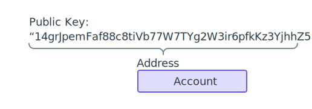
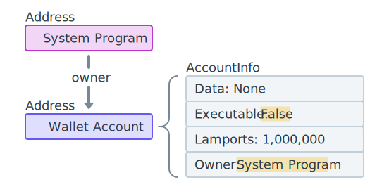
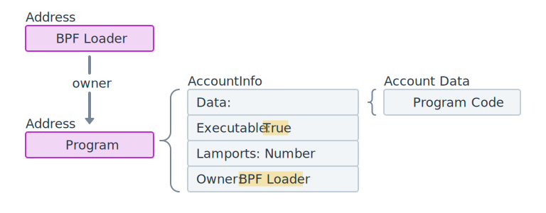

Solana'da, tüm veriler "hesaplar" olarak adlandırılan yapılarda depolanır. Verilerin
Solana'da düzenleniş şekli, her bir girişin "hesap" olarak adlandırıldığı bir
[key-value store](https://en.wikipedia.org/wiki/Key%E2%80%93value_database)
biçimini andırır.

## Ana Noktalar

- Hesaplar, çalıştırılabilir program kodu ya da program durumu içeren en fazla
  10MB veri depolayabilir.
  
- Hesapların depolanan veri miktarına orantılı olarak SOL cinsinden bir kiralama
  teminatı gereklidir ve bu teminat, hesap kapatıldığında tamamen geri
  ödenmektedir.

- Her hesabın bir program "sahibi" vardır. Sadece bir hesabın sahibi olan program,
  bu hesabın verilerini değiştirebilir veya lamport bakiyesinden düşüş
  yapabilir. Ancak, herkes bakiyeyi artırabilir.

- Programlar (akıllı sözleşmeler), çalıştırılabilir kodu depolayan durumsuz
  hesaplardır.

- Veri hesapları, program durumunu depolamak ve yönetmek için programlar tarafından
  oluşturulur.

- Native programlar, Solana zamanlayıcısıyla birlikte gelen yerleşik programlardır.

- Sysvar hesapları, ağ kümesi durumunu depolayan özel hesaplar olup,
  belirli adreslerde bulunmaktadır.

## Hesap

Her hesap, [Ed25519](https://ed25519.cr.yp.to/) `PublicKey` formatında 32 byte
olan benzersiz adresi ile tanımlanabilir. Adres, hesabın benzersiz tanımlayıcısı
olarak düşünülebilir.

Hesap ile adres arasındaki bu ilişki, adresin hesabın karşılık gelen on-chain
verisini bulmak için anahtar olarak kullanıldığı bir anahtar-değer çifti
olarak düşünülebilir.

### AccountInfo

Hesapların
[max boyutu 10MB'dir](https://github.com/solana-labs/solana/blob/27eff8408b7223bb3c4ab70523f8a8dca3ca6645/sdk/program/src/system_instruction.rs#L85)
(10 Mega Byte) ve Solana üzerindeki her hesapta depolanan verinin yapısı
[AccountInfo](https://github.com/solana-labs/solana/blob/27eff8408b7223bb3c4ab70523f8a8dca3ca6645/sdk/program/src/account_info.rs#L19)
olarak bilinen aşağıdaki gibidir.

Her hesap için `AccountInfo` aşağıdaki alanları içerir:

- `data`: Bir hesabın durumunu depolayan bir byte dizisi. Hesap bir program
  (akıllı sözleşme) ise, burası çalıştırılabilir program kodunu depolar. Bu alan
  genellikle "hesap verisi" olarak adlandırılır.
  
- `executable`: Hesabın bir program olup olmadığını belirten bir boolean işareti.
  
- `lamports`: Hesabın `lamports` cinsindeki bakiyesini
  sayısal olarak temsil eder, bu, SOL'nin en küçük birimidir (1 SOL = 1 milyar
  lamport).
  
- `owner`: Hesabı sahiplenen programın genel anahtarını (program kimliği) belirtir.

Solana Hesap Modeli'nin önemli bir parçası olarak, Solana üzerindeki her hesap
belirli bir "sahibi" vardır, özellikle bir programdır. Sadece bir hesabın
sahibi olarak belirlenen program, hesapta saklanan verileri değiştirebilir veya
lamport bakiyesinden düşüş yapabilir. Önemli olan, yalnızca sahibine ait olan
bakiyenin düşürülebileceğidir, ancak herkes bakiyeyi artırabilir.

> On-chain verileri depolamak için, bir miktar SOL hesabınıza aktarılmalıdır. Aktarılan
> miktar, hesabınızdaki depolanan verinin boyutuna orantılıdır. Bu kavram genellikle
> "kira" olarak adlandırılır. Ancak, "kira"yı daha çok bir "teminat" gibi
> düşünebilirsiniz, çünkü bir hesaba tahsis edilen SOL, hesap kapatıldığında
> tamamen geri alınabilir.

## Yerel Programlar

Solana, doğrulayıcı uygulamasının bir parçası olan ve ağ için çeşitli ana işlevlikler
sağlayan birkaç yerel programa sahiptir. Yerel programların tam listesini
[buradan](https://docs.solanalabs.com/runtime/programs) bulabilirsiniz.

Özel programlar geliştirirken, genellikle iki yerel programla, Sistem Programı ve
BPF Yükleyici ile etkileşimde bulunursunuz.

### Sistem Programı

:::info  
Varsayılan olarak, tüm yeni hesaplar
[Sistem Programı](https://github.com/solana-labs/solana/tree/27eff8408b7223bb3c4ab70523f8a8dca3ca6645/programs/system/src)
tarafından sahiplidir.
:::

Sistem Programı, aşağıdaki gibi birkaç önemli görevi
gerçekleştirir:

- [Yeni Hesap Oluşturma](https://github.com/solana-labs/solana/blob/27eff8408b7223bb3c4ab70523f8a8dca3ca6645/programs/system/src/system_processor.rs#L145):
  Sadece Sistem Programı yeni hesaplar oluşturabilir.
  
- [Alan Tahsisatı](https://github.com/solana-labs/solana/blob/27eff8408b7223bb3c4ab70523f8a8dca3ca6645/programs/system/src/system_processor.rs#L70):
  Her hesabın veri alanı için byte kapasitesini belirler.
  
- [Program Sahipliğini Atama](https://github.com/solana-labs/solana/blob/27eff8408b7223bb3c4ab70523f8a8dca3ca6645/programs/system/src/system_processor.rs#L112):
  Sistem Programı bir hesap oluşturduğunda, atanmış program sahibini farklı bir
  program hesabına yeniden atayabilir. Özel programların, Sistem Programı tarafından
  oluşturulan yeni hesapların sahipliğini nasıl aldığını gösterir.

Solana'da, bir "cüzdan" basitçe Sistem Programı'na ait bir hesaptır. Cüzdanın
lamport bakiyesi, hesabın sahip olduğu SOL miktarıdır.

> Sadece Sistem Programı'na ait hesaplar işlem ücreti ödeyici olarak
> kullanılabilir.

### BPF Yükleyici Programı

[BPF Yükleyici](https://github.com/solana-labs/solana/tree/27eff8408b7223bb3c4ab70523f8a8dca3ca6645/programs/bpf_loader/src)
ağdaki diğer programların "sahibi" olarak tanımlanan programdır ve Yerel Programlar
hariçtir. Özel programları dağıtmaktan, yükseltmekten ve çalıştırmaktan sorumludur.

## Sysvar Hesapları

Sysvar hesapları, küme durum verilerine erişim sağlayan belirlenmiş adreslerde
bulunan özel hesaplar olup, ağ kümesine dair verilerle dinamik olarak güncellenir.
Sysvar Hesaplarının tam listesine [buradan](https://docs.solanalabs.com/runtime/sysvars) ulaşabilirsiniz.

## Özel Programlar

Solana'da, "akıllı sözleşmeler" [programlar](https://docs/core/programs.md) olarak
adlandırılmaktadır. Bir program, çalıştırılabilir kodu içeren bir hesap olup,
"çalıştırılabilir" bayrağı true olarak ayarlanmıştır.

Program dağıtım süreci hakkında daha ayrıntılı açıklama için, bu belgelendirme
kapsamındaki `Programları Dağıtma` sayfasına bakabilirsiniz.

### Program Hesabı

Yeni programlar, Solana'da
[dağıtıldığında](https://github.com/solana-labs/solana/blob/27eff8408b7223bb3c4ab70523f8a8dca3ca6645/programs/bpf_loader/src/lib.rs#L498),
teknik olarak üç ayrı hesap oluşturulur:

- **Program Hesabı**: On-chain bir programı temsil eden ana hesap. Bu hesap,
  çalıştırılabilir veri hesabının adresini (derlenmiş program kodunu depolayan)
  ve programın güncelleme yetkisini (programda değişiklik yapmaya yetkili adres)
  depolar.
  
- **Program Çalıştırılabilir Veri Hesabı**: Programın çalıştırılabilir byte kodunu
  içeren bir hesap.

- **Tampon Hesabı**: Bir program yüklenirken veya yükseltilirken byte kodunu
  depolayan geçici bir hesaptır. Süreç tamamlandıktan sonra, veriler Program
  Çalıştırılabilir Veri Hesabı'na aktarılır ve tampon hesabı kapatılır.

Örneğin, Token Uzantıları ile ilgili Solana Keşif Arayüzüne ait bağlantılar
[Program Hesabı](https://explorer.solana.com/address/TokenzQdBNbLqP5VEhdkAS6EPFLC1PHnBqCXEpPxuEb)
ve onun karşılık gelen
[Program Çalıştırılabilir Veri Hesabı](https://explorer.solana.com/address/DoU57AYuPFu2QU514RktNPG22QhApEjnKxnBcu4BHDTY)'dır.

Kolaylık olması açısından, "Program Hesabı"nı programın kendisi olarak
düşünebilirsiniz.

> "Program Hesabı"nın adresi genellikle "Program Kimliği" olarak adlandırılır ve
> programı çağırmak için kullanılır.

### Veri Hesabı

Solana programları "durumsuz"dur, yani program hesapları sadece programın
çalıştırılabilir byte kodunu içerir. Ek verileri depolamak ve değiştirmek için,
yeni hesapların oluşturulması gerekir. Bu hesaplar, genellikle "veri hesapları"
olarak adlandırılır.

Veri hesapları, sahibi programın kodunda tanımlanan herhangi bir rastgele veriyi
depolayabilir.

Sadece `Sistem Programı` yeni hesap
oluşturabilir. Sistem Programı bir hesap oluşturduğunda, daha sonra bu yeni
hesabın sahipliğini başka bir programa devredebilir.

:::note  
Başka bir deyişle, bir özel program için veri hesabı oluşturmak, iki adımdan
oluşur:

1. Bir hesap oluşturmak için Sistem Programı'na yönlendirme yapmak ve ardından
   sahipliği özel bir programa devretmek.
   
2. Artık hesabı elinde bulunduran özel programın yönlendirilmesi ile program
   kodunda tanımlandığı şekilde hesap verilerini başlatmak.
:::

Bu veri hesabı oluşturma süreci sıklıkla tek bir adım olarak soyutlanır, ancak
temel süreci anlamak faydalıdır.