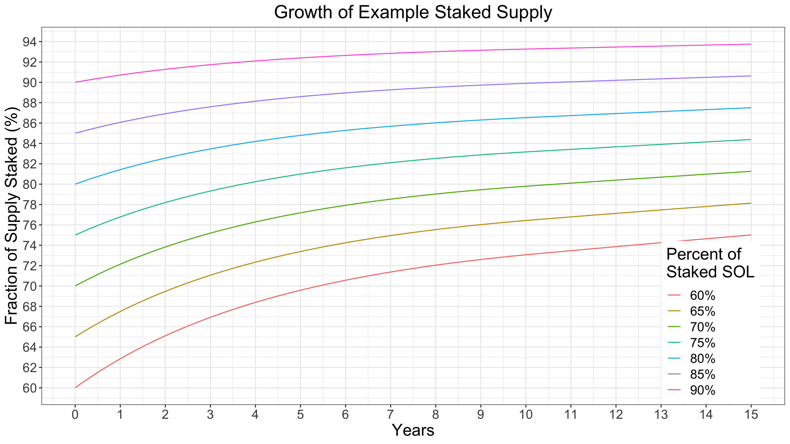
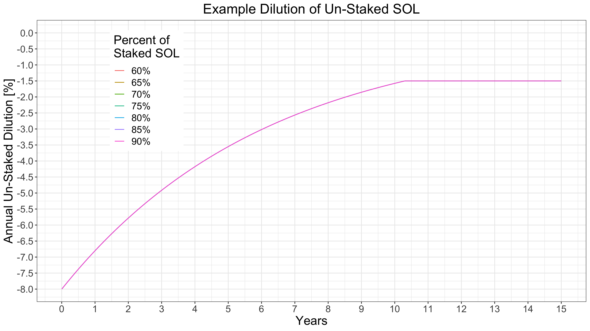
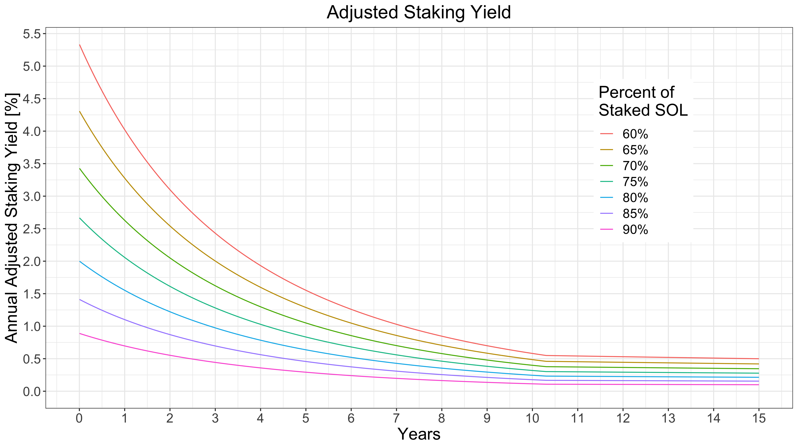
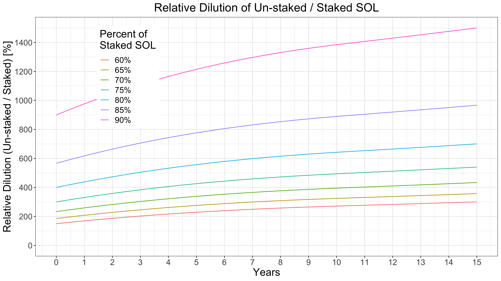

### Token Seyreltilmesi

Benzer şekilde, beklenen _Stake Seyreltilmesi_ (yani _Ayarlanmış Stake Getirisi_) ve daha önce tanımlanan _Seyretilmemiş Seyreltilme_ üzerine bakabiliriz. Yine, bu bağlamda _seyreltilme_, daha büyük bir set içindeki belirli bir token setinin kesirsel temsili (yani, sahipliği) değişikliği olarak tanımlanır. Bu anlamda, seyreltilme olumlu bir değer olabilir: kesirsel sahiplikte bir artış (stake seyreltilmesi / _Ayarlanmış Stake Getirisi_), ya da olumsuz bir değer: kesirsel sahiplikte bir azalma (seyretilmemiş seyreltilme).

:::tip
Stake edilmiş ve seyredilmemiş tokenların sahipliğindeki göreceli değişimin, genel token havuzunun enflasyon ihraçları ile artmasının önemli olduğunu unutmayın.
:::

Daha önce de tartışıldığımız gibi, bu ihraç yalnızca stake edilmiş token sahiplerine dağıtılıyor, bu da _Toplam Mevcut Arz_ içindeki stake edilmiş tokenların kesirsel temsilini artırıyor. 

Yukarıdaki _Enflasyon Takvimi_ parametreleri ile devam ederken, stake edilmiş arzın oranının aşağıda gösterildiği gibi büyüdüğünü görmekteyiz.

Bu temsil değişikliği nedeniyle, herhangi bir token sahibinin pay oranı, _Enflasyon Takvimi_ ve stake edilen tüm tokenların oranı bir işlevi olarak da değişecektir.

Ancak başlangıçta ilgi çeken, _seyretilmiş **seyretilmemiş** tokenlar_ veya $D_{us}$. Seyretilmemiş tokenlar durumunda, token seyreltilmesi yalnızca _Enflasyon Takvimi_ ile bir işlevdir çünkü seyretilmemiş tokenların miktarı zamanla değişmez.

:::info
Bu durum, seyreltilmiş seyreltilmeyi $D_{us}$ olarak açıkça hesaplayarak görülebilir.
:::

$t$ zamanında token havuzunun seyretilmemiş oranı $P_{us}(t_{N})$ ve $I_{t}$, iki ardışık zaman noktası arasında uygulanan artış enflasyon oranıdır. $SOL_{us}(t)$ ve $SOL_{total}(t)$, sırasıyla, $t$ zamanında ağda seyredilmemiş ve toplam SOL miktarıdır. Dolayısıyla $P_{us}(t) = SOL_{us}(t)/SOL_{total}(t)$.

$$
\begin{aligned}
	D_{us} &= \left( \frac{P_{us}(t_{1}) - P_{us}(t_{0})}{P_{us}(t_{0})} \right)\\
		&= \left( \frac{ \left( \frac{SOL_{us}(t_{2})}{SOL_{total}(t_{2})} \right) - \left( \frac{SOL_{us}(t_{1})}{SOL_{total}(t_{1})} \right)}{ \left( \frac{SOL_{us}(t_{1})}{SOL_{total}(t_{1})} \right) } \right)\\

\end{aligned}
$$

Ancak, enflasyon ihraçları yalnızca toplam miktarı artırdığı ve seyredilmemiş arz değişmediği için:

$$
\begin{aligned}
	SOL_{us}(t_2) &= SOL_{us}(t_1)\\
	SOL_{total}(t_2) &= SOL_{total}(t_1)\times (1 + I_{t_1})\\
\end{aligned}
$$

Dolayısıyla $D_{us}$ şöyle olur:

$$
\begin{aligned}
	D_{us} &= \left( \frac{ \left( \frac{SOL_{us}(t_{1})}{SOL_{total}(t_{1})\times (1 + I_{1})} \right) - \left( \frac{SOL_{us}(t_{1})}{SOL_{total}(t_{1})} \right)}{ \left( \frac{SOL_{us}(t_{1})}{SOL_{total}(t_{1})} \right) } \right)\\
	D_{us} &= \frac{1}{(1 + I_{1})} - 1\\
\end{aligned}
$$

Ya da genel olarak, seyredilmemiş tokenlar için enflasyon $I$ süresince seyreltilme:

$$
D_{us} = -\frac{I}{I + 1} \\
$$

Dolayısıyla varsayımımız doğru; bu seyreltilme, stake edilmiş tokenların toplam oranından bağımsızdır ve yalnızca enflasyon oranına bağlıdır. Bu, burada örnek _Enflasyon Takvimi_ ile görülebilir:

### Tahmin Edilen Ayarlanmış Stake Getirisi

Stake token sahiplerinin _seyreltilmesini_ belirlemek için benzer bir hesaplama yapabiliriz; burada tanımladığımız gibi **_Ayarlanmış Stake Getirisi_**. Bu bağlamda seyreltilmenin, zamanla orantılı sahiplikte bir _artış_ olduğunu akılda tutun. İlerleyen kısımlarda karışıklığı önlemek için _Ayarlanmış Stake Getirisi_ terimini kullanacağız.

Fonksiyonel formu görmek için $Y_{adj}$ veya _Ayarlanmış Stake Getirisi'ni_ (seyretilmemiş tokenların yukarıda $D_{us}$ seyreltilmesi ile karşılaştırmak üzere) hesaplıyoruz; burada $P_{s}(t)$ stake edilmiş token havuzunun $t$ zamanındaki oranı ve $I_{t}$, iki ardışık zaman noktası arasında uygulanan artış enflasyon oranıdır. $Y_{adj}$ tanımı şu şekilde:

$$
	Y_{adj} = \frac{P_s(t_2) - P_s(t_1)}{P_s(t_1)}\\
$$

Yukarıdaki grafikte görüldüğü gibi, stake edilmiş tokenların oranı enflasyon ihraçları ile artmaktadır. $SOL_s(t)$ ve $SOL_{\text{total}}(t)$, sırasıyla, $t$ zamanındaki stake edilmiş ve toplam SOL miktarını temsil eder:

$$
	P_s(t_2) = \frac{SOL_s(t_1) + SOL_{\text{total}}(t_1)\times I(t_1)}{SOL_{\text{total}}(t_1)\times (1 + I(t_1))}\\
$$

Burada $SOL_{\text{total}}(t_1)\times I(t_1)$, stake edilmiş token havuzuna eklenen ilave enflasyon ihraçtır. Şimdi $Y_{adj}$'yi genel terimlerle $t_1 = t$ yazabiliriz:

$$
\begin{aligned}
Y_{adj} &= \frac{\frac{SOL_s(t) + SOL_{\text{total}}(t)\times I(t)}{SOL_{\text{total}}(t)\times (1 + I(t))} - \frac{SOL_s(t)}{SOL_{\text{total}}(t)} }{ \frac{SOL_s(t)}{SOL_{\text{total}}(t)} }  \\
	&= \frac{ SOL_{\text{total}}(t)\times (SOL_s(t) + SOL_{\text{total}}(t)\times I(t)) }{ SOL_s(t)\times SOL_{\text{total}}\times (1 + I(t)) } -1 \\
\end{aligned}
$$

Bu, şöyle basitleşir:

$$
Y_{adj} =  \frac{ 1 + I(t)/P_s(t) }{ 1 + I(t) } - 1\\
$$

Böylece, _Ayarlanmış Stake Getirisi'nin enflasyon oranı ve ağdaki stake edilmiş tokenların yüzdesinin bir işlevi olduğunu görüyoruz. Bunun birkaç stake oranı için çizildiğini burada görebiliriz:

Aynı zamanda, tüm durumlarda seyredilmemiş tokenların seyreltilmesinin, ayarlanmış stake getirisi (yani stake edilmiş tokenların seyreltilmesi) ile karşılaştırıldığında daha büyük olduğu açık. Açıkça, _seyredilmemiş tokenların stake edilmiş tokenlara göre göreli seyreltilmesini_ inceleyebiliriz: $D_{us}/Y_{adj}$. 

:::note
Burada enflasyon ile ilişkimizin ortadan kalktığını ve zamanla stake edilen tokenlar ile stake edilmeyen tokenlar arasındaki göreli seyreltilmenin, yalnızca toplam token arzının %'sine bağlı olduğunu görebiliriz.
:::

Yukarıdan

$$
\begin{aligned}
Y_{adj} &=  \frac{ 1 + I/P_s }{ 1 + I } - 1,~\text{ve}\\
D_{us} &= -\frac{I}{I + 1},~\text{bu nedenle} \\
\frac{D_{us}}{Y_{adj}} &= \frac{ \frac{I}{I + 1} }{ \frac{ 1 + I/P_s }{ 1 + I } - 1 } \\
\end{aligned}
$$

Bu, şöyle basitleşiyor:

$$
	\begin{aligned}
	\frac{D_{us}}{Y_{adj}} &= \frac{ I }{ 1 + \frac{I}{P_s} - (1 + I)}\\
	&= \frac{ I }{ \frac{I}{P_s} - I}\\
	\frac{D_{us}}{Y_{adj}}&= \frac{ P_s }{ 1 - P_s}\\
	\end{aligned}
$$

Burada seyredilmemiş tokenların stake edilmiş tokenlara göre göreli seyreltilmesinin, toplam tokenların orantısına bağlı olduğunu görebiliriz. Yukarıda gösterildiği gibi, toplam tokenların oranı zamanla değişir (yani $P_s = P_s(t)$; enflasyon ihraçlarının yeniden stake edilmesi nedeniyle) bu nedenle göreli seyreltilmenin zaman içinde büyüdüğünü görmekteyiz:

Tahmin edilebileceği gibi, stake edilmiş tokenların toplam oranı arttıkça, seyredilmemiş tokenların göreli seyreltilmesi dramatik bir şekilde artar. Örneğin, ağ tokenlarının %80'inin stake edildiği durumda, bir seyredilmeyen token sahibi, stake edilmiş bir token sahibine göre yaklaşık %400 daha fazla seyreltilme deneyimleyecektir.

Yine, bu, stake edilmiş tokenların sahipliğindeki kesirsel değişimindeki değişikliği temsil eder ve token sahiplerinin stake edilmiş getiriyi kazanmak ve seyredilmemiş seyreltilmeden kaçınmak için tokenlarını stake etmeye teşvik eden yerleşik bir teşvik olduğunu göstermektedir.