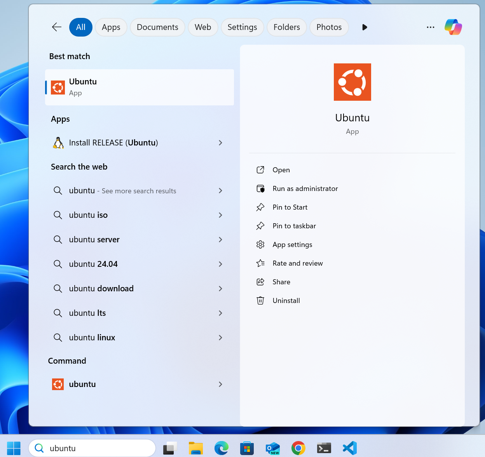
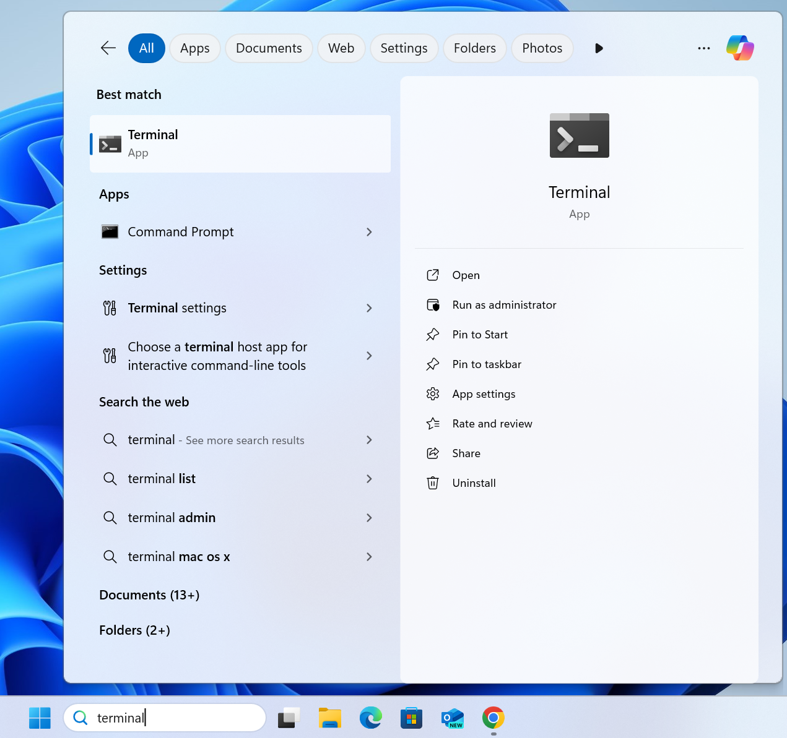
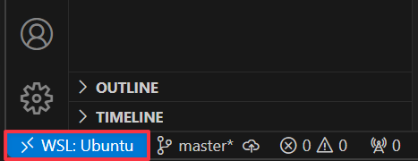

Bu bölüm, Solana geliştirme için yerel ortamınızı kurma adımlarını kapsar.

## Bağımlılıkları Kurun

- Windows kullanıcıları önce WSL'yi (Windows için Linux alt sistemi) kurmalı ve ardından
  aşağıdaki Linux bölümünde belirtilen bağımlılıkları yüklemelidir.
- Linux kullanıcıları önce aşağıdaki Linux bölümünde belirtilen bağımlılıkları yüklemelidir.
- Mac kullanıcıları, aşağıdaki Rust kurulum talimatlarıyla başlamalıdır.


Windows için Linux Alt Sistemi (WSL)

:::tip
Windows'da Solana programları geliştirmek için **mutlaka
[WSL](https://learn.microsoft.com/en-us/windows/wsl/install)** (Windows için
Linux alt sistemi) kullanmalısınız. Tüm ek bağımlılıklar Linux terminali aracılığıyla
kurulmalıdır.
:::

WSL kurulduktan sonra, Rust, Solana CLI ve Anchor CLI'yi kurmadan önce aşağıdaki
Linux bölümünde belirtilen bağımlılıkları kurun.

WSL'yi kurmak için Windows PowerShell'de aşağıdaki komutu çalıştırın:

```shell
wsl --install
```

Kurulum süreci, varsayılan bir kullanıcı hesabı oluşturmanızı isteyecektir.


Varsayılan olarak, WSL Ubuntu'yu kurar. "Ubuntu" olarak arama yaparak bir Linux terminali
açabilirsiniz.



Eğer Ubuntu terminaliniz aşağıdaki gibi görünüyorsa, terminalde `ctrl + v` (yapıştır kısayolu)
işlevini yerine getirmeyeceğiniz bir sorunla karşılaşabilirsiniz.


Bu sorunla karşılaşırsanız, "Terminal" olarak arama yaparak Windows Terminal'i açın.



Sonra, Windows Terminal'i kapatın ve tekrar "Ubuntu" araması yaparak bir Linux terminali açın.
Artık terminal aşağıdaki gibi görünmelidir; burada `ctrl + v` (yapıştır kısayolu) çalışır.


Eğer VS Code kullanıyorsanız, 
[WSL uzantısı](https://code.visualstudio.com/docs/remote/wsl-tutorial) WSL ve VS Code'u birlikte
kullanmanızı sağlar.


VS Code durum çubuğunda aşağıdakileri görmelisiniz:



:::info
WSL kurulduktan sonra, tüm ek bağımlılıklar Linux terminali aracılığıyla kurulmalıdır.
Rust, Solana CLI ve Anchor CLI'yi kurmadan önce aşağıdaki Linux bölümünde belirtilen
bağımlılıkları kurun.
:::


Linux

Anchor CLI kurulumu için gerekli bağımlılıklar şunlardır.

Öncelikle, aşağıdaki komutu çalıştırın:

```shell
sudo apt-get update
```

Sonra, aşağıdaki bağımlılıkları yükleyin:

```shell
sudo apt-get install -y \
    build-essential \
    pkg-config \
    libudev-dev llvm libclang-dev \
    protobuf-compiler libssl-dev
```

:::warning
`protobuf-compiler` yüklerken aşağıdaki hatayı alırsanız, önce `sudo apt-get update` çalıştırdığınızdan emin olun:
```
Package protobuf-compiler is not available, but is referred to by another package.
This may mean that the package is missing, has been obsoleted, or
is only available from another source
```
:::


---

### Rust'ı Kurun

Solana programları
[Rust programlama dili](https://www.rust-lang.org/) ile yazılmaktadır.

Rust için önerilen kurulum yöntemi
[rustup](https://www.rust-lang.org/tools/install)'dır.

Rust'ı kurmak için aşağıdaki komutu çalıştırın:

```shell
curl --proto '=https' --tlsv1.2 -sSf https://sh.rustup.rs | sh -s -- -y
```

Kurulum tamamlandıktan sonra aşağıdaki mesajı görmelisiniz:


Başarılı Rust Kurulum Mesajı

```
Rust now installed. Great!

To get started you may need to restart your current shell.
This would reload your PATH environment variable to include
Cargo's bin directory ($HOME/.cargo/bin).

To configure your current shell, you need to source
the corresponding env file under $HOME/.cargo.

This is usually done by running one of the following (note the leading DOT):
. "$HOME/.cargo/env"            # For sh/bash/zsh/ash/dash/pdksh
source "$HOME/.cargo/env.fish"  # For fish
```


PATH ortam değişkeninizi Cargo'nun bin dizinini içerecek şekilde yeniden yüklemek için aşağıdaki komutu çalıştırın:

```shell
. "$HOME/.cargo/env"
```

Kurulumun başarılı olduğunu doğrulamak için Rust sürümünü kontrol edin:

```shell
rustc --version
```

Aşağıdaki gibi bir çıktı görmelisiniz:

```
rustc 1.80.1 (3f5fd8dd4 2024-08-06)
```

---

### Solana CLI'yi Kurun

Solana CLI, Solana programlarını oluşturmak ve dağıtmak için gereken tüm araçları sağlar.

Solana CLI araç setini resmi kurulum komutu ile kurun:

```shell
sh -c "$(curl -sSfL https://release.anza.xyz/stable/install)"
```

`stable` kelimesini, istediğiniz sürümün yazılım versiyonuna karşılık gelen sürüm etiketi ile değiştirebilirsiniz (örneğin `v2.0.3`), veya üç sembolik kanal adından birini kullanabilirsiniz: `stable`, `beta` veya `edge`.

:::info
Eğer Solana CLI'yi ilk kez kuruyorsanız, PATH ortam değişkenini eklemeniz için aşağıdaki mesajı görebilirsiniz:
```
Close and reopen your terminal to apply the PATH changes or run the following in your existing shell:

export PATH="/Users/test/.local/share/solana/install/active_release/bin:$PATH"
```
:::


Eğer bir Linux veya WSL terminali kullanıyorsanız, kurulumdan alınan komutla kaydedilen PATH ortam değişkenini terminal yapılandırma dosyanıza eklemek için aşağıdaki komutu çalıştırabilirsiniz:

```shell
export PATH="$HOME/.local/share/solana/install/active_release/bin:$PATH"
```


Eğer Mac kullanıyorsanız ve `zsh` kullanıyorsanız, kurulumdan alınan varsayılan `export PATH` komutu terminalinizi kapattıktan sonra kalıcı olmaz.

Bunun yerine, PATH'e shell yapılandırma dosyanıza eklemek için aşağıdaki komutu çalıştırabilirsiniz:

```shell
echo 'export PATH="$HOME/.local/share/solana/install/active_release/bin:$PATH"' >> ~/.zshrc
```

Sonrasında, terminal oturumunu yenilemek veya terminalinizi yeniden başlatmak için aşağıdaki komutu çalıştırın.

```shell
source ~/.zshrc
```


Kurulumun başarılı olduğunu doğrulamak için Solana CLI sürümünü kontrol edin:

```shell
solana --version
```

Aşağıdaki gibi bir çıktı görmelisiniz:

```
solana-cli 1.18.22 (src:9efdd74b; feat:4215500110, client:Agave)
```

Tüm mevcut sürümleri
[Agave Github reposunda](https://github.com/anza-xyz/agave/releases) görüntüleyebilirsiniz.


Agave, [Anza](https://www.anza.xyz/) tarafından sağlanan bir doğrulayıcı istemcisidir; önceden Solana Labs doğrulayıcı istemcisi olarak biliniyordu.


Sonradan Solana CLI'yi en son sürüme güncellemek için aşağıdaki komutu kullanabilirsiniz:

```shell
agave-install update
```

---

### Anchor CLI'yi Kurun

[Anchor](https://www.anchor-lang.com/) Solana programları geliştirmek için bir çerçevedir. Anchor çerçevesi, Solana programlarını yazma sürecini basitleştirmek için Rust makrolarını kullanır.

Anchor CLI ve araçlarını kurmanın iki yolu vardır:

1. Anchor Sürüm Yöneticisi (AVM) kullanarak - bu **önerilen kurulum** yöntemidir,
   çünkü gelecekte Anchor sürümlerini güncellemeyi kolaylaştırır.
2. AVM olmadan - bu daha manuel bir süreç gerektirir ve Anchor sürümlerini daha sonra
   güncellemeyi zorlaştırır.


Anchor sürüm yöneticisi (AVM), sisteminizde farklı Anchor sürümlerini kurmanıza ve
yönetmenize olanak tanır, ayrıca gelecekte Anchor sürümlerini daha kolay güncellemeyi sağlar.

AVM'yi aşağıdaki komut ile kurun:

```shell
cargo install --git https://github.com/coral-xyz/anchor avm --force
```

AVM'nin kurulduğunu ve erişilebilir olduğunu test edin:

```shell
avm --version
```

AVM kullanarak Anchor CLI'nin en son sürümünü kurun:

```shell
avm install latest
avm use latest
```

Ya da, hangi sürümü kurmak istediğinizi belirterek Anchor CLI'nin belirli bir sürümünü kurun:

```shell
avm install 0.30.1
avm use 0.30.1
```

> Hangi Anchor CLI sürümünün sisteminizde kullanılacağını belirtmek için `avm use` komutunu çalıştırmayı unutmayın.
> 
> - Eğer `latest` sürümünü kurduysanız, `avm use latest` çalıştırın.
> - Eğer `0.30.1` sürümünü kurduysanız, `avm use 0.30.1` çalıştırın.


Anchor CLI'nin belirli bir sürümünü aşağıdaki komut ile kurun:

```shell
cargo install --git https://github.com/coral-xyz/anchor --tag v0.30.1 anchor-cli
```


Kurulum sırasında aşağıdaki uyarıyı görebilirsiniz. Ancak, bu kurulum sürecini etkilemez.


uyarı: beklenmeyen `cfg` durumu adı: `nightly`

```
warning: unexpected `cfg` condition name: `nightly`
 --> cli/src/lib.rs:1:13
  |
1 | #![cfg_attr(nightly, feature(proc_macro_span))]
  |             ^^^^^^^
  |
  = help: expected names are: `clippy`, `debug_assertions`, `doc`, `docsrs`, `doctest`, `feature`, `miri`, `overflow_checks`, `panic`, `proc_macro`, `relocation_model`, `rustfmt`, `sanitize`, `sanitizer_cfi_generalize_pointers`, `sanitizer_cfi_normalize_integers`, `target_abi`, `target_arch`, `target_endian`, `target_env`, `target_family`, `target_feature`, `target_has_atomic`, `target_has_atomic_equal_alignment`, `target_has_atomic_load_store`, `target_os`, `target_pointer_width`, `target_thread_local`, `target_vendor`, `test`, `ub_checks`, `unix`, ve `windows`
  = help: consider using a Cargo feature instead
  = help: or consider adding in `Cargo.toml` the `check-cfg` lint config for the lint:
           [lints.rust]
           unexpected_cfgs = { level = "warn", check-cfg = ['cfg(nightly)'] }
  = help: or consider adding `println!("cargo::rustc-check-cfg=cfg(nightly)");` to the top of the `build.rs`
  = note: see <https://doc.rust-lang.org/nightly/rustc/check-cfg/cargo-specifics.html> for more information about checking conditional configuration
  = note: `#[warn(unexpected_cfgs)]` varsayılan olarak açıktır.

warning: `anchor-cli` (lib) 1 uyarı üretti.
```


Kurulumun başarılı olduğunu doğrulamak için Anchor CLI versiyonunu kontrol edin:

```shell
anchor --version
```

Aşağıdaki gibi bir çıktı görmelisiniz:

```
anchor-cli 0.30.1
```

Linux veya WSL'de Anchor CLI'yi kurarken aşağıdaki hatayla karşılaşırsanız:

```
error: could not exec the linker cc = note: Permission denied (os error 13)
```

Bu hata mesajını görürseniz, şu adımları izleyin:

1. Bu sayfanın üst kısmındaki Linux bölümünde listelenen bağımlılıkları yükleyin.
2. Anchor CLI'yi tekrar yüklemeyi deneyin.

---

#### Node.js ve Yarn

Node.js ve Yarn, `anchor init` komutuyla oluşturulan varsayılan Anchor proje test dosyasını (TypeScript) çalıştırmak için gereklidir. (Rust test şablonu da vardır; `anchor init --test-template rust` komutuyla kullanılabilir.)


Node Kurulumu

Node'u kurmanın önerilen yolu
[Node Version Manager (nvm)](https://github.com/nvm-sh/nvm) kullanmaktır.

NVM'yi aşağıdaki komut ile kurun:

```shell
curl -o- https://raw.githubusercontent.com/nvm-sh/nvm/master/install.sh | bash
```

Terminalinizi yeniden başlatın ve NVM'nin kurulu olduğunu doğrulayın:

```shell
command -v nvm
```

Sonra, `nvm` kullanarak node'u kurun:

```shell
nvm install node
```

Kurulumun başarılı olduğunu doğrulamak için Node sürümünü kontrol edin:

```
node --version
```

Aşağıdaki gibi bir çıktı görmelisiniz:

```
v22.7.0
```


Yarn Kurulumu

Yarn'ı kurun:

```shell
npm install --global yarn
```

Kurulumun başarılı olduğunu doğrulamak için Yarn sürümünü kontrol edin:

```
yarn --version
```

Aşağıdaki çıktı ile karşılaşmalısınız:

```
1.22.1
```


---

`anchor build` komutunu çalıştırırken aşağıdaki gibi `not a directory` hatası ile karşılaşırsanız:

```
error: not a directory: '.../solana-release/bin/sdk/sbf/dependencies/platform-tools/rust/lib'
```

Bu çözümleri deneyin:

1. Aşağıdaki komutu kullanarak zorla yükleyin:

```shell
cargo build-sbf --force-tools-install
```

2. Eğer bu işe yaramazsa, Solana önbelleğini temizleyin:

```shell
rm -rf ~/.cache/solana/*
```

Herhangi bir çözümü uyguladıktan sonra `anchor build` komutunu tekrar çalıştırmayı deneyin.

Eğer Linux veya WSL kullanıyorsanız ve bir yeni Anchor projesi oluşturduktan sonra `anchor test` komutunu çalıştırırken aşağıdaki hatalarla karşılaşırsanız, bunun nedeni Node.js veya Yarn'ın eksik olması olabilir:

```
Permission denied (os error 13)
```

```
No such file or directory (os error 2)
```

---

## Solana CLI Temelleri

Bu bölüm, başlamanız için bazı yaygın Solana CLI komutlarına göz atar.

### Solana Yapılandırması

Mevcut yapılandırmanızı görmek için:

```shell
solana config get
```

Aşağıdaki gibi bir çıktı görmelisiniz:

```
Config File: /Users/test/.config/solana/cli/config.yml
RPC URL: https://api.mainnet-beta.solana.com
WebSocket URL: wss://api.mainnet-beta.solana.com/ (computed)
Keypair Path: /Users/test/.config/solana/id.json
Commitment: confirmed
```

RPC URL'si ve WebSocket URL'si, CLI'nin istek yapacağı Solana kümesini belirtir. Varsayılan olarak bu `mainnet-beta` olacaktır.

Solana CLI kümesini güncellemek için aşağıdaki komutları kullanabilirsiniz:

```
solana config set --url mainnet-beta
solana config set --url devnet
solana config set --url localhost
solana config set --url testnet
```

Aşağıdaki kısa seçenekleri de kullanabilirsiniz:

```
solana config set -um    # mainnet-beta için
solana config set -ud    # devnet için
solana config set -ul    # localhost için
solana config set -ut    # testnet için
```

Keypair Path, Solana CLI tarafından kullanılan varsayılan cüzdanın konumunu belirtir (işlem ücretlerini ödemek ve programları dağıtmak için). Varsayılan yol `~/.config/solana/id.json`'dır. Bir sonraki adım, varsayılan konumda bir keypair oluşturma sürecini açıklamaktadır.

---

### Cüzdan Oluşturma

Solana CLI kullanarak Solana ağıyla etkileşimde bulunmak için, SOL ile finanse edilmiş bir Solana cüzdanına ihtiyacınız var.

Varsayılan Keypair Path'ta bir keypair oluşturmak için aşağıdaki komutu çalıştırın:

```shell
solana-keygen new
```

Aşağıdaki gibi bir çıktı görmelisiniz:

```
Generating a new keypair

For added security, enter a BIP39 passphrase

NOTE! This passphrase improves security of the recovery seed phrase NOT the
keypair file itself, which is stored as insecure plain text

BIP39 Passphrase (empty for none):

Wrote new keypair to /Users/test/.config/solana/id.json
===========================================================================
pubkey: 8dBTPrjnkXyuQK3KDt9wrZBfizEZijmmUQXVHpFbVwGT
===========================================================================
Save this seed phrase and your BIP39 passphrase to recover your new keypair:
cream bleak tortoise ocean nasty game gift forget fancy salon mimic amazing
===========================================================================
```


Varsayılan konumda kaydedilmiş bir dosya sistem cüzdanınız varsa, bu komut **ÜSTÜNE YAZMAZ**; bunu açıkça `--force` bayrağını kullanarak zorlayana kadar geçerli olacaktır.


Keypair oluşturulduktan sonra, aşağıdaki komut ile keypair'in adresini (açık anahtar) alabilirsiniz:

```shell
solana address
```

---

### SOL Airdrop

Yerel cüzdanınızı kurduktan sonra, cüzdanınızı finanse etmek için bir airdrop SOL isteyin. İşlem ücretlerini ödemek ve programları dağıtmak için SOL'e ihtiyacınız var.

Kümenizi devnet'e ayarlayın:

```shell
solana config set -ud
```

Sonra devnet SOL için bir airdrop talep edin:

```shell
solana airdrop 2
```

Cüzdanınızdaki SOL bakiyesini kontrol etmek için aşağıdaki komutu çalıştırın:

```shell
solana balance
```

:::note
`solana airdrop` komutu şu anda devnet üzerinde isteğe bağlı olarak sınırlıdır. Hatalar büyük olasılıkla hız sınırlamalarından kaynaklanmaktadır.

Alternatif olarak, devnet SOL almak için
[Solana Web Faucet](https://faucet.solana.com)'ı kullanabilirsiniz.
:::

---

### Yerel Doğrulayıcıyı Çalıştırma

Solana CLI, dahili olarak
[test doğrulayıcı](https://docs.solanalabs.com/cli/examples/test-validator) ile birlikte gelir. Yerel bir doğrulayıcı çalıştırmak, programlarınızı yerel olarak dağıtmanıza ve test etmenize olanak tanır.

Ayrı bir terminalde, yerel bir doğrulayıcı başlatmak için aşağıdaki komutu çalıştırın:

```shell
solana-test-validator
```

:::tip
WSL'de, önce varsayılan yazma erişiminizin olduğu bir klasöre gitmeniz gerekebilir:

```shell
cd ~
mkdir validator
cd validator
solana-test-validator
```
:::

Komutlar öncesinde Solana CLI yapılandırmanızı localhost olarak güncellemeyi unutmayın.

```shell
solana config set -ul
```