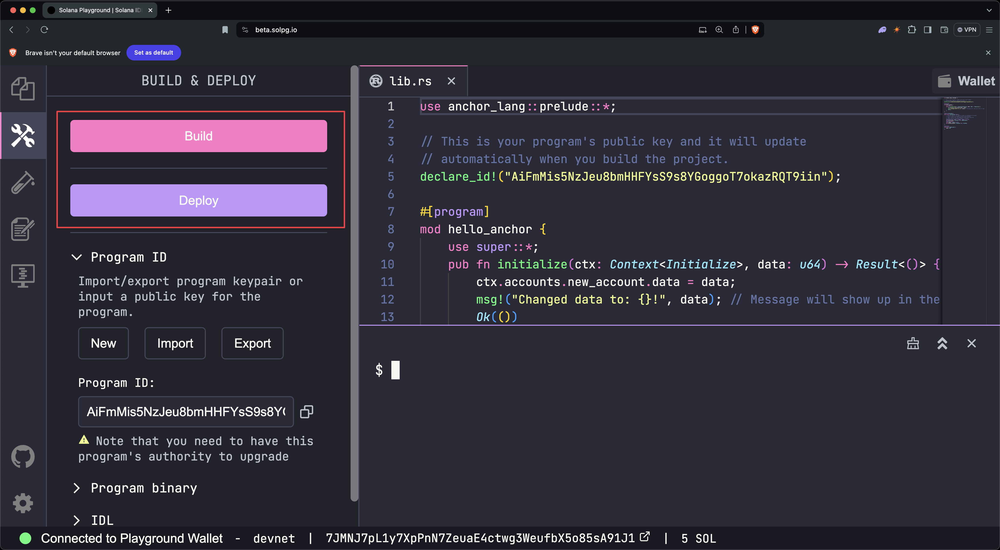
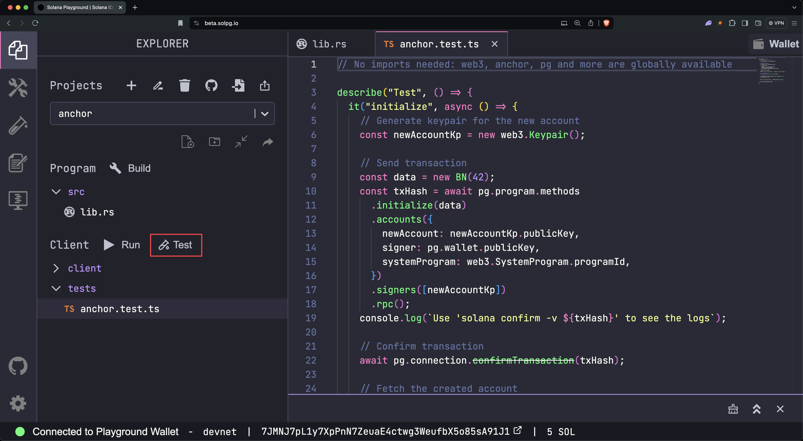

Bu bölümde, Anchor framework'ünü kullanarak basit bir Solana programı inşa edecek, dağıtacak ve test edeceğiz. Sonunda, ilk programınızı Solana blockchain'ine dağıtmış olacaksınız!

:::info
Bu bölümün amacı, sizi Solana Playground ile tanıştırmaktır. Daha ayrıntılı bir örneği PDA ve CPI bölümlerinde ele alacağız. Daha fazla bilgi için `Solana'daki Programlar` sayfasına başvurun.
:::


### Anchor Projesi Oluşturma

Öncelikle, yeni bir tarayıcı sekmesinde [solpg.io](https://beta.solpg.io) adresini açın.

- Sol paneldeki "Yeni bir proje oluştur" butonuna tıklayın.
- Bir proje adı girin, framework olarak Anchor'ı seçin ve ardından "Oluştur" butonuna tıklayın.


`src/lib.rs` dosyasında program kodu ile yeni bir projenin oluşturulduğunu göreceksiniz.

```rust filename="lib.rs"
use anchor_lang::prelude::*;

// Bu, programınızın genel anahtarıdır ve proje
// oluşturduğunuzda otomatik olarak güncellenir.
declare_id!("11111111111111111111111111111111");

#[program]
mod hello_anchor {
    use super::*;
    pub fn initialize(ctx: Context<Initialize>, data: u64) -> Result<()> {
        ctx.accounts.new_account.data = data;
        msg!("Veri değiştirildi: {}!", data); // Mesaj tx günlüklerinde görünecek
        Ok(())
    }
}

#[derive(Accounts)]
pub struct Initialize<'info> {
    // Bir hesabı başlatmak için alanı belirtmeliyiz.
    // İlk 8 byte varsayılan hesap ayırt edicisidir,
    // sonraki 8 byte NewAccount.data değerinin u64 tipinden gelir.
    // (u64 = 64 bit işaretsiz tam sayı = 8 byte)
    #[account(init, payer = signer, space = 8 + 8)]
    pub new_account: Account<'info, NewAccount>,
    #[account(mut)]
    pub signer: Signer<'info>,
    pub system_program: Program<'info, System>,
}

#[account]
pub struct NewAccount {
    data: u64
}
```


Şu anda, program kodunun yüksek seviyeli genel görünümünü geliştireceğiz:

- `declare_id!` makrosu, programınızın zincir üzerindeki adresini belirtir. Bu, programı bir sonraki adımda inşa ettiğimizde otomatik olarak güncellenecektir.

  ```rs
  declare_id!("11111111111111111111111111111111");
  ```

- `#[program]` makrosu, programın talimatlarını temsil eden fonksiyonlar içeren bir modülü işaretler.

  ```rs
  #[program]
  mod hello_anchor {
      use super::*;
      pub fn initialize(ctx: Context<Initialize>, data: u64) -> Result<()> {
          ctx.accounts.new_account.data = data;
          msg!("Veri değiştirildi: {}!", data); // Mesaj günlüklerde görünecek
          Ok(())
      }
  }
  ```

  Bu örnekte, `initialize` talimatı iki parametre alır:

  1. `ctx: Context` - Bu talimat için gereken hesaplara erişim sağlar, `Initialize` yapısında belirtildiği gibi.
  2. `data: u64` - Talimat çağrıldığında geçilecek bir talimat parametresidir.

  Fonksiyonun gövdesi, geçilen `data` argümanını `new_account`'ın `data` alanına atar ve ardından bir mesajı program günlüklerine yazar.

- `#[derive(Accounts)]` makrosu, belirli bir talimat için gereken hesapları belirten bir yapı tanımlamak için kullanılır; her alan ayrı bir hesabı temsil eder.

  Alan türleri (örn. `Signer`) ve kısıtlamalar (örn. `#[account(mut)]`) Anchor tarafından hesap doğrulamasına ilişkin yaygın güvenlik kontrollerini otomatik olarak yönetmek için kullanılır.

  ```rs
  #[derive(Accounts)]
  pub struct Initialize<'info> {
      #[account(init, payer = signer, space = 8 + 8)]
      pub new_account: Account<'info, NewAccount>,
      #[account(mut)]
      pub signer: Signer<'info>,
      pub system_program: Program<'info, System>,
  }
  ```

- `#[account]` makrosu, program tarafından oluşturulan ve sahip olunan bir hesabın veri yapısını temsil eden bir yapı tanımlamak için kullanılır.

  ```rs
  #[account]
  pub struct NewAccount {
    data: u64
  }
  ```


### Programı İnşa Et ve Dağıt

Programı inşa etmek için, terminalde `build` komutunu çalıştırın.

```shell filename="Terminal"
build
```

`declare_id!()` içindeki adresin güncellendiğini fark edeceksiniz. Bu, programınızın zincir üzerindeki adresidir.


```shell filename="Terminal"
$ build
İnşa ediliyor...
İnşa başarılı. 1.46s içinde tamamlandı.
```


Program başarıyla inşa edildikten sonra, programı ağda (varsayılan olarak devnet) dağıtmak için terminalde `deploy` komutunu çalıştırın. Bir programı dağıtmak için, programı depolayan zincir üzerindeki hesaba SOL tahsis edilmelidir.

:::warning
Dağıtım öncesinde yeterli SOL'a sahip olduğunuzdan emin olun. Devnet SOL'u, Playground terminalinde `solana airdrop 5` komutunu çalıştırarak veya [Web Faucet](https://faucet.solana.com/) kullanarak alabilirsiniz.
:::

```shell filename="Terminal"
deploy
```


```shell filename="Terminal"
$ deploy
Dağıtılıyor... Bu, program boyutuna ve ağ koşullarına bağlı olarak bir süre alabilir.
Uyarı: 1 işlem onaylanmadı, yeniden deniyorum...
Dağıtım başarılı. 19s içinde tamamlandı.
```


Alternatif olarak, sol paneldeki `Build` ve `Deploy` butonlarını da kullanabilirsiniz.



Program dağıtıldıktan sonra, artık talimatlarını çağırabilirsiniz.

### Programı Test Et

Başlangıç kodu ile birlikte, `tests/anchor.test.ts` dosyasında bir test dosyası bulunmaktadır. Bu dosya, istemciden başlangıç programında `initialize` talimatını nasıl çağıracağınızı göstermektedir.

```ts filename="anchor.test.ts"
// İthalat gerekmez: web3, anchor, pg ve diğerleri küresel olarak mevcuttur

describe("Test", () => {
  it("initialize", async () => {
    // Yeni hesap için anahtar çifti oluşturma
    const newAccountKp = new web3.Keypair();

    // İşlem gönderme
    const data = new BN(42);
    const txHash = await pg.program.methods
      .initialize(data)
      .accounts({
        newAccount: newAccountKp.publicKey,
        signer: pg.wallet.publicKey,
        systemProgram: web3.SystemProgram.programId,
      })
      .signers([newAccountKp])
      .rpc();
    console.log(`Günlükleri görmek için 'solana confirm -v ${txHash}' komutunu kullanın`);

    // İşlemi onaylama
    await pg.connection.confirmTransaction(txHash);

    // Oluşturulan hesabı alma
    const newAccount = await pg.program.account.newAccount.fetch(
      newAccountKp.publicKey,
    );

    console.log("Zincir üzerindeki veri:", newAccount.data.toString());

    // Zincir üzerindeki verinin, yerel 'data' ile eşit olup olmadığını kontrol etme
    assert(data.eq(newAccount.data));
  });
});
```

Program dağıtıldıktan sonra test dosyasını çalıştırmak için terminalde `test` komutunu çalıştırın.

```shell filename="Terminal"
test
```

Testin başarıyla geçtiğini gösteren bir çıktı almalısınız.


```shell filename="Terminal"
$ test
Testler çalıştırılıyor...
  hello_anchor.test.ts:
  hello_anchor
    Günlükleri görmek için 'solana confirm -v 3TewJtiUz1EgtT88pLJHvKFzqrzDNuHVi8CfD2mWmHEBAaMfC5NAaHdmr19qQYfTiBace6XUmADvR4Qrhe8gH5uc' komutunu kullanın
    Zincir üzerindeki veri: 42
    ✔ initialize (961ms)
  1 geçerli (963ms)
```


Alternatif olarak, sol paneldeki `Test` butonunu da kullanabilirsiniz.



Test çıktısından işlem hash'ini (imzasını) belirtip `solana confirm -v` komutunu çalıştırarak işlem günlüklerini görüntüleyebilirsiniz:

```shell filename="Terminal"
solana confirm -v [TxHash]
```

Örneğin:

```shell filename="Terminal"
solana confirm -v 3TewJtiUz1EgtT88pLJHvKFzqrzDNuHVi8CfD2mWmHEBAaMfC5NAaHdmr19qQYfTiBace6XUmADvR4Qrhe8gH5uc
```


```shell filename="Terminal" {29-35}
$ solana confirm -v 3TewJtiUz1EgtT88pLJHvKFzqrzDNuHVi8CfD2mWmHEBAaMfC5NAaHdmr19qQYfTiBace6XUmADvR4Qrhe8gH5uc
RPC URL: https://api.devnet.solana.com
Varsayılan İmzalayıcı: Playground Wallet
Taahhüt: onaylı

İşlem 308150984 slotunda gerçekleştirildi:
  Blok Zamanı: 2024-06-25T12:52:05-05:00
  Versiyon: eski
  Son Blok Hash: 7AnZvY37nMhCybTyVXJ1umcfHSZGbngnm4GZx6jNRTNH
  İmza 0: 3TewJtiUz1EgtT88pLJHvKFzqrzDNuHVi8CfD2mWmHEBAaMfC5NAaHdmr19qQYfTiBace6XUmADvR4Qrhe8gH5uc
  İmza 1: 3TrRbqeMYFCkjsxdPExxBkLAi9SB2pNUyg87ryBaTHzzYtGjbsAz9udfT9AkrjSo1ZjByJgJHBAdRVVTZv6B87PQ
  Hesap 0: srw- 3z9vL1zjN6qyAFHhHQdWYRTFAcy69pJydkZmSFBKHg1R (ücret ödeyici)
  Hesap 1: srw- c7yy8zdP8oeZ2ewbSb8WWY2yWjDpg3B43jk3478Nv7J
  Hesap 2: -r-- 11111111111111111111111111111111
  Hesap 3: -r-x 2VvQ11q8xrn5tkPNyeraRsPaATdiPx8weLAD8aD4dn2r
  Talimat 0
    Program:   2VvQ11q8xrn5tkPNyeraRsPaATdiPx8weLAD8aD4dn2r (3)
    Hesap 0: c7yy8zdP8oeZ2ewbSb8WWY2yWjDpg3B43jk3478Nv7J (1)
    Hesap 1: 3z9vL1zjN6qyAFHhHQdWYRTFAcy69pJydkZmSFBKHg1R (0)
    Hesap 2: 11111111111111111111111111111111 (2)
    Veri: [175, 175, 109, 31, 13, 152, 155, 237, 42, 0, 0, 0, 0, 0, 0, 0]
  Durum: Tamam
    Ücret: ◎0.00001
    Hesap 0 bakiye: ◎5.47001376 -> ◎5.46900152
    Hesap 1 bakiye: ◎0 -> ◎0.00100224
    Hesap 2 bakiye: ◎0.000000001
    Hesap 3 bakiye: ◎0.00139896
  Günlük Mesajları:
    Program 2VvQ11q8xrn5tkPNyeraRsPaATdiPx8weLAD8aD4dn2r çağrıldı [1]
    Program günlüğü: Talimat: Başlat
    Program 11111111111111111111111111111111 çağrıldı [2]
    Program 11111111111111111111111111111111 başarılı
    Program günlüğü: Veri değiştirildi: 42!
    Program 2VvQ11q8xrn5tkPNyeraRsPaATdiPx8weLAD8aD4dn2r toplamda 5661 hesaplama birimini kullandı
    Program 2VvQ11q8xrn5tkPNyeraRsPaATdiPx8weLAD8aD4dn2r başarılı

Onaylandı
```


Alternatif olarak, işlem detaylarını [SolanaFM](https://solana.fm/) veya [Solana Explorer](https://explorer.solana.com/?cluster=devnet) üzerinden, işlem imzasını (hash'ini) aratarak görüntüleyebilirsiniz.


  Explorer üzerinde Solana Playground ile eşleşecek şekilde küme (ağ) bağlantısını güncellemeyi hatırlatır. Solana Playground'un varsayılan kümesi devnet'tir.


### Programı Kapatma

Son olarak, zincir üzerindeki programa tahsis edilen SOL, programı kapatmak yoluyla tamamen geri alınabilir.

Bir programı kapatmak için, aşağıdaki komutu çalıştırabilir ve `declare_id!()` içinde bulunan program adresini belirtebilirsiniz:

```shell filename="Terminal"
solana program close [ProgramID]
```

Örneğin:

```shell filename="Terminal"
solana program close 2VvQ11q8xrn5tkPNyeraRsPaATdiPx8weLAD8aD4dn2r
```


```shell filename="Terminal"
$ solana program close 2VvQ11q8xrn5tkPNyeraRsPaATdiPx8weLAD8aD4dn2r
Kapalı Program Id 2VvQ11q8xrn5tkPNyeraRsPaATdiPx8weLAD8aD4dn2r, 2.79511512 SOL geri kazanıldı
```


Yalnızca programın güncelleme yetkisi onu kapatabilir. Güncelleme yetkisi, program dağıtıldığında belirlenir ve programı değiştirme veya kapatma yetkisine sahip olan tek hesaptır. Eğer güncelleme yetkisi iptal edilirse, program değiştirilemez hale gelir ve asla kapatılamaz veya güncellenemez.

Solana Playground üzerinde programlar dağıttığınızda, Playground cüzdanınız tüm programlarınız için güncelleme yetkisi olarak atanmıştır.


:::tip
Tebrikler! Anchor framework'ünü kullanarak ilk Solana programınızı inşa edip dağıttınız!
::: 

