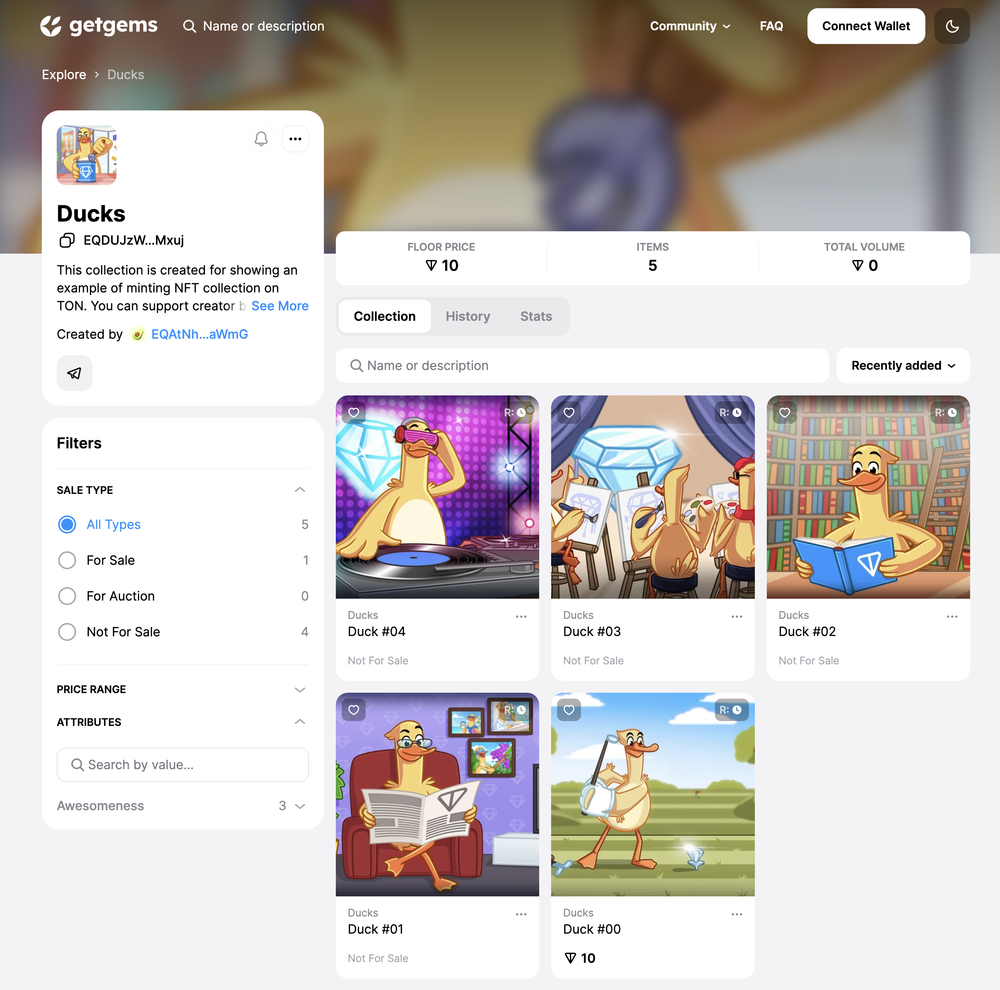
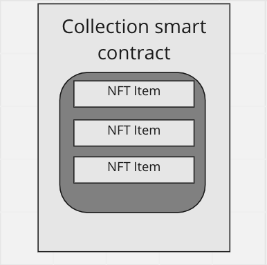
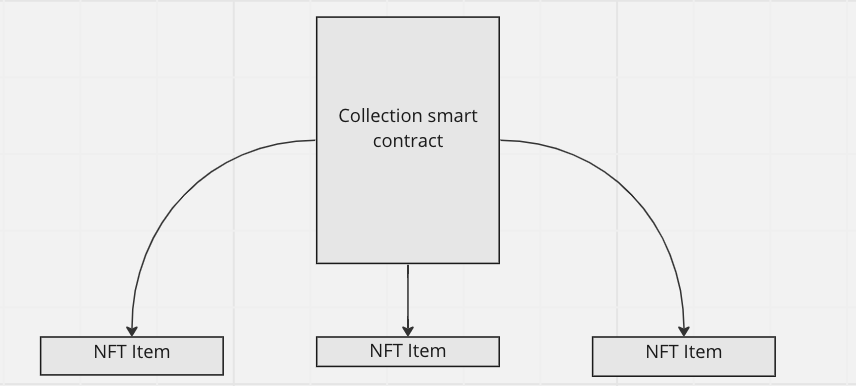
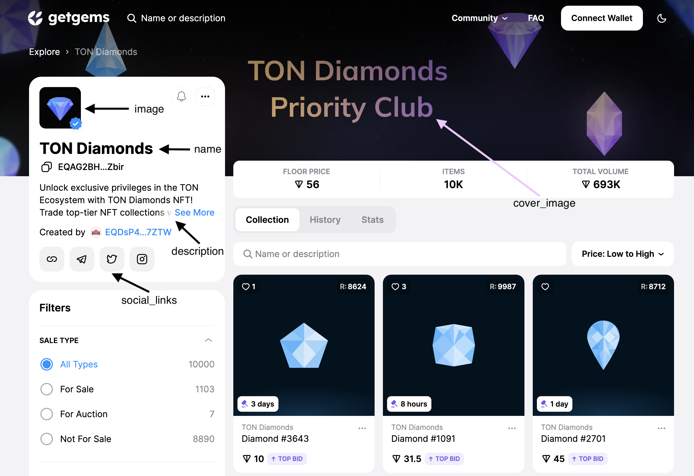
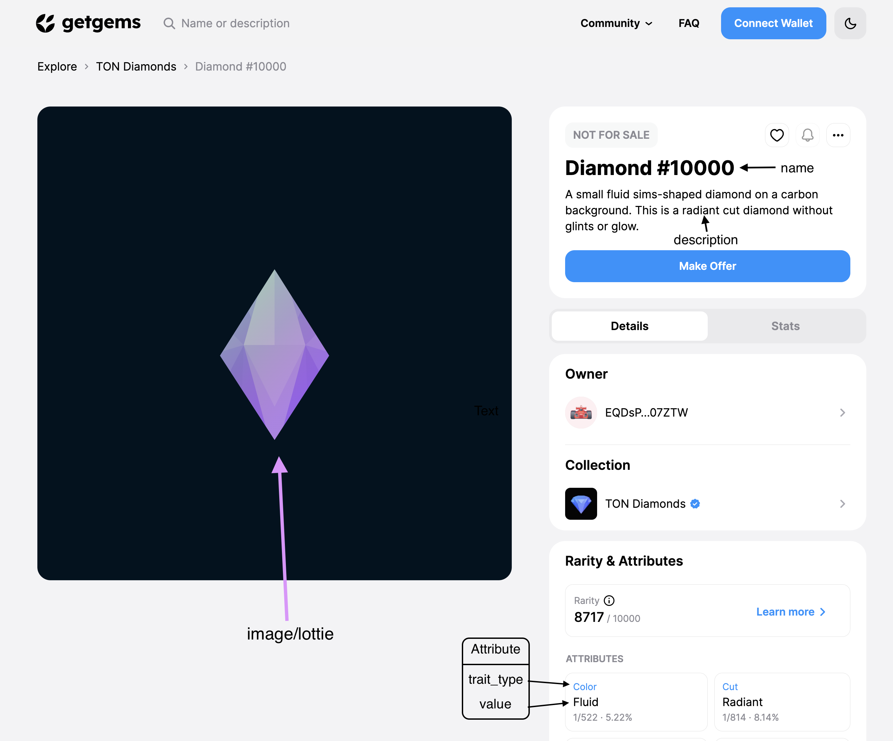

# Adım Adım NFT Koleksiyonu Mintleme

## 👋 Giriş
Değiştirilemeyen tokenlar (NFT'ler), dijital sanat ve koleksiyonlar dünyasında en sıcak konulardan biri haline geldi. NFT'ler, sahipliği ve özgünlüğü doğrulamak için blok zinciri teknolojisi kullanan benzersiz dijital varlıklardır. Bu, yaratıcılar ve koleksiyoncular için dijital sanat, müzik, videolar ve diğer dijital içerik formlarını para kazanma ve takas etme konusunda yeni olanaklar sunmuştur. Son yıllarda NFT pazarı patladı, bazı yüksek profilli satışlar milyonlarca dolara ulaştı. Bu makalede, adım adım TON'da bir NFT koleksiyonu oluşturacağız.

**Bu, bu eğitimin sonunda oluşturacağınız güzel ördek koleksiyonudur:**



## 🦄 Ne Öğreneceksiniz
1. TON'da NFT koleksiyonu mintleyeceksiniz.
2. TON'daki NFT'lerin nasıl çalıştığını anlayacaksınız.
3. NFT'yi satışa koyacaksınız.
4. Metadata'yı [pinata.cloud](https://pinata.cloud) üzerine yükleyeceksiniz.

## 💡 Ön Gereksinimler
Zaten içinde en az 2 TON bulunan bir test ağı cüzdanınız olmalıdır. Test ağı coinlerini [@testgiver_ton_bot](https://t.me/testgiver_ton_bot) adresinden alabilirsiniz.

:::info 
Tonkeeper cüzdanımın testnet versiyonunu nasıl açabilirim?  
Testnet ağını Tonkeeper'da açmak için ayarlara gidin ve altta bulunan Tonkeeper logosuna 5 kez tıklayın. Ardından "mainnet" yerine "testnet"i seçin.
:::

Pinata'yı IPFS depolama sistemimiz olarak kullanacağız, bu yüzden [pinata.cloud](https://pinata.cloud) üzerinde bir hesap oluşturmanız ve api_key ile api_secret almanız gerekecek. Resmi Pinata [belge öğreticisi](https://docs.pinata.cloud/account-management/api-keys) bu konuda size yardımcı olabilir. Bu API belirteçlerine sahip olduğunuzda, sizi burada bekliyor olacağım!

## 💎 TON'daki NFT Nedir?

Öğreticimizin ana kısmına başlamadan önce, genel anlamıyla TON'daki NFT'lerin nasıl çalıştığını anlamamız gerekiyor. Beklenmedik bir şekilde, diğer blok zincirlerine kıyasla TON'daki NFT uygulamasının benzersizliğini anlamak için Ethereum (ETH) üzerindeki NFT'lerin nasıl çalıştığına dair bir açıklama ile başlayacağız.

### ETH'deki NFT Uygulaması 

ETH'deki NFT'nin uygulanması son derece basittir - koleksiyonun 1 ana sözleşmesi vardır, bu sözleşme, bu koleksiyondaki NFT'lerin verilerini saklayan basit bir hashmap içerir. Bu koleksiyonla ilgili tüm talepler (herhangi bir kullanıcının NFT'yi aktarmak istemesi, satışa koyması vb.) bu tek koleksiyon sözleşmesine özel olarak gönderilir.



### TON'da Böyle Uygulama ile Oluşabilecek Problemler

TON bağlamında böyle bir uygulamanın sorunları, [NFT standardı](https://github.com/ton-blockchain/TEPs/blob/master/text/0062-nft-standard.md) ile mükemmel bir şekilde tanımlanmıştır:

* **Öngörülemeyen gaz tüketimi:** TON'da, sözlük işlemleri için gaz tüketimi, anahtarlar kümesine bağlıdır. Ayrıca, TON asenkron bir blok zinciridir. Bu, bir akıllı sözleşmeye bir mesaj gönderdiğinizde, diğer kullanıcılardan kaç tane mesajın akıllı sözleşmeye ulaşacağını bilemeyeceğiniz anlamına gelir. Sonuç olarak, mesajınız akıllı sözleşmeye ulaştığında sözlüğün boyutunun ne olacağını bilemezsiniz. Bu, basit bir cüzdan -> NFT akıllı sözleşmesi etkileşimi için uygundur, ancak akıllı sözleşme zincirleri için kabul edilemez; örneğin, cüzdan -> NFT akıllı sözleşmesi -> açık artırma -> NFT akıllı sözleşmesi. Gaz tüketimini öngöremiyorsak, NFT akıllı sözleşmesinin sahibi değişebilir, ancak açık artırma operasyonu için yeterli Toncoin olmayabilir. Sözlük kullanmayan akıllı sözleşmeler, belirleyici gaz tüketimi sağlar.

* **Ölçeklenemez (dar boğaz olur):** TON'daki ölçeklenme, otomatik olarak yük altında shardchain'lere bölünme kavramına dayanır. Popüler NFT'nin tek büyük akıllı sözleşmesi bu kavramla çelişmektedir. Bu durumda, birçok işlem bir tek akıllı sözleşmeye atıfta bulunacaktır. TON mimarisi şard edilmiş akıllı sözleşmeleri öngörmektedir (bkz. beyaz kitap), ancak şu anda uygulanmamıştır.

> **TL;DR** ETH çözümü ölçeklenebilir değil ve asenkron blok zinciri olan TON için uygun değil.

### TON NFT Uygulaması

TON'da, ana sözleşmemiz - koleksiyonumuzun akıllı sözleşmesi, metadata'sını ve sahibinin adresini saklar ve en önemlisi - yeni NFT öğesi oluşturmak ("mint") istiyorsak, bu koleksiyon sözleşmesine bir mesaj göndermemiz yeterlidir. Bu koleksiyon sözleşmesi, sağladığımız verileri kullanarak bizim için yeni bir NFT öğesi sözleşmesi konuşlandıracaktır.



:::info
Daha derinlemesine incelemek istiyorsanız `TON'daki NFT işlemleri` makalesini kontrol edebilir veya [NFT standardı](https://github.com/ton-blockchain/TEPs/blob/master/text/0062-nft-standard.md) okuyabilirsiniz.
:::

## ⚙ Geliştirme Ortamını Kurma
Boş bir proje oluşturarak başlayalım:

1. Yeni bir klasör oluştur

```bash
mkdir MintyTON
```

2. Bu klasörü aç

```bash
cd MintyTON
```

3. Projemizi başlat

```bash
yarn init -y
```

4. TypeScript'i kur

```bash
yarn add typescript @types/node -D
```

5. TypeScript projesini başlat

```bash
tsc --init
```

6. Bu yapılandırmayı `tsconfig.json`'a kopyalayın

```json
{
    "compilerOptions": {
      "module": "commonjs",
      "target": "es6",
      "lib": ["ES2022"],
      "moduleResolution": "node",
      "sourceMap": true,
      "outDir": "dist",
      "baseUrl": "src",
      "emitDecoratorMetadata": true,
      "experimentalDecorators": true,
      "strict": true,
      "esModuleInterop": true,
      "strictPropertyInitialization": false
    },
    "include": ["src/**/*"]
}
```

7. `package.json`'a uygulamayı derlemek ve başlatmak için bir betik ekleyin

```json
"scripts": {
    "start": "tsc --skipLibCheck && node dist/app.js"
  },
```

8. Gerekli kütüphaneleri kur

```bash
yarn add @pinata/sdk dotenv @ton/ton @ton/crypto @ton/core buffer
```

9. `.env` dosyası oluşturun ve bu şablona dayalı verilerinizi ekleyin
```
PINATA_API_KEY=your_api_key
PINATA_API_SECRET=your_secret_api_key
MNEMONIC=word1 word2 word3 word4
TONCENTER_API_KEY=aslfjaskdfjasasfas
```
Toncenter API anahtarını [@tonapibot](https://t.me/tonapibot) adresinden alabilirsiniz ve mainnet veya testnet'i seçebilirsiniz. `MNEMONIC` değişkeninde koleksiyon sahibi cüzdanınızın 24 kelimelik tohum ifadesini saklayın.

***Harika! Artık projemiz için kod yazmaya hazırız.***

### Yardımcı Fonksiyonlar Yazma

Öncelikle, `src/utils.ts` dosyasına `openWallet` fonksiyonunu oluşturalım; bu fonksiyon mnemonic ile cüzdanımızı açarak publicKey/secretKey bilgisini döndürecek.

24 kelimeden (tohum ifadesi) bir anahtar çiftimizi alıyoruz:
```ts
import { KeyPair, mnemonicToPrivateKey } from "@ton/crypto";
import { beginCell, Cell, OpenedContract} from "@ton/core";
import { TonClient, WalletContractV4 } from "@ton/ton";

export type OpenedWallet = {
  contract: OpenedContract<WalletContractV4>;
  keyPair: KeyPair;
};

export async function openWallet(mnemonic: string[], testnet: boolean) {
  const keyPair = await mnemonicToPrivateKey(mnemonic);
```

toncenter ile etkileşimde bulunmak için sınıf örneği oluştur:
```ts
  const toncenterBaseEndpoint: string = testnet
    ? "https://testnet.toncenter.com"
    : "https://toncenter.com";

  const client = new TonClient({
    endpoint: `${toncenterBaseEndpoint}/api/v2/jsonRPC`,
    apiKey: process.env.TONCENTER_API_KEY,
  });
```  

Ve sonunda cüzdanımızı açalım:
```ts
  const wallet = WalletContractV4.create({
      workchain: 0,
      publicKey: keyPair.publicKey,
    });

  const contract = client.open(wallet);
  return { contract, keyPair };
}
```

Güzel, ardından projemiz için ana giriş noktası olan `src/app.ts` dosyasını oluşturacağız. Burada yeni oluşturduğumuz `openWallet` fonksiyonunu kullanacağız ve ana fonksiyonumuz `init`i çağıracağız. Şimdilik yeterli.
```ts
import * as dotenv from "dotenv";

import { openWallet } from "./utils";
import { readdir } from "fs/promises";

dotenv.config();

async function init() {
  const wallet = await openWallet(process.env.MNEMONIC!.split(" "), true);  
}

void init();
```

Ve sonunda, `src` dizininde `delay.ts` adında bir dosya oluşturarak, `seqno` artırılana kadar bekleyen bir fonksiyon oluşturacağız.
```ts
import { OpenedWallet } from "./utils";

export async function waitSeqno(seqno: number, wallet: OpenedWallet) {
  for (let attempt = 0; attempt < 10; attempt++) {
    await sleep(2000);
    const seqnoAfter = await wallet.contract.getSeqno();
    if (seqnoAfter == seqno + 1) break;
  }
}

export function sleep(ms: number): Promise<void> {
  return new Promise((resolve) => setTimeout(resolve, ms));
}
```

:::info 
Seqno Nedir?  
Basitçe söylemek gerekirse, seqno, cüzdandan gönderilen çıkış işlemlerinin sayacıdır. Seqno, Yeniden Oynatma Saldırılarını önlemek için kullanılır. Bir işlem bir cüzdan akıllı sözleşmesine gönderildiğinde, işlemdeki seqno alanını depolama alanındaki ile karşılaştırır. Eğer eşleşirse, kabul edilir ve depolanan seqno bir artırılır. Eşleşmezse, işlem reddedilir. Bu nedenle, her çıkış işleminden sonra biraz beklememiz gerekecek.
:::

## 🖼 Metadata'yı Hazırlama

Metadata, NFT'mizi veya koleksiyonumuzu tanımlayan basit bir bilgidir. Örneğin ismi, açıklaması vb.

Öncelikle, NFT'lerimizin resimlerini `/data/images` dizinine `0.png`, `1.png`, ... olarak saklamalıyız; koleksiyonumuzun avatarı için `logo.png` dosyasını oluşturmalıyız. Ördek resimlerinin yer aldığı bir `paket indirin` veya kendi resimlerinizi bu klasöre yerleştirin. Ayrıca tüm metadata dosyalarımızı `/data/metadata/` klasöründe saklayacağız.

### NFT Spesifikasyonları

TON üzerindeki çoğu ürün, NFT koleksiyonu hakkında bilgi saklamak için aşağıdaki metadata spesifikasyonlarını desteklemektedir:

| Ad    | Açıklama  |
|-------|-----------|
| name  | Koleksiyon ismi |
| description | Koleksiyon açıklaması |
| image | Avatar olarak görüntülenecek resmin bağlantısı. Desteklenen bağlantı formatları: https, ipfs, TON Storage. |
| cover_image | Koleksiyonun kapak resmi olarak görüntülenecek resmin bağlantısı. |
| social_links | Projenin sosyal medya profillerinin bağlantılarının listesi. En fazla 10 bağlantı kullanın. |



Bu bilgilere dayanarak, koleksiyonumuzun metadata'sını tanımlayacak kendi `collection.json` dosyamızı oluşturalım!
```json
{
  "name": "Ducks on TON",
  "description": "Bu koleksiyon, TON üzerinde NFT koleksiyonu mintlemenin bir örneğini göstermek için oluşturulmuştur. Yaratıcıyı desteklemek için bu NFT'lerden birini satın alabilirsiniz.",
  "social_links": ["https://t.me/DucksOnTON"]
}
```
> "image" parametresini yazmadığımızı unutmayın, nedenini biraz sonra anlayacaksınız; sadece bekleyin!

Koleksiyon metadata dosyasını oluşturduktan sonra, NFT'lerimizin metadata'sını oluşturmamız gerekiyor.

NFT Öğesi metadata'sının spesifikasyonları:

| Ad    | Açıklama  |
|-------|-----------|
| name  | NFT ismi. Önerilen uzunluk: En fazla 15-30 karakter |
| description | NFT açıklaması. Önerilen uzunluk: En fazla 500 karakter |
| image | NFT'nin resminin bağlantısı. |
| attributes | NFT özellikleri. Trait_type (özellik adı) ve value (özelliğin kısa açıklaması) belirtilen bir özellikler listesidir. |
| lottie | Lottie animasyonu içeren json dosyasının bağlantısı. Belirtilirse, bu bağlantıdan Lottie animasyonu NFT sayfasında oynatılacaktır. |
| content_url | Ek içerik için bağlantı. |
| content_type | content_url bağlantısı aracılığıyla eklenen içeriğin türü. Örneğin bir video/mp4 dosyası. |



```json
{
  "name": "Duck #00",
  "description": "Bir golf turuna ne dersin?",
  "attributes": [{ "trait_type": "Harikalık", "value": "Süper havalı" }]
}
```

Bundan sonra, istendiği kadar NFT öğesi dosyası ve onların metadata'sını oluşturabilirsiniz.

### Metadata'yı Yükleme

Şimdi, metadata dosyalarımızı IPFS'ye yükleyecek kodu yazalım. `src` dizinine `metadata.ts` dosyasını oluşturun ve gerekli tüm importları ekleyin:
```ts
import pinataSDK from "@pinata/sdk";
import { readdirSync } from "fs";
import { writeFile, readFile } from "fs/promises";
import path from "path";
```

Sonrasında, tüm dosyaları klasörümüzden IPFS'ye yükleyecek olan fonksiyonu oluşturmamız gerekiyor:
```ts
export async function uploadFolderToIPFS(folderPath: string): Promise<string> {
  const pinata = new pinataSDK({
    pinataApiKey: process.env.PINATA_API_KEY,
    pinataSecretApiKey: process.env.PINATA_API_SECRET,
  });

  const response = await pinata.pinFromFS(folderPath);
  return response.IpfsHash;
}
```

***Harika!*** Şimdi, metadata dosyalarımızdaki "image" alanını neden boş bıraktığımız sorusuna dönecek olursak, bir senaryo düşünelim: 1000 NFT oluşturmak istiyorsunuz ve buna bağlı olarak, her öğe için bağlantıyı manuel olarak geçip boşluğu doldurmak zorundasınız. 
Bu gerçekten elverişsiz ve yanlış, bu yüzden bunu otomatik yapacak bir fonksiyon yazalım!

```ts
export async function updateMetadataFiles(metadataFolderPath: string, imagesIpfsHash: string): Promise<void> {
  const files = readdirSync(metadataFolderPath);

  await Promise.all(files.map(async (filename, index) => {
    const filePath = path.join(metadataFolderPath, filename)
    const file = await readFile(filePath);
    
    const metadata = JSON.parse(file.toString());
    metadata.image =
      index != files.length - 1
        ? `ipfs://${imagesIpfsHash}/${index}.jpg`
        : `ipfs://${imagesIpfsHash}/logo.jpg`;
    
    await writeFile(filePath, JSON.stringify(metadata));
  }));
}
```
Burada öncelikle belirtilen klasördeki tüm dosyaları okunur:
```ts
const files = readdirSync(metadataFolderPath);
```

Her dosyayı döngü ile geziyor ve içeriğini alıyoruz
```ts
const filePath = path.join(metadataFolderPath, filename)
const file = await readFile(filePath);

const metadata = JSON.parse(file.toString());
```

Sonrasında, dizindeki son dosya değilse, image alanına `ipfs://{IpfsHash}/{index}.jpg` değerini atıyoruz; eğer son dosya ise `ipfs://{imagesIpfsHash}/logo.jpg` değerini atıyoruz ve aslında dosyamızı yeni veri ile yeniden yazıyoruz.

metadata.ts dosyasının tam kodu:
```ts
import pinataSDK from "@pinata/sdk";
import { readdirSync } from "fs";
import { writeFile, readFile } from "fs/promises";
import path from "path";

export async function uploadFolderToIPFS(folderPath: string): Promise<string> {
  const pinata = new pinataSDK({
    pinataApiKey: process.env.PINATA_API_KEY,
    pinataSecretApiKey: process.env.PINATA_API_SECRET,
  });

  const response = await pinata.pinFromFS(folderPath);
  return response.IpfsHash;
}

export async function updateMetadataFiles(metadataFolderPath: string, imagesIpfsHash: string): Promise<void> {
  const files = readdirSync(metadataFolderPath);

  await Promise.all(files.map(async (filename, index) => {
    const filePath = path.join(metadataFolderPath, filename)
    const file = await readFile(filePath);
    
    const metadata = JSON.parse(file.toString());
    metadata.image =
      index != files.length - 1
        ? `ipfs://${imagesIpfsHash}/${index}.jpg`
        : `ipfs://${imagesIpfsHash}/logo.jpg`;
    
    await writeFile(filePath, JSON.stringify(metadata));
  }));
}
```

***Harika, şimdi bu yöntemleri `app.ts` dosyamızda çağıralım.***
Fonksiyonlarımızın importlarını ekleyin:
```ts
import { updateMetadataFiles, uploadFolderToIPFS } from "./src/metadata";
```

Metadata/resimler klasörüne giden dizinlere değişkenler kaydedin ve metadata yüklemek için fonksiyonlarımızı çağırın.
```ts
async function init() {
  const metadataFolderPath = "./data/metadata/";
  const imagesFolderPath = "./data/images/";

  const wallet = await openWallet(process.env.MNEMONIC!.split(" "), true);

  console.log("Resimleri IPFS'ye yüklemeye başladık...");
  const imagesIpfsHash = await uploadFolderToIPFS(imagesFolderPath);
  console.log(
    `Resimler başarıyla ipfs'ye yüklendi: https://gateway.pinata.cloud/ipfs/${imagesIpfsHash}`
  );

  console.log("Metadata dosyalarını IPFS'ye yüklemeye başladık...");
  await updateMetadataFiles(metadataFolderPath, imagesIpfsHash);
  const metadataIpfsHash = await uploadFolderToIPFS(metadataFolderPath);
  console.log(
    `Metadata başarıyla ipfs'ye yüklendi: https://gateway.pinata.cloud/ipfs/${metadataIpfsHash}`
  );
}
```

Bundan sonra `yarn start` komutunu çalıştırabilir ve dağıtılan metadata'nın bağlantısını görebilirsiniz!

### Offchain İçeriği Kodlama

Akıllı sözleşmede metadata dosyalarımıza bağlantı nasıl saklanacak? Bu sorunun tam cevabı [Token Data Standartı](https://github.com/ton-blockchain/TEPs/blob/master/text/0064-token-data-standard.md) ile verilebilir. 
Bazı durumlarda, yalnızca istenen bayrağı sağlamanın ve bağlantıyı ASCII karakterler olarak vermenin yeterli olmayacağını, bu nedenle bağlantımızı birkaç parçaya ayırmak için yılan formatını dikkate alacağımızı söyleyebilirim.

Öncelikle, `./src/utils.ts` dosyasında, buffer'ımızı parçalar halinde dönüştürecek bir fonksiyon oluşturalım:

```ts
function bufferToChunks(buff: Buffer, chunkSize: number) {
  const chunks: Buffer[] = [];
  while (buff.byteLength > 0) {
    chunks.push(buff.subarray(0, chunkSize));
    buff = buff.subarray(chunkSize);
  }
  return chunks;
}
```

Ve tüm parçaları 1 yılan-hücre haline bağlayacak bir fonksiyon oluşturun:
```ts
function makeSnakeCell(data: Buffer): Cell {
  const chunks = bufferToChunks(data, 127);

  if (chunks.length === 0) {
    return beginCell().endCell();
  }

  if (chunks.length === 1) {
    return beginCell().storeBuffer(chunks[0]).endCell();
  }

  let curCell = beginCell();

  for (let i = chunks.length - 1; i >= 0; i--) {
    const chunk = chunks[i];

    curCell.storeBuffer(chunk);

    if (i - 1 >= 0) {
      const nextCell = beginCell();
      nextCell.storeRef(curCell);
      curCell = nextCell;
    }
  }

  return curCell.endCell();
}
```

Son olarak, bu fonksiyonları kullanarak offchain içeriği bir hücre içinde kodlayacak bir fonksiyon oluşturmamız gerekiyor:
```ts
export function encodeOffChainContent(content: string) {
  let data = Buffer.from(content);
  const offChainPrefix = Buffer.from([0x01]);
  data = Buffer.concat([offChainPrefix, data]);
  return makeSnakeCell(data);
}
```  

## 🚢 NFT Koleksiyonunu Yayınlama
Metadata'mız hazır ve IPFS'ye yüklendiğinde, koleksiyonumuzu yayınlamaya başlayabiliriz!

Tüm koleksiyonla ilgili mantığı saklayacak bir dosya oluşturacağız: `/contracts/NftCollection.ts`. Her zamanki gibi importlarla başlayacağız:

```ts
import {
  Address,
  Cell,
  internal,
  beginCell,
  contractAddress,
  StateInit,
  SendMode,
} from "@ton/core";
import { encodeOffChainContent, OpenedWallet } from "../utils";
```

Ve koleksiyonumuz için ihtiyaç duyduğumuz başlatma verilerini tanımlayacağız:

```ts
export type collectionData = {
  ownerAddress: Address;
  royaltyPercent: number;
  royaltyAddress: Address;
  nextItemIndex: number;
  collectionContentUrl: string;
  commonContentUrl: string;
}
```

| İsim | Açıklama |
|---|---|
| ownerAddress | Koleksiyonumuzun sahibi olarak ayarlanacak adres. **Sadece sahibin yeni NFT çıkarma yetkisi olacak.** |
| royaltyPercent | Satış miktarının yüzdesi, belirtilen adrese gidecek. |
| royaltyAddress | Bu NFT koleksiyonunun satışlarından royalti alacak cüzdanın adresi. |
| nextItemIndex | Bir sonraki NFT nesnesinin sahip olması gereken indeks. |
| collectionContentUrl | Koleksiyon metadata'sına giden URL. |
| commonContentUrl | NFT nesneleri metadata'sı için temel URL. |

---

Öncelikle koleksiyonumuzun kodunu döndüren özel bir yöntem yazalım.

```ts
export class NftCollection {
  private collectionData: collectionData;

  constructor(collectionData: collectionData) {
    this.collectionData = collectionData;
  }

  private createCodeCell(): Cell {
    const NftCollectionCodeBoc =
      "te6cckECFAEAAh8AART/APSkE/S88sgLAQIBYgkCAgEgBAMAJbyC32omh9IGmf6mpqGC3oahgsQCASAIBQIBIAcGAC209H2omh9IGmf6mpqGAovgngCOAD4AsAAvtdr9qJofSBpn+pqahg2IOhph+mH/SAYQAEO4tdMe1E0PpA0z/U1NQwECRfBNDUMdQw0HHIywcBzxbMyYAgLNDwoCASAMCwA9Ra8ARwIfAFd4AYyMsFWM8WUAT6AhPLaxLMzMlx+wCAIBIA4NABs+QB0yMsCEsoHy//J0IAAtAHIyz/4KM8WyXAgyMsBE/QA9ADLAMmAE59EGOASK3wAOhpgYC42Eit8H0gGADpj+mf9qJofSBpn+pqahhBCDSenKgpQF1HFBuvgoDoQQhUZYBWuEAIZGWCqALnixJ9AQpltQnlj+WfgOeLZMAgfYBwGyi544L5cMiS4ADxgRLgAXGBEuAB8YEYGYHgAkExIREAA8jhXU1DAQNEEwyFAFzxYTyz/MzMzJ7VTgXwSED/LwACwyNAH6QDBBRMhQBc8WE8s/zMzMye1UAKY1cAPUMI43gED0lm+lII4pBqQggQD6vpPywY/egQGTIaBTJbvy9AL6ANQwIlRLMPAGI7qTAqQC3gSSbCHis+YwMlBEQxPIUAXPFhPLP8zMzMntVABgNQLTP1MTu/LhklMTugH6ANQwKBA0WfAGjhIBpENDyFAFzxYTyz/MzMzJ7VSSXwXiN0CayQ==";    
    return Cell.fromBase64(NftCollectionCodeBoc);
  }
}
```
Bu kodda, koleksiyon akıllı sözleşmesinin base64 temsilinden Cell okuyoruz.

Tamam, koleksiyon verilerimizin başlangıç verilerini içeren cell'imiz kaldı. Temel olarak, collectionData'daki verileri doğru bir şekilde saklamamız gerekiyor. İlk önce boş bir cell oluşturmamız ve oraya koleksiyon sahibi adresini ve mintlenecek bir sonraki öğenin indeksini saklamamız gerekiyor. Şimdi bir sonraki özel yöntemi yazalım:

```ts
private createDataCell(): Cell {
  const data = this.collectionData;
  const dataCell = beginCell();

  dataCell.storeAddress(data.ownerAddress);
  dataCell.storeUint(data.nextItemIndex, 64);
```

Bundan sonra, koleksiyon içeriğini saklayacak boş bir cell oluşturuyoruz ve ardından koleksiyon içeriğinin kodlanmış içeriğine referans saklıyoruz. Ve hemen ardından contentCell'e referansı ana veri cell'imizde saklıyoruz.

```ts
const contentCell = beginCell();

const collectionContent = encodeOffChainContent(data.collectionContentUrl);

const commonContent = beginCell();
commonContent.storeBuffer(Buffer.from(data.commonContentUrl));

contentCell.storeRef(collectionContent);
contentCell.storeRef(commonContent.asCell());
dataCell.storeRef(contentCell);
```

Bundan sonra, koleksiyonumuzda oluşturulacak NFT nesnelerinin kodunu sakladığımız cell'i oluşturuyor ve bu cell'e referansı dataCell'de saklıyoruz.

```ts
const NftItemCodeCell = Cell.fromBase64(
  "te6cckECDQEAAdAAART/APSkE/S88sgLAQIBYgMCAAmhH5/gBQICzgcEAgEgBgUAHQDyMs/WM8WAc8WzMntVIAA7O1E0NM/+kAg10nCAJp/AfpA1DAQJBAj4DBwWW1tgAgEgCQgAET6RDBwuvLhTYALXDIhxwCSXwPg0NMDAXGwkl8D4PpA+kAx+gAxcdch+gAx+gAw8AIEs44UMGwiNFIyxwXy4ZUB+kDUMBAj8APgBtMf0z+CEF/MPRRSMLqOhzIQN14yQBPgMDQ0NTWCEC/LJqISuuMCXwSED/LwgCwoAcnCCEIt3FzUFyMv/UATPFhAkgEBwgBDIywVQB88WUAX6AhXLahLLH8s/Im6zlFjPFwGRMuIByQH7AAH2UTXHBfLhkfpAIfAB+kDSADH6AIIK+vCAG6EhlFMVoKHeItcLAcMAIJIGoZE24iDC//LhkiGOPoIQBRONkchQCc8WUAvPFnEkSRRURqBwgBDIywVQB88WUAX6AhXLahLLH8s/Im6zlFjPFwGRMuIByQH7ABBHlBAqN1viDACCAo41JvABghDVMnbbEDdEAG1xcIAQyMsFUAfPFlAF+gIVy2oSyx/LPyJus5RYzxcBkTLiAckB+wCTMDI04lUC8ANqhGIu"
);
dataCell.storeRef(NftItemCodeCell);
```

Royalti parametreleri, akıllı sözleşmede royaltyFactor, royaltyBase, royaltyAddress ile saklanır. Royalti yüzdesi, `(royaltyFactor / royaltyBase) * 100%` formülü ile hesaplanabilir. RoyaltyPercent'i biliyorsak, royaltyFactor'u almak sorun değil.

```ts
const royaltyBase = 1000;
const royaltyFactor = Math.floor(data.royaltyPercent * royaltyBase);
```

Hesaplamalarımızdan sonra royalti verilerini ayrı bir cell'de saklamamız ve dataCell'de bu cell'e referans sağlamamız gerekiyor.

```ts
const royaltyCell = beginCell();
royaltyCell.storeUint(royaltyFactor, 16);
royaltyCell.storeUint(royaltyBase, 16);
royaltyCell.storeAddress(data.royaltyAddress);
dataCell.storeRef(royaltyCell);

return dataCell.endCell();
}
```

Şimdi koleksiyonumuzun StateInit'ini döndüren getter'ı yazalım:

```ts
public get stateInit(): StateInit {
  const code = this.createCodeCell();
  const data = this.createDataCell();

  return { code, data };
}
```

Ve koleksiyonumuzun adresini hesaplayacak bir getter yazalım (TON'daki bir akıllı sözleşmenin adresi, StateInit'inin hash'idir):

```ts
public get address(): Address {
    return contractAddress(0, this.stateInit);
  }
```

Artık akıllı sözleşmeyi blockchain'e dağıtacak bir yöntem yazmamız kaldı!

```ts
public async deploy(wallet: OpenedWallet) {
    const seqno = await wallet.contract.getSeqno();
    await wallet.contract.sendTransfer({
      seqno,
      secretKey: wallet.keyPair.secretKey,
      messages: [
        internal({
          value: "0.05",
          to: this.address,
          init: this.stateInit,
        }),
      ],
      sendMode: SendMode.PAY_GAS_SEPARATELY + SendMode.IGNORE_ERRORS,
    });
    return seqno;
  }
```

Yeni akıllı sözleşmeyi dağıtmak bizim durumumuzda - cüzdanımızdan koleksiyon adresine (StateInit'i bildiğimizde hesaplayabileceğimiz) bir mesaj göndermektir!

Sahip yeni bir NFT çıkardığında, koleksiyon sahibinin mesajını alır ve oluşturulan NFT akıllı sözleşmesine yeni bir mesaj gönderir (ücret ödenmesi gerekmektedir), bu yüzden mint için NFT sayısına bağlı olarak koleksiyonun bakiyesini artıracak bir yöntem yazalım:

```ts
public async topUpBalance(
    wallet: OpenedWallet,
    nftAmount: number
  ): Promise<number> {
    const feeAmount = 0.026 // bizim durumumuzda 1 işlem için ücretlerin yaklaşık değeri 
    const seqno = await wallet.contract.getSeqno();
    const amount = nftAmount * feeAmount;

    await wallet.contract.sendTransfer({
      seqno,
      secretKey: wallet.keyPair.secretKey,
      messages: [
        internal({
          value: amount.toString(),
          to: this.address.toString({ bounceable: false }),
          body: new Cell(),
        }),
      ],
      sendMode: SendMode.PAY_GAS_SEPARATELY + SendMode.IGNORE_ERRORS,
    });

    return seqno;
  }
```

Harika, şimdi `app.ts` dosyamıza birkaç include ekleyelim:

```ts
import { waitSeqno } from "./delay";
import { NftCollection } from "./contracts/NftCollection";
```

Ve `init()` fonksiyonunun sonuna yeni koleksiyonu dağıtmak için birkaç satır ekleyelim:

```ts
console.log("NFT koleksiyonunu yayına alma başlatılıyor...");
const collectionData = {
  ownerAddress: wallet.contract.address,
  royaltyPercent: 0.05, // 0.05 = %5
  royaltyAddress: wallet.contract.address,
  nextItemIndex: 0,
  collectionContentUrl: `ipfs://${metadataIpfsHash}/collection.json`,
  commonContentUrl: `ipfs://${metadataIpfsHash}/`,
};
const collection = new NftCollection(collectionData);
let seqno = await collection.deploy(wallet);
console.log(`Koleksiyon dağıtıldı: ${collection.address}`);
await waitSeqno(seqno, wallet);
```

## 🚢 NFT Öğelerini Yayınlama
Koleksiyonumuz hazır olduğunda, NFT'mizi çıkarma işlemine başlayabiliriz! Kodlarımızı `src/contracts/NftItem.ts` dosyasında saklayacağız.

Beklenmedik bir şekilde, şimdi `NftCollection.ts` dosyasına geri dönmemiz gerekiyor. Ve en üstte `collectionData` ile birlikte bu türü ekleyeceğiz.

```ts
export type mintParams = {
  queryId: number | null,
  itemOwnerAddress: Address,
  itemIndex: number,
  amount: bigint,
  commonContentUrl: string
}
```

| İsim | Açıklama |
|---|---|
| itemOwnerAddress | Öğenin sahibi olarak ayarlanacak adres. |
| itemIndex | NFT Öğesinin indeksi. |
| amount | Dağıtım için NFT'ye gönderilecek TON miktarı. |
| commonContentUrl | Öğenin URL'sine tam bağlantı, "commonContentUrl" koleksiyonun + bu commonContentUrl olarak gösterilebilir. |

---

Ve `NftCollection` sınıfında NFT Öğesinin dağıtımı için gövde oluşturacak bir yöntem oluşturun. Öncelikle, koleksiyon akıllı sözleşmesi için yeni bir NFT oluşturmak istediğimizi gösterecek bit'i saklayalım. Sonra sadece queryId ve bu NFT öğesinin indeksini saklayalım.

```ts
public createMintBody(params: mintParams): Cell {
    const body = beginCell();
    body.storeUint(1, 32);
    body.storeUint(params.queryId || 0, 64);
    body.storeUint(params.itemIndex, 64);
    body.storeCoins(params.amount);
```

Sonrasında, bu NFT'nin sahibi adresini saklayacak boş bir cell oluşturun:

```ts
    const nftItemContent = beginCell();
    nftItemContent.storeAddress(params.itemOwnerAddress);
```

Ve bu cell'de (NFT Öğesi içeriği) öğe metadata'sına referansı saklayın:

```ts
    const uriContent = beginCell();
    uriContent.storeBuffer(Buffer.from(params.commonContentUrl));
    nftItemContent.storeRef(uriContent.endCell());
```

Öğe içeriği cell'inde, gövde cell'imize referansı saklayın:

```ts
    body.storeRef(nftItemContent.endCell());
    return body.endCell();
}
```

Harika! Artık `NftItem.ts` dosyasına dönebiliriz. Yapmamız gereken tek şey, koleksiyon sözleşmemize NFT gövdesi ile mesaj göndermektir.

```ts
import { internal, SendMode, Address, beginCell, Cell, toNano } from "@ton/core";
import { OpenedWallet } from "utils";
import { NftCollection, mintParams } from "./NftCollection";
import { TonClient } from "@ton/ton";

export class NftItem {
  private collection: NftCollection;

  constructor(collection: NftCollection) {
    this.collection = collection;
  }

  public async deploy(
    wallet: OpenedWallet,
    params: mintParams
  ): Promise<number> {
    const seqno = await wallet.contract.getSeqno();
    await wallet.contract.sendTransfer({
      seqno,
      secretKey: wallet.keyPair.secretKey,
      messages: [
        internal({
          value: "0.05",
          to: this.collection.address,
          body: this.collection.createMintBody(params),
        }),
      ],
      sendMode: SendMode.IGNORE_ERRORS + SendMode.PAY_GAS_SEPARATELY,
    });
    return seqno;
  }
}
```

Sonunda, indeksine göre NFT adresini alacak kısa bir yöntem yazacağız.

Client değişkenini oluşturarak başlayacağız, bu koleksiyondaki get-methodunu çağırmamıza yardımcı olacaktır.

```ts
static async getAddressByIndex(
  collectionAddress: Address,
  itemIndex: number
): Promise<Address> {
  const client = new TonClient({
    endpoint: "https://testnet.toncenter.com/api/v2/jsonRPC",
    apiKey: process.env.TONCENTER_API_KEY,
  });
```

Ardından, koleksiyon get-methodunu çağıracağız, böylece bu koleksiyondaki belirtilen indekse sahip NFT'nin adresini döndürecektir.

```ts
  const response = await client.runMethod(
    collectionAddress,
    "get_nft_address_by_index",
    [{ type: "int", value: BigInt(itemIndex) }]
  );
```

...ve bu adresi ayrıştıracağız!

```ts
    return response.stack.readAddress();
}
```

Şimdi `app.ts` dosyasına biraz kod ekleyelim, her NFT'nin mintleme sürecini otomatikleştirmek için:

```ts
  import { NftItem } from "./contracts/NftItem";
  import { toNano } from '@ton/core';
```

Öncelikle metadata'larımızın bulunduğu klasördeki tüm dosyaları okuyalım:

```ts
const files = await readdir(metadataFolderPath);
files.pop();
let index = 0;
```

İkincisi, koleksiyonumuzun bakiyesini artırın:

```ts
seqno = await collection.topUpBalance(wallet, files.length);
await waitSeqno(seqno, wallet);
console.log(`Bakiye artırıldı`);
```

Sonunda, her metadata dosyasında döngü yaparak `NftItem` örneği oluşturun ve deploy yöntemini çağırın. Sonrasında seqno'nun artmasını beklememiz gerekir:

```ts
for (const file of files) {
    console.log(`Başlat ${index + 1} NFT'nin dağıtımını`);
    const mintParams = {
      queryId: 0,
      itemOwnerAddress: wallet.contract.address,
      itemIndex: index,
      amount: toNano("0.05"),
      commonContentUrl: file,
    };

    const nftItem = new NftItem(collection);
    seqno = await nftItem.deploy(wallet, mintParams);
    console.log(`Başarıyla dağıtıldı ${index + 1} NFT`);
    await waitSeqno(seqno, wallet);
    index++;
  }
```

## 🏷 NFT'yi Satışa Sunma
NFT'yi satışa sunmak için iki akıllı sözleşmeye ihtiyacımız var.

- Yeni satışların oluşturulması için yalnızca mantıktan sorumlu olan **Pazar**
- Satış iptal etme/alış mantığından sorumlu olan **Satış sözleşmesi**

### Pazar'ı Dağıtma
Yeni bir dosya oluşturun: `/contracts/NftMarketplace.ts`. Her zamanki gibi, bu pazarın sahibi adresini kabul edecek ve bu akıllı sözleşmenin kodunu (bu [temel NFT-Pazar akıllı sözleşmesinin sürümü](https://github.com/ton-blockchain/token-contract/blob/main/nft/nft-marketplace.fc)) ve başlangıç verilerini oluşturacak temel bir sınıf oluşturun.

```ts
import {
  Address,
  beginCell,
  Cell,
  contractAddress,
  internal,
  SendMode,
  StateInit,
} from "@ton/core";
import { OpenedWallet } from "../utils";

export class NftMarketplace {
  public ownerAddress: Address;

  constructor(ownerAddress: Address) {
    this.ownerAddress = ownerAddress;
  }


  public get stateInit(): StateInit {
    const code = this.createCodeCell();
    const data = this.createDataCell();

    return { code, data };
  }

  private createDataCell(): Cell {
    const dataCell = beginCell();

    dataCell.storeAddress(this.ownerAddress);

    return dataCell.endCell();
  }

  private createCodeCell(): Cell {
    const NftMarketplaceCodeBoc = "te6cckEBBAEAbQABFP8A9KQT9LzyyAsBAgEgAgMAqtIyIccAkVvg0NMDAXGwkVvg+kDtRND6QDASxwXy4ZEB0x8BwAGOK/oAMAHU1DAh+QBwyMoHy//J0Hd0gBjIywXLAljPFlAE+gITy2vMzMlx+wCRW+IABPIwjvfM5w==";
    return Cell.fromBase64(NftMarketplaceCodeBoc)
  }
}
```

Ve akıllı sözleşmemizin adresini StateInit'e göre hesaplayacak bir yöntem oluşturalım:

```ts
public get address(): Address {
    return contractAddress(0, this.stateInit);
  }
```

Daha sonra, pazarımızı aslında dağıtacak bir yöntem oluşturmamız gerekiyor:

```ts
public async deploy(wallet: OpenedWallet): Promise<number> {
    const seqno = await wallet.contract.getSeqno();
    await wallet.contract.sendTransfer({
      seqno,
      secretKey: wallet.keyPair.secretKey,
      messages: [
        internal({
          value: "0.5",
          to: this.address,
          init: this.stateInit,
        }),
      ],
      sendMode: SendMode.IGNORE_ERRORS + SendMode.PAY_GAS_SEPARATELY,
    });
    return seqno;
  }
```

Gördüğünüz gibi, bu kod, diğer akıllı sözleşmelerin (nft-item akıllı sözleşmesi, yeni koleksiyonun dağıtımı) dağıtımından farklılık göstermez. Tek fark, başlangıçta pazar yerimizi 0.05 TON değil, 0.5 TON ile artırmamızdır. Bunun nedeni nedir? Yeni bir akıllı satış sözleşmesi dağıtıldığında, pazar, isteği alır, işler ve yeni sözleşmeye bir mesaj gönderir (evet, durum NFT koleksiyonu ile benzer). Bu yüzden biraz ekstra tona ihtiyacımız var.

Son olarak, `app.ts` dosyamıza, pazarı dağıtmak için birkaç satır kod ekleyelim:

```ts
import { NftMarketplace } from "./contracts/NftMarketplace";
```

Ve sonra:

```ts
console.log("Yeni pazarın dağıtımına başlatılıyor ");
const marketplace = new NftMarketplace(wallet.contract.address);
seqno = await marketplace.deploy(wallet);
await waitSeqno(seqno, wallet);
console.log("Başarıyla yeni pazar dağıtıldı");

### Satış Sözleşmesini Yayınlama

Harika! Şu anda NFT satışımızın akıllı sözleşmesini zaten yayınlayabiliriz. Nasıl çalışacak? Yeni bir sözleşme yayınlamamız gerekiyor ve ardından "transfer" işlemimizle NFT'mizi satış sözleşmesine aktaracağız (diğer bir deyişle, NFT'mizin sahibini item verilerinde satış sözleşmesine değiştirmemiz yeterli). Bu eğitimde [nft-fixprice-sale-v2](https://github.com/getgems-io/nft-contracts/blob/main/packages/contracts/sources/nft-fixprice-sale-v2.fc) satış akıllı sözleşmesini kullanacağız.

```ts
/contracts/NftSale.ts
```

`/contracts/NftSale.ts` içinde yeni bir dosya oluşturun. Öncelikle satış akıllı sözleşmemizin verilerini tanımlayacak yeni bir tür belirtelim:

```ts
import {
  Address,
  beginCell,
  Cell,
  contractAddress,
  internal,
  SendMode,
  StateInit,
  storeStateInit,
  toNano,
} from "@ton/core";
import { OpenedWallet } from "utils";

export type GetGemsSaleData = {
  isComplete: boolean;
  createdAt: number;
  marketplaceAddress: Address;
  nftAddress: Address;
  nftOwnerAddress: Address | null;
  fullPrice: bigint;
  marketplaceFeeAddress: Address;
  marketplaceFee: bigint;
  royaltyAddress: Address;
  royaltyAmount: bigint;
};
```

Şimdi sınıf oluşturalım ve akıllı sözleşmemiz için başlangıç verisi hücresini oluşturacak temel bir yöntem ekleyelim.

```ts
export class NftSale {
  private data: GetGemsSaleData;

  constructor(data: GetGemsSaleData) {
    this.data = data;
  }
}
```

**Ücret bilgileriyle bir hücre oluşturma işlemiyle başlayacağız.** Pazar yerinin alacağı ücret için adresi, pazar yerine gönderilecek TON miktarını saklamamız gerekiyor. Satıştan elde edilecek telif hakkı ve telif hakkı miktarını alacak adresi saklayın.

```ts
private createDataCell(): Cell {
  const saleData = this.data;

  const feesCell = beginCell();

  feesCell.storeAddress(saleData.marketplaceFeeAddress);
  feesCell.storeCoins(saleData.marketplaceFee);
  feesCell.storeAddress(saleData.royaltyAddress);
  feesCell.storeCoins(saleData.royaltyAmount);
```

Bunun ardından, boş bir hücre oluşturup satış verilerinden bilgileri doğru sırayla saklayabiliriz ve hemen ardından ücret bilgilerini içeren hücreye referansı saklayabiliriz:

```ts
  const dataCell = beginCell();

  dataCell.storeUint(saleData.isComplete ? 1 : 0, 1);
  dataCell.storeUint(saleData.createdAt, 32);
  dataCell.storeAddress(saleData.marketplaceAddress);
  dataCell.storeAddress(saleData.nftAddress);
  dataCell.storeAddress(saleData.nftOwnerAddress);
  dataCell.storeCoins(saleData.fullPrice);
  dataCell.storeRef(feesCell.endCell());

  return dataCell.endCell();
}
```

Ve her zamanki gibi akıllı sözleşmemizin `stateInit`'ini, başlangıç kodu hücresini ve adresini almak için yöntemler ekleyin.

```ts
public get address(): Address {
  return contractAddress(0, this.stateInit);
}

public get stateInit(): StateInit {
  const code = this.createCodeCell();
  const data = this.createDataCell();

  return { code, data };
}

private createCodeCell(): Cell {
  const NftFixPriceSaleV2CodeBoc =
    "te6cckECDAEAAikAART/APSkE/S88sgLAQIBIAMCAATyMAIBSAUEAFGgOFnaiaGmAaY/9IH0gfSB9AGoYaH0gfQB9IH0AGEEIIySsKAVgAKrAQICzQgGAfdmCEDuaygBSYKBSML7y4cIk0PpA+gD6QPoAMFOSoSGhUIehFqBSkHCAEMjLBVADzxYB+gLLaslx+wAlwgAl10nCArCOF1BFcIAQyMsFUAPPFgH6AstqyXH7ABAjkjQ04lpwgBDIywVQA88WAfoCy2rJcfsAcCCCEF/MPRSBwCCIYAYyMsFKs8WIfoCy2rLHxPLPyPPFlADzxbKACH6AsoAyYMG+wBxVVAGyMsAFcsfUAPPFgHPFgHPFgH6AszJ7VQC99AOhpgYC42EkvgnB9IBh2omhpgGmP/SB9IH0gfQBqGBNgAPloyhFrpOEBWccgGRwcKaDjgskvhHAoomOC+XD6AmmPwQgCicbIiV15cPrpn5j9IBggKwNkZYAK5Y+oAeeLAOeLAOeLAP0BZmT2qnAbE+OAcYED6Y/pn5gQwLCQFKwAGSXwvgIcACnzEQSRA4R2AQJRAkECPwBeA6wAPjAl8JhA/y8AoAyoIQO5rKABi+8uHJU0bHBVFSxwUVsfLhynAgghBfzD0UIYAQyMsFKM8WIfoCy2rLHxnLPyfPFifPFhjKACf6AhfKAMmAQPsAcQZQREUVBsjLABXLH1ADzxYBzxYBzxYB+gLMye1UABY3EDhHZRRDMHDwBTThaBI=";

  return Cell.fromBase64(NftFixPriceSaleV2CodeBoc);
}
```

Artık pazar yerine satış sözleşmesini yayınlamak için göndereceğimiz bir mesaj oluşturmalıyız ve bu mesajı göndermeliyiz.

Öncelikle yeni satış sözleşmemizin `StateInit`'ini saklayacak bir hücre oluşturalım.

```ts
public async deploy(wallet: OpenedWallet): Promise {    
  const stateInit = beginCell()
      .store(storeStateInit(this.stateInit))
      .endCell();
```

Mesajımızın gövdesi için bir hücre oluşturun. İlk olarak, yeni satış akıllı sözleşmesi yayınlamak istediğimizi belirtmek için op-kodu 1 olarak ayarlamamız gerekiyor. Daha sonra, yeni satış akıllı sözleşmemize gönderilecek coinleri saklamamız gerekiyor. Son olarak, yeni sözleşmenin `stateInit` referanslarını ve bu yeni sözleşmeye gönderilecek gövdeyi saklamamız gerekiyor.

```ts
  const payload = beginCell();
  payload.storeUint(1, 32);
  payload.storeCoins(toNano("0.05"));
  payload.storeRef(stateInit);
  payload.storeRef(new Cell());
```

Ve sonunda mesajımızı gönderelim:

```ts
  const seqno = await wallet.contract.getSeqno();
  await wallet.contract.sendTransfer({
    seqno,
    secretKey: wallet.keyPair.secretKey,
    messages: [
      internal({
        value: "0.05",
        to: this.data.marketplaceAddress,
        body: payload.endCell(),
      }),
    ],
    sendMode: SendMode.IGNORE_ERRORS + SendMode.PAY_GAS_SEPARATELY,
  });
  return seqno;
}
```

Mükemmel, satış akıllı sözleşmesi yayınladıktan sonra tek kalan, NFT'mizin sahibini bu satış sözleşmesinin adresine değiştirmektir.

### Elemanı Transfer Etme

Bir öğeyi transfer etmek ne anlama geliyor? Basitçe, öğenin yeni sahibinin kim olduğunu belirten bilgiyle, sahibin cüzdanından akıllı sözleşmeye bir mesaj göndermektir.

`NftItem.ts`'ye gidin ve bu tür bir mesajın gövdesini oluşturacak NftItem sınıfında yeni bir statik yöntem oluşturun:

Boş bir hücre oluşturun ve verileri doldurun.

```ts
static createTransferBody(params: {
    newOwner: Address;
    responseTo?: Address;
    forwardAmount?: bigint;
  }): Cell {
    const msgBody = beginCell();
    msgBody.storeUint(0x5fcc3d14, 32); // op-kod 
    msgBody.storeUint(0, 64); // sorgu-id
    msgBody.storeAddress(params.newOwner);
```

**Op-kodu, sorgu-id ve yeni sahibin adresinin yanı sıra, başarılı bir transferin onayı için yanıtın nereye gönderileceğini ve gelen mesajdaki coinlerin geri kalanını da saklamalıyız.** Yeni sahibin alacağı TON miktarını ve bir metin yükü alıp almayacağını da saklayın.

```ts
  msgBody.storeAddress(params.responseTo || null);
  msgBody.storeBit(false); // özel yük yok
  msgBody.storeCoins(params.forwardAmount || 0);
  msgBody.storeBit(0); // ön yükleme yok 

  return msgBody.endCell();
}
```

NFT’yi transfer etmek için bir transfer fonksiyonu oluşturun.

```ts
static async transfer(
    wallet: OpenedWallet,
    nftAddress: Address,
    newOwner: Address
  ): Promise {
    const seqno = await wallet.contract.getSeqno();

    await wallet.contract.sendTransfer({
      seqno,
      secretKey: wallet.keyPair.secretKey,
      messages: [
        internal({
          value: "0.05",
          to: nftAddress,
          body: this.createTransferBody({
            newOwner,
            responseTo: wallet.contract.address,
            forwardAmount: toNano("0.02"),
          }),
        }),
      ],
      sendMode: SendMode.IGNORE_ERRORS + SendMode.PAY_GAS_SEPARATELY,
    });
    return seqno;
  }
```

Güzel, şimdi zaten sona çok yakınız. Tekrar `app.ts`'ye dönelim ve satmak istediğimiz NFT'nin adresini alalım:

```ts
const nftToSaleAddress = await NftItem.getAddressByIndex(collection.address, 0);
```

**Satış bilgilerini saklayacak bir değişken oluşturun.** 

`app.ts`'nin başına ekleyin:

```ts
import { GetGemsSaleData, NftSale } from "./contracts/NftSale";
```

Ve ardından:

```ts
const saleData: GetGemsSaleData = {
  isComplete: false,
  createdAt: Math.ceil(Date.now() / 1000),
  marketplaceAddress: marketplace.address,
  nftAddress: nftToSaleAddress,
  nftOwnerAddress: null,
  fullPrice: toNano("10"),
  marketplaceFeeAddress: wallet.contract.address,
  marketplaceFee: toNano("1"),
  royaltyAddress: wallet.contract.address,
  royaltyAmount: toNano("0.5"),
};
```

`nftOwnerAddress`'i null olarak ayarladığımızı unutmayın, çünkü bunu böyle yaparsak satış sözleşmemiz sadece yayınlandığında coinlerimizi kabul edecektir.

**Satışımızı yayınlayalım:**

```ts
const nftSaleContract = new NftSale(saleData);
seqno = await nftSaleContract.deploy(wallet);
await waitSeqno(seqno, wallet);
```

... ve transfer edelim!

```ts
await NftItem.transfer(wallet, nftToSaleAddress, nftSaleContract.address);
```

Artık projemizi başlatabiliriz ve sürecin tadını çıkarabiliriz!

```
yarn start
```

https://testnet.getgems.io/collection/{YOUR_COLLECTION_ADDRESS_HERE} adresine gidin ve bu mükemmel ördekleri görün!

## Sonuç

Bugün TON hakkında pek çok yeni şey öğrendiniz ve hatta testnet'te kendi güzel NFT koleksiyonunuzu oluşturdunuz! Eğer hala herhangi bir sorunuz varsa veya bir hata fark ettiyseniz - yazarla iletişime geçmekten çekinmeyin - [@coalus](https://t.me/coalus)

## Referanslar

- [GetGems NFT sözleşmeleri](https://github.com/getgems-io/nft-contracts)
- [NFT Standardı](https://github.com/ton-blockchain/TEPs/blob/master/text/0062-nft-standard.md)

## Yazar Hakkında 

- Coalus ile [Telegram](https://t.me/coalus) veya [GitHub](https://github.com/coalus) üzerinden iletişime geçebilirsiniz.

## Ayrıca Bakınız

- `NFT Kullanım Durumları`