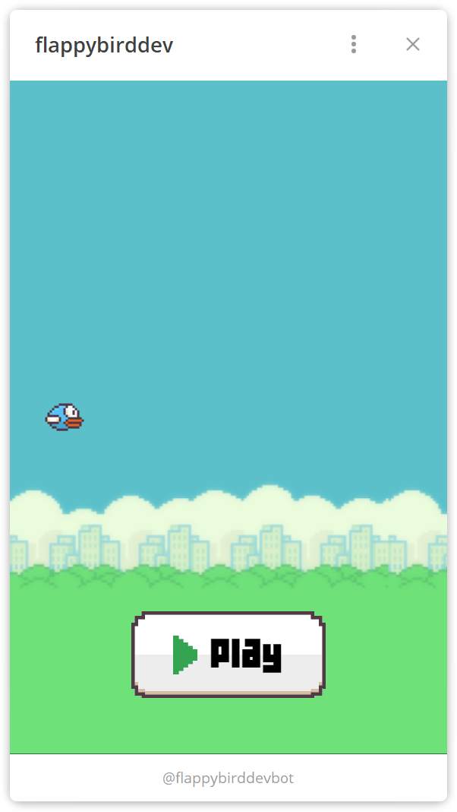
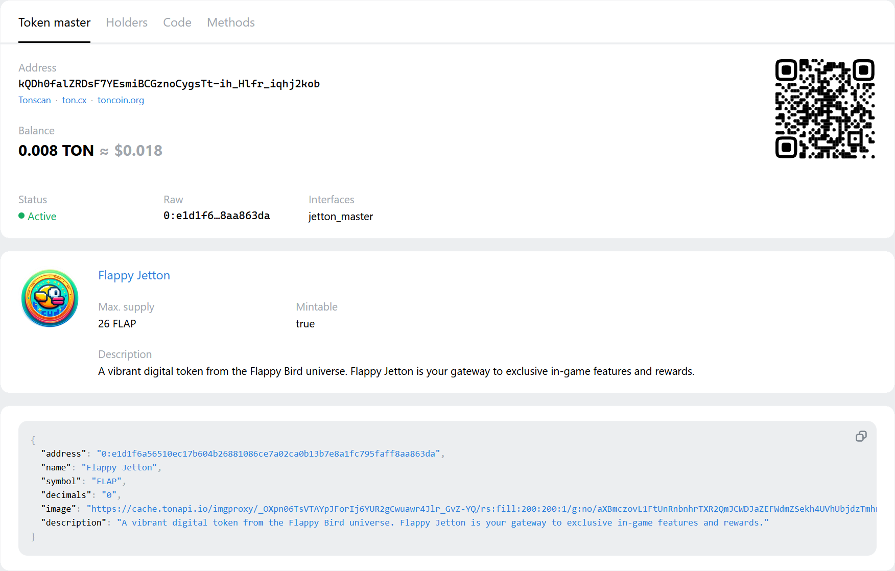
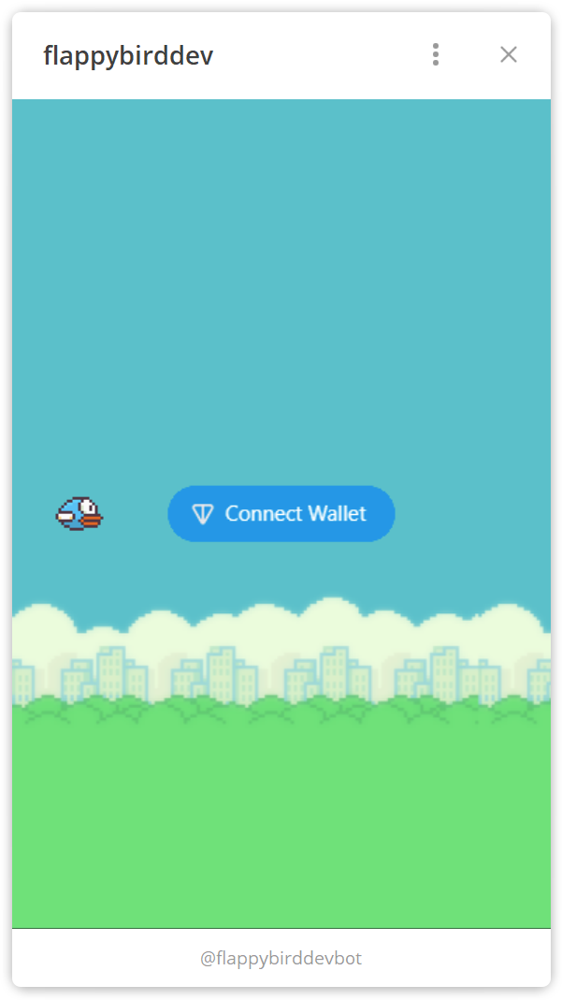
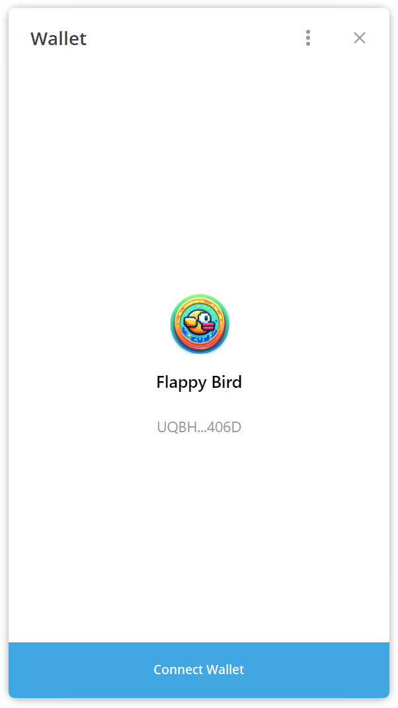
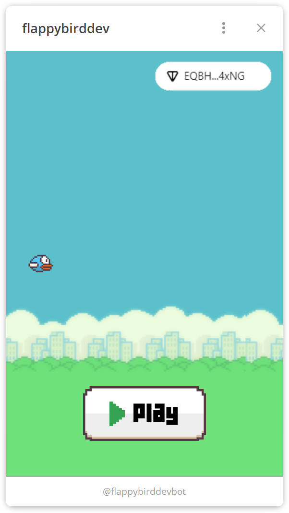
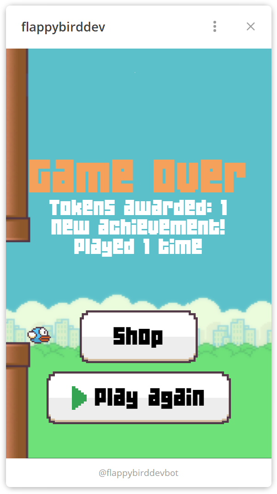
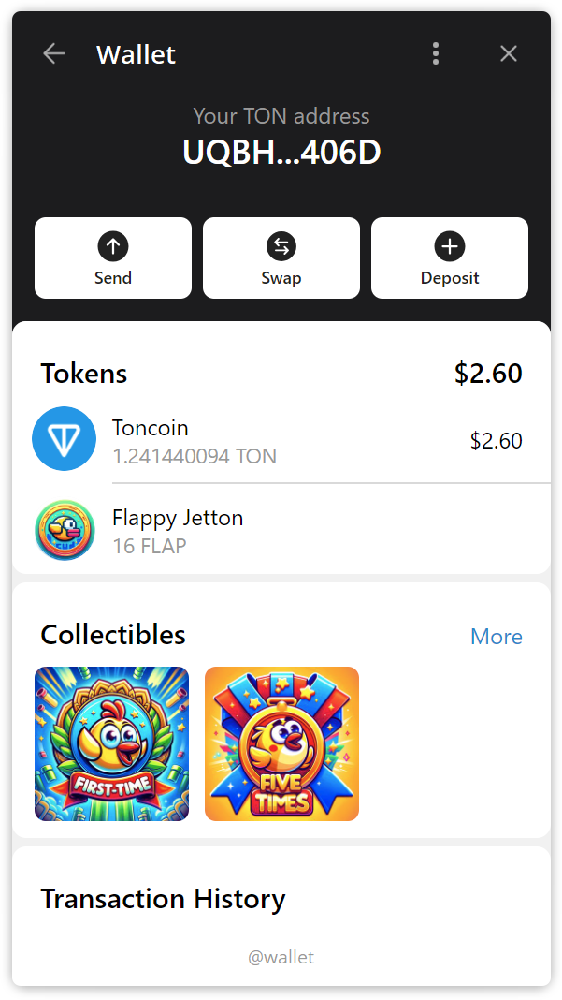
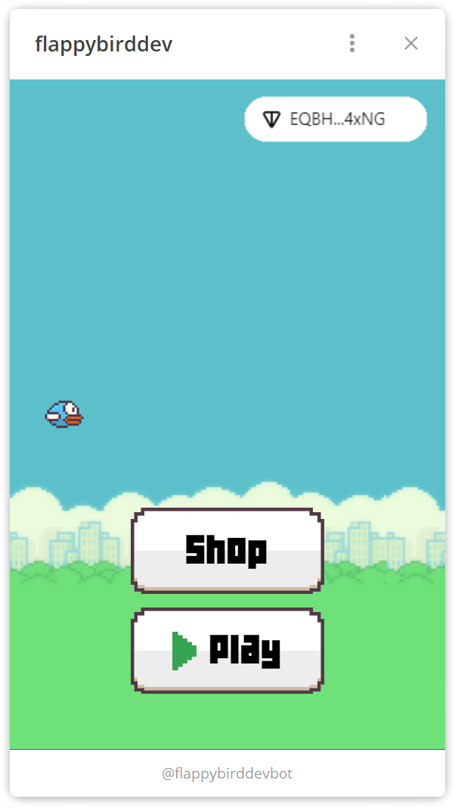
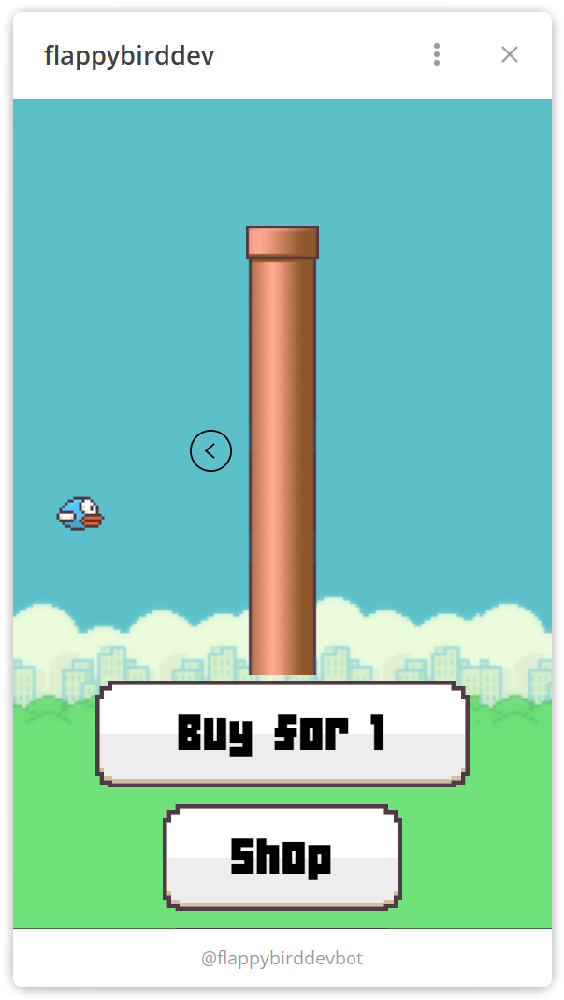
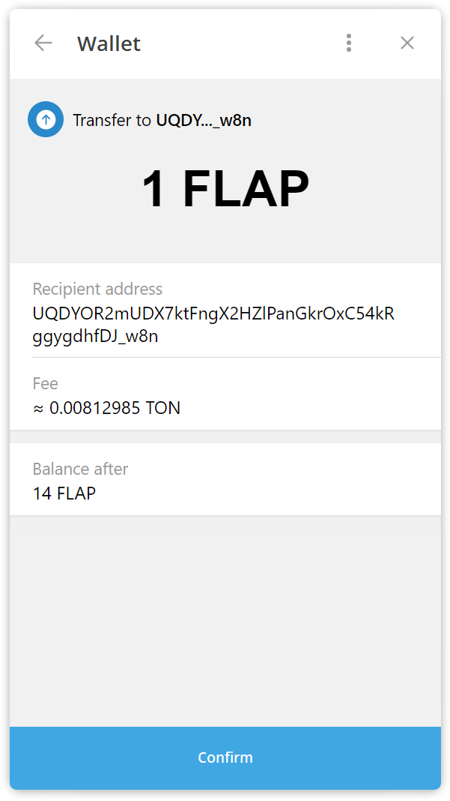

# Oyunlar için TON blockchain

## Eğitimde Ne Var
Bu eğitimde, bir oyuna TON blockchain nasıl eklenir, bunu ele alacağız. Örneğimiz için Phaser'da yazılmış bir Flappy Bird klonu kullanacağız ve adım adım GameFi özellikleri ekleyeceğiz. Eğitimde, daha okunabilir hale getirmek için kısa kod parçaları ve psödo kod kullanacağız. Ayrıca, daha iyi anlamanıza yardımcı olmak için gerçek kod bloklarına bağlantılar sağlayacağız. Tüm uygulama [demo repo](https://github.com/ton-community/flappy-bird)'da bulunabilir.



Aşağıdakileri uygulayacağız:
- **Başarılar**: Kullanıcılarımızı `SBT'lerle` ödüllendirelim. Başarı sistemi, kullanıcı etkileşimini artırmak için harika bir araçtır.
- **Oyun parası**: TON blockchain'de kendi jettonunuzu başlatmak kolaydır. Jetton, oyun içi bir ekonomi oluşturmak için kullanılabilir. Kullanıcılarımız, harcayabilecekleri oyun paralarını kazanabilecekler.
- **Oyun mağazası**: Kullanıcılara, oyun içi öğeleri ya oyun parasıyla ya da TON parasıyla satın alma imkanı sunacağız.

---

## Hazırlıklar

### GameFi SDK'yı Yükleyin
Öncelikle, oyun ortamını kurmamız gerekiyor. Bunu yapmak için `assets-sdk`'yı kurmamız gerekiyor. Paket, geliştiricilerin blockchain'i oyunlara entegre etmeleri için ihtiyaç duyacakları her şeyi hazırlamak için tasarlanmıştır. Kütüphane, CLI veya Node.js betikleri aracılığıyla kullanılabilir. Bu eğitimde CLI yaklaşımını tercih ediyoruz.

```sh
npm install -g @ton-community/assets-sdk@beta
```

### Ana cüzdan oluşturun
Sonrasında, bir ana cüzdan oluşturmamız gerekiyor. Ana cüzdan, jetton, koleksiyonlar, NFT'ler, SBT'ler mint etmek ve ödemeleri almak için kullanacağımız cüzdan olacaktır.

```sh
assets-cli setup-env
```
Size birkaç soru sorulacak:

| Alan      | İpucu                                                                                      |
|-----------|-------------------------------------------------------------------------------------------|
| Ağ       | Test oyunu olduğu için `testnet` seçin.                                                  |
| Tür      | Ana cüzdan olarak kullanmak için en iyi ve performanslı seçenek olduğu için `highload-v2` cüzdan türünü seçin. |
| Depolama | `NFT`/`SBT` dosyalarını depolamak için kullanılacaktır. `Amazon S3` (merkezi) veya `Pinata` (dağıtık). Eğitim için, dağıtık depolamanın Web3 oyunu için daha öğretici olacağı için `Pinata` kullanacağız. |
| IPFS geçidi | Varlık metadata'sını yüklemek için hizmet: `pinata`, `ipfs.io` veya başka bir hizmet URL'si girin. |

Betik, oluşturulan cüzdan durumunu görebilmeniz için açabileceğiniz bir bağlantı çıktı verecek.


Gördüğünüz gibi cüzdan henüz yaratılmamış. :::warning Cüzdanın gerçekten oluşturulabilmesi için içine bazı fonlar yatırmamız gerekiyor. Gerçek dünyada, cüzdan adresini kullanarak istediğiniz şekilde fon yatırabilirsiniz. Bizim durumumuzda [Testgiver TON Bot](https://t.me/testgiver_ton_bot) kullanacağız. Lütfen 5 test TON parası talep etmek için açın.

Biraz sonra cüzdanda 5 TON göreceksiniz ve durumu `Uninit` oldu. Cüzdan hazır. İlk kullanımından sonra durumu `Active` değişiyor.


### Oyun içi para mint etme
Kullanıcıları ödüllendirmek için oyun içi para oluşturuyoruz:

```sh
assets-cli deploy-jetton
```
Size birkaç soru sorulacak:

| Alan      | İpucu                                                  |
|-----------|-------------------------------------------------------|
| İsim      | Jetton ismi, örneğin `Flappy Jetton`.                |
| Açıklama  | Jetton açıklaması, örneğin: Flappy Bird evreninden canlı bir dijital jetton. |
| Resim     | Hazırlanan [jetton logosunu](https://raw.githubusercontent.com/ton-community/flappy-bird/ca4b6335879312a9b94f0e89384b04cea91246b1/scripts/tokens/flap/image.png) indirin ve dosya yolunu belirtin. Elbette, herhangi bir resmi kullanabilirsiniz. |
| Sembol    | `FLAP` veya kullanmak istediğiniz herhangi bir kısaltmayı girin. |
| Ondalık   | Paranın nokta sonrası kaç sıfır olacağını belirtir. Bizim durumumuzda '0' kalsın. |

Betik, oluşturulan jetton durumunu görebilmeniz için açabileceğiniz bir bağlantı çıktı verecek. `Active` durumu olacak. Cüzdan durumu `Uninit`'den `Active`'ye değişecektir.



### SBT'ler için koleksiyonlar oluşturma
Örneğin, demo oyunda kullanıcıları birinci ve beşinci oyunları için ödüllendireceğiz. Bu nedenle, ilgili koşulları gerçekleştirdiklerinde SBT'leri yerleştirmek için iki koleksiyon mint edeceğiz:

```sh
assets-cli deploy-nft-collection
```

| Alan      | Birinci oyun                     | Beşinci oyun                     |
|-----------|----------------------------------|----------------------------------|
| Tür       | `sbt`                            | `sbt`                            |
| İsim      | Flappy İlk Uçuş                 | Flappy yüksek beş               |
| Açıklama  | Flappy Bird oyununda ilk yolculuğunuzu kutluyoruz! | Flappy yüksek beş NFT ile sürekli oyun oynamanızı kutlayın! |
| Resim     | [resmi buradan](https://raw.githubusercontent.com/ton-community/flappy-bird/article-v1/scripts/tokens/first-time/image.png) indirebilirsiniz | [resmi buradan](https://raw.githubusercontent.com/ton-community/flappy-bird/article-v1/scripts/tokens/five-times/image.png) indirebilirsiniz |

Tam hazırız. O zaman mantık uygulanımına geçelim.

---

## Cüzdan Bağlama
Her şey, bir kullanıcının cüzdanını bağlamasıyla başlar. O zaman, cüzdan bağlama entegrasyonunu ekleyelim. Müşteri tarafında blockchain ile çalışmak için Phaser için GameFi SDK'sını kurmamız gerekiyor:

```sh
npm install --save @ton/phaser-sdk@beta
```

Şimdi GameFi SDK'sını ayarlayalım ve bir örnek oluşturalım:

```typescript
import { GameFi } from '@ton/phaser-sdk'

const gameFi = await GameFi.create({
    network: 'testnet',
    connector: {
        // tonconnect-manifest.json kök dizinde yer alıyorsa bu seçeneği atlayabilirsiniz
        manifestUrl: '/assets/tonconnect-manifest.json',
        actionsConfiguration: {
            // cüzdan bağlandığında geri döneceğiniz Telegram Mini Uygulamanızın adresi
            // Uygulama oluşturma sürecinde BothFather'a sağladığınız URL
            // daha fazla okumak için lütfen https://github.com/ton-community/flappy-bird#telegram-bot--telegram-web-app adresine bakın
            twaReturnUrl: URL_YOU_ASSIGNED_TO_YOUR_APP
        },
        contentResolver: {
            // bazı NFT pazar yerleri CORS'u desteklemediği için bir proxy kullanmamız gerekiyor
            // URL'nin her formatını kullanabilirsiniz, %URL% gerçek URL ile değiştirilecektir
            urlProxy: `${YOUR_BACKEND_URL}/${PROXY_URL}?url=%URL%`
        },
        // oyun içi satın alımların geldiği yer
        merchant: {
            // oyun içi jetton satın alımları (FLAP)
            // `assets-cli deploy-jetton` çalıştırarak aldığınız adresi kullanın
            jettonAddress: FLAP_ADDRESS,
            // oyun içi TON satın alımları
            // `assets-cli setup-env` çalıştırarak aldığınız ana cüzdan adresini kullanın
            tonAddress: MASTER_WALLET_ADDRESS
        }
    },
})
```
> Başlatma seçenekleri hakkında daha fazla bilgi için lütfen [kütüphane belgesini](https://github.com/ton-org/game-engines-sdk) okuyun.

> `tonconnect-manifest.json`'ın ne olduğunu öğrenmek için lütfen ton-connect `manifest açıklamasına` bakın.

Artık bir cüzdan bağlama butonu oluşturabiliriz. Bağlantı butonunu içeren bir UI sahnesi oluşturalım:

```typescript
class UiScene extends Phaser.Scene {
    // gameFi örneğini constructor ile al
    private gameFi: GameFi;

    create() {
        this.button = this.gameFi.createConnectButton({
            scene: this,
            // butonunuzu UI sahnesinde konumlandırmak için konumu hesaplayabilirsiniz
            x: 0,
            y: 0,
            button: {
                onError: (error) => {
                    console.error(error)
                }
                // diğer seçenekler, belgeleri okuyun
            }
        })
    }
}
```

> [bağlantı düğmesi](https://github.com/ton-community/flappy-bird/blob/article-v1/workspaces/client/src/connect-wallet-ui.ts#L82) ve [UI sahnesi](https://github.com/ton-community/flappy-bird/blob/article-v1/workspaces/client/src/connect-wallet-ui.ts#L45) oluşturma hakkında okuyun.

Bir kullanıcının cüzdanını bağladığında veya bağlantısını kestiğinde izlemek için aşağıdaki kod parçasını kullanalım:

```typescript
function onWalletChange(wallet: Wallet | null) {
    if (wallet) {
        // cüzdan kullanılmaya hazır
    } else {
        // cüzdan bağlantısı kesildi
    }
}
const unsubscribe = gameFi.onWalletChange(onWalletChange)
```

> Daha karmaşık senaryolar hakkında daha fazla bilgi edinmek için lütfen [cüzdan bağlantı akışının](https://github.com/ton-community/flappy-bird/blob/article-v1/workspaces/client/src/index.ts#L16) tam uygulamasına bakın.

Oyun arayüzü yönetimi hakkında nasıl [uygulama yapılabileceğini](https://github.com/ton-community/flappy-bird/blob/article-v1/workspaces/client/src/index.ts#L50) okuyun.

Artık kullanıcı cüzdanı bağlandı ve ileriye gidebiliriz.





---

## Başarılar ve ödüller uygulama
Başarılar ve ödül sistemini uygulamak için, kullanıcı denemesi başına talep edileceği bir uç nokta hazırlamamız gerekiyor.

### `/played` uç noktası
Aşağıdaki görevleri yerine getirmesi gereken bir uç nokta `/played ` oluşturmalıyız:
- Kullanıcı cüzdan adresi ve uygulama lansmanı sırasında Mini Uygulamaya geçirilen Telegram başlangıç verileri ile bir vücut almalıdır. Başlangıç verileri, kullanıcı adına sadece kendisi adına talepte bulunduğunu doğrulamak için ayrıştırılmalıdır.
- Uç nokta, bir kullanıcının oynadığı oyun sayısını hesaplayıp saklamalıdır.
- Uç nokta, bir kullanıcı için ilk veya beşinci oyun olup olmadığını kontrol etmelidir ve eğer öyleyse, kullanıcıyı ilgili SBT ile ödüllendirmelidir.
- Uç nokta, her oyun için kullanıcılara 1 FLAP ile ödül vermelidir.

> [/played uç noktası](https://github.com/ton-community/flappy-bird/blob/article-v1/workspaces/server/src/index.ts#L197) kodunu okuyun.

### `/played` uç noktasına istek
Her seferinde kuş bir boruya çarptığında veya düştüğünde istemci kodu, doğru vücutla `/played` uç noktasını çağırmalıdır:

```typescript
async function submitPlayed(endpoint: string, walletAddress: string) {
    return await (await fetch(endpoint + '/played', {
        body: JSON.stringify({
            tg_data: (window as any).Telegram.WebApp.initData,
            wallet: walletAddress
        }),
        headers: {
            'content-type': 'application/json'
        },
        method: 'POST'
    })).json()
}

const playedInfo = await submitPlayed('http://localhost:3001', wallet.account.address);
```

> [submitPlayer fonksiyonu](https://github.com/ton-community/flappy-bird/blob/article-v1/workspaces/client/src/game-scene.ts#L10) kodunu okuyun.

İlk kez oynayalım ve bir FLAP jettonu ve SBT ile ödüllendirileceğinden emin olalım. Oyun butonuna tıklayın, bir veya iki borudan geçin ve sonra bir tüpe çarpın. Tamam, her şey çalışıyor!



4 kez daha oynayın ve ikinci SBT'yi alın, ardından Cüzdanınızı açın, TON Uzay. İşte koleksiyonlarınız:



---

## Oyun mağazası uygulama
Oyun içinde bir mağaza sahibi olmak için iki bileşene ihtiyacımız var. Birincisi, kullanıcıların satın alma bilgilerini sağlayan bir uç nokta. İkincisi, kullanıcı işlemlerini izlemek ve oyun özelliklerini sahiplerine atamak için küresel bir döngüdür.

### `/purchases` uç noktası
Uç nokta aşağıdaki işlemleri gerçekleştirir:
- Telegram Mini Uygulamalar başlangıç verileri ile `auth` get parametresi alır.
- Uç nokta bir kullanıcının satın aldığı öğeleri alır ve öğe listesini yanıt olarak döner.

> [/purchases](https://github.com/ton-community/flappy-bird/blob/article-v1/workspaces/server/src/index.ts#L303) uç noktası kodunu okuyun.

### Satın alma döngüsü
Kullanıcıların ödemelerini ne zaman yaptığını bilmek için, ana cüzdan işlemlerini izlememiz gerekiyor. Her işlem bir mesaj içermelidir `userId`:`itemId`. En son işlenmiş işlemi hatırlayacağız, sadece yeni olanları alacağız, kullanıcı İncelemeleri satın aldıkları özellikleri atayacağız ve son işlem hash'ini yeniden yazacağız. Bu, sonsuz bir döngüde çalışacaktır.

> [satın alma döngüsü](https://github.com/ton-community/flappy-bird/blob/article-v1/workspaces/server/src/index.ts#L110) kodunu okuyun.

### Mağaza için istemci tarafı
İstemci tarafında Mağaza butonumuz var.



Bir kullanıcı butona tıkladığında, mağaza sahnesi açılır. Mağaza sahnesi, bir kullanıcının satın alabileceği öğelerin listesini içerir. Her öğenin bir fiyatı ve bir Satın Al butonu vardır. Bir kullanıcı Satın Al butonuna tıkladığında, satın alma yapılır.

Mağazayı açmak, satın alınan öğelerin yüklenmesini tetikler ve her 10 saniyede bir günceller:

```typescript
// fetchPurchases fonksiyonu içinde
await fetch('http://localhost:3000/purchases?auth=' + encodeURIComponent((window as any).Telegram.WebApp.initData))
// satın alma izle
setTimeout(() => { fetchPurchases() }, 10000)
```

> [showShop fonksiyonu](https://github.com/ton-community/flappy-bird/blob/article-v1/workspaces/client/src/ui.ts#L191) kodunu okuyun.

Artık satın almayı kendisi uygulamamız gerekiyor. Bunu yapmak için önce GameFi SDK örneğini oluşturacak ve ardından `buyWithJetton` yöntemini kullanacağız:

```typescript
gameFi.buyWithJetton({
    amount: BigInt(price),
    forwardAmount: BigInt(1),
    forwardPayload: (window as any).Telegram.WebApp.initDataUnsafe.user.id + ':' + itemId
});
```





Ayrıca TON parasıyla ödeme yapmak da mümkündür:

```typescript
import { toNano } from '@ton/phaser-sdk'

gameFi.buyWithTon({
    amount: toNano(0.5),
    comment: (window as any).Telegram.WebApp.initDataUnsafe.user.id + ':' + 1
});
```

---

## Son Söz
Bu eğitim için bu kadar! Temel GameFi özelliklerini ele aldık, ancak SDK daha fazla işlevsellik sunar: oyuncular arasında transferler, NFT'lerle ve koleksiyonlarla çalışma araçları vb. Gelecekte daha fazla özellik sunacağız.

Kullanabileceğiniz tüm GameFi özelliklerini öğrenmek için [ton-org/game-engines-sdk](https://github.com/ton-org/game-engines-sdk) ve [@ton-community/assets-sdk](https://github.com/ton-community/assets-sdk) belgelerini okuyun.

Düşüncelerinizi [Tartışmalar](https://github.com/ton-org/game-engines-sdk/discussions)'da bize bildirin!

Tam uygulama, [flappy-bird](https://github.com/ton-community/flappy-bird) reposunda mevcuttur.